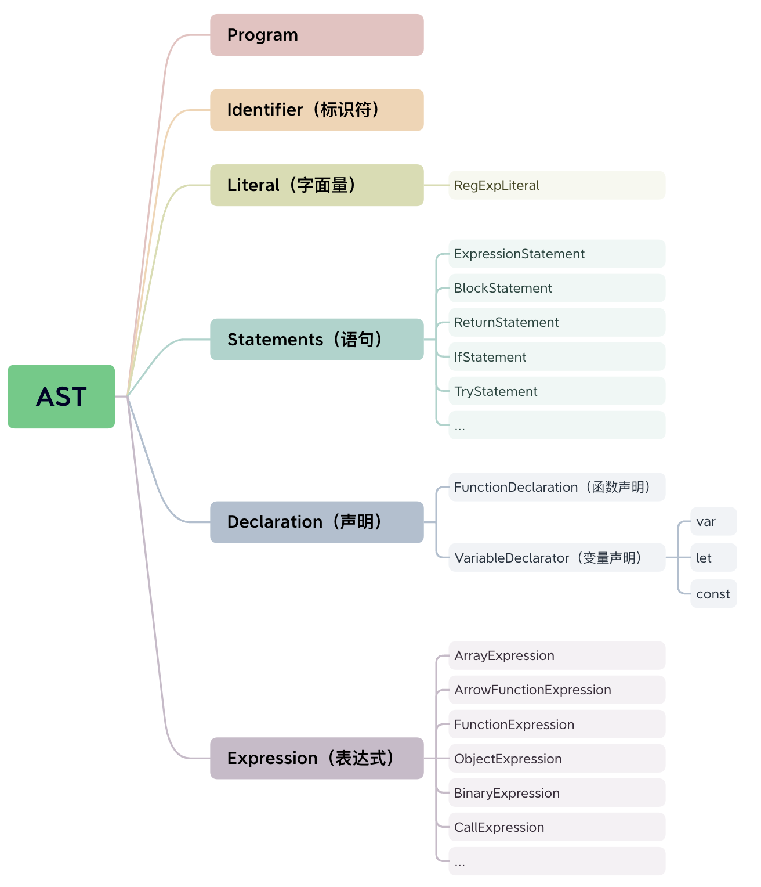
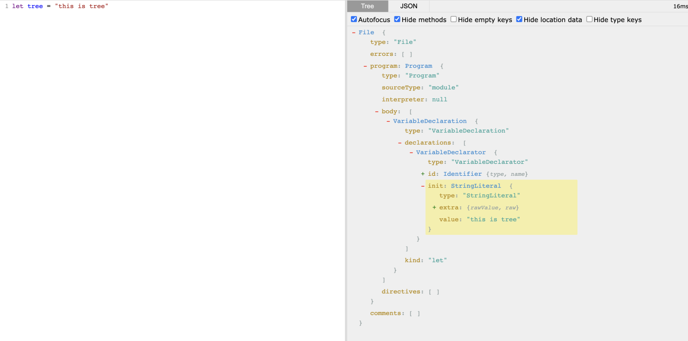
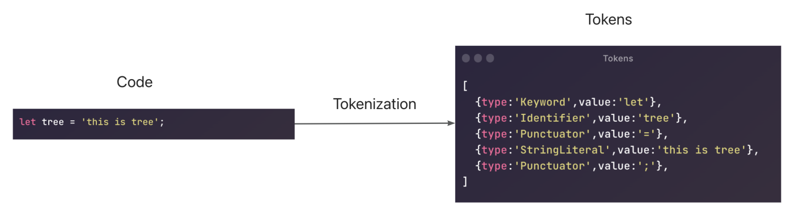
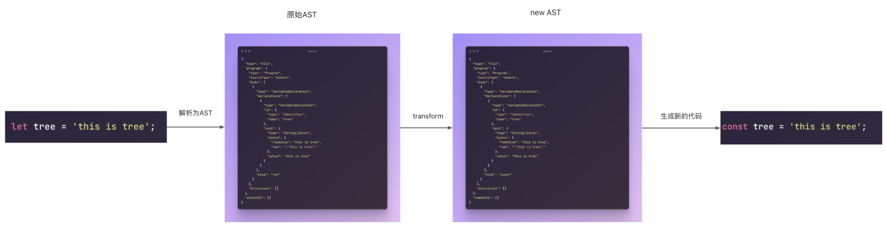

# 抽象语法树 AST

## 为什么要学习 AST

虽然在平时的开发中我们很少用到 AST，但是它却扮演了一个非常重要的角色，无论是代码编译（babel），打包（webpack），代码压缩，css 预处理，代码校验（eslint），代码美化（pretiier），还是 Vue 中对 template 的编译都离不开 AST。

## 什么是 AST

抽象语法树（AST）是源代码的抽象语法结构的树状表示，树上的每个节点都表示源代码中的一种结构。在不同的场景下，会有不同的解析器将源码解析成抽象语法树。

## 抽象语法树（AST）是怎样的



详见[estree](https://github.com/estree/estree/blob/master/es2015.md#programs)

以一段最简单的代码看一下 AST 内部结构到底是怎样的

```js
let tree = 'this is tree'
```

使用工具[astexplorer](https://astexplorer.net/)来查看对应的 AST 语法树如下所示：


## AST 是如何生成的

AST 的生成需要经过词法分析，语法分析这两个步骤构建 AST 树，进而对原始 AST 树改造生成新的代码。

### 词法分析

词法分析就是扫描输入的源代码字符串，生成一系列的词法单元（tokens），这些词法单元包括数字，标点符号，运算符等。词法单元之间是独立的，在词法单元阶段不关心每一行代码是通过什么方式组合在一起的。

以上面的`let tree = 'this is tree';`为例，词法分析将其生成 tokens 的结果如下：

```js
;[
  { type: 'Keyword', value: 'let' },
  { type: 'Identifier', value: 'tree' },
  { type: 'Punctuator', value: '=' },
  { type: 'StringLiteral', value: 'this is tree' },
  { type: 'Punctuator', value: ';' }
]
```



对源码进行词法分析后得到的 tokens 并不能帮助我们判断该条语句是否合法，接下来还需要进行语法分析。

### 语法分析

语法分析是将词法分析阶段得到的 tokens 重新整理成语法相互关联的表达形式，转化成有语法含义的抽象语法树结构。同时会验证语法，如果语法有错会抛出语法错误。

使用`@babel/parser`将源码解析成 AST

```js
const { parse } = require('@babel/parser')

const str = `let tree = 'this is tree';`

const ast = parse(str)
console.log(ast)

// AST结构如下
{
  "type": "File",
  "program": {
    "type": "Program",
    "sourceType": "module",
    "body": [
      {
        "type": "VariableDeclaration",
        "declarations": [
          {
            "type": "VariableDeclarator",
            "id": {
              "type": "Identifier",
              "name": "tree"
            },
            "init": {
              "type": "StringLiteral",
              "extra": {
                "rawValue": "this is tree",
                "raw": "\"this is tree\""
              },
              "value": "this is tree"
            }
          }
        ],
        "kind": "let"
      }
    ],
    "directives": []
  },
  "comments": []
}
```

### 代码生成

代码生成阶段可以遍历初始的 AST，对 AST 的结构进行改造，再将改造后的结构生成对应的代码字符串。

使用`@babel/traverse`和`@babel/generator`遍历原始 AST 并改造该 AST 的结构，生成新的代码。

```js
const { parse } = require('@babel/parser')
const traverse = require('@babel/traverse')
const generate = require('@babel/generator')

const str = `let tree = 'this is tree';`

// 将源码解析成 AST
const ast = parse(str)
console.log(ast)

// 遍历AST并将变量声明let改为const
traverse.default(ast1, {
  enter(path) {
    if (path.isVariableDeclaration() && path.node.kind === 'let') {
      path.node.kind = 'const'
    }
  }
})

// 生成新的代码
const newAst = generate.default(ast)

console.log(newAst) //const tree = 'this is tree';
```

转换示意图如下所示：


## AST 的具体应用
