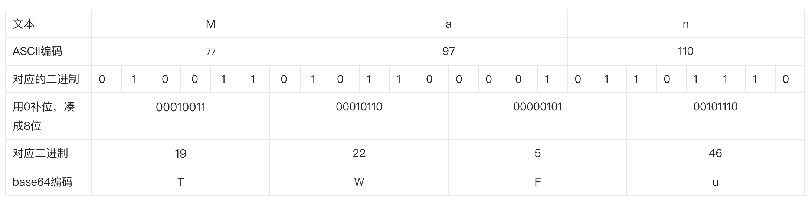

# base64 格式的数据实现原理

:::tip
`base64`是处理二进制数据的一种编码方式，可用于把二进制数据编码成 64 个可打印的字符。
:::

## 字节

一个字节由 8 位二进制数据组成即 00000000 -- 11111111。

## 编码

编码是把字符串转化成二进制数据的一种方式。

## base64 编码表

| 码值 | 字符 | 码值 | 字符 | 码值 | 字符 | 码值 | 字符 |
| ---- | ---- | ---- | ---- | ---- | ---- | ---- | ---- |
| 0    | A    | 16   | Q    | 32   | g    | 48   | w    |
| 1    | B    | 17   | R    | 33   | h    | 49   | x    |
| 2    | C    | 18   | S    | 34   | i    | 50   | y    |
| 3    | D    | 19   | T    | 35   | j    | 51   | z    |
| 4    | E    | 20   | U    | 36   | k    | 52   | 0    |
| 5    | F    | 21   | V    | 37   | l    | 53   | 1    |
| 6    | G    | 22   | W    | 38   | m    | 54   | 2    |
| 7    | H    | 23   | X    | 39   | n    | 55   | 3    |
| 8    | I    | 24   | Y    | 40   | o    | 56   | 4    |
| 9    | J    | 25   | Z    | 41   | p    | 57   | 5    |
| 10   | K    | 26   | a    | 42   | q    | 58   | 6    |
| 11   | L    | 27   | b    | 43   | r    | 59   | 7    |
| 12   | M    | 28   | c    | 44   | s    | 60   | 8    |
| 13   | N    | 29   | d    | 45   | t    | 61   | 9    |
| 14   | O    | 30   | e    | 46   | u    | 62   | +    |
| 15   | P    | 31   | f    | 47   | v    | 63   | /    |

## base64 的实现

base64 的实现就是通过把字符串转化为二进制数据，然后按照每 6 位二进制数据来进行分割，用 0 补位凑成 8 位，再把 8 位二进制数据转化为十进制数找到对应的映射表就可生成 base64 编码。

:::tip 具体实现步骤

1. 将字符串转化为二进制数据
2. 二进制数据按照每 6 位一组分割, 不足 6 位的补 0
3. 6 位二进制数据用 0 补位凑成 8 位，再将这 8 位二进制转化为十进制数
4. 在对应的 base64 映射表中找到对应的映射字符，对于上述第二步不足 6 位补 0 的地方，每两个额外的 0 由 = 字符填充
   :::

以 Man 为例，对字符 Man 编码为 base64 的过程如下：

1. 在 ASCII 编码表找到字符对应的编码，如 M 字符的编码为 77，a 对应的编码为 97，n 对应的编码为 110
2. 将对应的编码转换为二进制，分别而 01001101,01100001,01101110
3. 将这些二进制按照每 6 位一组分隔，即 010011，010110，000101，101110
4. 将 6 位二进制数据用 0 补位凑成 8 位，即 00010011，00010110，00000101，00101110
5. 将这些 8 位二进制转为十进制，即 19,22,5,46
6. 在 base64 编码表找到码值对应的字符，即 T,W,F,u

因此，字符"Man"经过 base64 编码后的值为 TWFu

### =填充

:::tip
填充=对于 base64 编码是否有必要？因为在解码时又丢弃了填充。
:::

- 发送单个字符的字符串时不需要填充；
- 发送多个字符的字符串的 base64 编码时，填充就很重要。如果连接未填充的字符串，则将无法获得原始字符串，因为有关添加的字节的信息将丢失。

看下面的示例：
| 字符 | 有填充的 base64 编码 | 无填充的 base64 编码 |
| ---- | ---- | ---- |
| a | YQ== | YQ |
| bc | YmM== | YmM |
| def | ZGVm | ZGVm |

当发送连接时没有填充，合并的 base64 字符串将是：YQYmMZGVm，尝试解码时得到的字符串将是 'a&1',是错误的。

当发送连接时使用填充，合并的 base64 字符串将是：YQ==YmM==ZGVm，尝试解码时得到的字符串将是 'abcdef'，是正确的。

因此，传输多个字符时使用填充是有必要的。

### 字符串与 base64 编码转换方法

字符串转换为 base64:window.btoa('')

base64 转换为字符串:window.atob('')

## ASCII 编码表

| Bin(二进制) | Oct(八进制) | Dec(十进制) | Hex(十六进制) | 缩写/字符    | 解释         |
| ----------- | ----------- | ----------- | ------------- | ------------ | ------------ |
| 0010 0000   | 040         | 32          | 0x20          | (space)      | 空格         |
| 0010 0001   | 041         | 33          | 0x21          | !            | 叹号         |
| 0010 0010   | 042         | 34          | 0x22          | "            | 双引号       |
| 0010 0011   | 043         | 35          | 0x23          | #            | 井号         |
| 0010 0100   | 044         | 36          | 0x24          | $            | 美元符       |
| 0010 0101   | 045         | 37          | 0x25          | %            | 百分号       |
| 0010 0110   | 046         | 38          | 0x26          | &            | 和号         |
| 0010 0111   | 047         | 39          | 0x27          | '            | 闭单引号     |
| 0010 1000   | 050         | 40          | 0x28          | (            | 开括号       |
| 0010 1001   | 051         | 41          | 0x29          | )            | 闭括号       |
| 0010 1010   | 052         | 42          | 0x2A          | \*           | 星号         |
| 0010 1011   | 053         | 43          | 0x2B          | +            | 加号         |
| 0010 1100   | 054         | 44          | 0x2C          | ,            | 逗号         |
| 0010 1101   | 055         | 45          | 0x2D          | -            | 减号/破折号  |
| 0010 1110   | 056         | 46          | 0x2E          | .            | 句号         |
| 0010 1111   | 057         | 47          | 0x2F          | /            | 斜杠         |
| 0011 0000   | 060         | 48          | 0x30          | 0            | 字符 0       |
| 0011 0001   | 061         | 49          | 0x31          | 1            | 字符 1       |
| 0011 0010   | 062         | 50          | 0x32          | 2            | 字符 2       |
| 0011 0011   | 063         | 51          | 0x33          | 3            | 字符 3       |
| 0011 0100   | 064         | 52          | 0x34          | 4            | 字符 4       |
| 0011 0101   | 065         | 53          | 0x35          | 5            | 字符 5       |
| 0011 0110   | 066         | 54          | 0x36          | 6            | 字符 6       |
| 0011 0111   | 067         | 55          | 0x37          | 7            | 字符 7       |
| 0011 1000   | 070         | 56          | 0x38          | 8            | 字符 8       |
| 0011 1001   | 071         | 57          | 0x39          | 9            | 字符 9       |
| 0011 1010   | 072         | 58          | 0x3A          | :            | 冒号         |
| 0011 1011   | 073         | 59          | 0x3B          | ;            | 分号         |
| 0011 1100   | 074         | 60          | 0x3C          | <            | 小于         |
| 0011 1101   | 075         | 61          | 0x3D          | =            | 等号         |
| 0011 1110   | 076         | 62          | 0x3E          | >            | 大于         |
| 0011 1111   | 077         | 63          | 0x3F          | ?            | 问号         |
| 0100 0000   | 0100        | 64          | 0x40          | @            | 电子邮件符号 |
| 0100 0001   | 0101        | 65          | 0x41          | A            | 大写字母 A   |
| 0100 0010   | 0102        | 66          | 0x42          | B            | 大写字母 B   |
| 0100 0011   | 0103        | 67          | 0x43          | C            | 大写字母 C   |
| 0100 0100   | 0104        | 68          | 0x44          | D            | 大写字母 D   |
| 0100 0101   | 0105        | 69          | 0x45          | E            | 大写字母 E   |
| 0100 0110   | 0106        | 70          | 0x46          | F            | 大写字母 F   |
| 0100 0111   | 0107        | 71          | 0x47          | G            | 大写字母 G   |
| 0100 1000   | 0110        | 72          | 0x48          | H            | 大写字母 H   |
| 0100 1001   | 0111        | 73          | 0x49          | I            | 大写字母 I   |
| 01001010    | 0112        | 74          | 0x4A          | J            | 大写字母 J   |
| 0100 1011   | 0113        | 75          | 0x4B          | K            | 大写字母 K   |
| 0100 1100   | 0114        | 76          | 0x4C          | L            | 大写字母 L   |
| 0100 1101   | 0115        | 77          | 0x4D          | M            | 大写字母 M   |
| 0100 1110   | 0116        | 78          | 0x4E          | N            | 大写字母 N   |
| 0100 1111   | 0117        | 79          | 0x4F          | O            | 大写字母 O   |
| 0101 0000   | 0120        | 80          | 0x50          | P            | 大写字母 P   |
| 0101 0001   | 0121        | 81          | 0x51          | Q            | 大写字母 Q   |
| 0101 0010   | 0122        | 82          | 0x52          | R            | 大写字母 R   |
| 0101 0011   | 0123        | 83          | 0x53          | S            | 大写字母 S   |
| 0101 0100   | 0124        | 84          | 0x54          | T            | 大写字母 T   |
| 0101 0101   | 0125        | 85          | 0x55          | U            | 大写字母 U   |
| 0101 0110   | 0126        | 86          | 0x56          | V            | 大写字母 V   |
| 0101 0111   | 0127        | 87          | 0x57          | W            | 大写字母 W   |
| 0101 1000   | 0130        | 88          | 0x58          | X            | 大写字母 X   |
| 0101 1001   | 0131        | 89          | 0x59          | Y            | 大写字母 Y   |
| 0101 1010   | 0132        | 90          | 0x5A          | Z            | 大写字母 Z   |
| 0101 1011   | 0133        | 91          | 0x5B          | [            | 开方括号     |
| 0101 1100   | 0134        | 92          | 0x5C          | \\           | 反斜杠       |
| 0101 1101   | 0135        | 93          | 0x5D          | ]            | 闭方括号     |
| 0101 1110   | 0136        | 94          | 0x5E          | ^            | 脱字符       |
| 0101 1111   | 0137        | 95          | 0x5F          | \_           | 下划线       |
| 0110 0000   | 0140        | 96          | 0x60          | `            | 开单引号     |
| 0110 0001   | 0141        | 97          | 0x61          | a            | 小写字母 a   |
| 0110 0010   | 0142        | 98          | 0x62          | b            | 小写字母 b   |
| 0110 0011   | 0143        | 99          | 0x63          | c            | 小写字母 c   |
| 0110 0100   | 0144        | 100         | 0x64          | d            | 小写字母 d   |
| 0110 0101   | 0145        | 101         | 0x65          | e            | 小写字母 e   |
| 0110 0110   | 0146        | 102         | 0x66          | f            | 小写字母 f   |
| 0110 0111   | 0147        | 103         | 0x67          | g            | 小写字母 g   |
| 0110 1000   | 0150        | 104         | 0x68          | h            | 小写字母 h   |
| 0110 1001   | 0151        | 105         | 0x69          | i            | 小写字母 i   |
| 0110 1010   | 0152        | 106         | 0x6A          | j            | 小写字母 j   |
| 0110 1011   | 0153        | 107         | 0x6B          | k            | 小写字母 k   |
| 0110 1100   | 0154        | 108         | 0x6C          | l            | 小写字母 l   |
| 0110 1101   | 0155        | 109         | 0x6D          | m            | 小写字母 m   |
| 0110 1110   | 0156        | 110         | 0x6E          | n            | 小写字母 n   |
| 0110 1111   | 0157        | 111         | 0x6F          | o            | 小写字母 o   |
| 0111 0000   | 0160        | 112         | 0x70          | p            | 小写字母 p   |
| 0111 0001   | 0161        | 113         | 0x71          | q            | 小写字母 q   |
| 0111 0010   | 0162        | 114         | 0x72          | r            | 小写字母 r   |
| 0111 0011   | 0163        | 115         | 0x73          | s            | 小写字母 s   |
| 0111 0100   | 0164        | 116         | 0x74          | t            | 小写字母 t   |
| 0111 0101   | 0165        | 117         | 0x75          | u            | 小写字母 u   |
| 0111 0110   | 0166        | 118         | 0x76          | v            | 小写字母 v   |
| 0111 0111   | 0167        | 119         | 0x77          | w            | 小写字母 w   |
| 0111 1000   | 0170        | 120         | 0x78          | x            | 小写字母 x   |
| 0111 1001   | 0171        | 121         | 0x79          | y            | 小写字母 y   |
| 0111 1010   | 0172        | 122         | 0x7A          | z            | 小写字母 z   |
| 0111 1011   | 0173        | 123         | 0x7B          | {            | 开花括号     |
| 0111 1100   | 0174        | 124         | 0x7C          | &#124;       | 垂线         |
| 0111 1101   | 0175        | 125         | 0x7D          | }            | 闭花括号     |
| 0111 1110   | 0176        | 126         | 0x7E          | ~            | 波浪号       |
| 0111 1111   | 0177        | 127         | 0x7F          | DEL (delete) | 删除         |
