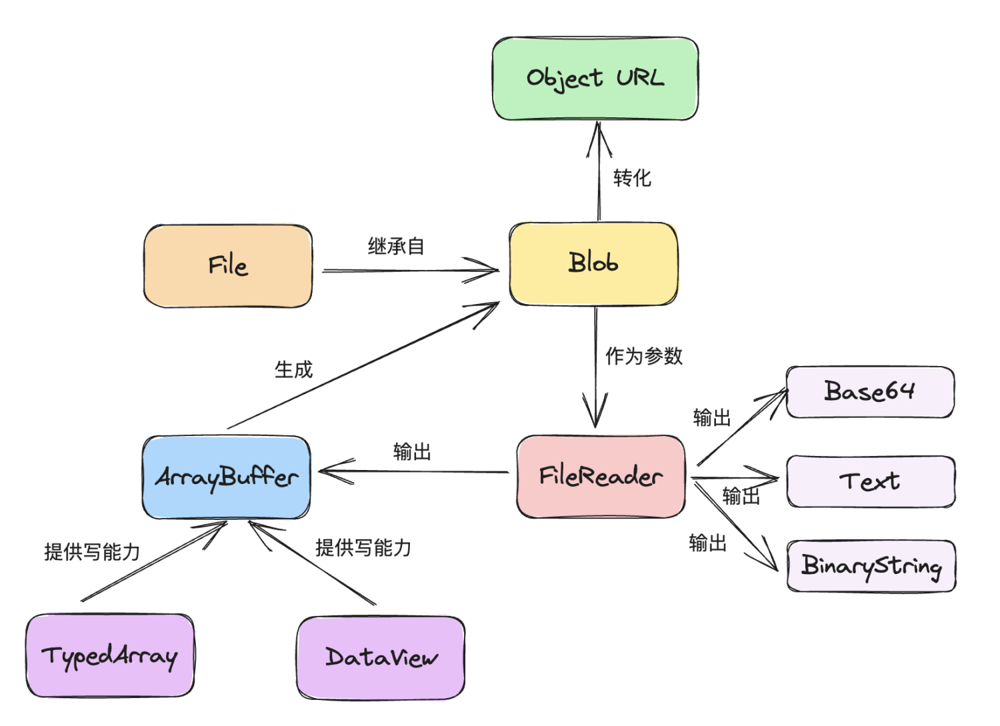
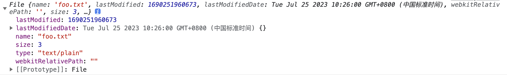
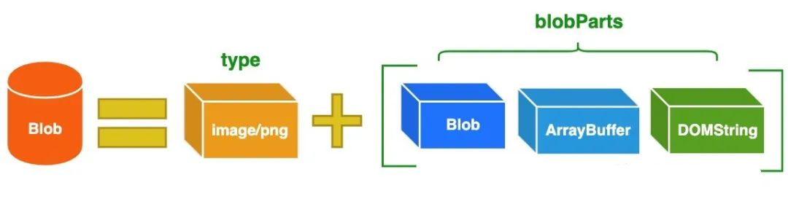

# 前端二进制

File、Blob、FileReader、ArrayBuffer、Base64 等之间的关联图如下所示：


## ArrayBuffer

`ArrayBuffer`对象是 `JavaScript` 操作二进制数据的一个接口，ES6 才正式纳入 `ECMAScript` 规范，并且增加了新的方法，它是以数组的语法处理二进制数据。

:::tip ArrayBuffer 概念
`ArrayBuffer`对象代表储存二进制数据的一段内存，它不能直接读写，只能通过视图（`TypedArray`视图和`DataView`视图）来读写，视图的作用是以指定格式解读二进制数据。
:::

关于`TypedArray`视图和`DataView`视图，在后文中会介绍。

`ArrayBuffer`也是一个构造函数，可以分配一段可以存放数据的连续内存区域。

```js
// 生成了一段 32 字节的内存区域，每个字节的值默认都是 0
const buf = new ArrayBuffer(32)
```

这个构造函数的参数可以是一个整数，表示二进制数据占用的字节长度；返回值是一个指定大小的 `ArrayBuffer` 对象，其内容被初始化为 0。

如果想要读写这段内容，那么就需要为其指定视图。首先创建一个 `DataView` 的视图，以`ArrayBuffer`对象实例作为参数，如下所示：

```js
const buf = new ArrayBuffer(32)
console.log(buf) // ArrayBuffer(32){}
const dataView = new DataView(buf)
console.log(dataView.getUint8(0)) // 0
```

在上述代码中，对一段 32 字节的内存建立起了一个`DataView`视图，然后以不带符号的 8 位整数格式，从头读取 8 位二进制数据，结果得到 0，因为原始内存的`ArrayBuffer`对象，默认所有位都是 0。

还有一种视图`TypedArray`，它与`DataView`的区别是，它不是一个构造函数，而是一组构造函数，代表不同的数据格式。

```js
const buf = new ArrayBuffer(32)
// 32 位带符号整数
const x1 = new Int32Array(buf)
x1[0] = 1
console.log(x1[0]) // 1
// 8 位不带符号整数
const x2 = new Uint8Array(buf)
x2[0] = 2
console.log(x1[0], x2[0]) // 2 2
```

上述代码中，分别创建了两种视图（32 位带符号整数和 8 位不带符号整数），由于这两个视图对应的是同一段内存，因此修改其中一个，另外一个也会被修改。

另外，`TypedArray`视图不仅仅可以接受`ArrayBuffer`实例作为参数，还可以接受普通的函数作为参数。对于以普通函数作为参数的时候，它会直接分配内存生成底层的`ArrayBuffer`实例，并同时完成对这段内存的赋值。

```js
const typedArr = new Uint8Array([2, 3, 4])
console.log(typedArr, typedArr.length) // [2,3,4] 3
typedArr[0] = 10
console.log(typedArr) // [10,3,4]
```

上面代码中，使用`TypedArray`视图的`Uint8Array`构造函数，新建一个不带符号的 8 位整数视图。可以看到，`Uint8Array`直接使用普通数组作为参数，对底层内存的赋值同时完成。

### ArrayBuffer 实例属性和方法

`ArrayBuffer`的实例属性 byteLength，返回所分配的内存区域的字节长度。

```js
const buf = new ArrayBuffer(32)
console.log(buf.byteLength) //32
```

`ArrayBuffer`的实例方法 slice，允许将内存区域的一部分，拷贝生成一个新的`ArrayBuffer`对象。

```js
const buf = new ArrayBuffer(32)
// 拷贝buffer对象的前 5 个字节（从 0 开始，到第 5 个字节前面结束），生成一个新的ArrayBuffer对象
const newBuf = buf.slice(0, 5)
```

`ArrayBuffer`有一个静态方法 isView，返回一个布尔值，表示参数是否为`ArrayBuffer`的视图实例。

```js
const buffer = new ArrayBuffer(8)
console.log(ArrayBuffer.isView(buffer)) // false

const v = new Int32Array(buffer)
console.log(ArrayBuffer.isView(v)) // true
```

## TypedArray

:::tip
`ArrayBuffer`对象作为内存区域，可以存放多种类型的数据。同一段内存，不同数据有不同的解读方式，这就叫做“视图”（view）。`ArrayBuffer`有两种视图，一种是`TypedArray`视图，另一种是`DataView`视图。
:::

`TypedArray`是一组构造函数，共包含九种类型，每一种视图都是一个构造函数，这 9 个构造函数生成的数组，统称为`TypedArray`视图。

| 名称              | 占用字节 | 描述                                      |
| ----------------- | -------- | ----------------------------------------- |
| Int8Array         | 1        | 8 位有符号整数                            |
| Uint8Array        | 1        | 8 位无符号整数                            |
| Uint8ClampedArray | 1        | 8 位无符号整型固定数组(数值在 0~255 之间) |
| Int16Array        | 2        | 16 位有符号整数                           |
| Uint16Array       | 2        | 16 位无符号整数                           |
| Int32Array        | 4        | 32 位有符号整数                           |
| Uint32Array       | 4        | 32 位无符号整数                           |
| Float32Array      | 4        | 32 位 IEEE 浮点数                         |
| Float64Array      | 8        | 64 位 IEEE 浮点数                         |

视图的构造函数可以接受三个参数：TypedArray(buffer, byteOffset=0, length?)

- 第一个参数（必需）：视图对应的底层 `ArrayBuffer` 对象。
- 第二个参数（可选）：视图开始的字节序号，默认从 0 开始。
- 第三个参数（可选）：视图包含的数据个数，默认直到本段内存区域结束。

```js
// 创建一个8字节的ArrayBuffer
const buf = new ArrayBuffer(8)
// 创建一个指向buf的Int32视图，开始于字节0，直到缓冲区的末尾
const v1 = new Int32Array(buf)
// 创建一个指向buf的Uint8视图，开始于字节2，直到缓冲区的末尾
const v2 = new Uint8Array(buf, 2)
// 创建一个指向buf的Int16视图，开始于字节2，长度为2
const v3 = new Int16Array(buf, 2, 2)
console.log(v1, v2, v3) //[0,0]  [0,0,0,0,0,0]  [0,0]
```

## DataView

`DataView` 就是一种更灵活的视图，`DataView`视图支持除`Uint8ClampedArray`以外的八种类型。`DataView`比使用`TypedArray`更方便，只需要简单的创建一次就能进行各种转换。

语法：`new DataView(ArrayBuffer buffer [, 字节起始位置 [, 长度]])`

`DataView`实例提供 10 个方法读取内存:
| 实例方法 | 读取字节 | 描述 |
| ----------------- | -------- | ----------------------------------------- |
| getInt8 | 1 | 返回一个 8 位整数 |
| getUint8 | 1 | 返回一个无符号的 8 位整数 |
| getInt16 | 2 | 返回一个 16 位整数 |
| getUint16 | 2 | 返回一个无符号的 16 位整数数 |
| getInt32 | 4 | 返回一个 32 位整数 |
| getUint32 | 4 | 返回一个无符号的 32 位整数数 |
| getBigInt64 | 8 | 返回一个 64 位整数 |
| getBigUint64 | 8 | 返回一个无符号的 64 位整数 |
| getFloat32 | 4 | 返回一个 32 位浮点数 |
| getFloat64 | 8 | 返回一个 64 位浮点数|

## File

File 对象代表一个文件，用来读写文件信息。它继承了 Blob 对象，或者说是一种特殊的 Blob 对象，所有可以使用 Blob 对象的场合都可以使用它。

它的使用场景最常见的就是表单的文件上传控件`<input type+"file" />`，示例如下：

```html
<input type="file" id="fileItem" />
```

```js
const file = document.getElementById('fileItem').files[0]
console.log(file instanceof File) //true
```

当用户选中文件后，浏览器会生成一个数组，里面是用户选中的文件，它们都是 File 实例对象。在上述例子中，file 是用户选中的第一个文件，它是 File 的实例。

浏览器原生提供了一个 File()构造函数，用来生成 File 实例对象。

语法：`new File(array,name[,options])`
参数：

- array：数组，成员可以是二进制对象或字符串，表示文件的内容
- name：字符串，表示文件名或文件路径
- options：配置对象，设置实例的属性。可选参数。
  - type:字符串，表示实例对象的 MIME 类型，默认为空字符串
  - lastModified：时间戳，表示上次修改的时间，默认为 Date.now()

示例：

```js
const file = new File(['foo'], 'foo.txt', { type: 'text/plain' })
console.log(file)
```



File 实例对象有以下这些属性和方法：

- `File.lastModified`：最后修改时间
- `File.name`：文件名或文件路径
- `File.size`：文件大小（单位字节）
- `File.type`：文件的 MIME 类型

```js
const file = new File(['foo'], 'foo.txt', { type: 'text/plain' })
console.log(file.lastModified) // 1690255472289
console.log(file.name) // foo.txt
console.log(file.size) // 3
console.log(file.type) // text/plain
```

:::warning
File 对象没有自己的实例方法，由于继承了 Blob 对象，因此可以使用 Blob 的实例方法 slice()
:::

## FileList

FileList 对象是一个类似数组的对象，代表一组选中的文件，每个成员都是一个 File 实例。它主要出现在两个场合：

- 文件控件节点（`<input type="file">`）的 files 属性，返回一个 FileList 实例。
- 拖拉一组文件时，目标区的 DataTransfer.files 属性，返回一个 FileList 实例。

```js
// <input id="fileItem" type="file">
const files = document.getElementById('fileItem').files
console.log(files instanceof FileList) // true
console.log(files.length) // 1
console.log(files)
```

FileList 的实例属性为 length，表示有多少个文件。

有一个实例方法`item()`，用来返回指定位置的实例。它接受一个整数作为参数，表示位置的序号（从零开始）。但是，由于 FileList 的实例是一个类似数组的对象，可以直接用方括号运算符，即`myFileList[0]`等同于`myFileList.item(0)`，所以一般用不到 `item()`方法。

## FileReader

`FileReader` 对象用于读取 `File` 对象或 `Blob` 对象所包含的文件内容。

`FileReader` 对象实例有以下属性：

- `FileReader.error`：读取文件时产生的错误对象
- `FileReader.readyState`：整数，表示读取文件时的当前状态。一共有三种可能的状态，0 表示尚未加载任何数据，1 表示数据正在加载，2 表示加载完成。
- `FileReader.result`：读取完成后的文件内容，有可能是字符串，也可能是一个 `ArrayBuffer` 实例。
- `FileReader.onabort`：abort 事件（用户终止读取操作）的监听函数。
- `FileReader.onerror`：error 事件（读取错误）的监听函数。
- `FileReader.onload`：load 事件（读取操作完成）的监听函数，通常在这个函数里面使用 result 属性，拿到文件内容。
- `FileReader.onloadstart`：loadstart 事件（读取操作开始）的监听函数。
- `FileReader.onloadend`：loadend 事件（读取操作结束）的监听函数。
- `FileReader.onprogress`：progress 事件（读取操作进行中）的监听函数。

`FileReader` 对象实例方法：

- `FileReader.abort()`：终止读取操作，readyState 属性将变成 2。
- `FileReader.readAsArrayBuffer()`：以 `ArrayBuffer` 的格式读取文件，读取完成后 result 属性将返回一个 `ArrayBuffer` 实例。
- `FileReader.readAsBinaryString()`：读取完成后，result 属性将返回原始的二进制字符串。
- `FileReader.readAsDataURL()`：读取完成后，result 属性将返回一个 Data URL 格式（Base64 编码）的字符串，代表文件内容。对于图片文件，这个字符串可以用于 img 元素的 src 属性。注意，这个字符串不能直接进行 Base64 解码，必须把前缀 data:_/_;base64,从字符串里删除以后，再进行解码。
- `FileReader.readAsText()`：读取完成后，result 属性将返回文件内容的文本字符串。该方法的第一个参数是代表文件的 Blob 实例，第二个参数是可选的，表示文本编码，默认为 UTF-8。

监听 load 事件的示例：

```js
// <input type="file" id="fileItem" onChange={(e) => fileChange(e)} />

const fileChange = (event) => {
  const file = event.target.files[0]
  const reader = new FileReader()
  reader.onload = function (event) {
    console.log(event.target.result)
  }
  const result = reader.readAsText(file)
  console.log(result)
}
```

每当选中的文件发生变化，就会尝试读取第一个文件。

```jsx
<input type="file" id="fileItem" onChange={(e) => fileChange(e)} />


const [imgSrc, setImgSrc] = useState('');

const fileChange = (event) => {
    const file = event.target.files[0];
    const reader = new FileReader();
    reader.onload = function (event) {
      setImgSrc(event.target.result);
    };
    if (file) {
      reader.readAsDataURL(file);
    }
  };

```

上面代码中，当用户选中图片文件以后，脚本会自动读取文件内容，然后使用`readAsDataURL`方法将`Data URL`赋值给 img 元素的 src 属性，从而可以在界面中展示上传的图片。

## Base64

[Base64 详见这篇文章](https://meix.netlify.app/daily/base64.html)

## Blob

`Blob`是对大数据块的不透明引用或句柄，表示“二进制大对象”（Binary Large Object）。在 `JavaScript` 中，`Blob` 通常表示二进制数据，不过它们不一定非得是大量数据，`Blob` 也可以表示一个小型文本文件的内容。`Blob` 是不透明的，能对他们进行直接操作的就只有获取它们的大小（以字节为单位）、MIME 类型以及将它们分割成更小的 `Blob`。简单来说，`Blob`对象就是一个不可修改的二进制文件。

`Blob`为一些 JavaScript 操作二进制数据的 API 提供了数据交换机制的支持。

Blob 是由一个可选的字符串 type(通常是 MIME 类型)和 blobParts 组成，如下所示：


MIME（Multipurpose Internet Mail Extensions:多用途互联网邮件扩展类型,是设定某种扩展名的文件用一种应用程序来打开的方式类型，当该扩展名文件被访问的时候，浏览器会自动使用指定应用程序来打开。

常见的 MIME 类型有：超文本标记语言文本 .html text/html、PNG 图像 .png image/png、普通文本 .txt text/plain 等。

浏览器提供了一个 Blob 构造函数，用来生成 Blob 实例对象.

- 语法：`const aBlob = new Blob(blobParts, options)`
- 参数
  - blobParts：它是一个由 `ArrayBuffer`，`ArrayBufferView`，`Blob`，`DOMString` 等对象构成的数组。`DOMStrings` 会被编码为 UTF-8。
  - options:可选对象
    - type: 默认值为 ""，它代表了将会被放入到 blob 中的数组内容的 MIME 类型。
    - endings: 默认值为 "transparent"，用于指定包含行结束符`\n`的字符串如何被写入。它是以下两个值中的一个："native"，代表行结束符会被更改为适合宿主操作系统文件系统的换行符，或者 "transparent"，代表会保持 blob 中保存的结束符不变。

```js
// 从字符串创建Blob
let myBlobParts = ['<html><h2>Hello Semlinker</h2></html>'] // an array consisting of a single DOMString
let myBlob = new Blob(myBlobParts, { type: 'text/html', endings: 'transparent' }) // the blob
console.log(myBlob.size + ' bytes size') // 37 bytes size
console.log(myBlob.type + ' is the type') // text/html is the type

// 从类型化数组和字符串创建 Blob
let hello = new Uint8Array([72, 101, 108, 108, 111]) // 二进制格式的 "hello"
let blob = new Blob([hello, ' ', 'semlinker'], { type: 'text/plain' })
console.log(blob) // {size:15,type: "text/plain"}
```

Blob 实例的属性：

- size(只读)：表示 Blob 对象中所包含数据的大小（以字节为单位）
- type(只读)：一个字符串，表明该 Blob 对象所包含数据的 MIME 类型。如果类型未知，则该值为空字符串

Blob 的实例方法：

- `slice([start[, end[, contentType]]])`：返回一个新的 Blob 对象，包含了原 Blob 对象中指定范围内的数据。
- `stream()`：返回一个能读取 blob 内容的 ReadableStream。
- `text()`：返回一个 Promise 对象且包含 blob 所有内容的 UTF-8 格式的 USVString。
- `arrayBuffer()`：返回一个 Promise 对象且包含 blob 所有内容的二进制格式的 ArrayBuffer。

## 对象间的转换

### File、Blob 转化成 dataURL

FileReader 对象允许 Web 应用程序异步读取文件（或原始数据缓冲区）内容，使用 File 或 Blob 对象指定要读取的文件或数据。

```js
function fileToDataURL(file) {
  let reader = new FileReader()
  reader.readAsDataURL(file)
  // reader 读取文件成功的回调
  reader.onload = function (e) {
    return reader.result
  }
}
```

### dataURL(base64) 转化成 Blob(二进制)对象

```js
function dataURLToBlob(fileDataURL) {
  let arr = fileDataURL.split(','),
    mime = arr[0].match(/:(.*?);/)[1],
    bstr = atob(arr[1]),
    n = bstr.length,
    u8arr = new Uint8Array(n)
  while (n--) {
    u8arr[n] = bstr.charCodeAt(n)
  }
  return new Blob([u8arr], { type: mime })
}
```

### File, Blob 文件数据绘制到 canvas

```js
// File, Blob ——> dataURL ——> canvas
function fileAndBlobToCanvas(fileDataURL) {
  let img = new Image()
  img.src = fileDataURL
  let canvas = document.createElement('canvas')
  if (!canvas.getContext) {
    alert('浏览器不支持canvas')
    return
  }
  let ctx = canvas.getContext('2d')
  document.getElementById('container').appendChild(canvas)
  img.onload = function () {
    ctx.drawImage(img, 0, 0, canvas.width, canvas.height)
  }
}
```

### 从 canvas 中获取文件 dataURL

```js
function canvasToDataURL() {
  let canvas = document.createElement('canvas')
  let canvasDataURL = canvas.toDataURL('image/png', 1.0)
  return canvasDataURL
}
```

### file 对象转 base64

```jsx
// <input type="file" id="fileItem" onChange={(e) => fileChange(e)} />

const fileChange = (event) => {
  const file = event.target.files[0]
  const reader = new FileReader()
  if (file) {
    reader.readAsDataURL(file)
  }
  reader.onload = function (event) {
    setImgSrc(event.target.result)
  }
}
```

### base64 转成 blob 上传

```js
// dataURL ——> ArrayBuffer ——> Blob
function dataURLtoBlob(dataURL) {
  var byteString = atob(dataURL.split(',')[1])
  var mimeString = dataURL.split(',')[0].split(':')[1].split(';')[0]
  var ab = new ArrayBuffer(byteString.length)
  var ia = new Uint8Array(ab)
  for (var i = 0; i < byteString.length; i++) {
    ia[i] = byteString.charCodeAt(i)
  }
  return new Blob([ab], { type: mimeString })
}
```

### blob 转成 ArrayBuffer

```js
// Blob ——> FileReader ——> ArrayBuffer
let blob = new Blob([1, 2, 3, 4])
let reader = new FileReader()
reader.readAsArrayBuffer(blob)
reader.onload = function (event) {
  console.log(event.target.result)
}
```

### buffer 转成 blob

```js
let blob = new Blob([buffer])
```

### base64 转 File

```js
// base64 ——> ArrayBuffer ——> File
const base64ConvertFile = function (urlData, filename) {
  // 64转file
  if (typeof urlData != 'string') {
    this.$toast('urlData不是字符串')
    return
  }
  var arr = urlData.split(',')
  var type = arr[0].match(/:(.*?);/)[1]
  var fileExt = type.split('/')[1]
  var bstr = atob(arr[1])
  var n = bstr.length
  var u8arr = new Uint8Array(n)
  while (n--) {
    u8arr[n] = bstr.charCodeAt(n)
  }
  return new File([u8arr], 'filename.' + fileExt, {
    type: type
  })
}
```
