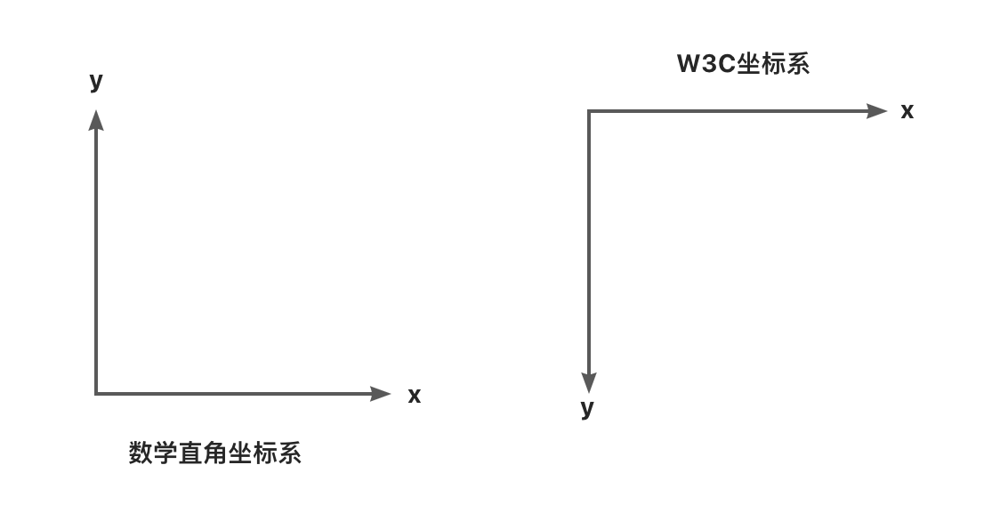
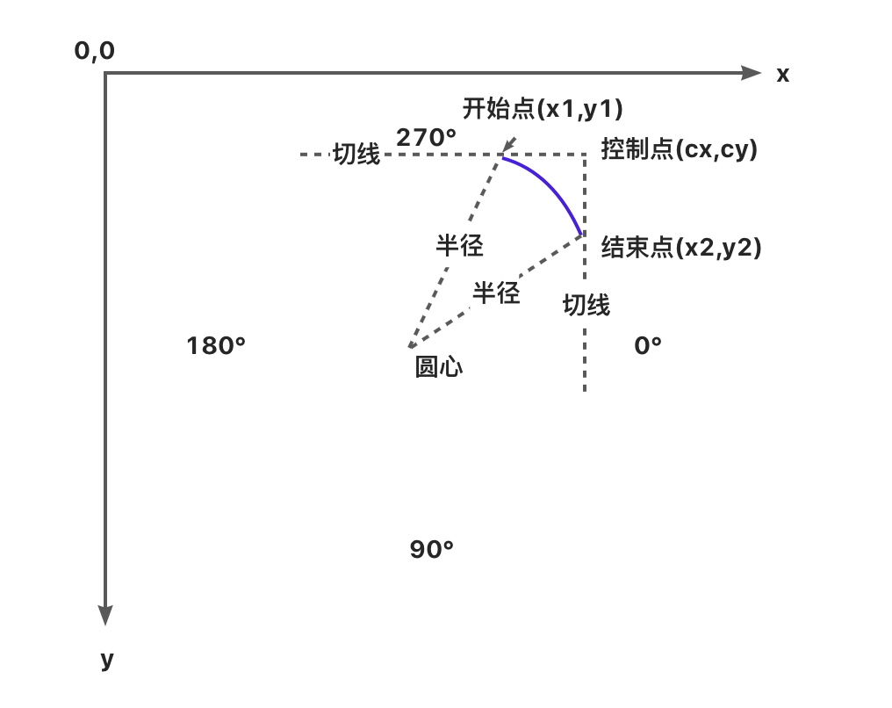

# Canvas 指南

## 概述

canvas 元素用于生成图像。它本身就像一个画布，JavaScript 通过操作它的 API，在上面生成图像。它的底层是一个个像素，基本上 canvas 是一个可以用 JavaScript 操作的位图（bitmap）。

## Canvas 是什么

- Canvas 中文名叫 “画布”，是 HTML5 新增的一个标签。
- Canvas 允许开发者通过 JS 在这个标签上绘制各种图案。
- Canvas 拥有多种绘制路径、矩形、圆形、字符以及图片的方法。
- Canvas 在某些情况下可以 “代替” 图片。
- Canvas 可用于动画、游戏、数据可视化、图片编辑器、实时视频处理等领域。

## Canvas 与 SVG 的区别

Canvas 与 SVG 图像的区别在于，canvas 是脚本调用各种方法生成图像，SVG 则是一个 XML 文件，通过各种子元素生成图像。

| Canvas                               | SVG                                                               |
| ------------------------------------ | ----------------------------------------------------------------- |
| 用 JS 动态生成元素（一个 HTML 元素） | 用 XML 描述元素（类似 HTML 元素那样，可用多个元素来描述一个图形） |
| 位图（受屏幕分辨率影响）             | 矢量图（不受屏幕分辨率影响）                                      |
| 不支持事件                           | 支持事件                                                          |
| 数据发生变化需要重绘                 | 不需要重绘                                                        |

## 基础实例

使用 Canvas API 之前，需要在网页里面新建一个 canvas 元素。

```html
<canvas id="canvas" width="300" height="200" style="border: 1px solid #ccc;"></canvas>
```

```js
// 获取canvas对象
const canvas = document.getElementById('canvas')
// 获取 canvas 上下文环境对象
const ctx = canvas.getContext('2d')

ctx.fillStyle = 'green'
// 绘制图形
ctx.fillRect(10, 10, 150, 100)
```

[Document.getElementById()](https://developer.mozilla.org/zh-CN/docs/Web/API/Document/getElementById) 方法获取 HTML canvas 元素的引用

[HTMLCanvasElement.getContext()](https://developer.mozilla.org/zh-CN/docs/Web/API/HTMLCanvasElement/getContext) 方法获取这个元素的 context——图像稍后将在此被渲染。

由 [CanvasRenderingContext2D](https://developer.mozilla.org/zh-CN/docs/Web/API/CanvasRenderingContext2D) 接口完成实际的绘制。fillStyle 属性让长方形变成绿色。fillRect() 方法将它的左上角放在 (10, 10)，把它的大小设置成宽 150 高 100。

:::warning 注意点

1. 默认宽高：canvas 有 默认的 宽度(300px) 和 高度(150px)
2. 设置 canvas 宽高：canvas 元素提供了 width 和 height 两个属性，可设置它的宽高。
   这两个属性只需传入数值，不需要传入单位。
3. 不能通过 CSS 设置画布的宽高
4. 线条默认宽度和颜色：线条的默认宽度是 1px ，默认颜色是黑色。

:::

## 基础图形

### 坐标系

Canvas 使用的是 W3C 坐标系 ，也就是遵循屏幕、报纸的阅读习惯，从上往下，从左往右。


### 直线

绘制直线，需要用到以下三个方法：

1. moveTo(x1, y1)：起点坐标 (x, y)
2. lineTo(x2, y2)：下一个点的坐标 (x, y)
3. stroke()：将所有坐标用一条线连起来

```html
<canvas id="c" style={{ border: '1px solid #ccc' }}></canvas>
```

```js
const canvas = document.getElementById('c')
const ctx = canvas.getContext('2d')

// 绘制直线
ctx.moveTo(50, 100) // 起点坐标
ctx.lineTo(200, 50) // 下一个点的坐标
ctx.stroke() // 将上面的坐标用一条线连接起来

// 绘制多条直线
ctx.moveTo(20, 100) // 起点坐标
ctx.lineTo(200, 100) // 下一个点的坐标
ctx.stroke() // 将上面的坐标用一条线连接起来

ctx.beginPath() // 新开一条路径
ctx.moveTo(20, 120) // 起点坐标
ctx.lineTo(200, 120) // 下一个点的坐标
ctx.stroke() // 将上面的坐标用一条线连接起来

// 设置样式
ctx.lineWidth = 20
ctx.strokeStyle = 'pink'
ctx.lineCap = 'round' // 默认: butt; 圆形: round; 方形: square
```

### 折线

绘制折线和直线差不多，都是使用 moveTo() 、lineTo() 和 stroke() 方法可以绘制折线。如下示例：

```js
ctx.moveTo(50, 200) //起始点
ctx.lineTo(100, 50)
ctx.lineTo(200, 200)
ctx.lineTo(250, 50)

ctx.stroke()
```

### 矩形

#### 使用绘制直线的方式绘制矩形

```js
// 绘制矩形
ctx.moveTo(50, 50)
ctx.lineTo(200, 50)
ctx.lineTo(200, 120)
ctx.lineTo(50, 120)
// ctx.lineTo(50, 50); // 需要闭合，又或者使用 closePath() 方法进行闭合，推荐使用 closePath()
ctx.closePath()

ctx.stroke()
```

:::warning 注意点
使用绘制直线的方式绘制矩形需要闭合，可以使用 closePath() 方法进行闭合
:::

#### canvas 提供的方法绘制矩形

1. fillRect(x,y,width,height)
   fillRect 用来绘制一个填充的矩形

2. strokeRect(x, y, width, height)
   strokeRect()用来绘制一个矩形的边框

3. clearRect(x, y, width, height)
   clearRect()用来清除指定矩形区域，让清除部分完全透明

4. rect(x, y, width, height)

```js
// 绘制矩形
ctx.strokeStyle = 'pink'
ctx.strokeRect(20, 20, 200, 200)

// 绘制填充矩形
ctx.fillStyle = 'pink'
ctx.fillRect(20, 20, 200, 200)
```

::: warning 注意点
fillStyle,strokeStyle 需要写在 fillRect，strokeRect 前面，否则样式不会生效
:::

同时使用 fillRect 和 strokeRect 会产生描边的效果

```js
ctx.fillStyle = 'pink'
ctx.fillRect(20, 20, 200, 200)
ctx.strokeStyle = 'yellow'
ctx.strokeRect(20, 20, 200, 200)
```

rect() 和 fillRect() 、strokeRect() 的用法差不多，唯一的区别是：

strokeRect() 和 fillRect() 这两个方法调用后会立即绘制；rect() 方法被调用后，不会立刻绘制矩形，而是需要调用 stroke() 或 fill() 辅助渲染。

```js
ctx.strokeStyle = 'red'
ctx.fillStyle = 'pink'

ctx.rect(20, 20, 200, 200) // rect(x, y, width, height)
ctx.stroke()
ctx.fill()

// ——————————————————————————————————
ctx.strokeStyle = 'red'
ctx.rect(20, 20, 200, 200) // rect(x, y, width, height)
ctx.stroke()

// 等价于
ctx.strokeStyle = 'red'
ctx.strokeRect(20, 20, 200, 200)

// ——————————————————————————————————
ctx.fillStyle = 'pink'
ctx.rect(20, 20, 200, 200) // rect(x, y, width, height)
ctx.fill()

// 等价于
ctx.fillStyle = 'pink'
ctx.fillRect(20, 20, 200, 200)
```

```js
ctx.strokeStyle = 'red'
ctx.fillStyle = 'pink'

ctx.rect(20, 20, 200, 200)
ctx.stroke()
ctx.fill()
// 清除指定矩形区域，让清除部分完全透明
ctx.clearRect(30, 30, 100, 100)
```

### 多边形

绘制三角形

```js
ctx.moveTo(20, 20)
ctx.lineTo(100, 20)
ctx.lineTo(100, 80)
ctx.closePath()
ctx.stroke()
```

绘制菱形

```js
ctx.moveTo(20, 20)
ctx.lineTo(120, 40)
ctx.lineTo(220, 20)
ctx.lineTo(120, 0)
ctx.lineTo(20, 20)
ctx.closePath()
ctx.stroke()
```

### 圆形

绘制圆形的方法是 arc()

**语法**：arc(x, y, r, sAngle, eAngle，counterclockwise)

**参数**：

- x 和 y: 圆心坐标
- r: 半径
- sAngle: 开始角度
- eAngle: 结束角度
- counterclockwise: 绘制方向（true: 逆时针; false: 顺时针），默认 false

```js
ctx.beginPath()
ctx.arc(100, 100, 50, 0, (360 * Math.PI) / 180)
ctx.closePath()
ctx.stroke()
```

:::warning 注意点
绘制圆形之前，必须先调用 `beginPath()` 方法

在绘制完成之后，还需要调用 `closePath()` 方法
:::

#### 绘制半圆

使用 arc() 方法画圆时，没做到刚好绕完一周（360°）就直接闭合路径，就会出现半圆的状态。

绘制下半圆

```js
ctx.beginPath()
ctx.arc(100, 100, 50, 0, (180 * Math.PI) / 180)
ctx.closePath()
ctx.stroke()
```

绘制上半圆

```js
ctx.beginPath()
ctx.arc(100, 100, 50, 0, (180 * Math.PI) / 180, true)
ctx.closePath()
ctx.stroke()
```

#### 绘制弧线

##### arc()绘制弧线

使用 arc() 方法画半圆时，如果最后不调用 closePath() 方法，就不会出现闭合路径。也就是说，那是一条弧线。

```js
// 绘制一条上半圆弧线
ctx.beginPath()
ctx.arc(100, 100, 50, 0, (180 * Math.PI) / 180, true)
ctx.stroke()
```

##### arcTo()绘制弧线

**语法**：arcTo(cx, cy, x2, y2, radius)

**参数**：

- cx: 两切线交点的横坐标
- cy: 两切线交点的纵坐标
- x2: 结束点的横坐标
- y2: 结束点的纵坐标
- radius: 半径

arcTo() 方法利用 开始点、控制点和结束点形成的夹角，绘制一段与夹角的两边相切并且半径为 radius 的圆弧。


## 基础样式

### stroke()：描边

### lineWidth：线条宽度

lineWidth 默认值是 1 ，默认单位是 px。

```js
ctx.beginPath()
ctx.moveTo(50, 50)
ctx.lineTo(250, 50)
ctx.lineWidth = 10 // 设置线宽
ctx.stroke()
```

### strokeStyle：线条颜色

```js
ctx.beginPath()
ctx.moveTo(50, 50)
ctx.lineTo(250, 50)
ctx.lineWidth = 10 // 设置线宽
ctx.strokeStyle = 'pink'
ctx.stroke()
```

### lineCap:线帽

```js
ctx.beginPath()
ctx.moveTo(50, 50)
ctx.lineTo(250, 50)
ctx.lineWidth = 10 // 设置线宽
ctx.strokeStyle = 'pink'
// 设置圆形线帽
ctx.lineCap = 'round' //默认值是butt，square（方形），round（圆形）
ctx.stroke()
```

### setLineDash:设置虚线

**语法**：setLineDash()

虚线分 3 种情况

1. 只传 1 个值
2. 有 2 个值
3. 有 3 个以上的值

```js
ctx.lineWidth = 20
ctx.strokeStyle = 'pink'

ctx.moveTo(50, 50)
ctx.lineTo(200, 50)
ctx.setLineDash([10]) // 只传1个参数，实线与空白都是 10px
ctx.stroke()

ctx.beginPath()
ctx.moveTo(50, 100)
ctx.lineTo(200, 100)
ctx.setLineDash([10, 20]) // 2个参数，此时，实线是 10px, 空白 20px
ctx.stroke()

ctx.beginPath()
ctx.moveTo(50, 150)
ctx.lineTo(200, 150)
ctx.setLineDash([10, 20, 5]) // 传3个以上的参数，此例：10px实线，20px空白，5px实线，10px空白，20px实线，5px空白 ……

ctx.stroke()
```

## 图片

在 Canvas 中可以使用 drawImage() 方法绘制图片。

**语法**：drawImage(image, dx, dy)

**参数**：

- image: 要渲染的图片对象。
- dx: 图片左上角的横坐标位置。
- dy: 图片左上角的纵坐标位置。

渲染图片的方式有 两种，一种是在 JS 里加载图片再渲染，另一种是把 DOM 里的图片拿到 canvas 里渲染。

### JS 里加载图片再渲染

渲染的步骤：

1. 创建 Image 对象
2. 引入图片
3. 等待图片加载完成
4. 使用 drawImage() 方法渲染图片

示例：

```html
<canvas width={300} height={300} id="c" style={{ border: '1px solid #ccc' }}></canvas>
```

```js
const canvas = document.getElementById('c')
const ctx = canvas.getContext('2d')

// 1. 创建 Image 对象
const img = new Image()
// 2. 引入图片
img.src = '/img1.jpeg'
// 3. 等待图片加载完成
img.onload = () => {
  // 4. 使用 drawImage() 方法渲染图片
  ctx.drawImage(img, 0, 0)
}
```

### DOM 里的图片拿到 canvas 里再渲染

```js
const canvas = document.getElementById('c')
const ctx = canvas.getContext('2d')

// 获取DOM里面的图片
const img = document.getElementById('box')
// 使用 drawImage() 方法渲染图片
ctx.drawImage(img, 0, 0)
```

### 设置宽高

**语法**：drawImage(image, dx, dy, dw, dh)

```js
const canvas = document.getElementById('c')
const ctx = canvas.getContext('2d')

// 1. 创建 Image 对象
const img = new Image()
// 2. 引入图片
img.src = '/img1.jpeg'
// 3. 等待图片加载完成
img.onload = () => {
  // 4. 使用 drawImage() 方法渲染图片，指定渲染图片的宽高
  ctx.drawImage(img, 0, 0, 100, 100)
}
```

### 截取图片

**语法**：drawImage(image, sx, sy, sw, sh, dx, dy, dw, dh)

**参数**：

- image: 图片对象
- sx: 开始截取的横坐标
- sy: 开始截取的纵坐标
- sw: 截取的宽度
- sh: 截取的高度
- dx: 图片左上角的横坐标位置
- dy: 图片左上角的纵坐标位置
- dw: 图片宽度
- dh: 图片高度

示例：

```js
const canvas = document.getElementById('c')
const ctx = canvas.getContext('2d')

// 1. 创建 Image 对象
const img = new Image()
// 2. 引入图片
img.src = '/img1.jpeg'
// 3. 等待图片加载完成
img.onload = () => {
  // 4. 使用 drawImage() 方法渲染图片，指定渲染图片的宽高
  ctx.drawImage(img, 0, 0, 100, 100, 30, 30, 200, 200)
}
```
