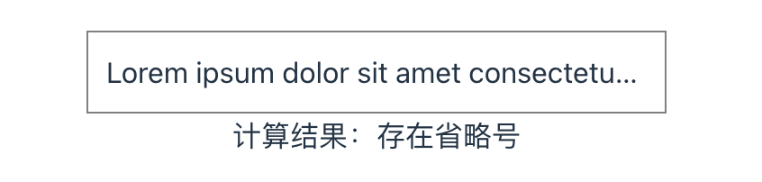
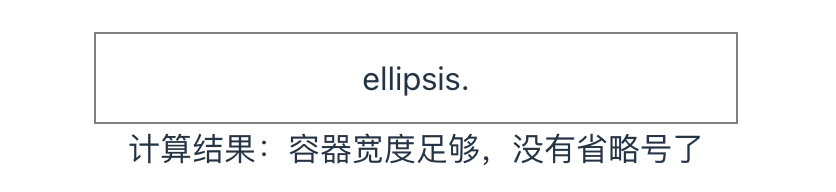

# 前端小知识

## CSS 一行文本超出以...显示

```css
overflow: hidden;
text-overflow: ellipsis;
white-space: nowrap;
word-break: break-all;
```

## CSS 多行文本超出以...显示

```css
display: -webkit-box;
word-break: break-all;
-webkit-line-clamp: 2;
-webkit-box-orient: vertical;
overflow: hidden;
text-overflow: ellipsis;
```

## 单行文字不换行

```css
word-break: break-all;
white-space: nowrap;
```

## 修改滚动条样式

```css
div::-webkit-scrollbar {
  display: none;
}
```

- div::-webkit-scrollbar 滚动条整体部分
- div::-webkit-scrollbar-thumb 滚动条里面的小方块，能向上向下移动（或往左往右移动，取决于是垂直滚动条还是水平滚动条
- div::-webkit-scrollbar-track 滚动条的轨道（里面装有 Thumb
- div::-webkit-scrollbar-button 滚动条的轨道的两端按钮，允许通过点击微调小方块的位置
- div::-webkit-scrollbar-track-piece 内层轨道，滚动条中间部分（除去
- div::-webkit-scrollbar-corner 边角，即两个滚动条的交汇处
- div::-webkit-resizer 两个滚动条的交汇处上用于通过拖动调整元素大小的小控件注意此方案有兼容性问题，一般需要隐藏滚动条时都是用一个色块通过定位盖上去，或者将子级元素调大，父级元素使用 overflow-hidden 截掉滚动条部分。暴力且直接。

## ??合并空运算符

假设变量 a 不存在，希望给系统一个默认值，一般会使用||运算符。但是在`javascript`中空字符串，0，false 都会执行||运算符，所以`ECMAScript2020`引入合并空运算符解决该问题，只允许在值为 null 或未定义时使用默认值。

示例：

```js
const name = ''

console.log(name || 'yd') // yd;
console.log(name ?? 'yd') // '';
```

## JS 判断文字是否溢出（即是否存在...）

:::details 判断文字是否溢出

```jsx
import { useEffect, useState } from 'react'

const [result, setResult] = useState()

useEffect(() => {
  const box = document.querySelector('.box')

  const getPadding = (el) => {
    const style = window.getComputedStyle(el, null)
    const paddingLeft = Number.parseInt(style.paddingLeft, 10) || 0
    const paddingRight = Number.parseInt(style.paddingRight, 10) || 0
    const paddingTop = Number.parseInt(style.paddingTop, 10) || 0
    const paddingBottom = Number.parseInt(style.paddingBottom, 10) || 0
    return {
      pLeft: paddingLeft,
      pRight: paddingRight,
      pTop: paddingTop,
      pBottom: paddingBottom
    }
  }

  const checkEllipsis = () => {
    const range = document.createRange()
    range.setStart(box, 0)
    range.setEnd(box, box.childNodes.length)
    window.getSelection().addRange(range)
    const rangeWidth = range.getBoundingClientRect().width
    const rangeHeight = range.getBoundingClientRect().height
    const { pLeft, pRight, pTop, pBottom } = getPadding(box)
    const horizontalPadding = pLeft + pRight
    const verticalPadding = pTop + pBottom
    if (
      rangeWidth + horizontalPadding > box.offsetWidth ||
      rangeHeight + verticalPadding > box.offsetHeight ||
      range.scrollWidth > box.offsetWidth
    ) {
      setResult('存在省略号')
    } else {
      setResult('容器宽度足够，没有省略号了')
    }
  }

  checkEllipsis()
}, [])

return (
  <>
    <div className="ellipsis box">Lorem ipsum dolor sit amet consectetur adipisicing elit.</div>
    <div>计算结果：{result}</div>
  </>
)
```

:::

```css
.ellipsis {
  overflow: hidden;
  text-overflow: ellipsis;
  white-space: nowrap;
}

.box {
  border: 1px solid gray;
  padding: 10px;
  width: 300px;
}
```



