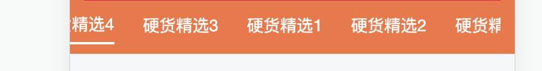
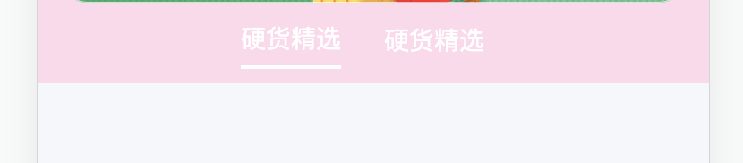

# 踩坑记录

## 水平滚动使用 justify-content 显示不全问题

一般在写 tab 的时候，我们想要实现的效果是：tab 较少（即只有两个或三个 tab）时，希望可以居中展示（最先考虑到的是 justify-content:center)，当有多个 tab 时，希望实现的效果是可以横向滚动。

一般会想到的就是这么写：

```css
.category {
  display: flex;
  align-items: center;
  justify-content: center;
  text-align: center;
  overflow-x: auto;
  flex-wrap: nowrap;
  padding: 8px;
  box-sizing: border-box;
  &::-webkit-scrollbar {
    display: none;
  }
}
```

但是直接这样使用会出现一个问题，即 tab 会有部分被遮挡，第一个元素会被遮挡，如下这种效果：



当然也想过不使用 justify-content: center;而是 justify-content: space-between;这样导致的问题是两个 tab 之间的间隔太大了，不是我们想要的效果。想要解决这个问题，暂时是在 category 外面再包一层 div,给这层 div 设置 justify-content: center;另外，需要设置 margin:0 auto;这样可以保证在 tab 较少时也可以保证居中效果。

```css
.category-father {
  display: flex;
  justify-content: center;
}
.category {
  display: flex;
  align-items: center;
  text-align: center;
  overflow-x: auto;
  flex-wrap: nowrap;
  padding: 8px;
  box-sizing: border-box;
  margin: 0 auto;
  &::-webkit-scrollbar {
    display: none;
  }
}
```

实现的效果如下所示：




## 安卓浏览器下 line-height 垂直居中但是效果出现偏离

安卓字体小于 12px 会出现渲染上移的情况，是无法通过 CSS 解决的，即使解决了也是一种通过微调来实现的 hack 方法，因为文字在 `content-area` 内部渲染的时候已经偏移了，而 css 的居中方案都是控制的整个 `content-area` 的居中。

### 原因

导致这个问题的本质原因可能是 Android 在排版计算的时候参考了 primyfont 字体的相关属性（即 HHead Ascent、HHead Descent 等），而 primyfont 的查找是看`font-family`里哪个字体在 fonts.xml 里第一个匹配上，而原生 Android 下中文字体是没有 family name 的，导致匹配上的始终不是中文字体，所以解决这个问题就要在`font-family`里显式申明中文，或者通过什么方法保证所有字符都 fallback 到中文字体。

### 解决方案

1. 针对 Android 7.0+设备：`<html>上设置 lang 属性：<html lang="zh-cmn-Hans">`，同时 `font-family` 不指定英文，如 `font-family: sans-serif` 。这个方法是利用了浏览器的字体 fallback 机制，让英文也使用中文字体来展示，blink 早期的内核在 fallback 机制上存在问题，Android 7.0+才能 ok，早期的内核下会导致英文 fallback 到 Noto Sans Myanmar，这个字体非常丑。
2. 针对 MIUI 8.0+设备：设置 `font-family: miui` 。这个方案就是显式申明中文的方案，MIUI 在 8.0+上内置了小米兰亭，同时在 fonts.xml 里给这个字体指定了 `family name：miui`，所以我们可以直接设置。
3. 尽量避免小于 12px 的元素。

## html2canvas 绘制的图片模糊

不要使用`background-image:url()`属性，实验发现用这个属性渲染出来的图片都很糊，用 img 标签就好了。

## html2canvas 绘制文案向下偏移

有些第三方样式或者 `init.css` 样式全局设置了 `img { display : block ;}`

解决方案：在目标页面重置 img 全局样式即可

```css
img {
  display: initial;
}
```

## JS 复制文案在异步方法中复制失败

:::details 复制方法

```js
export const copy = (text: string): Promise<void> => {
  let fakeElem: null | HTMLTextAreaElement = null

  const isRTL = document.documentElement.getAttribute('dir') == 'rtl'
  fakeElem = document.createElement('textarea')
  // Prevent zooming on iOS
  fakeElem.style.fontSize = '12pt'
  // Reset box model
  fakeElem.style.border = '0'
  fakeElem.style.padding = '0'
  fakeElem.style.margin = '0'
  // Move element out of screen horizontally
  fakeElem.style.position = 'absolute'
  fakeElem.style[isRTL ? 'right' : 'left'] = '-9999px'
  // Move element to the same position vertically
  const yPosition = window.pageYOffset || document.documentElement.scrollTop
  fakeElem.style.top = `${yPosition}px`

  fakeElem.setAttribute('readonly', '')
  fakeElem.value = text

  document.body.appendChild(fakeElem)

  select(fakeElem)

  return new Promise((resolve, reject) => {
    try {
      document.execCommand('copy')
      resolve()
    } catch (err) {
      reject()
    }
    if (fakeElem) {
      document.body.removeChild(fakeElem)
    }
  })
}
```

:::

这个问题就是在复制文案的时候，预期的是在异步获取到需要复制的内容后将其复制到剪切板，但是实际上却只能获取到结果，不能成功复制到剪切板。

### 原因

`document.execCommand()`这个 api 只能在真正的用户操作之后才能被触发，是为了安全考虑。
原理大致是这样的，当用户操作之后，chrome 会将当前作用域下的 userAction 变量置为 true，然后执行 execCommand 时就会去读取这个变量，当为 true 的时候才可以执行。
ajax 基本都是异步请求，而异步请求不同于同步请求的地方就在于重新创建了一个作用域去执行回调函数。 所以在重新创建一个作用域之后，之前作用域内的 userAction 就失效了，当前作用域下的 userAction 为 false，所以复制不成功.

### 解决方案

1. 用真正的用户操作去执行 execCommand。（可能需要修改交互流程）
2. 将异步请求改成同步请求。这样做就不会创建新的作用域，execCommand 命令依旧在 userAction 为 true 的上下文下执行。（当然这种做法也不是很推荐，但为了满足需求只能这样做，只要把 xhr.open 里的最后一个参数改为 false 即可满足同步请求）
