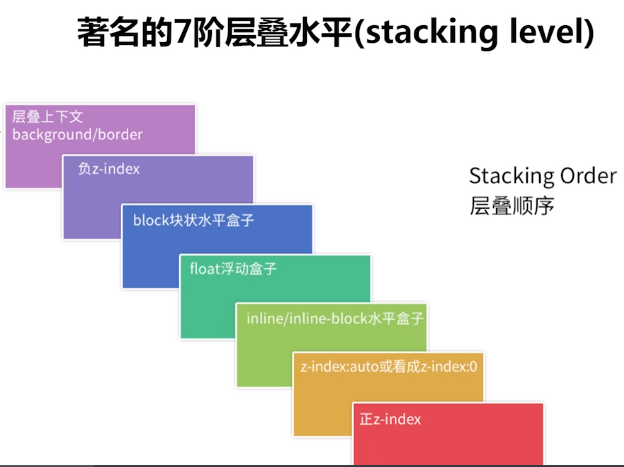

# 前端页面截图方案

:::tip 背景
将网页保存为图片（以下简称为快照），是用户记录和分享页面信息的有效手段，在各种兴趣测试和营销推广等形式的活动页面中尤为常见。
快照环节通常处于页面交互流程的末端，汇总了用户最终的参与结果，直接影响到用户对于活动的完整体验。因此，生成高质量的页面快照，对于活动的传播和品牌的转化具有十分重要的意义。
:::

## 适用场景

- 适用于将页面转为图片，特别是对实时性要求较高的场景。
- 希望在快照中展示跨域图片资源的场景。
- 针对生成图片内容不完整、模糊或者转换过程缓慢等问题，寻求有效解决方案的场景。

## 原理简析

:::tip
依据图片是否由设备本地生成，快照可分为前端处理和后端处理两种方式。

由于后端生成的方案依赖于网络通信，不可避免地存在通信开销和等待时延，同时对于模板和数据结构变更也有一定的维护成本。

因此，出于实时性和灵活性等综合考虑，优先选用前端处理的方式。
:::

前端侧对于快照的处理过程，实质上是将 DOM 节点包含的视图信息转换为图片信息的过程。这个过程可以借助 canvas 的原生 API 实现，这也是方案可行性的基础。

具体来说，转换过程是将目标 DOM 节点绘制到 canvas 画布，然后 canvas 画布以图片形式导出。可简单标记为绘制阶段和导出阶段两个步骤：

- **绘制阶段**：选择希望绘制的 DOM 节点，根据 nodeType 调用 canvas 对象的对应 API，将目标 DOM 节点绘制到 canvas 画布（例如对于 img 的绘制使用 drawImage 方法)。
- **导出阶段**：通过 canvas 的 toDataURL 或 getImageData 等对外接口，最终实现画布内容的导出

## 基础方案

### 原生 canvas

对于单个 img 元素可按如下方式生成自身的快照：

```html

```

```javascript
// 获取目标元素
const target = document.getElementById('box')
// 新建canvas画布
const canvas = document.createElement('canvas')
canvas.width = 100
canvas.height = 100
const ctx = canvas.getContext('2d')
// 导出阶段：从canvas导出新的图片
const exportNewImage = (canvas) => {
  const exportImage = document.createElement('img')
  exportImage.src = canvas.toDataURL()
  document.body.appendChild(exportImage)
}
// 绘制阶段：待图片内容加载完毕后绘制画布
target.onload = () => {
  // 将图片内容绘入画布
  ctx.drawImage(target, 0, 0, 100, 100)
  // 将画布内容导出为新的图片
  exportNewImage(canvas)
}
```

其中，`drawImage`是 canvas 上下文对象的实例方法，提供多种方式将 `CanvasImageSource` 源绘制到 canvas 画布上。`exportNewImage` 用于将 canvas 中的视图信息导出为包含图片展示的 data URI。

从上面 canvas 方案中可以看到基于 canvas 提供的相关基础 API，为前端侧的页面快照处理提供了可能。
然而，具体的业务应用往往更加复杂，上面的「低配版」实例显然未能覆盖多数的实际场景，例如：

- canvas 的 drawImage 方法只接受 CanvasImageSource，而 CanvasImageSource 并不包括文本节点、普通的 div 等，将非 img 的元素绘制到 canvas 需要特定处理。
- 当有多个 DOM 元素需要绘制时，层级优先级处理较为复杂。
- 调用 canvas 绘制：需要进行布局计算，需要关注 float、z-index、position 等布局定位的处理。
- 样式合成绘制计算较为繁琐。绘制起来也很繁琐，造成开发量大。

### html2canvas

[html2canvas](https://github.com/niklasvh/html2canvas)

[html2canvas 文档](http://html2canvas.hertzen.com/)

`html2canvas`库主要使用的是 Canvas 实现方式，主要过程是手动将 dom 重新绘制成 canvas，并没有截取页面的屏幕截图，而是根据从 DOM 读取的属性构建页面的表示，因此，它只能正确渲染可以理解的属性，有许多 CSS 属性无法正确渲染。

#### 使用

`html2canvas`对外暴露了一个可执行函数，它的第一个参数用于接收待绘制的目标节点(必选)；第二个参数是可选的配置项，用于设置涉及 canvas 导出的各个参数:

options 对象可选的值

| Name                   | Default                 | Description                                                                          |
| ---------------------- | ----------------------- | ------------------------------------------------------------------------------------ |
| allowTaint             | false                   | 是否允许跨域图像污染画布                                                             |
| backgroundColor        | #ffffff                 | 画布背景颜色，如果在 DOM 中没有指定，设置“null”（透明）                              |
| canvas                 | null                    | 使用现有的“画布”元素，用来作为绘图的基础                                             |
| foreignObjectRendering | false                   | 是否使用 ForeignObject 渲染（如果浏览器支持的话）                                    |
| imageTimeout           | 15000                   | 加载图像的超时时间(毫秒)，设置为“0”以禁用超时                                        |
| ignoreElements         | (element) => false      | 从呈现中移除匹配元素                                                                 |
| logging                | true                    | 为调试目的启用日志记录                                                               |
| onclone                | null                    | 回调函数，当文档被克隆以呈现时调用，可以用来修改将要呈现的内容，而不影响原始源文档。 |
| proxy                  | null                    | 用来加载跨域图片的代理 URL，如果设置为空（默认），跨域图片将不会被加载               |
| removeContainer        | true                    | 是否清除 html2canvas 临时创建的克隆 DOM 元素                                         |
| scale                  | window.devicePixelRatio | 用于渲染的缩放比例，默认为浏览器设备像素比                                           |
| useCORS                | false                   | 是否尝试使用 CORS 从服务器加载图像                                                   |
| width                  | Element width           | canvas 的宽度                                                                        |
| height                 | Element height          | canvas 的高度                                                                        |
| x                      | Element x-offset        | canvas 的 x 轴位置                                                                   |
| y                      | Element y-offset        | canvas 的 y 轴位置                                                                   |
| scrollX                | Element scrollX         | 渲染元素时使用的 x 轴位置(例如，如果元素使用 position: fixed)                        |
| scrollY                | Element scrollY         | 渲染元素时使用的 y 轴位置(例如，如果元素使用 position: fixed)                        |
| windowWidth            | Window.innerWidth       | 渲染元素时使用的窗口宽度，这可能会影响诸如媒体查询之类的事情                         |
| windowHeight           | Window.innerHeight      | 渲染元素时使用的窗口高度，这可能会影响诸如媒体查询之类的事情                         |

```js
// element 为目标绘制节点，options为可选参数
html2canvas(element[,options]);
```

调用示例：

```js
import html2canvas from 'html2canvas'

const options = {}

// 输入dom节点，返回包含dom视图内容的canvas对象
html2canvas(dom, options).then(function (canvas) {
  document.body.appendChild(canvas)
})
```

#### 浏览器支持情况

:::tip

- Firefox 3.5+
- Google Chrome
- Opera 12+
- IE9+
- Safari 6+
  :::

#### 原理分析

`html2canvas` 的基本原理是读取 DOM 元素的信息，基于这些信息去构建截图，并呈现在 canvas 画布中。其中重点就在于将 dom 重新绘制成 canvas 的过程，该过程整体的思路是：

遍历目标节点和目标节点的子节点，遍历过程中记录所有节点的结构、内容和样式，然后计算节点本身的层级关系，最后根据不同的优先级绘制到 canvas 画布中。

`html2canvas` 的解析过程：

1. 构建配置项
   在这一步会结合传入的 options 和一些 defaultOptions，生成用于渲染的配置数据 renderOptions。相关配置的分类如下：

   ```js
   resourceOptions：资源跨域相关配置
   contextOptions：缓存、日志相关配置
   windowOptions：窗口宽高、滚动配置
   cloneOptions：对指定dom的配置
   renderOptions：render结果的相关配置，包括生成图片的各种属性
   ```

2. clone 目标节点并获取样式和内容

3. 解析目标节点
   目标节点的样式和内容都获取到了之后，就需要把它所承载的数据信息转化为 Canvas 可以使用的数据类型。在对目标节点的解析方法中，递归整个 DOM 树，并取得每一层节点的数据，对于每一个节点而言需要绘制的部分包括边框、背景、阴影、内容，而对于内容就包含图片、文字、视频等。在整个解析过程中，对目标节点的所有属性进行解析构造，转化成为指定的数据格式，基础数据格式可见以下代码:

```js
class ElementContainer {
  // 所有节点上的样式经过转换计算之后的信息
  readonly styles: CSSParsedDeclaration;
  // 节点的文本节点信息, 包括文本内容和其他属性
  readonly textNodes: TextContainer[] = [];
  // 当前节点的子节点
  readonly elements: ElementContainer[] = [];
  // 当前节点的位置信息（宽/高、横/纵坐标）
  bounds: Bounds;
  flags = 0;
  ...
}
```

4. 构建内部渲染器
   把目标节点处理成特定的数据结构之后，就需要结合 Canvas 调用渲染方法了，Canvas 绘图需要根据样式计算哪些元素应该绘制在上层，哪些在下层，那么这个规则是什么样的呢？这里就涉及到 CSS 布局相关的一些知识。默认情况下，CSS 是流式布局的，元素与元素之间不会重叠。不过有些情况下，这种流式布局会被打破，比如使用了浮动(float)和定位(position)。因此需要识别出哪些脱离了正常文档流的元素，并记住它们的层叠信息，以便正确地渲染它们。那些脱离正常文档流的元素会形成一个层叠上下文。

   层叠上下文和层叠顺序的规则：
   

   Canvas 绘制节点的时候，需要生成指定的层叠数据，因此需要先计算出整个目标节点里子节点渲染时所展现的不同层级，构造出所有节点对应的层叠上下文在内部所表现出来的数据结构，具体数据结构如下:

   ```js
   // 当前元素
   element: ElementPaint
   // z-index 为负, 形成层叠上下文
   negativeZIndex: StackingContext[];
   // z-index 为 0、auto、transform 或 opacity, 形成层叠上下文
   zeroOrAutoZIndexOrTransformedOrOpacity: StackingContext[];
   // 定位和 z-index 形成的层叠上下文
   positiveZIndex: StackingContext[];
   // 没有定位和 float 形成的层叠上下文
   nonPositionedFloats: StackingContext[];
   // 没有定位和内联形成的层叠上下文
   nonPositionedInlineLevel: StackingContext[];
   // 内联节点
   inlineLevel: ElementPaint[];
   // 不是内联的节点
   nonInlineLevel: ElementPaint[];
   ```

   基于以上数据结构，将元素子节点分类，添加到指定的数组中，解析层叠信息的方式和解析节点信息的方式类似，都是递归整棵树，收集树的每一层的信息，形成一颗包含层叠信息的层叠树。

5. 绘制数据
   调用`renderStackContent`方法，将 DOM 元素一层一层渲染到 canvas 中。

#### 源码分析

入口方法：

```js
var html2canvas = function (element, options) {
  if (options === void 0) {
    options = {}
  }
  return renderElement(element, options)
}
```

入口方法返回的是`renderElement`调用的结果，因此直接看`renderElement`方法。

`renderElement`方法的主要目的是将页面中指定的 DOM 元素渲染到一个 canvas 中，并将渲染好的 canvas 返回给用户。

`renderElement`方法主要做的事情：

1. 构建配置项，解析用户传入的 options，将其与默认的 options 合并，得到用于渲染的配置数据 renderOptions。
2. 对传入的 DOM 元素进行解析，取到节点信息和样式信息，这些节点信息会和上一步的 renderOptions 配置一起传给 `canvasRenderer` 实例，用来绘制 canvas
3. `canvasRenderer` 将依据浏览器渲染层叠内容的规则，将用户传入的 DOM 元素渲染到一个 canvas 中，这个 canvas 我们可以在 then 方法的回调中取到

`renderElement`方法的核心代码如下：

```js
const renderElement = async (
  element: HTMLElement,
  opts: Partial<Options>
): Promise<HTMLCanvasElement> => {
  const renderOptions = { ...defaultOptions, ...opts } // 合并默认配置和用户配置
  const renderer = new CanvasRenderer(renderOptions) // 根据渲染的配置数据生成canvasRenderer实例
  const root = parseTree(clonedElement) // 解析用户传入的DOM元素（为了不影响原始的DOM，实际上会克隆一个新的DOM元素），获取节点信息
  return await renderer.render(root) // canvasRenderer实例会根据解析到的节点信息，依据浏览器渲染层叠内容的规则，将DOM元素内容渲染到离屏canvas中
}
```

**parseTree 解析节点信息**

parseTree 的入参是一个普通的 DOM 元素，返回值是一个 `ElementContainer` 对象，该对象主要包含：

- bounds：位置信息（width|height|left|top）
- context
- textNodes：文本节点
- elements：子元素信息
- flags：用来决定如何渲染的标志
- styles：样式

该对象包含的只是节点树的相关信息，不包含层叠数据，层叠数据在 parseStackingContexts 方法中取得。

**renderer.render**

有了节点信息就可以构建渲染器，渲染的逻辑如下：

- 使用上一步解析到的节点数据，生成层叠数据
- 使用节点的层叠数据，依据浏览器渲染层叠数据的规则，将 DOM 元素一层一层渲染到离屏 canvas 中
  render 核心代码如下：

```js
async render(element: ElementContainer): Promise<HTMLCanvasElement> {
  const stack = parseStackingContexts(element);
  // 渲染层叠内容
  await this.renderStack(stack);
  return this.canvas;
}
```

`parseStackingContexts`解析层叠信息的方式和`parseTree`解析节点信息的方式类似，都是递归整棵树，收集树的每一层的信息，形成一颗包含层叠信息的层叠树。

而渲染层叠内容的`renderStack`方式实际上调用的是`renderStackContent`方法，该方法是整个渲染流程中最为关键的方法。

**renderStackContent**

`renderStackContent`主要做的是将 DOM 元素一层一层得渲染到离屏 canvas 中。默认情况下，CSS 是流式布局的，元素与元素之间不会重叠。不过有些情况下，这种流式布局会被打破，比如使用了浮动(float)和定位(position)，那些脱离正常文档流的元素会形成一个层叠上下文，因此需要根据层叠上下文规则进行渲染，`renderStackContent`就是对 CSS 层叠布局规则的一个实现：

```js
async renderStackContent(stack: StackingContext) {
    // 1. 最底层是background/border
    await this.renderNodeBackgroundAndBorders(stack.element);

    // 2. 第二层是负z-index
    for (const child of stack.negativeZIndex) {
        await this.renderStack(child);
    }

    // 3. 第三层是block块状盒子
    await this.renderNodeContent(stack.element);

    for (const child of stack.nonInlineLevel) {
        await this.renderNode(child);
    }

    // 4. 第四层是float浮动盒子
    for (const child of stack.nonPositionedFloats) {
        await this.renderStack(child);
    }

    // 5. 第五层是inline/inline-block水平盒子
    for (const child of stack.nonPositionedInlineLevel) {
        await this.renderStack(child);
    }
    for (const child of stack.inlineLevel) {
        await this.renderNode(child);
    }

    // 6. 第六层是以下三种：
    // (1) ‘z-index: auto’或‘z-index: 0’。
    // (2) ‘transform: none’
    // (3) opacity小于1
    for (const child of stack.zeroOrAutoZIndexOrTransformedOrOpacity) {
        await this.renderStack(child);
    }

    // 7. 第七层是正z-index
    for (const child of stack.positiveZIndex) {
        await this.renderStack(child);
    }
}

```

### canvas2image

[canvas2image](https://github.com/hongru/canvas2image) 将 canvas 保存或转换为图像的工具

`canvas2image`仅用于将输入的 canvas 对象按特定格式转换和存储操作，其中这两类操作均支持 PNG，JPEG，GIF，BMP 四种图片类型：

```js
// 格式转换
Canvas2Image.convertToPNG(canvasObj, width, height)
Canvas2Image.convertToJPEG(canvasObj, width, height)
Canvas2Image.convertToGIF(canvasObj, width, height)
Canvas2Image.convertToBMP(canvasObj, width, height)

// 另存为指定格式图片
Canvas2Image.saveAsPNG(canvasObj, width, height)
Canvas2Image.saveAsJPEG(canvasObj, width, height)
Canvas2Image.saveAsGIF(canvasObj, width, height)
Canvas2Image.saveAsBMP(canvasObj, width, height)
```

实质上，`canvas2image`只是提供了针对 canvas 基础 API 的二次封装（例如 getImageData、toDataURL），而本身并不依赖`html2canvas`。

调用示例：

```html


<div onClick="{handleCanvas2Image}">canvas2Image</div>
```

```js
const handleCanvas2Image = () => {
  const box = document.getElementById('box')
  const imageEl = Canvas2Image.convertToPNG(box, 100, 100)
  document.body.appendChild(imageEl)
}
```

### html2canvas & canvas2image

调用示例：

```html


<div onClick="{handleToImage}">html2canvas & canvas</div>
```

```js
function convertToImage(container: HTMLElement | null, options = {}) {
  return html2canvas(container, options).then((canvas) => {
    const imageEl = Canvas2Image.convertToPNG(canvas, canvas.width, canvas.height)
    return imageEl
  })
}

// html2canvas和Canvas2Image结合
const handleToImage = () => {
  const canvas = document.getElementById('box')
  convertToImage(canvas).then((path) => {
    document.body.appendChild(path)
  })
}
```

### 优化

基于 `html2canvas` 和 `canvas2image`，实现了相比原生方案通用性更佳的基础页面快照方案。然而面对实际复杂的应用场景，以上基础方案生成的快照效果往往不尽如人意。
快照效果的差异性，一方面是由于 `html2canvas` 导出的视图信息是通过各种 DOM 和 canvas 的 API 复合计算二次绘制的结果（并非一键栅格化）。因此不同宿主环境的相关 API 实现差异，可能导致生成的图片效果存在多端不一致性或者显示异常的情况。

另一方面，业务层面的因素，例如对于开发者 `html2canvas` 的配置有误或者是页面布局不当等原因，也会对生成快照的结果带来偏差。
社区中也可以常见到一些对于生成快照质量的讨论，例如：

- 为什么有些内容显示不完整、残缺、白屏或黑屏？
- 明明原页面清晰可辨，为什么生成的图片模糊如毛玻璃？
- 将页面转换为图片的过程十分缓慢

首要问题：保证目标节点视图信息完整导出

由于真机环境的兼容性和业务实现方式的不同，在一些使用 `html2canvas` 过程中常会出现快照内容与原视图不一致的情况。内容不完整的常见自检 checklist 如下：

- 跨域问题：存在跨域图片污染 canvas 画布。
- 资源加载：生成快照时，相关资源还未加载完毕。
- 滚动问题：页面中滚动元素存在偏移量，导致生成的快照顶部出现空白。

#### 跨域问题解决方案

:::tip 跨域问题
由于 `canvas` 对于图片资源的同源限制，如果画布中包含跨域的图片资源则会污染画布( Tainted canvases )，造成生成图片内容混乱或者`html2canvas`方法不执行等异常问题。
:::

- useCORS 配置

```js
// 开启html2canvas 的 useCORS 配置
const options = {
  useCORS: true, // 允许使用跨域图片
  allowTaint: false // 不允许跨域图片污染画布
}

html2canvas(element, options)
```

- CORS 配置
  上一步的 useCORS 的配置，只是允许 img 接收跨域的图片资源，而对于解锁跨域图片在 canvas 上的绘制并导出，需要图片资源本身提供 CORS 支持，可以在 img 标签上设置 crossorigin，属性值为 anonymous，可以开启 CORS 请求。当然，这种方式的前提还是服务端的响应头 Access-Control-Allow-Origin 已经被设置过允许跨域。如果图片本身服务端不支持跨域，可以使用 canvas 统一转成 base64 格式。

#### 资源加载解决方案

:::tip 资源加载
资源加载不全，是造成快照不完整的一个常见因素。在生成快照时，如果部分资源没有加载完毕，那么生成的内容自然也谈不上完整。
:::

1. 设置一定的延迟
2. 基于 Promise.all 实现

#### 滚动问题解决方案

:::tip 滚动问题
典型特征：生成快照的顶部存在空白区域。

原因：一般是保存长图（超过一屏），并且滚动条不在顶部时导致（常见于 SPA 类应用）。
:::

在调用`html2canvas`之前，先记录此时的 scrollTop，然后调用 window.scroll(0, 0)将页面移动至顶部。待快照生成后，再调用 window.scroll(0, scrollTop)恢复原有纵向偏移量。

### dom-to-image

[dom-to-image](https://github.com/tsayen/dom-to-image) 主要使用的是 SVG 实现方式，简单来说就是先把 DOM 转换为 SVG 然后再把 SVG 转换为图片。

#### SVG 转换

SVG 中有一个[foreignObject](https://developer.mozilla.org/zh-CN/docs/Web/SVG/Element/foreignObject)，这个元素的作用是可以在其中使用具有其它 XML 命名空间的 XML 元素，支持内嵌 HTML 和 css 样式。利用这个特性，只需要将节点样式转换为内联后，用`foreignObject`包裹即可。举个例子：

```js
<svg xmlns="http://www.w3.org/2000/svg">
  <foreignObject width="120" height="50">
    <body xmlns="http://www.w3.org/1999/xhtml">
      <p>文字。</p>
    </body>
  </foreignObject>
</svg>
```

可以看到`foreignObject`标签里面有一个设置了 xmlns=“<http://www.w3.org/1999/xhtml>”命名空间的 body 标签，此时 body 标签及其子标签都会按照 XHTML 标准渲染，实现了 SVG 和 XHTML 的混合使用。

#### 主要方法

- `domtoimage.toPng(…)`：将节点转化为 png 格式的图片
- `domtoimage.toJpeg(…)`：将节点转化为 jpg 格式的图片
- `domtoimage.toSvg(…)`：将节点转化为 svg 格式的图片，生成的图片的格式都是 base64 格式
- `domtoimage.toBlob(…)`：将节点转化为二进制格式，这个可以直接将图片下载
- `domtoimage.toPixelData(…)`：获取原始像素值，以 Uint8Array 数组的形式返回，每 4 个数组元素表示一个像素点，即 rgba 值。这个方法也是挺实用的，可以用于 WebGL 中编写着色器颜色。

#### 主要属性

- filter ： 过滤器节点中默写不需要的节点；
- bgcolor ： 图片背景颜色；
- height, width ： 图片宽高；
- style ：传入节点的样式，可以是任何有效的样式；
- quality ： 图片的质量，也就是清晰度；一个介于 0 和 1 之间的数字，表示 JPEG 图像的图像质量（例如 0.92 => 92%）。默认为 1.0 (100%)
- cacheBust ： 将时间戳加入到图片的 url 中，相当于添加新的图片；
- imagePlaceholder ： 图片生成失败时，在图片上面的提示，相当于 img 标签的 alt；

#### 使用

```html
<div id="home-box" className="home-box">
  
  <button onClick="{handleToImage}">Dom to Image</button>
  <button onClick="{handleSaveImg}">保存图片</button>
</div>

```

```js
const [imgUrl, setImgUrl] = useState()

/**
 *
 * @param target DOM
 * @param type 转换的图片格式，主要有 toPng，toJpeg，toSvg，toBlob，toPixelData
 * @param options 属性
 */
const convertToImg = (target: HTMLElement, type: string, options: {}) => {
  domtoimage[type](target)
    .then((dataUrl: SetStateAction<undefined>) => {
      setImgUrl(dataUrl)
    })
    .catch((err: any) => {
      console.log('转换失败', err)
    })
}

const handleToImage = () => {
  const target = document.getElementById('home-box')
  const options = { bgcolor: 'blue', width: 100, height: 100, imagePlaceholder: '图片' }
  convertToImg(target, 'toSvg', options)
}

// 保存图片
const handleSaveImg = () => {
  let link = document.createElement('a')
  link.download = 'my-image-name.png'
  link.href = imgUrl
  imgUrl && link.click()
}
```

#### 浏览器支持情况

支持 Chrome 和 Firefox，Chrome 在大型 DOM 树上的性能明显更好，这可能是因为它对 SVG 的支持更高效，而且它支持属性`CSSStyleDeclaration.cssText`

不支持（也不会）支持 Internet Explorer，因为它不支持 SVG`foreignObject`标签

不支持 Safari ，因为它在 `foreignObject`标签上使用了更严格的安全模型。toSvg 建议的解决方法是在服务器上使用和呈现。

#### 源码解析

核心 API

- toSvg
- toPng
- toJpeg
- toBlob
- toPixelData

上述这几个方法实现方式都差不多，主要实现方式：

1. 递归 clone,处理 dom 节点
2. 将 dom 节点转化为 svg（主要使用 foreignObject 将 dom 包裹，再在 svg 内部嵌入 XHTML）
3. 转换为 svg 后处理为 dataUrl
4. 最后处理为 canvas

以下通过 toPng 展开说明，其他方法的实现与 toPng 类似：

1. toPng(调用 draw，实现 canvas=>png)

```js
function toPng(node, options) {
  return draw(node, options || {}).then(function (canvas) {
    return canvas.toDataURL()
  })
}
```

toPng 是通过 draw 方法将 dom 节点转为 canvas，然后通过 canvas 获取图片资源。

2. draw(调用 toSvg，实现 dom=>canvas)

```js
function draw(domNode, options) {
  // 将DOM节点转换为svg
  return (
    toSvg(domNode, options)
      // 拿到的svg是image data URL,这里进一步通过svg创建图片
      .then(util.makeImage)
      .then(util.delay(100))
      .then(function (image) {
        // 通过图片创建canvas并返回
        var canvas = newCanvas(domNode)
        canvas.getContext('2d').drawImage(image, 0, 0)
        return canvas
      })
  )
  // 新建canvas节点，处理dataUrl资源，和options参数
  function newCanvas(domNode) {
    var canvas = document.createElement('canvas')
    canvas.width = options.width || util.width(domNode)
    canvas.height = options.height || util.height(domNode)

    if (options.bgcolor) {
      var ctx = canvas.getContext('2d')
      ctx.fillStyle = options.bgcolor
      ctx.fillRect(0, 0, canvas.width, canvas.height)
    }
    return canvas
  }
}
```

draw 方法调用 toSvg 方法拿到 dataUrl 后，将其转换为 canvas 并返回。

3. toSvg(调用 cloneNode 和 makeSvgDataUri，实现 dom=>svg)

```js
function toSvg(node, options) {
  options = options || {}
  copyOptions(options)
  return (
    Promise.resolve(node)
      .then(function (node) {
        return cloneNode(node, options.filter, true) // 递归克隆dom节点
      })
      // 嵌入字体,找出所有font-face样式,添加入一个新的style里面
      .then(embedFonts)
      // 将图片链接转换为dataUrl形式使用
      .then(inlineImages)
      // 将options里面的一些style放进style里面
      .then(applyOptions)
      .then(function (clone) {
        // 创建svg，将dom节点通过 XMLSerializer().serializeToString() 序列化为字符串
        // 然后用 foreignObject 包裹，就能将dom转为svg。
        return makeSvgDataUri(
          clone,
          options.width || util.width(node),
          options.height || util.height(node)
        )
      })
  )
  function applyOptions(clone) {
    // 处理一些options的样式
    ...
    return clone
  }
}
```

toSvg 方法主要是将 dom 转换为 svg,并将 svg 处理为 dataUrl。

4. cloneNode(克隆处理 dom 和 css)

```js
function cloneNode(node, filter, root) {
  if (!root && filter && !filter(node)) return Promise.resolve()

  return (
    Promise.resolve(node)
      // 克隆第一层
      .then(makeNodeCopy)
      .then(function (clone) {
        // 克隆子节点
        return cloneChildren(node, clone, filter)
      })
      .then(function (clone) {
        // 处理节点样式，伪类样式，输入内容以及处理svg，创建命名空间
        return processClone(node, clone)
      })
  )
}
```

5. makeSvgDataUri(实现 dom=>svg data:url)

```js
function makeSvgDataUri(node, width, height) {
  return (
    Promise.resolve(node)
      .then(function (node) {
        node.setAttribute('xmlns', 'http://www.w3.org/1999/xhtml')
        // 将dom节点通过 XMLSerializer().serializeToString() 序列化为字符串
        return new XMLSerializer().serializeToString(node)
      })
      .then(util.escapeXhtml)
      .then(function (xhtml) {
        return '<foreignObject x="0" y="0" width="100%" height="100%">' + xhtml + '</foreignObject>'
      })
      // 将foreignObject包裹后的dom转换为svg ,不指定xmlns命名空间是不会渲染的
      .then(function (foreignObject) {
        return (
          '<svg xmlns="http://www.w3.org/2000/svg" width="' +
          width +
          '" height="' +
          height +
          '">' +
          foreignObject +
          '</svg>'
        )
      })
      .then(function (svg) {
        // 将svg处理为dataUrl
        return 'data:image/svg+xml;charset=utf-8,' + svg
      })
  )
}
```

用 foreignObject 包裹将 dom 转换为 svg

### html2canvas 和 dom-to-image 优缺点对比

`html2canvas` 优点：较`dom-to-image`兼容性更好，由于`dom-to-image`主要依靠`foreignObject`将 dom 转为 svg，而 IE 不支持`foreignObject`，Safari 在 `foreignObject`标签上使用了更严格的安全模型.

`html2canvas` 缺点：对于一些属性不支持转化：如不支持伪类，border 不支持 dash，不支持 text-shadow 等。

`dom-to-image`优点：元素齐全，还原度高。
`dom-to-image`缺点：浏览器兼容性不好，建议只在 Chrome 下使用。没有维护更新。
