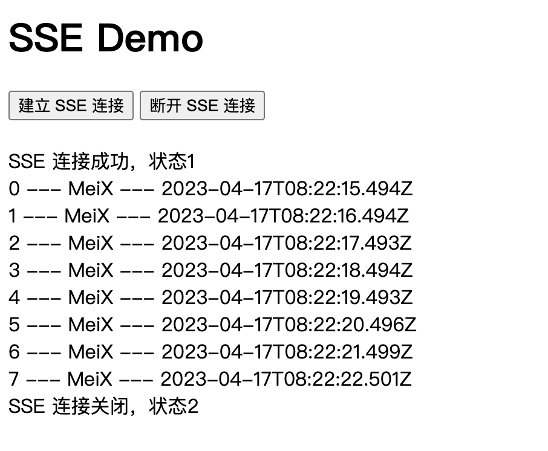

# Server-Sent Events

## 概述

:::tip SSE 是什么
​ `Server-Sent Events` 服务器推送事件，简称 SSE，是一种服务端实时主动向浏览器推送消息的技术。使用 server-sent 事件，服务器可以在任何时刻向我们的 Web 页面推送数据和信息。这些被推送进来的信息可以在这个页面上作为 Events + data 的形式来处理。

​ `SSE` 是 HTML5 中一个与通信相关的 API，主要由两部分组成：服务端与浏览器端的通信协议（HTTP 协议）及浏览器端可供 `JavaScript` 使用的 `EventSource` 对象。
:::

[Server-Sent Events MDN](https://developer.mozilla.org/zh-CN/docs/Web/API/Server-sent_events)

### EventSource

[EventSource MDN](https://developer.mozilla.org/zh-CN/docs/Web/API/EventSource)

`EventSource`是服务器推送的一个网络事件接口。一个 EventSource 实例会对 HTTP 服务开启一个持久化的连接，以 text/event-stream 格式发送事件，会一直保持开启直到被要求关闭。

一旦连接开启，来自服务端传入的消息会以事件的形式分发至你代码中。如果接收消息中有一个事件字段，触发的事件与事件字段的值相同。如果没有事件字段存在，则将触发通用事件。

`EventSource`接口从其父接口[EventTarget](https://developer.mozilla.org/zh-CN/docs/Web/API/EventTarget)继承属性。

EventSource 属性：

- EventSource.onerror:事件处理器，当发生错误时被调用
- EventSource.onmessage:事件处理器，当接收到一个 message 事件（即消息来自源头）时被调用
- EventSource.onopen:事件处理器，当接收到一个 open 事件（即连接刚打开）时被调用
- EventSource.readyState:一个 unsigned short 值，代表连接状态。可能值是 CONNECTING (0), OPEN (1), 或者 CLOSED (2)
- EventSource.url:一个 DOMString,代表事件源的 URL

| readyState | 含义                                                             |
| ---------- | ---------------------------------------------------------------- |
| 0          | 浏览器与服务端尚未建立连接或连接已被关闭                         |
| 1          | 浏览器与服务端已成功连接，浏览器正在处理接收到的事件及数据       |
| 2          | 浏览器与服务端建立连接失败，客户端不再继续建立与服务端之间的连接 |

:::tip EventSource 与 WebSockets 的区别

EventSource 服务端推送是单向的，数据信息被单向从服务端到客户端分发；WebSockets 服务端推送是双向的。

| Server-Sent Events API                          | WebSockets                       |
| ----------------------------------------------- | -------------------------------- |
| 基于 HTTP 协议                                  | 基于 TCP 协议                    |
| 单向推送，只能服务端单向发送消息                | 双向推送，可以同时发送和接收消息 |
| 轻量级，使用简单                                | 相对复杂                         |
| 内置断线重连和消息追踪的功能                    | 不在协议范围内，需手动实现       |
| 文本或使用 Base64 编码和 gzip 压缩的二进制消息  | 类型广泛                         |
| 支持自定义事件类型                              | 不支持自定义事件类型             |
| 连接数 HTTP/1.1 6 个，HTTP/2 可协商（默认 100） | 连接无限制                       |

:::

## 服务端建立连接

SSE 本质是浏览器发起 http 请求，服务器在收到请求后，返回状态与数据，并附带以下 headers：

```js
'Content-Type': 'text/event-stream',
'Cache-Control': 'no-cache',
Connection: 'keep-alive'
```

:::warning 注意点

- SSE API 规定推送事件流的 MIME 类型为 text/event-stream。
- 必须指定浏览器不缓存服务端发送的数据，以确保浏览器可以实时显示服务端发送的数据。
- SSE 是一个一直保持开启的 TCP 连接，所以 Connection 为 keep-alive。
  :::

### 消息格式

​ EventStream（事件流）为 UTF-8 格式编码的文本或使用 Base64 编码和 gzip 压缩的二进制消息。

每条消息由一行或多行字段组成（event、id、retry、data），每个字段组成形式为：字段名:字段值。字段以行为单位，每行以\n 分隔。以冒号开头的行为注释行，会被浏览器忽略。

每次推送，可由多个消息组成，每个消息之间以空行分隔（即最后一个字段以\n\n 结尾）。

:::warning 注意点

- 除上述四个字段外，其他所有字段都会被忽略。
- 如果一行字段中不包含冒号，则整行文本将被视为字段名，字段值为空。
- 注释行可以用来防止链接超时，服务端可以定期向浏览器发送一条消息注释行，以保持连接不断。
  :::

- **event**：事件类型。如果指定了该字段，那么在浏览器接收到这条消息时，会在当前的 EventSource 对象上触发一个事件，可以通过 addEventListener 进行监听。如果没有指定该字段，那么就会触发 EventSource 上的 onmessage 事件处理器。
- **id**:事件 ID，事件的唯一标识符，浏览器会跟踪事件 ID，如果发生断连，浏览器会把收到的最后一个事件 ID 放到 HTTP Header Last-Event-Id 中进行重连，作为一种简单的同步机制。
- **retry**:​ 重连时间。整数值，单位 ms，如果与服务器的连接丢失，浏览器将等待指定时间，然后尝试重新连接。如果该字段不是整数值，会被忽略。
- **data**:​ 消息数据。数据内容只能以一个字符串的文本形式进行发送，如果需要发送一个对象时，需要将该对象以一个 JSON 格式的字符串的形式进行发送。在浏览器接收到该字符串后，再把它还原为一个 JSON 对象。

示例：

```js
res.write(`event: customEvent\n`) //指定事件类型
res.write(`id: ${id}\n`) //指定事件ID
res.write(`retry: 10000\n`) //重连事件
const data = { id, time: new Date().toISOString() }
res.write(`data: ${JSON.stringify(data)}\n\n`) //消息数据（每个消息之间以空行分隔）
```

## 浏览器建立连接

:::tip
在浏览器端，可以使用`EventSource`对象监听服务端发送的事件。一旦建立连接，服务器就可以使用 HTTP 响应的 'text/event-stream' 内容类型发送事件消息，浏览器则可以通过监听 EventSource 对象的 onmessage、onopen 和 onerror 事件来处理这些消息。
:::

EventSource 接受两个参数：URL 和 options。
​ URL 为 http 事件来源，一旦 EventSource 对象被创建后，浏览器立即开始对该 URL 地址发送过来的事件进行监听。
​ options 是一个可选的对象，包含 withCredentials 属性，表示是否发送凭证（cookie、HTTP 认证信息等）到服务端，默认为 false。

```js
const eventSource = new EventSource('/events', { withCredentials: true })
```

建立连接

```js
eventSource = new EventSource('/events')

// 监听消息事件
eventSource.addEventListener('customEvent', (event) => {
  const data = JSON.parse(event.data)
  messageElement.innerHTML += `${data.id} --- ${data.time}` + '<br />'
})

eventSource.onopen = () => {
  messageElement.innerHTML += `SSE 连接成功，状态${eventSource.readyState}<br />`
}

eventSource.onerror = () => {
  messageElement.innerHTML += `SSE 连接错误，状态${eventSource.readyState}<br />`
}
```

断开连接

```js
eventSource.close()
```

## 示例

服务端使用 node 编写一个简单的 SSE 实践示例：
创建 server.js 文件

:::details server.js

```js
const http = require('http')
const fs = require('fs')
const port = 3010 //端口

const server = http.createServer((req, res) => {
  if (req.url === '/') {
    // 如果请求根路径，返回 index.html 文件
    fs.readFile('index.html', (err, data) => {
      if (err) {
        res.writeHead(500)
        res.end('Error loading index.html')
      } else {
        res.writeHead(200, { 'Content-Type': 'text/html' })
        res.end(data)
      }
    })
  } else if (req.url === '/events') {
    // 如果请求 /events 路径，建立 SSE 连接
    res.writeHead(200, {
      'Content-Type': 'text/event-stream',
      'Cache-Control': 'no-cache',
      Connection: 'keep-alive'
    })

    // 每隔 1 秒发送一条消息
    let id = 0
    const intervalId = setInterval(() => {
      res.write(`event: customEvent\n`)
      res.write(`id: ${id}\n`)
      res.write(`retry: 30000\n`)
      const data = { id, time: new Date().toISOString(), name: 'MeiX' }
      res.write(`data: ${JSON.stringify(data)}\n\n`)
      id++
    }, 1000)

    // 当客户端关闭连接时停止发送消息
    req.on('close', () => {
      clearInterval(intervalId)
      id = 0
      res.end()
    })
  } else {
    // 如果请求的路径无效，返回 404 状态码
    res.writeHead(404)
    res.end()
  }
})

server.listen(port, () => {
  console.log('Server listening on port 3010')
})
```

:::

创建 index.html 文件

:::details index.html

```html
<!DOCTYPE html>
<html lang="en">
  <head>
    <meta charset="UTF-8" />
    <meta http-equiv="X-UA-Compatible" content="IE=edge" />
    <meta name="viewport" content="width=device-width, initial-scale=1.0" />
    <title>SSE Demo</title>
  </head>
  <body>
    <h1>SSE Demo</h1>
    <button onclick="connectSSE()">建立 SSE 连接</button>
    <button onclick="closeSSE()">断开 SSE 连接</button>
    <br />
    <br />
    <div id="message"></div>

    <script>
      const messageElement = document.getElementById('message')

      let eventSource

      // 建立 SSE 连接
      const connectSSE = () => {
        eventSource = new EventSource('/events')

        // 监听消息事件
        eventSource.addEventListener('customEvent', (event) => {
          const data = JSON.parse(event.data)
          messageElement.innerHTML += `${data.id}  --- ${data.name}  --- ${data.time} ` + '<br />'
        })

        eventSource.onopen = () => {
          messageElement.innerHTML += `SSE 连接成功，状态${eventSource.readyState}<br />`
        }

        eventSource.onerror = () => {
          messageElement.innerHTML += `SSE 连接错误，状态${eventSource.readyState}<br />`
        }
      }

      // 断开 SSE 连接
      const closeSSE = () => {
        eventSource.close()
        messageElement.innerHTML += `SSE 连接关闭，状态${eventSource.readyState}<br />`
      }
    </script>
  </body>
</html>
```

:::

示例结果：

