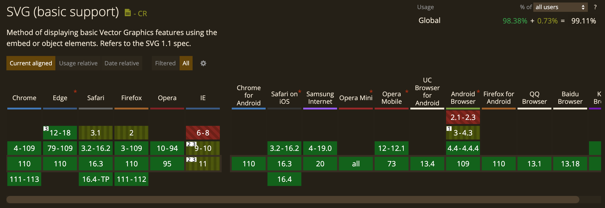
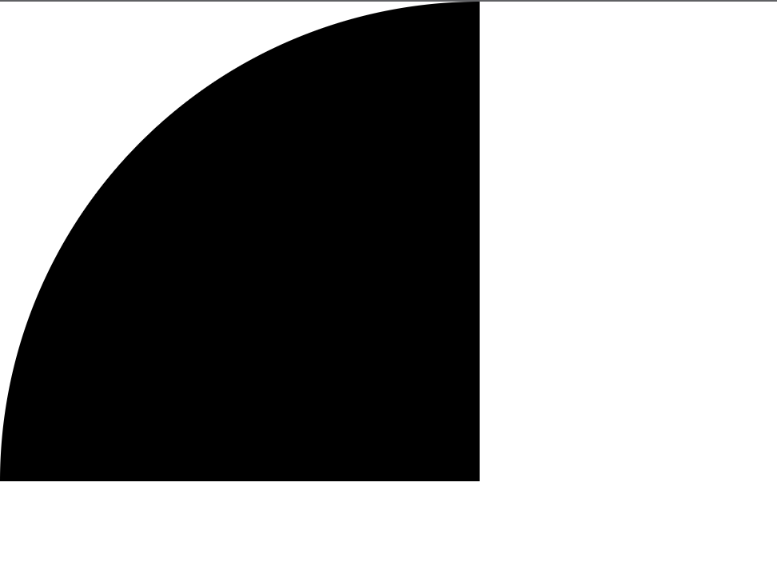

# SVG

## 简介

:::tip
SVG 是 Scalable Vector Graphics 的缩写，意为可缩放矢量图形。于 2003 年 1 月 14 日 SVG 1.1 被 Sun 公司（已被 Oracle 公司收购）、Adobe、苹果公司、IBM 以及柯达共同确立成为 W3C 推荐标准。
:::

### 基本概念

SVG 是一种 XML 语言，类似 XHTML，可以用来绘制矢量图形。

:::tip SVG 是什么

1. SVG 是 Scalable Vector Graphics 的缩写 意为可缩放矢量图形
2. SVG 是一个基于文本的开放网络标准，用来定义用于网络的矢量图形
3. SVG 图像在放大或改变尺寸的情况下其图形质量不会有所损失，因此能够优雅而简洁地渲染不同大小的图形，并和 CSS，DOM，JavaScript 和 SMIL 等其他网络标准无缝衔接
4. SVG 使用 XML 格式定义图形
5. SVG 是万维网联盟的标准与诸如 DOM 和 XSL 之类的 W3C 标准是一个整体
   :::

### 优点

:::tip SVG 的优点

1. SVG 与 JPEG 和 GIF 图像比起来，尺寸更小，且可压缩性更强。
2. SVG 图像中的文本是可选的，同时也是可搜索的，且可以与 JavaScript 技术一起运行
3. SVG 可在图像质量不下降的情况下被放大和缩小
4. SVG 可被非常多的工具读取和修改（比如文本编辑器）
5. SVG 图像不依赖分辨率，可在任何的分辨率下被高质量地打印
6. SVG 文件是纯粹的 XML
7. SVG 是开放的标准
   :::

### 缺点

:::tip SVG 的缺点

1. SVG 复杂度越高渲染速度就会越慢（任何过度使用 DOM 的应用都不快）
2. SVG 不适合游戏应用，只能结合 Canvas 来实现
3. SVG 不能动态的修改动画内容
   :::

### 浏览器兼容性



## 基本语法

### 简单示例

```js
<svg version="1.1" baseProfile="full" width="300" height="200" xmlns="http://www.w3.org/2000/svg">
  <circle cx="100" cy="100" r="50" />
</svg>
```

如上面的语法所示，SVG 的绘制其实就是一个 SVG 标签，然后在标签内绘制要绘制的内容，比如上面的语法是在 SVG 标签内绘制了一个圆形（cx、cy 为圆的坐标，r 为圆的半径）

### SVG 的属性

#### width height

width、height 用来设置 SVG 的宽高。

#### viewBox

viewBox 属性定义了 SVG 中可以显示的区域。

语法：viewBox="x y w h" , x、y 为起始点，w、h 为显示区域的宽高。

示例：

```js
<svg
  version="1.1"
  baseProfile="full"
  width="300"
  height="300"
  viewBox="0 0 100 100"
  xmlns="http://www.w3.org/2000/svg"
>
  <circle cx="100" cy="100" r="100" />
</svg>
```

上例中在一个尺寸为 300 \* 300 的 SVG 中绘制一个坐标为（100, 100）半径为 100 的圆，同时加上 viewBox 属性为"0 0 100 100"，其结果如下：

如图 SVG 里面的圆只显示了一部份，原因是 viewBox 定义了一个：从（0, 0）点开始，宽高为 100 _100 的显示区域。而这个 100_ 100 的显示区域会放到 300 \* 300(svg 宽高)的 SVG 中去显示，整体就放大了 3 倍。

#### version

version 属性用于指明 SVG 的版本，也就是指明 SVG 文档应该遵循的规范。version 属性纯粹就是一个说明，对渲染或处理没有任何影响。且目前只有 1.0 和 1.1 这两个版本。

#### xmlns 和 xmlns:xlink

SVG 使用 XML 格式定义图形，SVG 文件是纯粹的 XML 文件。

在 XML 中，标签和属性属于命名空间，这是为了防止来自不同技术的标签和属性发生冲突。例如在 SVG 中存在 a 标签，在 HTML 中也存在 a 标签，那么怎么区分这个 a 标签属于哪一种技术，这就需要使用命名空间了。加入命名空间以后就能知道哪一个是 svg:a，哪一个又是 html:a，这样就可以区分出不同的标签和属性。

xmlns 用于声明命名空间（namespace），在此声明之下的所有子标签都属于这个空间内。这里看起来是一个 url，但实际上仅仅是一个字符串，这样使用只是惯例。因此很多时候都会被称为”namespace url” 而不是”namespace name”。

当在 SVG 中加入 xmlns 时，因为它定义了默认命名空间，因此不需要前缀，直接在 SVG 标签中写一个 a 标签，a 标签和 UA 就知道它是 SVG 的 a 标签而不是 HTML 的 a 标签.

xmlns:xlink 表示前缀为 xlink 的标签和属性，应该由理解该规范的 UA 使用 xlink 规范 来解释。

:::tip
UA 是 User Agent 的简称。User Agent 是 Http 协议中的一部分，属于头域的组成部分。通俗地讲 UA 是一种向访问网站提供所使用的浏览器类型、操作系统、浏览器内核等信息的标识。通过这个标识，用户所访问的网站可以显示不同的排版，从而为用户提供更好的体验或者进行信息统计。
:::

示例：

```js
<svg xmlns="http://www.w3.org/2000/svg" xmlns:xlink="http://www.w3.org/1999/xlink">
  // ......
</svg>
```

### 基本图形

基本图形其实就是插入到 SVG 标签中的元素，如上面示例中的圆形（circle）。

#### 圆形(circle)

[circle](https://developer.mozilla.org/zh-CN/docs/Web/SVG/Element/circle)是一个 SVG 的基本形状，用来创建圆，基于一个圆心和一个半径。

**语法**：`<circle cx="100" cy="100" r="100"/>`

**属性**：cx、cy 为圆的坐标，r 为圆的半径

示例：

```js
<svg width="300" height="300" xmlns="http://www.w3.org/2000/svg">
  <circle cx="100" cy="100" r="100" />
</svg>
```

#### 矩形(rect)

[rect](https://developer.mozilla.org/zh-CN/docs/Web/SVG/Element/rect)元素是 SVG 的一个基本形状，用来创建矩形，基于一个角位置以及它的宽和高。它还可以用来创建圆角矩形。

**语法**：`<rect x="0" y="0" rx="5" ry="5" width="300" height="200"/>`

**属性**：x、y 为矩形的起始点坐标，rx、ry 为圆角 x、y 轴方向的半径， width、height 为矩形的宽高

示例：

```js
<svg width="300" height="300" xmlns="http://www.w3.org/2000/svg">
  <rect x="0" y="0" rx="5" ry="5" width="300" height="200" />
</svg>
```

#### 椭圆(ellipse)

[ellipse](https://developer.mozilla.org/zh-CN/docs/Web/SVG/Element/ellipse)元素是一个 SVG 基本形状，用来创建一个椭圆，基于一个中心坐标以及它们的 x 半径和 y 半径。

**语法**：`<ellipse cx="100" cy="100" rx="100" ry="50"/>`

**属性**：cx、cy 为椭圆的坐标，rx 为椭圆的 x 轴半径、ry 为椭圆的 y 轴半径

示例：

```js
<svg width="300" height="300" xmlns="http://www.w3.org/2000/svg">
  <ellipse cx="100" cy="100" rx="100" ry="50" />
</svg>
```

#### 线条(line)

[line](https://developer.mozilla.org/zh-CN/docs/Web/SVG/Element/line)元素是一个 SVG 基本形状，用来创建一条连接两个点的线。

**语法**：`<line x1="10" x2="50" y1="110" y2="150" />`

**属性**：x1、y1 为起点的坐标，x2、y2 为终点的坐标

示例：

```js
<svg width="300" height="300" xmlns="http://www.w3.org/2000/svg">
    <!-- 不设置样式属性 style 是看不出效果的 -->
    <line x1="50" x2="50" y1="200" y2="50" style="stroke: #000000;"/>
</svg>
```

#### 折线（polyline）

[polyline](https://developer.mozilla.org/zh-CN/docs/Web/SVG/Element/polyline)元素是 SVG 的一个基本形状，用来创建一系列直线连接多个点。

**语法**：`<polyline points="0 0, 20 40, 70 80, 100 90, 200 30, 250 50" />`

**属性**：points 为点集数列，其中每个点都必须包含 2 个数字，一个是 x 坐标，一个是 y 坐标。

示例：

```js
<svg width="300" height="300" xmlns="http://www.w3.org/2000/svg">
    <!-- 不设置样式属性style是看不出效果的 并且polyline默认为填充需要把fill属性设置为none -->
    <polyline points="0 0, 20 40, 70 80, 100 90, 200 30, 250 50" fill="none" style="stroke: #000000;" />
</svg>
```

#### 多边形（polygon）

[polygon](https://developer.mozilla.org/zh-CN/docs/Web/SVG/Element/polygon) 元素定义了一个由一组首尾相连的直线线段构成的闭合多边形形状。

**语法**：`<polygon points="0 0, 20 40, 70 80, 100 90, 200 30, 250 50" />`

**属性**：points 为点集数列，其中每个点都必须包含 2 个数字，一个是 x 坐标，一个是 y 坐标。

示例：和折线（polyline）同样的数据

```js
<svg width="300" height="300" xmlns="http://www.w3.org/2000/svg">
    <!-- 不设置样式属性style是看不出效果的 并且polyline默认为填充需要把fill属性设置为none -->
    <polygon points="0 0, 20 40, 70 80, 100 90, 200 30, 250 50" fill="none" style="stroke: #000000;" />
</svg>
```

#### path

[path](https://developer.mozilla.org/zh-CN/docs/Web/SVG/Element/path) 元素是用来定义形状的通用元素。所有的基本形状都可以用 path 元素来创建。

**语法**：<path d="M50 50 H 200 V 200 H 50 L 50 50"/>

**属性**：d 为一个点集数列以及其它绘制路径的信息。

示例：

```js
<svg width="300" height="300" xmlns="http://www.w3.org/2000/svg">
  <path d="M50 50 H 200 V 200 H 50 L 50 50" fill="none" style="stroke: #000000;" />
</svg>
```

path 里的 d 属性是什么？

path 标签的图形形状是通过属性 d 来定义的，属性 d 的值是以：命令 + 参数 的形式进行组合的，命令又是通过关键字来表示的。
既然 d 属性是以命令+参数形式组合的，那到底有哪些命令呢？以下总结了 10 个命令，分别是：

- M = Move to
- L = Line to
- H = Horizontal Line to
- V = Vertical Line to
- Q = Quadratic Bezier Curve to
- T = Smooth Quadratic Bezier Curve to
- C = Curve to
- S = Smooth Curve to
- A = Elliptical Arc
- Z = close path

##### 直线命令

:::warning
以下所有命令中 大写为绝对定位 小写为相对定位，后续的命令亦如此以下所有命令中 大写为绝对定位 小写为相对定位，后续的命令亦如此.
:::

###### M（Move to）

M 命令其实就是把画笔移动到某个点，就好像画笔提起来以后移动到一个新的位置准备开始绘制。但因为仅仅是移动画笔而没有绘制，所以 M 命令经常出现在路径的起始点，用来指明画笔应该从何处开始绘制。
每一段路径都必须以 M 命令开头，如果有多个 M 命令则表示新路径的开始。

**语法**：M x y 或者 m x y

**参数**：x、y 为坐标

###### L (Line to）

L 命令会绘制一点并且和之前的点（也就是 L 命令前面的点）连成一条直线。

**语法**：L x y 或者 l x y

**参数**：x、y 为坐标

示例：

```js
<svg width="300" height="300" xmlns="http://www.w3.org/2000/svg">
    <!-- 从起始点（50， 20）画一条到（250， 20）的直线 -->
    <path d="M50 20 L250 20" style="stroke: #000000;"/>
    <!-- 从起始点（50， 50）画一条到（250， 50）的直线 和 从起始点（50， 100）画一条到（250， 100）的直线 -->
    <!-- M命令为多个时，后面的M命令为先线段的起始点 -->
    <path d="M50 50 L250 50 M50 100 L250 100" style="stroke: #ff0000;"/>
    <!-- 从起始点（50， 150）画一条到（250， 150）的直线 -->
    <!-- M命令后面连续跟着多个坐标点，除了第一个坐标点，后面的全部默认为隐式的L命令 -->
    <path d="M50 150 250 150" style="stroke: #00ff00;"/>
    <!-- 从起始点（50， 200）画一条到（250， 200）又到（250，250）的折线 -->
    <!-- 多个L命令连续可以省略后面的L命令 -->
    <path d="M50 200 L250 200 250 250 " fill="none" style="stroke: #0000ff;"/>
  </svg>
```

###### H（Horizontal Line to）

H 命令可以从之前的点绘制一条水平的直线，H 命令可以等价于 y 值和之前点相同的 L 命令

**语法**：H x 或者 h x

**参数**：x 为 X 轴坐标

示例：

```js
<svg width="300" height="300">
    <!-- 从起始点（50， 20）画一条X轴为250的水平直线 -->
    <path d="M50 20 H250" style="stroke: #000000;"/>
  </svg>
```

###### V（Vertical Line to）

V 命令可以从之前的点绘制一条垂直的直线，V 命令可以等价于 x 值和之前点相同的 L 命令

**语法**：V y 或者 v y

**参数**：y 为 Y 轴坐标

示例：

```js
<svg width="300" height="300">
    <!-- 从起始点（50， 20）画一条Y轴为250的垂直直线 -->
    <path d="M50 20 V250" style="stroke: #000000;"/>
  </svg>
```

:::warning 注意点
连续的 H 命令和 V 命令取大值
:::

###### Z（Close path）

Z 命令是一个闭合命令，他会从当前点画一条直线到路径的起始点。
Z 命令因为没有参数所以 Z 和 z 效果一样，所以不区分大小写.

**语法**：Z 或者 z

**参数**：无

示例：

```js
<svg width="300" height="300">
  <path d="M50 100 Q 175 200 300 100" fill="none" style="stroke: #ff0000;" />
</svg>
```

##### 曲线命令

###### Q（Quadratic Bezier Curve to）

Q 命令可以用来绘制一条二次贝塞尔曲线，二次贝塞尔曲线需要一个控制点，用来确定起点和终点的曲线斜率。

**语法**：Q x1 y1, x y 或者 q x1 y1, x y

**参数**：x、y 为终点位置，x1、y1 为控制点。

示例：

```js
<svg width="300" height="300">
  <path d="M50 100 Q 175 200 300 100" fill="none" style="stroke: #ff0000;" />
</svg>
```

###### T（Smooth Quadratic Bezier Curve to）

T 命令是一个延长二次贝塞尔曲线的简化命令，T 命令可以通过前一个控制点推断出后一个控制点，这也就是为什么 T 命令只需要一个坐标的原因。
需要注意的是 T 命令的的前面必须有一个 Q 命令或者其他的 T 命令。如果 T 命令单独使用，那么控制点就会被认为和终点是同一个点，所以画出来的将是一条直线

**语法**：T x y 或者 t x y

**参数**：x、y 为终点位置

示例：

```js
<svg width="300" height="300">
  <path d="M50 100 Q 175 200 300 100 T 600 100 " fill="none" style="stroke: #ff0000;" />
</svg>
```

###### C（Curve to）

C 命令可用来绘制一条三次贝塞尔曲线，相对于二次贝塞尔曲线多了一个控制点。

**语法**：C x1 y1, x2 y2, x y 或者 c x1 y1, x2 y2, x y

**参数**：x、y 为终点位置，x1、y1 为曲线起始点的控制点，x2、y2 为曲线终止的控制点。

示例：

```js
<svg width="300" height="300">
  <path d="M50 50 C 100 100, 200 100, 250 50" fill="none" style="stroke: #000000;" />
  <path d="M50 200 C 100 250, 200 150, 250 200" fill="none" style="stroke: #ff0000;" />
</svg>
```

###### S（Smooth Curve to）

三次贝塞尔曲线的 S 命令和二次贝塞尔曲线的 T 命令比较相似。S 命令也可以用来创建与前面一样的贝塞尔曲线，但如果 S 命令跟在一个 C 命令或者另一个 S 命令的后面，那么它的第一个控制点，就会被假设成前一个控制点的对称点。
如果 S 命令单独使用，前面没有 C 命令或者另一个 S 命令，那么它的两个控制点就会被假设为同一个点。

**语法**：S x2 y2, x y 或者 s x2 y2, x y

**参数**：x、y 为终点位置，x2、y2 为曲线终止的控制点。

示例：

```js
<svg width="300" height="300">
  <path d="M10 100 C 40 10, 65 10, 95 100" fill="none" style="stroke: #ff0000;" />
</svg>
```

三次贝塞尔曲线相对于二次贝塞尔曲线拥有更大的自由度，但两种曲线能达到的效果是差不多的。最终选择使用哪种贝塞尔曲线，通常取决于需求，以及对曲线对称性的依赖程度。

###### A（Elliptical Arc）

A 命令用于画弧形，它可以截取圆或椭圆的弧形成的曲线
**语法**： A rx ry x-axis-rotation large-arc-flag sweep-flag x y 或者 a rx ry x-axis-rotation large-arc-flag sweep-flag x y

**参数**：

- rx、ry 分别为 X 轴的半径和 Y 轴的半径
- x-axis-rotation 为弧度在 X 轴的旋转角度
- large-arc-flag 决定弧线是大于还是小于 180 度，0 表示小角度弧，1 表示大角度弧
- sweep-flag 为弧的方向，0 表示从起点到终点沿逆时针画弧，1 表示从起点到终点沿顺时针画弧
- x、y 为弧形的终点

示例：

```js
<svg width="300px" height="1000px">
    <path d="M10 100 50 100  A 30 50 0 0 1 150 100 L 200 100" fill="none" style="stroke: #ff0000"/>
    <!-- 旋转45度的弧（第三个参数） -->
    <path d="M10 200 50 200  A 30 50 45 0 1 150 200 L 200 200" fill="none" style="stroke: #ff0000"/>
    <!-- 1表示大角度弧（第四个参数） -->
    <path d="M10 300 50 300  A 30 50 -45 1 1 150 300 L 200 300" fill="none" style="stroke: #ff0000"/>
    <!-- 0逆时针（第五个参数） -->
    <path d="M10 400 50 400  A 30 50 0 1 0 150 400 L 200 400" fill="none" style="stroke: #ff0000"/>
  </svg>
```
