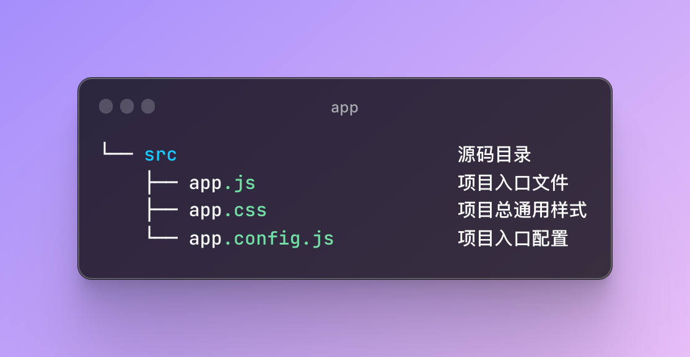

# Taro 跨端开发小程序

## 安装与使用

参考文档：[https://taro-docs.jd.com/docs/GETTING-STARTED](https://taro-docs.jd.com/docs/GETTING-STARTED)
Taro 项目基于 node，请确保已具备较新的 node 环境（>=12.0.0）

### 安装 CLI 工具

```javascript
# 使用 npm 安装 CLI
$ npm install -g @tarojs/cli

# 使用 yarn 安装 CLI
$ yarn global add @tarojs/cli

# 安装了 cnpm，使用 cnpm 安装 CLI
$ cnpm install -g @tarojs/cli
```

:::warning 注意点
如果安装过程中出现 sass 相关的安装错误，请再安装 [mirror-config-china](https://www.npmjs.com/package/mirror-config-china)
:::

```javascript
npm install -g mirror-config-china
```

### 项目初始化

使用命令创建模版项目：

```javascript
taro init myApp
```

### 编译运行

Taro 初始化后的 script 如下：


使用`Taro`的`build`命令可以把`Taro`代码编译成不同端的代码，然后在对应的开发工具中查看效果。

`Taro`编译分为`dev`和`build`模式：

- dev 模式（增加 --watch 参数） 将会监听文件修改。
- build 模式（去掉 --watch 参数） 将不会监听文件修改，并会对代码进行压缩打包。
- dev 模式生成的文件较大，设置环境变量 NODE_ENV 为 production 可以开启压缩，方便预览，但编译速度会下降。

#### 多端同步调试

在 dist 目录下创建一个与编译的目标平台名同名的目录，并将结果放在这个目录下，例如编译到微信小程序，最终结果是在 dist/weapp 目录下，这样做的好处是，各个平台使用独立的目录互不影响，从而达到多端同步调试的目的，在 `config/index.js` 配置如下：

```javascript
// config/index.js中
outputRoot: `dist/${process.env.TARO_ENV}`
```


#### 微信小程序

```javascript
# yarn
$ yarn dev:weapp
$ yarn build:weapp

# npm script
$ npm run dev:weapp
$ npm run build:weapp

# 仅限全局安装
$ taro build --type weapp --watch
$ taro build --type weapp

# npx 用户也可以使用
$ npx taro build --type weapp --watch
$ npx taro build --type weapp

# watch 同时开启压缩
$ set NODE_ENV=production && taro build --type weapp --watch # CMD
$ NODE_ENV=production taro build --type weapp --watch # Bash
```

下载[微信开发者工具](https://developers.weixin.qq.com/miniprogram/dev/devtools/download.html)，选择项目根目录下`dist`目录进行预览。

需要注意开发者工具的项目设置：

- 需要关闭 ES6 转 ES5 功能，开启可能报错
- 需要关闭上传代码时样式自动补全，开启可能报错
- 需要关闭代码压缩上传，开启可能报错

#### 字节跳动小程序

```javascript
# yarn
$ yarn dev:tt
$ yarn build:tt

# npm script
$ npm run dev:tt
$ npm run build:tt

# 仅限全局安装
$ taro build --type tt --watch
$ taro build --type tt

# npx 用户也可以使用
$ npx taro build --type tt --watch
$ npx taro build --type tt

# watch 同时开启压缩
$ set NODE_ENV=production && taro build --type tt --watch # CMD
$ NODE_ENV=production taro build --type tt --watch # Bash
```

下载[字节跳动小程序开发者工具](https://microapp.bytedance.com/docs/zh-CN/mini-app/develop/developer-instrument/download/developer-instrument-update-and-download/)，并确保已经设置了小程序项目配置文件[project.config.json](https://microapp.bytedance.com/docs/zh-CN/mini-app/develop/framework/basic-reference/catalog-structure/#projectconfigjson-%E9%85%8D%E7%BD%AE%E4%BB%8B%E7%BB%8D)，选择项目根目录下`dist`目录进行预览。

需要注意开发者工具的项目设置：

- 需要关闭 ES6 转 ES5 功能，开启可能报错
- 需要关闭上传代码时样式自动补全，开启可能报错
- 需要关闭代码压缩上传，开启可能报错

## 基础教程

### 目录结构


Taro 目录结构与原生小程序目录结构对比：


#### app



| 文件          | 是否必须 | 作用           |
| ------------- | -------- | -------------- |
| app.js        | 是       | 小程序入口逻辑 |
| app.css       | 否       | 小程序全局样式 |
| app.config.js | 是       | 小程序全局配置 |

`app.config.js`对应小程序规范的全局配置文件`app.json`，优点在于它是 js 文件，可以编写逻辑。

全局配置文档参考：[https://taro-docs.jd.com/docs/app-config](https://taro-docs.jd.com/docs/app-config)

### 配置

#### 编译配置

编译配置存放于项目根目录下的 config 目录中，包含三个文件：

- index.js 是通用配置
- dev.js 是项目预览时的配置
- prod.js 是项目打包时的配置

[编译配置详情](https://taro-docs.jd.com/docs/config-detail)

#### 设计稿及尺寸单位

在 Taro 中尺寸单位建议使用 `px`、 百分比 `%`，`Taro` 默认会对所有单位进行转换。在 `Taro` 中书写尺寸按照 1:1 的关系来进行书写，即从设计稿上量的长度 100px，那么尺寸书写就是 100px，当转成微信小程序的时候，尺寸将默认转换为 100rpx，当转成 H5 时将默认转换为以 rem 为单位的值。
如果你希望部分 px 单位不被转换成 rpx 或者 rem ，最简单的做法就是在 px 单位中增加一个大写字母，例如 Px 或者 PX 这样，则会被转换插件忽略。
结合过往的开发经验，`Taro` 默认以 750px 作为换算尺寸标准，如果设计稿不是以 750px 为标准，则需要在项目配置 config/index.js 中进行设置，例如设计稿尺寸是 640px，则需要修改项目配置 config/index.js 中的 designWidth 配置为 640：

```javascript
const config = {
  // 项目名称
  projectName: 'projectName',
  // 项目创建日期
  date: '2023-2-14',
  // 设计稿尺寸
  designWidth: 640,
  // 设计稿尺寸换算规则
  deviceRatio: {
    375: 2 / 1,
    640: 2.34 / 2,
    750: 1,
    828: 1.81 / 2,
  },
  ...
}
```

在编译时，`Taro` 会帮你对样式做尺寸转换操作，但是如果是在 JS 中书写了行内样式，那么编译时就无法做替换了，针对这种情况，`Taro` 提供了 API `Taro.pxTransform` 来做运行时的尺寸转换。

```javascript
Taro.pxTransform(40) // 小程序：rpx，H5：rem
//在小程序上40会被转换成40rpx

例：
import { Button } from '@tarojs/components';
import Taro from '@tarojs/taro';

return (
  <Button style={{ fontSize: Taro.pxTransform(40) }}>
      Add
  </Button>
);
```

#### 全局配置

根目录下的 `app.config.js` 文件用来对小程序进行全局配置，配置项遵循微信小程序规范，并且对所有平台进行统一。

[全局配置参考](https://taro-docs.jd.com/docs/app-config)

#### 页面配置

每一个小程序页面都可以使用`.config.js` 文件来对本页面的窗口表现进行配置。页面中配置项在当前页面会覆盖全局配置 `app.config.json`的 `window` 中相同的配置项。

文件需要 `export` 一个默认对象，配置项遵循微信小程序规范，并且对所有平台进行统一。

```javascript
export default definePageConfig({
  navigationBarTitleText: '首页'
})
```

也支持在页面 JS 中使用`definePageConfig`定义页面配置，而不需要提供`page.config.js`文件。

:::warning 注意点
使用 `definePageConfig` 定义的页面配置对象不能使用变量
:::

```javascript
import { View } from '@tarojs/components'

definePageConfig({
  navigationBarTitleText: '我的'
})

const Mine = () => {
  return <View>Mine</View>
}
export default Mine
```

[页面配置参考](https://taro-docs.jd.com/docs/page-config)

#### 项目配置

通过 `Taro` 模板创建的项目都会默认拥有 `project.config.json` 这一项目配置文件，这个文件只能用于微信小程序，若要兼容到其他小程序平台，请按如下对应规则来增加相应平台的配置文件，其配置与各自小程序平台要求的一致：

| 小程序平台     | 添加配置文件                                                                                                                                                                      |
| -------------- | --------------------------------------------------------------------------------------------------------------------------------------------------------------------------------- |
| 微信小程序     | [project.config.json](https://developers.weixin.qq.com/miniprogram/dev/devtools/projectconfig.html?search-key=%E9%A1%B9%E7%9B%AE%E9%85%8D%E7%BD%AE)                               |
| 字节跳动小程序 | [project.tt.json](https://microapp.bytedance.com/docs/zh-CN/mini-app/develop/framework/basic-reference/catalog-structure/#projectconfigjson-%E9%85%8D%E7%BD%AE%E4%BB%8B%E7%BB%8D) |
| 支付宝小程序   | [project.alipay.json](https://opendocs.alipay.com/mini/framework/project)                                                                                                         |

#### 小程序分包

Taro 支持使用微信小程序的独立分包功能，配置方法和微信小程序中一致，请参考：[微信小程序独立分包功能](https://developers.weixin.qq.com/miniprogram/dev/framework/subpackages/basic.html)

```javascript
├── config
├── src
|   ├── pages
|   |   └── index
|   ├── moduleA
|   |   └── pages
|   |       └── homeA
|   ├── app.css
|   ├── app.json
|   └── app.js
└── package.json
```

通过在 app.json 的 subPackages 字段中，给对应的分包配置项中定义的 independent 字段声明对应分包为独立分包：

```javascript
subPackages: [
  {
    root: 'pages/moduleA',
    pages: ['pages/homeA/index'],
    independent: true
  }
]
```

```javascript
├── src                         源码目录
|   ├── pages
|   |   └── index
|   |       ├── index.js
|   |       ├── index.css
|   |       └── index.config.js
|   |   └── moduleA             分包页面目录
|   |       ├── index.js
|   |       ├── index.css
|   |       └── index.config.js
|   |
|   ├── app.js                  项目入口文件
|   ├── app.css                 项目总通用样式
|   └── app.config.js           项目入口配置
|
├── project.config.json         微信小程序项目配置 project.config.json
├── project.tt.json             字节跳动小程序项目配置 project.tt.json
|
└── package.json
```

[参考示例](https://github.com/NervJS/taro/blob/next/examples/weapp-independent-subpackages/src/app.config.ts)

### React

`Taro 3`支持将 Web 框架直接运行在各平台，开发者使用的是真实的 `React` 和 `Vue` 等框架。
但是 `Taro` 在组件、API、路由等规范上，遵循微信小程序规范，所以在 `Taro` 中使用 `React` 和开发者熟悉的 Web 端有一些差异，以下将详细列出。

#### React API

因为在 Taro 3 中开发者使用的是真实的 React，React 的 API 如 Component、useState、useEffect 等都需要从 React 包中获取。

```javascript
// 从 'react' 包中获取 React API
import React, { Component, useState, useEffect } from 'react'
```

Taro 专有的 Hooks，从`@tarojs/taro`引入。

#### 组件

Taro 中可以使用小程序规范的内置组件进行开发，如 View、Text、Button 等。
[组件库](https://taro-docs.jd.com/docs/components-desc)

```javascript
import { View, Text, Button } from '@tarojs/components'
```

自 Taro v3.3+，支持使用 H5 标签进行开发，使用方法：

```javascript
yarn add @tarojs/plugin-html
//Or
npm i @tarojs/plugin-html
```

```javascript
// config/index.js
config = {
  // ...
  plugins: ['@tarojs/plugin-html']
}
```

```javascript
const Mine = () => {
  return <div>Mine</div>
}
export default Mine
```

规范：

- 在 React 中使用这些内置组件前，必须从 @tarojs/components 进行引入。
- 组件属性遵从大驼峰式命名规范。
- 事件规范：组件事件。

#### 事件

事件和 Web 端一样。在事件回调函数中，第一个参数是事件对象，回调中调用 `stopPropagation` 可以阻止冒泡。
规范：

- 内置事件名以 on 开头，遵从小驼峰式（camelCase）命名规范。
- React 中点击事件使用 onClick。

```javascript
import { useState } from 'react'
import { View, Text, Button } from '@tarojs/components'
import Taro from '@tarojs/taro'

const Home = () => {
  const [count, setCount] = useState(1)

  const handleAdd = (e) => {
    e.stopPropagation() //阻止事件冒泡
    setCount(count + 1)
  }

  const handleSub = () => {
    setCount(count - 1)
  }

  const handleOuterClick = () => {
    console.log('outer')
  }

  return (
    <View onClick={handleOuterClick}>
      <Text>{count}----------</Text>
      <Button onClick={(e) => handleAdd(e)} style={{ fontSize: Taro.pxTransform(40) }}>
        Add
      </Button>
      <Button onClick={handleSub}>Sub</Button>
    </View>
  )
}

export default Home
```

#### 生命周期触发机制

##### 入口组件

| 生命周期方法                                                                                      | Taro Hooks(Taro v3.5.0+开始支持)      | 说明                                      |
| ------------------------------------------------------------------------------------------------- | ------------------------------------- | ----------------------------------------- |
| onLaunch(options)                                                                                 | useLaunch                             | 在小程序环境中对应 app 的 onLaunch        |
| 在此生命周期中通过访问 options 参数或调用 getCurrentInstance().router，可以访问到程序初始化参数。 |
| componentDidShow(options)                                                                         |
| 程序启动或切前台时触发                                                                            |
| componentDidHide()                                                                                |
| 程序切后台时触发                                                                                  |
| onError (error)                                                                                   | useError                              | 小程序发生脚本错误或 API 调用报错时触发。 |
| onPageNotFound (Object)                                                                           | usePageNotFound                       | 程序要打开的页面不存在时触发。            |
| onUnhandledRejection (Object)                                                                     | useUnhandledRejection                 |
| 支付宝小程序需要在 project.alipay.json 文件中添加配置 enableAppxNg: true 才能在真机环境进行监听。 | 小程序有未处理的 Promise 拒绝时触发。 |

##### 页面组件

| 生命周期方法       | Taro Hooks(Taro v3.5.0+开始支持) | 说明                                                   |
| ------------------ | -------------------------------- | ------------------------------------------------------ |
| onLoad(options)    | useLoad                          | 在小程序环境中对应页面的 onLoad，监听页面加载          |
| onUnload ()        | useUnload                        | 在小程序环境中对应页面的 onUnload，监听页面显示        |
| onReady            | useReady                         | 在小程序环境中对应页面的 onReady，监听页面初次渲染完成 |
| componentDidShow() | useDidShow                       | 在小程序环境中对应页面的 onShow,监听页面卸载           |
| componentDidHide() | useDidHide                       | 在小程序环境中对应页面的 onHide，监听页面隐藏          |
| onPullDownRefresh  | usePullDownRefresh               | 监听用户下拉动作                                       |

需要在全局配置的 window 选项中或页面配置中设置 enablePullDownRefresh: true。
可以通过 Taro.startPullDownRefresh 触发下拉刷新，调用后触发下拉刷新动画，效果与用户手动下拉刷新一致。
当处理完数据刷新后，Taro.stopPullDownRefresh 可以停止当前页面的下拉刷新. |
| onReachBottom | useReachBottom | 监听用户上拉触底事件
可以在全局配置的 window 选项中或页面配置中设置触发距离 onReachBottomDistance。
在触发距离内滑动期间，本事件只会被触发一次 |
| onShareAppMessage | useShareAppMessage
使用此 Hook 时必须为页面配置 enableShareAppMessage: true | 监听用户点击页面内转发按钮（Button 组件 openType='share'）或右上角菜单“转发”按钮的行为，并自定义转发内容。
当 onShareAppMessage 没有触发时，请在页面配置中设置 enableShareAppMessage: true
只有定义了此事件处理函数，右上角菜单才会显示“转发”按钮 |
| onShareTimeline | useShareTimeline | 用户点击右上角转发到朋友圈 |
| onAddToFavorites | useAddToFavorites | 监听用户点击右上角菜单“收藏”按钮的行为，并自定义收藏内容。 |
| onPageScroll | usePageScroll | 监听用户滑动页面事件 |
| onResize | useResize | 小程序屏幕旋转时触发 |
| onTabItemTap | useTabItemTap | 当前是 tab 页时，点击 tab 时触发 |

## 组件库

[参考文档](https://docs.taro.zone/docs/components-desc)

## API

[参考文档](https://taro-docs.jd.com/docs/apis/about/desc)

### 环境判断

`Taro.getEnv()`：获取当前环境值，具体值如下：

| Taro.ENV_TYPE.WXAPP    | 微信小程序环境     |
| ---------------------- | ------------------ |
| Taro.ENV_TYPE.SWAN     | 百度小程序环境     |
| Taro.ENV_TYPE.ALIPAY   | 支付宝小程序环境   |
| Taro.ENV_TYPE.TT       | 字节跳动小程序环境 |
| Taro.ENV_TYPE.WEB      | WEB(H5)环境        |
| Taro.ENV_TYPE.RN       | ReactNative 环境   |
| Taro.ENV_TYPE.QQ       | QQ 小程序环境      |
| Taro.ENV_TYPE.JD       | 京东小程序环境     |
| Taro.ENV_TYPE.QUICKAPP | 快应用环境         |

### Taro.getCurrentPages()

获取当前页面栈，数组中第一个元素为首页，最后一个元素为当前页面。


### Taro.getCurrentInstance()


获取当前页面的路径：Taro.getCurrentInstance().router.path

### Taro.getLaunchOptionsSync()

获取小程序启动时的参数。
注：部分版本在无 referrerInfo 的时候会返回 undefined，因此建议使用 options.referrerInfo && optionsreferrerInfo.appid 来判断。

| 参数             | 类型                   | 必填 | 说明                                                                                                                    |
| ---------------- | ---------------------- | ---- | ----------------------------------------------------------------------------------------------------------------------- |
| path             | string                 | 是   | 启动小程序的路径                                                                                                        |
| query            | TaroGeneral.IAnyObject | 是   | 启动小程序的 query 参数                                                                                                 |
| scene            | number                 | 是   | 启动小程序的[场景值](https://developers.weixin.qq.com/miniprogram/dev/framework/app-service/scene.html)                 |
| shareTicket      | string                 | 是   | shareTicket，详见[获取更多转发信息](https://developers.weixin.qq.com/miniprogram/dev/framework/open-ability/share.html) |
| referrerInfo     | ReferrerInfo           | 是   | 来源信息。从另一个小程序、公众号或 App 进入小程序时返回。否则返回 {}。(参见后文注意)                                    |
| forwardMaterials | ForwardMaterial[]      | 否   | 打开的文件信息数组，只有从聊天素材场景打开（scene 为 1173）才会携带该参数                                               |
| chatType         | keyof ChatType         | 否   | 从微信群聊/单聊打开小程序时，chatType 表示具体微信群聊/单聊类型                                                         |
| apiCategory      | keyof ApiCategory      | 否   | API 类别                                                                                                                |

## 混合开发

小程序打出的包 dist，是一整个小程序。如果想要将打出的包插入到原生小程序中去实现，需要打包成一个单独的分包。Taro3 提供了混合开发的功能。
（1）编译项目时使用 --blended 参数以输出混合模式的代码。

```javascript
# 以混合模式进行打包
$ taro build --type [platform] --blended

如编译微信小程序
taro build:weapp -- --watch --blended
```

这个时候，在打包出来的 app.js 中会暴露出 taroApp，供我们在原生小程序的 app.js 页面下去调用其生命周期。

但是存在这样一个问题，在执行我们的原生小程序项目时，我们通过引用在原生项目下的 app.js 里引入 Taro 项目的入口文件，来提前初始化一些运行时的逻辑，因此要保证 Taro 项目下的 app.js 文件里的逻辑能优先执行。所以说只是 --blended 命令这种，只适合主包的页面，分包的话，没法优先执行。
解决分包开发，引入 @tarojs/plugin-indie 插件

```javascript
npm install --dev @tarojs/plugin-indie
// Or
yarn add --dev @tarojs/plugin-indie
```

引入插件配置

```javascript
// config/index.js
const config = {
  // ...
  plugins: ['@tarojs/plugin-indie']
  // ...
}
```

简单来说，就是在编译代码时，对页面下的 js chunk 文件进行 require 引入的目录调整，增加对应的 module 的 sourceMap 映射。这样在访问到我们 Taro 下的分包页面时，就可以做到优先执行了。
（2）移动 Taro 项目的输出目录到原生项目内。或者使用插件，如下移动目录的插件：
在项目根目录新建 plugin-move/index.js 文件

```javascript
const fs = require('fs-extra')
const path = require('path')

export default (ctx, options) => {
  ctx.onBuildFinish(() => {
    // Taro v3.1.4
    const blended = ctx.runOpts.blended || ctx.runOpts.options.blended

    if (!blended) return

    console.log('编译结束！')

    const rootPath = path.resolve(__dirname, '../..')
    const miniappPath = path.join(rootPath, 'fx-mini-mmmw')
    const outputPath = path.resolve(__dirname, '../dist/weapp')
    // 在原生小程序项目下的路由文件夹
    const destPath = path.join(miniappPath, 'taro')

    if (fs.existsSync(destPath)) {
      fs.removeSync(destPath)
    }
    fs.copySync(outputPath, destPath)

    console.log('拷贝结束！')
  })
}
```

插件配置

```javascript
// config/index.js
const path = require('path')
const config = {
  // ...
  plugins: [path.join(process.cwd(), '/plugin/index.js')]
  // ...
}
```

（3）原生项目的 app.js 中引用 Taro 入口文件

```javascript
// 必须引用 Taro 项目的入口文件
const taroApp = require('./taro/app.js').taroApp

App({
  onShow() {
    // 可选，调用 Taro 项目 app 的 onShow 生命周期
    taroApp.onShow()
  },

  onHide() {
    // 可选，调用 Taro 项目 app 的 onHide 生命周期
    taroApp.onHide()
  }
})
```

[参考文档](https://mp.weixin.qq.com/s?__biz=MzIxMzExMjYwOQ==&mid=2651896934&idx=1&sn=619aea0f571e3694cacb590f5e3600f0&scene=21#wechat_redirect)

## 使用 http 请求库

Taro3.6 版本开始支持[请求库](https://www.oschina.net/news/226844/taro-3-6-released)
通过引入@tarojs/plugin-http 插件，为小程序环境提供网络请求库所需的运行时环境支持。

```markdown
{
"plugins": ["@tarojs/plugin-http"]
}
```

注意：当前 @tarojs/runtime 在小程序环境中缺少 Blob、FormData、File 对象，这在网络请求库的文件上传特性中是必须的，故暂不支持。

### 使用

安装@tarojs/plugin-http 和 axios

```markdown
npm install @tarojs/plugin-http
npm install axios
// Or
yarn add axios
yarn add @tarojs/plugin-http
```

插件配置

```markdown
const config = {
plugins: ['@tarojs/plugin-http'],
...
}
```

安装适配器 axios-taro-adapter

```markdown
npm install axios-taro-adapter
```

使用 axios 创建请求示例

```markdown
import { TaroAdapter } from "axios-taro-adapter";

axios({
method,
url,
data,
timeout: 10000,
headers,
adapter: TaroAdapter, // 添加这一行替换默认的适配器
})
.then((res) => {
...
})
.catch((err) => {
reject();
});
```
