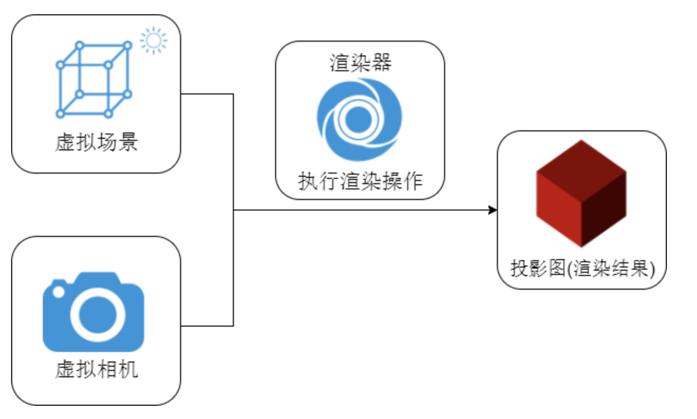
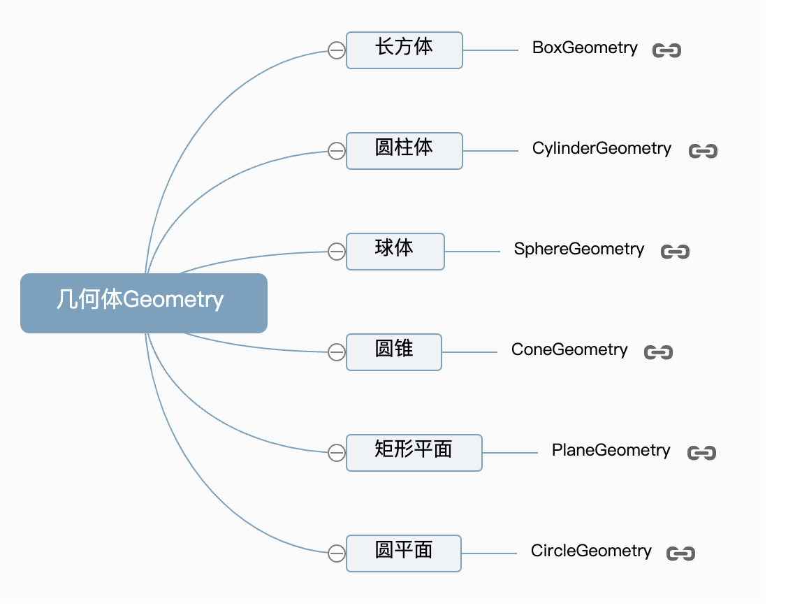
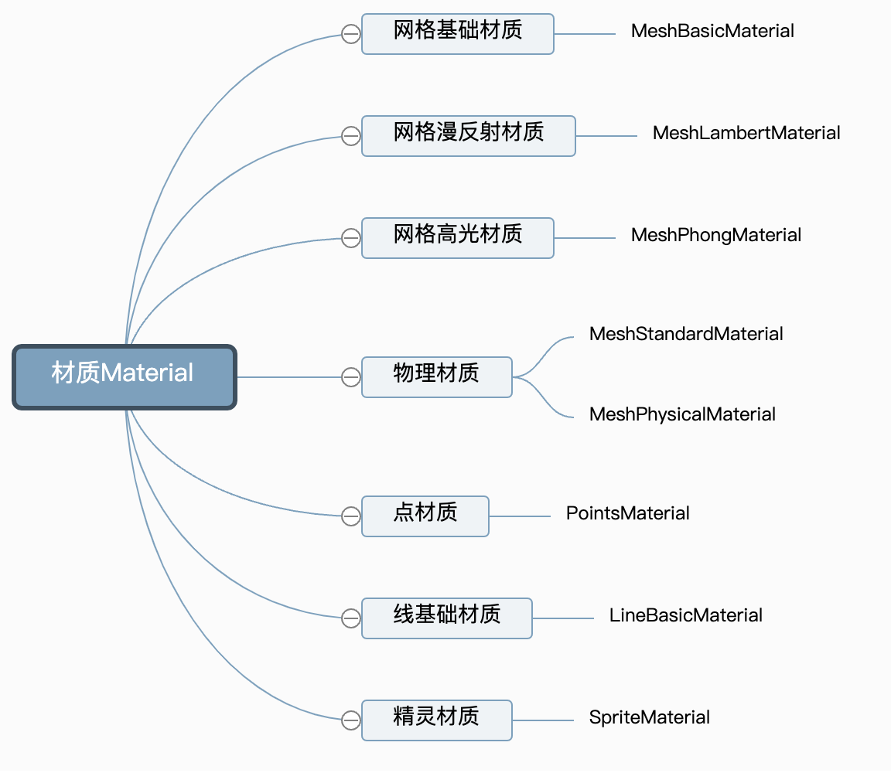
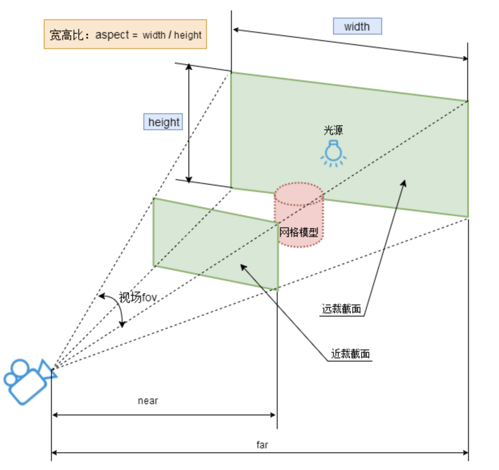
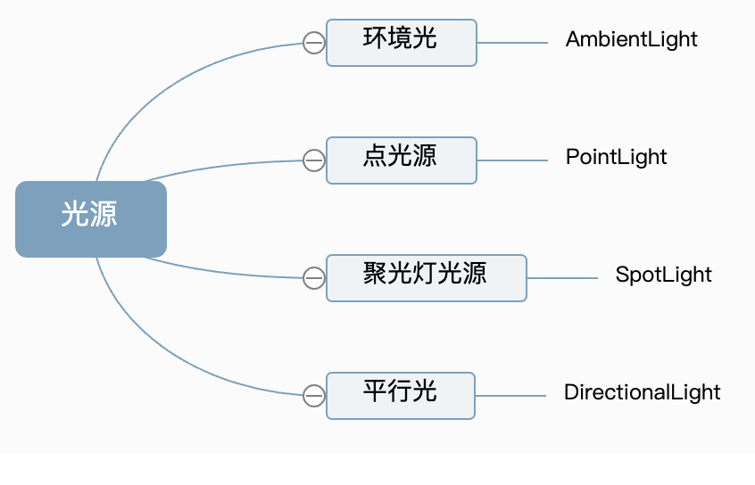
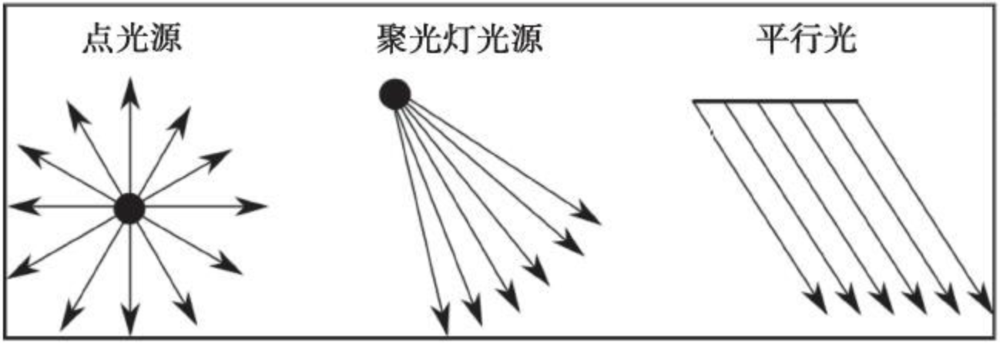

# Three.js 理论知识

:::tip Three.js 是什么
`Three.js` 是一个基于 `webGL` 的封装的一个易于使用且轻量级的 3D 库，对 `WebGL` 提供的接口进行了非常好的封装，简化了很多细节，大大降低了学习成本，极大地提高了性能，功能也非常强大，用户不需要详细地学习 `WebGL`,就能轻松创作出三维图形，是前端开发人员常用的 3D 库之一 。
:::

问：为什么要学习 Three.js?

答：学习 Three.js 有很多好处：

- 首先，它是一个 `JavaScript 3D` 库，可以让开发者在网页上创建 3D 图形。
- 其次，`Three.js` 自带 d.ts 描述文件甚至是 example 里面没有并入核心部分的类都具备描述文件，完全面向对象，可以说是前端开发的一大福利了。
- 此外，基本上大部分其他库或平台只要有相关的需要都会提供 `ThreeJS` 的集成路径，比如 Mapbox、Echart、D3 这一类，这一点可以说是最大的优势了。
- 最后，`Three.js` 提供了完整的三维特性，如 PBR、风格化渲染、后期效果、物理、动画、粒子等 。

## 三个基本概念

学习 Three.js，首先我们就需要认识它的三个基本概念，及 Scene(场景)、Camera(相机)、Renderer(渲染器)。

它们之间的关系如下图所示：


### Scene(场景)

场景(scene)是一个包含所有 3D 对象的容器，用来表示模拟生活中的真实三维场景,或者说三维世界。场景中的对象可以是几何体、光源、相机等。场景中的物体按照一定的顺序排列，可以通过改变它们的顺序来改变它们在屏幕上的位置和渲染顺序。

```js
// 创建一个3D场景对象
const scene = new THREE.Scene()
```

创建场景之后，我们可以创建几何体、材质等并添加进场景中。Three.js 提供了许多几何体 API 以及材质相关的 API。

#### 几何体 Geometry

几何体 API 用来表示三维物体的几何形状，相关 API 如下所示：



创建一个长方体

```js
const geometry = new THREE.BoxGeometry(100, 100, 100)
```

#### 材质 Material

材质 Material 用来定义物体的外观效果（如颜色等），Three.js 不同的材质渲染的效果是不一样的，材质相关的 API 如下所示：



定义一个网格基础材质

```js
//创建一个材质对象Material
const material = new THREE.MeshBasicMaterial({
  color: 0xff0000 //0xff0000设置材质颜色为红色
})
```

#### 网格模型 Mesh

在 three.js 中可以通过网格模型 Mesh 表示一个虚拟物体

```js
// 两个参数分别为几何体geometry、材质material
const mesh = new THREE.Mesh(geometry, material) //网格模型对象Mesh

//设置网格模型在三维空间中的位置坐标，默认是坐标原点
mesh.position.set(0, 10, 0)

// 网格模型mesh添加到三维场景scene中
scene.add(mesh)
```

### Camera(相机)

要想把三维场景渲染到网页上，还需要定义一个相机，相机主要有两种，分别是透视投影相机和正投影相机

#### OrthographicCamera

`OrthographicCamera` 这种投影模式下，无论物体距离相机距离远或者近，在最终渲染的图片中物体的大小都保持不变。

#### PerspectiveCamera

`PerspectiveCamera`这种投影模式被用来模拟人眼所看到的景象，它是 3D 场景的渲染中使用得最普遍的投影模式。

```js
// 实例化一个透视投影相机对象
const camera = new THREE.PerspectiveCamera()

// 相机对象Camera具有位置属性.position，通过位置属性.position可以设置相机的位置。
// 根据需要设置相机位置具体值
camera.position.set(200, 200, 200)

//相机观察目标指向Threejs 3D空间中某个位置
camera.lookAt(0, 0, 0) //坐标原点
```

相机相关的几个属性：

- 相机位置.position：设置相机的位置
- 相机观察目标.lookAt()：设置相机的观察目标（即相机镜头对准哪个物体或哪个坐标）

PerspectiveCamera 参数：
|参数|含义|默认值|
| --- | --- | -- |
|fov|相机视锥体竖直方向视野角度|50|
|aspect |相机视锥体水平方向和竖直方向长度比，一般设置为 Canvas 画布宽高比 width / height| 1|
|near |相机视锥体近裁截面相对相机距离| 0.1|
|far |相机视锥体远裁截面相对相机距离，far-near 构成了视锥体高度方向| 2000|



### Renderer(渲染器)

有了场景和相机，依然还不能把三维物体渲染到网页上，还差一个东西，那就是 Renderer 渲染器，接下来就介绍一下这个新对象——WebGL 渲染器 WebGLRenderer

```js
// 创建渲染器对象
const renderer = new THREE.WebGLRenderer()
```

#### renderer 对象相关属性和方法

- 设置 Canvas 画布尺寸.setSize()

```js
// 定义threejs输出画布的尺寸(单位:像素px)
const width = 800 //宽度
const height = 500 //高度
renderer.setSize(width, height) //设置three.js渲染区域的尺寸(像素px)
```

- 渲染器渲染方法.render()

渲染器`WebGLRenderer`执行渲染方法`.render()`就可以生成一个 Canvas 画布(照片)，并把三维场景 Scene 呈现在 canvas 画布上面。

```js
renderer.render(scene, camera) //执行渲染操作
```

- 渲染器 Canvas 画布属性.domElement

渲染器 `WebGLRenderer` 通过属性`.domElement` 可以获得渲染方法`.render()`生成的 `Canvas` 画布，`.domElement` 本质上就是一个 HTML 元素：`Canvas` 画布。

```js
document.body.appendChild(renderer.domElement)
```

获取了 canvas 画布之后，可以将其插入到任意 HTML 元素中，🌰：

```html
<div id="webgl" style="margin-top: 200px;margin-left: 100px;"></div>

<script>
  document.getElementById('webgl').appendChild(renderer.domElement)
</script>
```

## 其他相关概念

### 辅助观察的坐标系

```js
// AxesHelper：辅助观察的坐标系
const axesHelper = new THREE.AxesHelper(150)
scene.add(axesHelper)
```

### 光源

物体表面的明暗效果是会受到光照的影响，在 Three.js 中，可以通过 Light 模拟光照对网格对象 Mesh 表面的影响。

不同的网格材质，有的会受光照的影响，有的不受光照的影响，其中基础网格材质`MeshBasicMaterial`就不会受到光照的影响。




- THREE.PointLight 从特定的一点向所有方向发射光线。
- THREE.SpotLight 从特定的一点以锥形发射光线。
- THREE.DirectionalLight 不是从单个点发射光线，而是从二维平面发射光线，光线彼此平行。

示例：

```js
//点光源：两个参数分别表示光源颜色和光照强度
// 参数1：0xffffff是纯白光,表示光源颜色
// 参数2：1.0,表示光照强度，可以根据需要调整
const pointLight = new THREE.PointLight(0xffffff, 1.0)

//点光源位置
pointLight.position.set(400, 0, 0) //点光源放在x轴上

scene.add(pointLight) //点光源添加到场景中
```

### 相机控件 OrbitControls

```js
// 引入轨道控制器扩展库OrbitControls.js
import { OrbitControls } from 'three/addons/controls/OrbitControls.js'

// 设置相机控件轨道控制器OrbitControls
const controls = new OrbitControls(camera, renderer.domElement)
// 如果OrbitControls改变了相机参数，重新调用渲染器渲染三维场景
controls.addEventListener('change', function () {
  renderer.render(scene, camera) //执行渲染操作
}) //监听鼠标、键盘事件

controls.addEventListener('change', function () {
  // 浏览器控制台查看相机位置变化
  console.log('camera.position', camera.position)
})
```

## 文档

- [Three.js 教程](http://www.webgl3d.cn/pages/2de1b9/)
- [Three.js 中文文档](http://www.yanhuangxueyuan.com/threejs/docs/index.html#manual/zh/)
