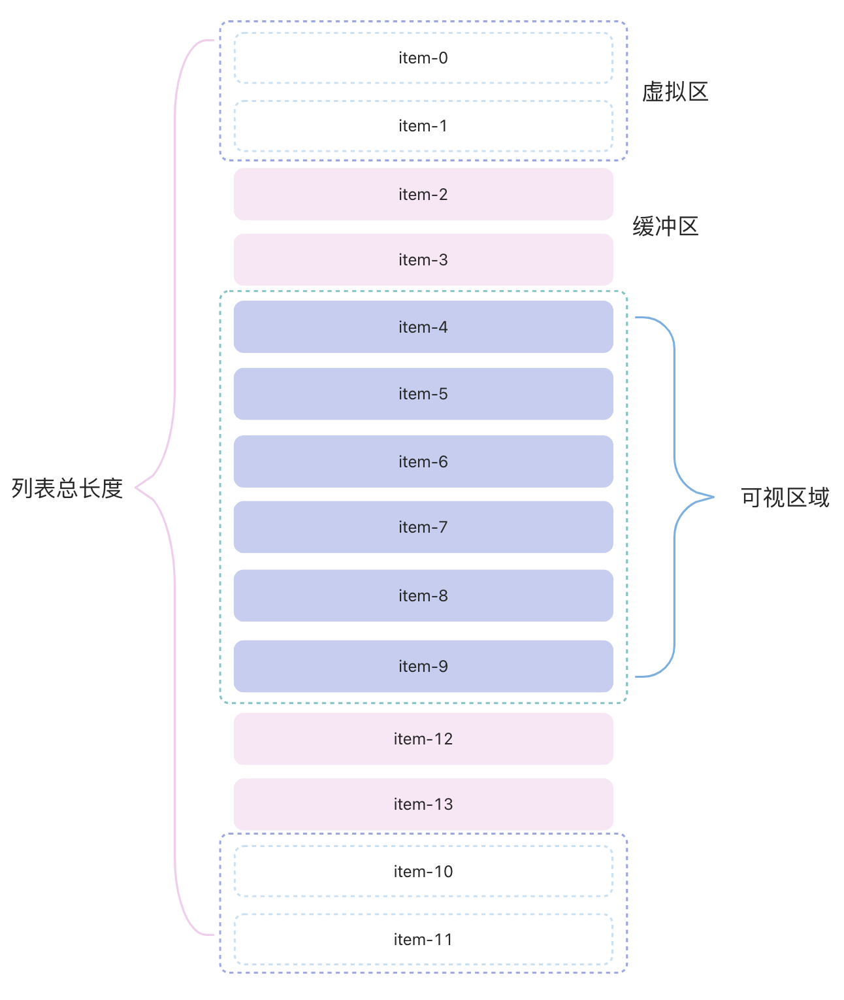

# 虚拟列表

## 什么是虚拟滚动,虚拟列表

在日常的业务中，大部分情况我们遇到的 list 数据量都比较小，如果数据太大会考虑分页请求渲染，但是有时候可能也会遇到这种情况：接口直接返回成千上万条数据，如果还是直接使用老方法，将这些数据全部渲染的话，会浪费非常多的资源，性能低效甚至页面卡顿等情况。

不管数据多大，用户一次性能够看到的数据是有限的，因此可以考虑只渲染用户可视区域的内容，当用户滚动时再依次渲染剩下的内容，这样虚拟列表就发挥作用了。

一个虚拟列表是指当有成千上万条数据需要进行展示但是用户的“视窗”（一次性可见内容）又不大时，可以通过巧妙的方法只渲染用户最大可见元素并在用户进行滚动时动态更新每个元素中的内容从而达到一个和长 list 滚动一样的效果但花费非常少的资源。实际上虚拟列表只是一种实现方案，它只对可视区域进行渲染，对于不可见区域只渲染部分（这部分的渲染又叫缓冲区），从而提升性能。如下图所示：



从图中可以看出，我们可以将整个列表分成：可视区，缓冲区，虚拟区三部分。可视区内就是用户看到数据的区域。

## 定高虚拟列表

### 页面布局

```tsx
// 外面的容器，用于监听滚动事件
<div
  ref={scrollingContainer}
  style={{ height: height }}
  onScroll={onScroll}
  className="overflow-x-hidden overflow-y-auto"
>
  {/* 渲染内容，设置高度为列表总的高度，用于生成滚动条 */}
  <div className="relative" style={{ height: listHeight, transform: getTransform() }}>
    {renderList.map((item: any, index: number) => (
      <div key={index}>
        <Component item={item} {...info} />
      </div>
    ))}
  </div>
</div>
```

整体 div：监听可视区域的滚动事件，判断可视区域截取的数组。

渲染区域：渲染区域实际上是由可视区和缓冲区组成，缓冲区的作用是为了防止滚动过快出现空白或卡顿现象。

### 参数说明

- 容器高度：height
- 渲染区域列表总高度：total\*itemHeight
- 可视区域内展示元素数：limit = height/itemHeight
- 子列表高度：itemHeight
- 起始索引：startIndex
- 结束索引：endIndex=Math.min(startIndex + limit, total - 1)
- 缓冲个数：bufferSize

在 onScroll 中监听滚动事件，判断是否需要更新数据

```ts
const onScroll = (e: any) => {
  if (e.target === scrollingContainer.current) {
    const { scrollTop } = e.target
    // 计算当前的startIndex
    const currentIndex = Math.floor(scrollTop / itemHeight)
    // 当前的startIndex和之前的originStartIdx不同时，需要更新数据
    if (currentIndex !== originStartIdx) {
      setOriginStartIdx(currentIndex)
      setStartIndex(Math.max(originStartIdx - bufferSize, 0))
      setEndIndex(Math.min(currentIndex + limit + bufferSize, total - 1))
      setOffsetY(scrollTop - (scrollTop % limit)) // 设置偏移量
      setListHeight(0)
    }
  }
}
```

根据 startIndex 和 endIndex 渲染列表

```tsx
useEffect(() => {
  setRenderList(list.slice(startIndex, endIndex))
}, [startIndex, endIndex])
```

设置渲染区域的偏移量

```ts
// 偏移量
const getTransform = () => {
  return `translate3d(0,${offsetY}px,0)`
}
```

定高虚拟列表组件完整代码

```tsx
import { useState, useRef, useEffect } from 'react'

const FixedSizeList =
  (Component: any) =>
  ({ info, list }: any) => {
    const { height, itemHeight, total, bufferSize } = info || {} // list配置信息
    const limit = Math.ceil(height / itemHeight) // 一页渲染的条数
    const scrollingContainer = useRef<HTMLDivElement>(null)

    const [originStartIdx, setOriginStartIdx] = useState(0)
    const [startIndex, setStartIndex] = useState(Math.max(originStartIdx - bufferSize, 0)) // 起始索引
    const [endIndex, setEndIndex] = useState(Math.min(originStartIdx + limit, total - 1)) // 结束索引
    const [offsetY, setOffsetY] = useState(0) // 偏移量
    const [listHeight, setListHeight] = useState(total * itemHeight) // 初始列表高度，用于生成滚动条
    const [renderList, setRenderList] = useState([])

    // 数据渲染初始化
    useEffect(() => {
      setRenderList(list.slice(startIndex, endIndex))
    }, [startIndex, endIndex])

    // 滚动事件
    const onScroll = (e: any) => {
      if (e.target === scrollingContainer.current) {
        const { scrollTop } = e.target
        const currentIndex = Math.floor(scrollTop / itemHeight)
        if (currentIndex !== originStartIdx) {
          setOriginStartIdx(currentIndex)
          setStartIndex(Math.max(originStartIdx - bufferSize, 0))
          setEndIndex(Math.min(currentIndex + limit + bufferSize, total - 1))
          setOffsetY(scrollTop - (scrollTop % limit)) // 偏移量
          setListHeight(0)
        }
      }
    }

    // 偏移量style
    const getTransform = () => {
      return `translate3d(0,${offsetY}px,0)`
    }

    return (
      // 外面的容器，用于监听滚动事件
      <div
        ref={scrollingContainer}
        style={{ height: height }}
        onScroll={onScroll}
        className="overflow-x-hidden overflow-y-auto"
      >
        {/* 渲染内容，设置高度为列表总的高度，用于生成滚动条 */}
        <div className="relative" style={{ height: listHeight, transform: getTransform() }}>
          {renderList.map((item: any, index: number) => (
            <div key={index}>
              <Component item={item} {...info} />
            </div>
          ))}
        </div>
      </div>
    )
  }

export default FixedSizeList
```

使用

```tsx
import FixedSizeList from '@/components/FixedSizeList'

const dataList: any = []
const dataLength = 1000
for (let id = 0; id < dataLength; ++id) {
  dataList.push({ id })
}

const rowRenderer = ({ item, itemHeight }: any) => {
  return (
    <li
      className="w-full left-0 right-0 text-center"
      style={{
        height: `${itemHeight - 1}px`,
        lineHeight: `${itemHeight}px`,
        borderBottom: '1px solid #000'
      }}
      key={item.id}
      onClick={() => {
        console.log('item-', item.id)
      }}
    >
      item-{item.id}
    </li>
  )
}

const RenderList = FixedSizeList(rowRenderer)

const Home = () => {
  return (
    <RenderList
      info={{ height: 800, bufferSize: 5, total: dataList.length, itemHeight: 60 }}
      list={dataList}
    />
  )
}

export default Home
```

## 不定高虚拟列表

对于不定高的情况，每个 item 的高度是不一定的，因此无法计算列表的高度以及偏移量。那么对于子列表的动态高度应该怎么处理？

1. 第一种，将 itemHeight 作为参数传递过来，我们可以根据传递数组来控制，但这种情况需要我们提前将列表的高度算出来，算每个子列表的高度很麻烦，其次这个高度还要根据屏幕的大小去变化，这个方法明显不适合
2. 第二种，预算高度，我们可以假定子列表的高度也就是虚假高度（initItemHeight）,当我们渲染的时候，再更新对应高度，这样就可以解决子列表高度的问题

对于第二种方案，采用预算高度，这个时候需要维护一个高度列表数组 positions，来记录真实 DOM 的高度。

```ts
interface positionsType {
  index?: number // 当前pos对应的元素的下标
  top?: number //顶部位置
  bottom?: number //底部位置
  height?: number //元素高度
  dHeight?: number // 用于判断是否需要更新高度
}
```

### 参数说明

- initItemHeight：子列表预算高度
- startIndex：起始索引
- endIndex：结束索引
- renderCount：一页渲染条数
- scrollingContainer：滚动区域 ref
- renderRef：渲染区域 ref
- positions：位置信息

### 高度初始化

```tsx
// 初始高度
const initPositions = () => {
  const data: positionsType[] = []
  for (let i = 0; i < list.length; i++) {
    data.push({
      index: i,
      top: i * initItemHeight,
      bottom: (i + 1) * initItemHeight,
      height: initItemHeight,
      dHeight: 0
    })
  }
  const listHeight = data[data.length - 1].bottom
  setListHeight(listHeight) // 列表高度：positions最后一项的bottom
  setPositions([...data])
}
```

### 更新高度

```tsx
// 更新高度（更新子列表高度和列表高度）
const updatePositions = () => {
  const newPositions = JSON.parse(JSON.stringify(positions))
  const nodes: any = renderRef.current?.childNodes
  if (nodes.length === 0) return
  nodes.forEach((node: HTMLDivElement) => {
    if (!node) return
    const rect = node.getBoundingClientRect() // 获取对应的元素信息
    const index = Number(node.id) // 可以通过id，来获取到对应的索引
    const oldHeight: any = positions[index].height // 旧的高度
    const dHeight = oldHeight - rect.height // 差值，根据差值来判断是否需要更新
    // 更新子列表高度
    if (dHeight) {
      newPositions[index].height = rect.height // 真实高度
      newPositions[index].bottom = (newPositions[index].bottom || 0) - dHeight
      newPositions[index].dHeight = dHeight
    }
  })

  //  重新计算整体的高度
  const startId = Number(nodes[0].id)
  const positionsLen: any = positions.length
  let startHeight: number = positions[startId].dHeight || 0
  positions[startId].dHeight = 0
  for (let i = startId + 1; i < positionsLen; ++i) {
    const item = positions[i]
    positions[i].top = positions[i - 1].bottom
    positions[i].bottom = (positions[i].bottom || 0) - startHeight
    if (item.dHeight !== 0) {
      startHeight += item.dHeight || 0
      item.dHeight = 0
    }
  }
  // 重新计算子列表高度
  setItemHeight(positions[positionsLen - 1].bottom)

  setPositions(newPositions)
}
```

### 滚动事件

```tsx
// 滚动事件
const onScroll = (e: any) => {
  if (e.target === scrollingContainer.current) {
    const { scrollTop } = e.target
    const currentStartIndex: any = getStartIndex(scrollTop)
    if (currentStartIndex !== originStartIdx) {
      setOriginStartIdx(currentStartIndex)
      setStartIndex(Math.max(originStartIdx - bufferSize, 0))
      setEndIndex(currentStartIndex + renderCount + bufferSize)
      const currentOffsetY: any =
        currentStartIndex > 0 ? positions[currentStartIndex - 1].bottom : 0
      setOffsetY(currentOffsetY)
      setListHeight(0)
    }
  }
}
```

滚动事件中根据 scrollTop 设置 startIndex 时使用了二分法查找

```tsx
// 二分法查找
const binarySearch = <T, VT>(
  list: T[],
  value: VT,
  compareFunc: (current: T, value: VT) => CompareResult
) => {
  let start = 0
  let end = list.length - 1
  let tempIndex = null

  while (start <= end) {
    tempIndex = Math.floor((start + end) / 2)
    const midValue = list[tempIndex]

    const compareRes: CompareResult = compareFunc(midValue, value)
    if (compareRes === CompareResult.eq) {
      return tempIndex
    }

    if (compareRes === CompareResult.lt) {
      start = tempIndex + 1
    } else if (compareRes === CompareResult.gt) {
      end = tempIndex - 1
    }
  }

  return tempIndex
}

const getStartIndex = (scrollTop = 0) => {
  let idx: any = binarySearch<positionsType, number>(
    positions,
    scrollTop,
    (currentValue: positionsType, targetValue: number) => {
      const currentCompareValue: any = currentValue.bottom
      if (currentCompareValue === targetValue) {
        return CompareResult.eq
      }

      if (currentCompareValue < targetValue) {
        return CompareResult.lt
      }

      return CompareResult.gt
    }
  )
  const targetItem: any = positions[idx]

  // Incase of binarySearch give us a not visible data(an idx of current visible - 1)...
  if (targetItem.bottom < scrollTop) {
    idx += 1
  }

  return idx
}
```

不定高虚拟滚动组件完整代码

```tsx
import { useEffect, useRef, useState } from 'react'

const initItemHeight = 50 // 子列表预估高度

interface positionsType {
  index?: number
  top?: number
  bottom?: number
  height?: number
  dHeight?: number
}

export enum CompareResult {
  // eslint-disable-next-line no-unused-vars
  eq = 1,
  // eslint-disable-next-line no-unused-vars
  lt,
  // eslint-disable-next-line no-unused-vars
  gt
}

const VaribleSizeList =
  (Component: any) =>
  ({ info, list }: any) => {
    const { bufferSize, total, height } = info || {}
    const [renderList, setRenderList] = useState([]) // 渲染数据列表
    const [originStartIdx, setOriginStartIdx] = useState(0)
    const [startIndex, setStartIndex] = useState(Math.max(originStartIdx - bufferSize, 0)) // 起始索引
    const [endIndex, setEndIndex] = useState(0) // 结束索引
    const [positions, setPositions] = useState<positionsType[]>([]) // 位置信息
    const [listHeight, setListHeight] = useState<any>(0) // 列表高度
    const [itemHeight, setItemHeight] = useState<any>(initItemHeight) // 子列表高度
    const [renderCount, setRenderCount] = useState(0) // 一页渲染数量
    const [offsetY, setOffsetY] = useState(0) // 偏移量

    const scrollingContainer = useRef<HTMLDivElement>(null)
    const renderRef = useRef<HTMLDivElement>(null)

    // 高度初始化
    useEffect(() => {
      initPositions()
    }, [])

    // 初始高度
    const initPositions = () => {
      const data: positionsType[] = []
      for (let i = 0; i < list.length; i++) {
        data.push({
          index: i,
          top: i * initItemHeight,
          bottom: (i + 1) * initItemHeight,
          height: initItemHeight,
          dHeight: 0
        })
      }
      const listHeight = data[data.length - 1].bottom
      // 列表高度：positions最后一项的bottom
      setListHeight(listHeight)
      setPositions([...data])
    }

    useEffect(() => {
      if (positions.length) {
        setListHeight(positions[positions.length - 1].bottom)
      }
      const limit = Math.ceil(height / itemHeight)
      setRenderCount(limit)
      setEndIndex(Math.min(originStartIdx + limit, total - 1))
    }, [list.length, scrollingContainer])

    // 列表数据初始化
    useEffect(() => {
      setRenderList(list.slice(startIndex, endIndex))
      if (renderRef.current) {
        updatePositions()
      }
    }, [startIndex, endIndex])

    // 更新高度
    useEffect(() => {
      updatePositions()
    }, [renderRef.current])

    // 更新高度（更新子列表高度和列表高度）
    const updatePositions = () => {
      const newPositions = JSON.parse(JSON.stringify(positions))
      const nodes: any = renderRef.current?.childNodes
      if (nodes.length === 0) return
      nodes.forEach((node: HTMLDivElement) => {
        if (!node) return
        const rect = node.getBoundingClientRect() // 获取对应的元素信息
        const index = Number(node.id) // 可以通过id，来获取到对应的索引
        const oldHeight: any = positions[index].height // 旧的高度
        const dHeight = oldHeight - rect.height // 差值，根据差值来判断是否需要更新
        // 更新子列表高度
        if (dHeight) {
          newPositions[index].height = rect.height // 真实高度
          newPositions[index].bottom = (newPositions[index].bottom || 0) - dHeight
          newPositions[index].dHeight = dHeight
        }
      })

      //  重新计算整体的高度
      const startId = Number(nodes[0].id)
      const positionsLen: any = positions.length
      let startHeight: number = positions[startId].dHeight || 0
      positions[startId].dHeight = 0
      for (let i = startId + 1; i < positionsLen; ++i) {
        const item = positions[i]
        positions[i].top = positions[i - 1].bottom // 该item的顶部位置为上一个item的底部位置
        positions[i].bottom = (positions[i].bottom || 0) - startHeight
        if (item.dHeight !== 0) {
          startHeight += item.dHeight || 0
          item.dHeight = 0
        }
      }
      // 重新计算子列表高度
      setItemHeight(positions[positionsLen - 1].bottom)
      setPositions(newPositions)
    }

    // 二分查找
    const binarySearch = <T, VT>(
      list: T[],
      value: VT,
      compareFunc: (current: T, value: VT) => CompareResult
    ) => {
      let start = 0
      let end = list.length - 1
      let tempIndex = null

      while (start <= end) {
        tempIndex = Math.floor((start + end) / 2)
        const midValue = list[tempIndex]

        const compareRes: CompareResult = compareFunc(midValue, value)
        if (compareRes === CompareResult.eq) {
          return tempIndex
        }

        if (compareRes === CompareResult.lt) {
          start = tempIndex + 1
        } else if (compareRes === CompareResult.gt) {
          end = tempIndex - 1
        }
      }

      return tempIndex
    }

    const getStartIndex = (scrollTop = 0) => {
      let idx: any = binarySearch<positionsType, number>(
        positions,
        scrollTop,
        (currentValue: positionsType, targetValue: number) => {
          const currentCompareValue: any = currentValue.bottom
          if (currentCompareValue === targetValue) {
            return CompareResult.eq
          }

          if (currentCompareValue < targetValue) {
            return CompareResult.lt
          }

          return CompareResult.gt
        }
      )
      const targetItem: any = positions[idx]

      // Incase of binarySearch give us a not visible data(an idx of current visible - 1)...
      if (targetItem.bottom < scrollTop) {
        idx += 1
      }

      return idx
    }

    // 滚动事件
    const onScroll = (e: any) => {
      if (e.target === scrollingContainer.current) {
        const { scrollTop } = e.target
        const currentStartIndex: any = getStartIndex(scrollTop)
        if (currentStartIndex !== originStartIdx) {
          setOriginStartIdx(currentStartIndex)
          setStartIndex(Math.max(originStartIdx - bufferSize, 0))
          setEndIndex(currentStartIndex + renderCount + bufferSize)
          const currentOffsetY: any =
            currentStartIndex > 0 ? positions[currentStartIndex - 1].bottom : 0
          if (currentOffsetY < 0) {
            setOffsetY(0)
          } else {
            setOffsetY(currentOffsetY)
          }
          setListHeight(0)
        }
      }
    }

    const getTransform = () => {
      return `translate3d(0,${offsetY}px,0)`
    }

    return (
      // 外面的容器，用于监听滚动事件
      <div
        ref={scrollingContainer}
        onScroll={onScroll}
        style={{ height: height }}
        className="overflow-x-hidden overflow-y-auto"
      >
        {/* 渲染区域 */}
        <div
          className="relative"
          ref={renderRef}
          style={{ height: listHeight, transform: getTransform() }}
        >
          {renderList.map((item: any, index: number) => (
            <div key={index}>
              <Component item={item} />
            </div>
          ))}
        </div>
      </div>
    )
  }

export default VaribleSizeList
```

使用

```tsx
import { faker } from '@faker-js/faker'
import VaribleSizeList from '@/components/VaribleSizeList'

const dataList: any = []
const dataLength = 100

for (let id = 0; id < dataLength; ++id) {
  dataList.push({
    id,
    value: faker.lorem.sentences()
  })
}

const rowRenderer = ({ item }: any) => {
  return (
    <div
      key={item.id}
      className="w-full p-5 border left-0 right-0"
      onClick={() => {
        console.log('item-', item.value)
      }}
      id={`item-${item}`}
    >
      <span className="block text-[14px] text-[rgba(0, 0, 0, 0, 85)] font-medium">
        Item - {item.id} Data:
      </span>
      <span className="text-[16px] text-[rgba(0, 0, 0, 0.5] w-full">{item.value}</span>
    </div>
  )
}

const RenderList = VaribleSizeList(rowRenderer)

const Home = () => {
  return (
    <RenderList info={{ height: 800, bufferSize: 5, total: dataList.length }} list={dataList} />
  )
}

export default Home
```
