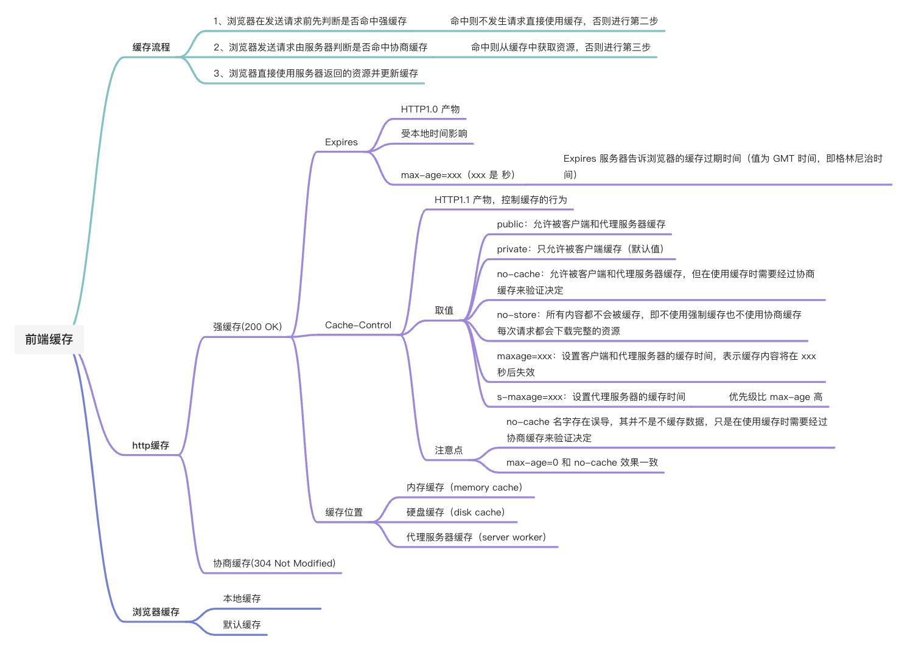

# 前端缓存指南

## 说在前面

:::tip 什么是缓存，缓存有什么作用？
当第一次访问网站的时候，电脑会把网站上的图片和数据下载到电脑上，当再次访问该网站的时候，网站就会从电脑中直接加载出来，这就是缓存。

缓存有以下好处：

1. 缓解服务器压力，不用每次都去请求数据。
2. 提升性能，打开本地资源肯定会比请求服务器来的快。
3. 减少带宽消耗，当使用缓存时，只会产生很小的网络消耗。
   :::

## Web 缓存的种类

| Web 换成类型   | 描述                                                                                                                                                                                                    |
| -------------- | ------------------------------------------------------------------------------------------------------------------------------------------------------------------------------------------------------- |
| 数据库缓存     | 当 web 应用关系复杂，数据表蹭蹭蹭往上涨时，可以将查询后的数据放到内存中进行缓存，下次再查询时，就直接从内存缓存中获取，从而提高响应速度                                                                 |
| CDN 缓存       | 当发送一个 web 请求时，CDN 会计算去哪得到这些内容的路径短且快。这个是网站管理员部署的，所以他们也可以将大家经常访问存的内容放在 CDN 里，从而加快响应。                                                  |
| 代理服务器缓存 | 代理服务器缓存，跟浏览器缓存性质类似，但是代理服务器缓存面向的群体更广，规模更大。它不只为一个用户服务，一般为大量用户提供服器缓存服务，同一个副本会被重用多次,因此在减少响应时间和带宽使用方面很有效。 |
| 浏览器缓存     | 每个浏览器都实现了 HTTP 缓存，通过浏览器使用 HTTP 协议与服务器交互的时候，浏览器就会根据—套与服务器约定的规则进行缓存工作。在浏览器中点击前进和后退按钮时，利用的便是浏览器的缓存机制。                 |

浏览器缓存其实就是指在本地使用的计算机中开辟一个内存区，同时也开辟一个硬盘区作为数据传输的缓冲区，然后用这个缓冲区来暂时保存用户以前访问过的信息。

浏览器缓存过程： 强缓存，协商缓存。

浏览器缓存位置一般分为四类： Service Worker-->Memory Cache-->Disk Cache-->Push Cache。

## http 缓存策略

1. 是否使用缓存，如果不使用缓存，将 Cache-Control 设置为 no-store,如果是使用协商缓存，则将 Cache-Control 设置为 no-cache；
2. 如果是强制缓存，判断是否需要被代理服务器缓存，然后配置强制缓存的过期时间；
3. 如果是协商缓存，首页也是判断是否需要被代理服务器缓存，然后配置协商缓存的 ETag 或 last-modified;

浏览器请求资源过程：

## 强缓存

:::tip 强缓存
强缓存是访问 URL 的时候，不会向服务器发送请求，直接从缓存中读取资源，但是会返回 200 的状态码。
:::

强制缓存在缓存数据未失效的情况下（即 Cache-Control 的 max-age 没有过期或者 Expires 的缓存时间没有过期），那么就会直接使用浏览器的缓存数据，不会再向服务器发送任何请求。

强制缓存生效时，http 状态码为 200。这种方式页面的加载速度是最快的，性能也是很好的，但是在这期间，如果服务器端的资源修改了，页面上是拿不到的，因为它不会再向服务器发请求了。

这种情况就是我们在开发种经常遇到的，比如你修改了页面上的某个样式，在页面上刷新了但没有生效，因为走的是强缓存，所以 Ctrl + F5 一顿操作之后就好了。 跟强制缓存相关的 header 头属性有（Pragma/Cache-Control/Expires）；

### 如何设置强缓存

第一次进入页面，请求服务器，然后服务器进行应答，浏览器会根据 response Header 来判断是否对资源进行缓存，如果响应头中有 expires、pragma 或者 cache-control 字段，代表这是强缓存，浏览器就会把资源缓存在 memory cache 或 disk cache 中。

第二次请求时，浏览器判断请求参数，如果符合强缓存条件就直接返回状态码 200，从本地缓存中拿数据。
否则把响应参数存在 request header 请求头中，看是否符合协商缓存，符合则返回状态码 304，不符合则服务器会返回全新资源。

### expires

expires 是 HTTP1.0 控制网页缓存的字段，值为一个时间戳，准确来讲是格林尼治时间，服务器返回该请求结果缓存的到期时间，当再次发送请求时，如果未超过过期时间，直接使用该缓存，如果过期了则重新请求。

缺点：它判断是否过期是用本地时间来判断的，本地时间是可以自己修改的。

### Cache-Control

Cache-Control 是 HTTP1.1 中控制网页缓存的字段，当 Cache-Control 和 Expires 都存在时，Cache-Control 优先级更高，它的主要取值为：

- public：资源客户端和服务器都可以缓存。
- privite：资源只有客户端可以缓存。
- no-cache：客户端缓存资源，但是是否缓存需要经过协商缓存来验证。
- no-store：不使用缓存。
- max-age：缓存保质期。

Cache-Control 使用的 max-age 为 相对时间，解决了 expires 可以修改本地时间而改变过期时间的问题。

### pragma

pragma 这个是 HTTP1.0 中禁用网页缓存的字段，其取值为 no-cache，和 Cache-Control 的 no-cache 效果一样。

### 缓存位置

问：强缓存会把资源房放到 memory cache 和 disk cache 中，那什么资源放在 memory cache，什么资源放在 disk cache 中？

答：存储图像和网页等资源主要缓存在 disk cache，操作系统缓存文件等资源大部分都会缓存在 memory cache 中。

## 协商缓存

:::tip 协商缓存
协商缓存就是强缓存失效后，浏览器携带缓存标识向服务器发送请求，由服务器根据缓存标识来决定是否使用缓存的过程。
:::

当第一次请求时服务器返回的响应头中没有 Cache-Control 和 Expires 或者 Cache-Control 和 Expires 过期还或者它的属性设置为 no-cache 时(即不走强缓存)，那么浏览器第二次请求时就会与服务器进行协商，与服务器端对比判断资源是否进行了修改更新。

主要有以下两种情况：

1. 如果服务器端的资源没有修改，那么就会返回 304 状态码，告诉浏览器可以使用缓存中的数据，这样就减少了服务器的数据传输压力。
2. 如果数据有更新就会返回 200 状态码，服务器就会返回更新后的资源并且将缓存信息一起返回。跟协商缓存相关的 header 头属性有（ETag/If-Not-Match 、Last-Modified/If-Modified-Since）请求头和响应头需要成对出现；

:::warning 注意点
Etag / If-None-Match 优先级高于 Last-Modified / If-Modified-Since，同时存在则只有 Etag / If-None-Match 生效。
:::

### 如何设置协商缓存

#### Last-Modified / If-Modified-Since

- Last-Modified：是服务器响应请求时，返回该资源文件在服务器最后被修改的时间。
- If-Modified-Since：是客户端再次发起该请求时，携带上次请求返回的 Last-Modified 值，通过此字段值告诉服务器该资源上次请求返回的最后被修改时间。

服务器收到该请求，发现请求头含有 If-Modified-Since 字段，则会根据 If-Modified-Since 的字段值与该资源在服务器的最后被修改时间做对比，若服务器的资源最后被修改时间大于 If-Modified-Since 的字段值，则重新返回资源，状态码为 200；否则则返回 304，代表资源无更新，可继续使用缓存文件。

#### Etag / If-None-Match

- Etag：是服务器响应请求时，返回当前资源文件的一个唯一标识(由服务器生成)。
- If-None-Match：是客户端再次发起该请求时，携带上次请求返回的唯一标识 Etag 值，通过此字段值告诉服务器该资源上次请求返回的唯一标识值。

服务器收到该请求后，发现该请求头中含有 If-None-Match，则会根据 If-None-Match 的字段值与该资源在服务器的 Etag 值做对比，一致则返回 304，代表资源无更新，继续使用缓存文件；不一致则重新返回资源文件，状态码为 200。

## 强缓存与协商缓存的区别

1. 强缓存不发请求到服务器，所以有时候资源更新了浏览器还不知道，但是协商缓存会发请求到服务器，所以资源是否更新，服务器肯定知道。
2. 大部分 web 服务器都默认开启协商缓存。

## http 缓存注意点

（1）强缓存的情况下，只要缓存还没有过期，就会直接从缓存中取数据就算服务器端有数据变化也不会从服务器端获取，这样就无法获取到修改后的数据；解决办法：在修改后的资源加上随机数，确保不会从缓存中取；
（2）尽量减少 304 的请求，因为协商缓存每次都会与后台服务器进行交互，所以性能上不是很好，从性能上来看应该多使用强制缓存；

## 刷新对于强缓存和协商缓存的影响

1. 当 ctrl+f5 强制刷新网页时，直接从服务器加载，跳过强缓存和协商缓存。
2. 当 f5 刷新网页时，跳过强缓存，但是会检查协商缓存。
3. 浏览器地址栏中写入 URL，回车 浏览器发现缓存中有这个文件了，不用继续请求了，直接去缓存拿。（最快）

## ETag

::: tip ETag 是什么？
ETag（Entity Tag）是万维网协议 HTTP 的一部分。它是 HTTP 协议提供的若干机制中的一种 Web 缓存验证机制，并且允许客户端进行缓存协商。这使得缓存变得更加高效，而且节省带宽。如果资源的内容没有发生改变，Web 服务器就不需要发送一个完整的响应。
:::
