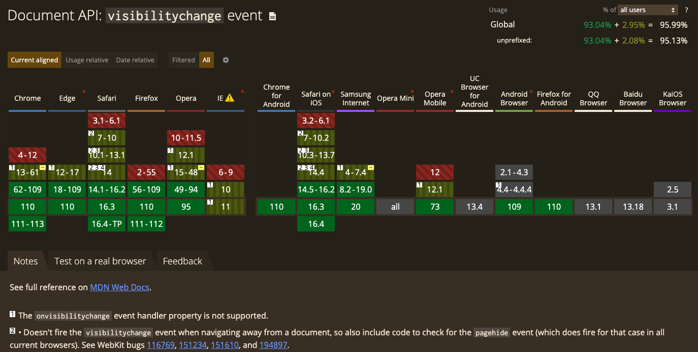

# 浏览器监听切屏功能实现

## 监听切换原理

浏览器自带了 API 可以监听浏览器窗口的实现，即 [visibilitychange](https://developer.mozilla.org/zh-CN/docs/Web/API/Document/visibilitychange_event) 属性。

MDN 介绍：当其选项卡的内容变得可见或被隐藏时，会在文档上触发 `visibilitychange` (能见度更改) 事件。
所以，要实现浏览器窗口切换的监听，只需要注册`visibilitychange`的事件即可。

```js
document.addEventListener('visibilitychange', function () {
  if (document.visibilityState == 'hidden') {
    //todo...
  } else if (document.visibilityState == 'visible') {
    //todo...
  }
})
```

::: warning 注意点
出于兼容性原因，请确保使用 document.addEventListener 而不是 window.addEventListener 来注册回调。Safari <14.0 仅支持前者。
:::

### 浏览器兼容性

[visibilitychange 的浏览器兼容性](https://caniuse.com/?search=visibilitychange)


