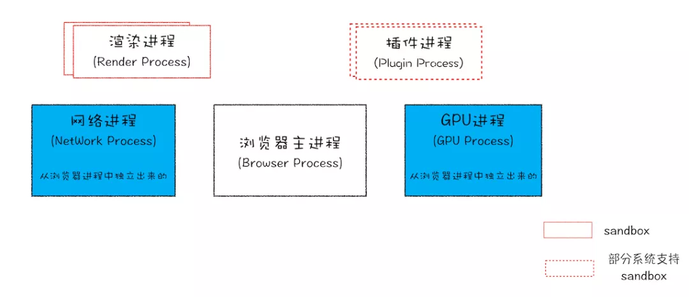
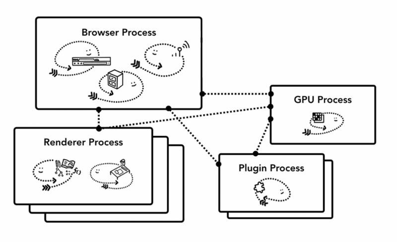
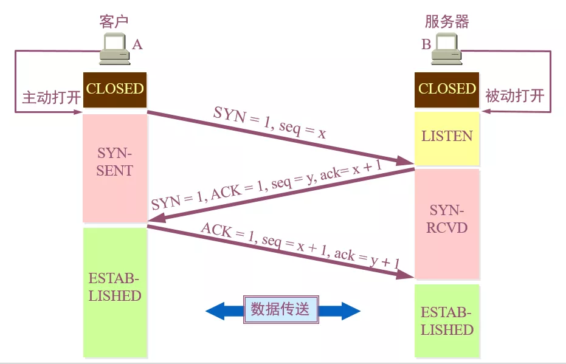

# 浏览器工作原理

:::tip URL 输入后按回车，浏览器内部究竟发生了什么
从浏览器角度来说明，URL 后输入后按回车，浏览器内部究竟发生了什么：

- 浏览器内有哪些进程，这些进程都有些什么作用
- 浏览器地址输入 URL 后，内部的进程、线程都做了哪些事
- 与浏览器交互时，内部进程是怎么处理这些交互事件的
  :::

## 进程

进程（process）是程序的一次执行过程，是一个动态概念，是程序在执行过程中分配和管理资源的基本单位。简单的说，进程可以理解成正在执行的应用程序。

## 线程

线程（thread）是 CPU 调度和分派的基本单位，它可与同属一个进程的其他的线程共享进程所拥有的全部资源。简单的说，线程可以理解成应用程序中的代码的执行器。

:::tip 进程和线程的关系
线程是跑在进程里面的，一个进程里面可能有一个或者多个线程，而一个线程，只能隶属于一个进程。

大家都知道，浏览器属于一个应用程序，而应用程序的一次执行，可以理解为计算机启动了一个进程，进程启动后，CPU 会给该进程分配相应的内存空间，当进程得到了内存之后，就可以使用线程进行资源调度，进而完成应用程序的功能。
:::

## 浏览器的多进程架构

如果要开发一个浏览器，它的架构可以是一个单进程多线程的应用程序，也可以是一个使用 IPC 通信的多进程应用程序。以下通过 Chrome 来介绍浏览器的多进程架构。

在 Chrome 中，主要的进程可以分为以下五类：

1. **_浏览器进程_**：主要负责界面显示、用户交互、子进程管理，同时提供存储等功能。
2. **_渲染进程_**：核心任务是将 HTML、CSS 和 JavaScript 转换为用户可以与之交互的网页，排版引擎 Blink 和 JavaScript 引擎 V8 都是运行在该进程中，默认情况下，Chrome 会为每个 Tab 标签创建一个渲染进程。出于安全考虑，渲染进程都是运行在沙箱模式下。
3. **_GPU 进程_**：负责处理整个应用程序的 GPU 任务。
4. **_网络进程_**：主要负责页面的网络资源加载，之前是作为一个模块运行在浏览器进程里面的，直至最近才独立出来，成为一个单独的进程。
5. **_插件进程_**：主要是负责插件的运行，因插件易崩溃，所以需要通过插件进程来隔离，以保证插件进程崩溃不会对浏览器和页面造成影响。

### Chrome 四个进程的关系

首先，当浏览一个网页，会在浏览器的地址栏里输入 URL：

1. 这个时候 `Browser Process` 会向这个 URL 发送请求，获取这个 URL 的 HTML 内容;
2. 然后将 HTML 交给 `Renderer Process`，`Renderer Process` 解析 HTML 内容，解析遇到需要请求网络的资源又返回来交给 `Browser Process` 进行加载;
3. 同时通知 `Browser Process`，需要 `Plugin Process` 加载插件资源，执行插件代码。
4. 解析完成后，`Renderer Process` 计算得到图像帧，并将这些图像帧交给 `GPU Process`，`GPU Process` 将其转化为图像并显示在屏幕上。

## 从输入 URL 到页面渲染的过程到底发生了什么

### 网页导航阶段

对于浏览器进程`Browser Process`,`Browser Process`主要分为以下几个线程处理不同的工作：

- UI thread：控制浏览器上的按钮及输入框；
- network thread：处理网络请求，从网上获取数据；
- storage thread：控制文件等的访问；

网页加载过程的步骤如下：

#### 1. 处理输入

当在浏览器的地址栏输入内容按下回车时，`UI thread`会对输入的内容进行判断，输入内容可以分为以下两种：

1. 输入的是搜索关键词（search query）：地址栏会使用浏览器默认的搜索引擎，来合成新的带搜索关键字的 URL。；
2. 输入的请求是 URL:地址栏会根据规则，给这段内容加上协议，合成为完整的 URL；

#### 2. 开始导航，网络进程开始工作

输入完成按下回车键后，`UI thread`将关键词搜索对应的 URL 或输入的 URL 交给网络线程`Network thread`，网络进程接收到 url 请求后：

- 首先检查本地缓存是否缓存了该请求资源，如果有则将该资源返回给浏览器进程；
- 准备 IP 地址和端口：进行 DNS 解析时先查找缓存，没有再使用 DNS 服务器解析；
  DNS 服务器解析的查找顺序：

  - 浏览器缓存；
  - 本机缓存；
  - hosts 文件；
  - 路由器缓存；
  - ISP DNS 缓存；
  - DNS 递归查询（本地 DNS 服务器 -> 权限 DNS 服务器 -> 顶级 DNS 服务器 -> 13 台根 DNS 服务器）

- 等待 TCP 队列：浏览器会为每个域名最多维护 6 个 TCP 连接，如果发起一个 HTTP 请求时，这 6 个 TCP 连接都处于忙碌状态，那么这个请求就会处于排队状态；
  解决 6 个 TCP 限制方案：
  - 采用域名分片技术：将一个站点的资源放在多个（CDN）域名下面。
  - 升级为 HTTP2，就没有 6 个 TCP 连接的限制了；
- 通过三次握手建立 TCP 连接；

##### TCP 建立连接的三次握手

1. 第一次握手：客户端先向服务器端发送一个请求建立连接的数据包，报文的 TCP 首部中：标志位：同步 SYN 为 1；
   序号 Seq=x，x 为所传送数据的第一个字节的序号，随后进入 SYN-SENT 状态；标志位值为 1 表示该标志位有效。

2. 第二次握手：服务器根据收到数据包的 SYN 标志位判断为建立连接的请求，随后返回一个确认数据包；
   其中标志位 SYN=1，ACK=1，序号 seq=y，确认号 ack=x + 1 表示收到了客户端传输过来的 x 字节数据，并希望下次从 x+1 个字节开始传，并进入 SYN-RCVD 状态；
   这里要区分标志位 ACK 和确认号 ack；

3. 第三次握手：客户端收到后，再给服务器发送一个确认数据包，标志位 ACK=1，序号 seq=x+1，确认号 ack=y+1，随后进入 ESTABLISHED 状态；

服务器端收到后，也进入 ESTABLISHED 状态，由此成功建立了 TCP 连接，可以开始数据传送；

##### TCP 连接为什么要三次握手

TCP 建立连接的过程需要三次握手，主要是为了保证连接的可靠性和避免网络中的重复连接。

在 TCP 连接建立的过程中，如果没有三次握手，那么客户端和服务器可能会误认为对方已经建立了连接，从而进行数据传输。这样就会导致网络中的重复连接，浪费网络资源，同时也会影响数据的可靠性。

通过三次握手，可以确保客户端和服务器都确认了对方的连接请求，并且双方都准备好了进行数据传输。具体来说，第一次握手表示客户端发送了一个连接请求，第二次握手表示服务器收到了请求并回复了一个确认连接的请求，第三次握手表示客户端收到了服务器的确认请求并返回一个确认连接的请求。这样就建立了一个可靠的连接，可以保证数据传输的可靠性。

此外，三次握手还可以防止“中间人攻击”等安全问题。在三次握手的过程中，客户端和服务器都会验证对方的身份，确保只有对方才能建立连接。这样就可以避免恶意用户冒充服务器或者客户端进行攻击。

##### 四次挥手

1. 第一次：客户端（主动断开连接）发送数据包给服务器，其中标志位 FIN=1，序号位 seq=u，并停止发送数据；
2. 第二次：服务器收到数据包后，由于还需传输数据，无法立即关闭连接，先返回一个标志位 ACK=1，序号 seq=v，确认号 ack=u+1 的数据包；
3. 第三次：服务器准备好断开连接后，返回一个数据包，其中标志位 FIN=1，标志位 ACK=1，序号 seq=w，确认号 ack=u+1；
4. 第四次：客户端收到数据包后，返回一个标志位 ACK=1，序号 seq=u+1，确认号 ack=w+1 的数据包。

由此通过四次挥手断开 TCP 连接。

##### 为什么要四次挥手

由于服务器不能马上断开连接，导致 FIN 释放连接报文与 ACK 确认接收报文需要分两次传输，即第二次和第三次"挥手"；

通过四次挥手，可以确保客户端和服务器都确认了对方的关闭请求，并且确保服务端所有需要传输的数据都传输完毕。具体来说，第一次挥手表示客户端发送了一个关闭请求，第二次挥手表示服务器收到了关闭请求的包，但是可能还有没传输完毕的数据，无法立即关闭连接，第三次挥手表示数据已经传输完毕，服务器准备断开连接，返回确认断开连接的数据包给客户端，第四次挥手表示客户端已经收到服务器确认关闭的请求并返回一个确认关闭请求的包，这样就建立了一个可靠的连接，可以保证数据传输的可靠性。

此外，四次挥手还可以防止“中间人攻击”等安全问题。在四次挥手的过程中，客户端和服务器都会验证对方的身份，确保只有对方才能进行连接和关闭操作。这样就可以避免恶意用户冒充服务器或者客户端进行攻击。

#### 3. 读取响应

`network thread`接收到服务器的响应后，开始解析 HTTP 响应报文，然后根据响应头中的 Content-Type 字段来确定响应主体的媒体类型（MIME Type），如果媒体类型是一个 HTML 文件，则将响应数据交给渲染进程（`renderer process`）来进行下一步的工作，如果是 zip 文件或者其它文件，会把相关数据传输给下载管理器。

与此同时，浏览器会进行 Safe Browsing 安全检查，如果域名或者请求内容匹配到已知的恶意站点，`network thread` 会展示一个警告页。除此之外，网络线程还会做 CORB（Cross Origin Read Blocking）检查来确定那些敏感的跨站数据不会被发送至渲染进程。

#### 4. 查找渲染进程

各种检查完毕以后，`network thread` 确信浏览器可以导航到请求网页，`network thread` 会通知 `UI thread` 数据已经准备好，`UI thread` 会查找到一个 `renderer process` 进行网页的渲染。

浏览器为了对查找渲染进程这一步骤进行优化，考虑到网络请求获取响应需要时间，所以在第二步开始，浏览器已经预先查找和启动了一个渲染进程，如果中间步骤一切顺利，当 `network thread` 接收到数据时，渲染进程已经准备好了，但是如果遇到重定向，这个准备好的渲染进程也许就不可用了，这个时候会重新启动一个渲染进程。

#### 5. 提交导航

数据和渲染进程都准备好了，`Browser Process` 会向 `Renderer Process` 发送 IPC 消息来确认导航，此时，浏览器进程将准备好的数据发送给渲染进程，渲染进程接收到数据之后，又发送 IPC 消息给浏览器进程，告诉浏览器进程导航已经提交了，页面开始加载。

这个时候导航栏会更新，安全指示符更新（地址前面的小锁），访问历史列表（history tab）更新，即可以通过前进后退来切换该页面。

#### 6. 初始化加载完成

当导航提交完成后，渲染进程开始加载资源及渲染页面（详细内容下文介绍），当页面渲染完成后（页面及内部的 iframe 都触发了 onload 事件），会向浏览器进程发送 IPC 消息，告知浏览器进程，这个时候 `UI thread` 会停止展示 tab 中的加载中图标。

### 渲染阶段

导航过程完成之后，浏览器进程把数据交给了渲染进程，渲染进程负责 tab 内的所有事情，核心目的就是将 HTML/CSS/JS 代码转化为用户可进行交互的 web 页面。

:::tip 渲染进程包含的线程

- 一个主线程（main thread）
- 多个工作线程（work thread）
- 一个合成器线程（compositor thread）
- 多个光栅化线程（raster thread）
  :::

网页渲染步骤：

#### 1. 构建 DOM

当渲染进程收到导航的确认信息之后，开始接收来自浏览器进程的数据，此时，主线程会对接收的数据进行解析并转换为 DOM（Document Object Model）对象。

#### 2. 子资源加载

主线程如果在构建的过程中遇到了图片、CSS、JavaScript 脚本等资源，它会逐一发起请求去获取这些资源，同时为了提升效率，浏览器也会运行预加载扫描程序，如果 HTML 中存在 img、link 等标签，预加载扫描程序会把这些请求传递给 Browser Process 的 network thread 进行资源下载。

#### 3. JavaScript 的下载与执行

由于 JS 代码可能会改变 DOM 的结构，比如说执行 document.write()等 API，那么在构建 DOM 的过程中，如果遇到了 script 标签，渲染引擎就会停止对 HTML 的解析，而去加载执行 JS 代码。

:::tip
开发者也可以有多种方式来告知浏览器如何应对某个资源，比如说如果在 script 标签上添加了 async 或 defer 等属性，浏览器会异步的加载和执行 JS 代码，而不会阻塞渲染。
:::

#### 4. 样式计算 - Style calculation

DOM 树只是页面的结构，要知道页面长什么样子，还需要知道 DOM 的每一个节点的样式。

主线程在解析页面时，遇到 style 标签或者 link 标签的 CSS 资源，会加载 CSS 代码，根据 CSS 代码确定每个 DOM 节点的计算样式（computed style）。

:::warning 注意点
计算样式是主线程根据 CSS 样式选择器（CSS selectors）计算出的每个 DOM 元素应该具备的具体样式，即使页面没有设置任何自定义的样式，浏览器也会提供其默认的样式。
:::

#### 5. 布局 - Layout

DOM 树和计算样式完成后，还需要知道每一个节点在页面上的位置，布局（Layout）其实就是找到所有元素的几何关系的过程。

主线程会遍历 DOM 及相关元素的计算样式，构建出包含每个元素的页面坐标信息及盒子模型大小的布局树（Render Tree），遍历过程中，会跳过隐藏的元素（display: none），另外，伪元素虽然在 DOM 上不可见，但是在布局树上是可见的。

#### 6. 绘制 - Paint

布局 layout 之后，知道了不同元素的结构，样式，几何关系，要绘制出一个页面，需要知道每个元素的绘制先后顺序.

在绘制阶段，主线程会遍历布局树（layout tree），生成一系列的绘画记录（paint records）。绘画记录可以看做是记录各元素绘制先后顺序的笔记。

#### 7. 合成 - Compositing

文档结构、元素的样式、元素的几何关系、绘画顺序，这些信息都有了，这个时候如果要绘制一个页面，需要做的是把这些信息转化为显示器中的像素，这个转化的过程，叫做光栅化（rasterizing）。
