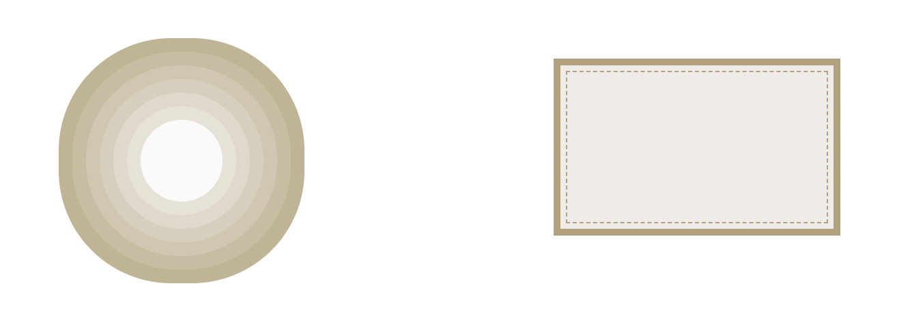
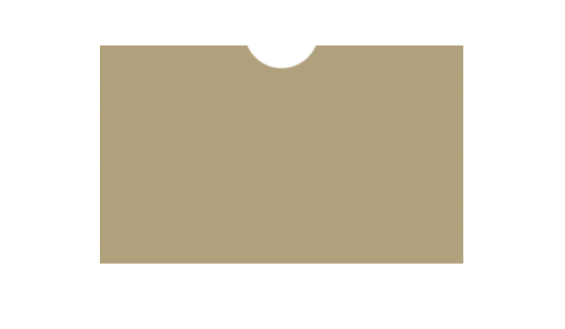
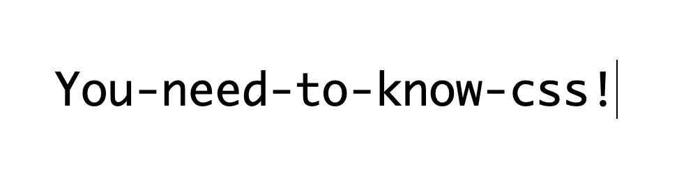
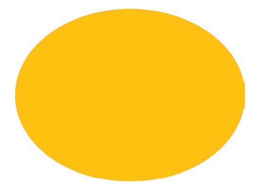
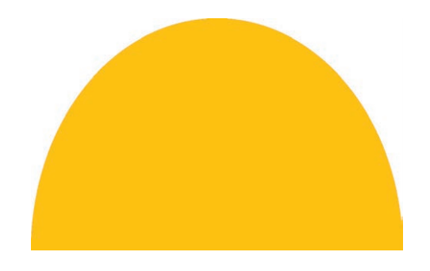
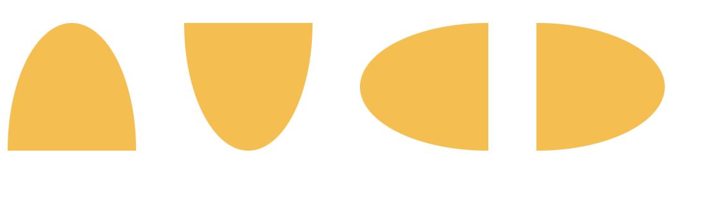
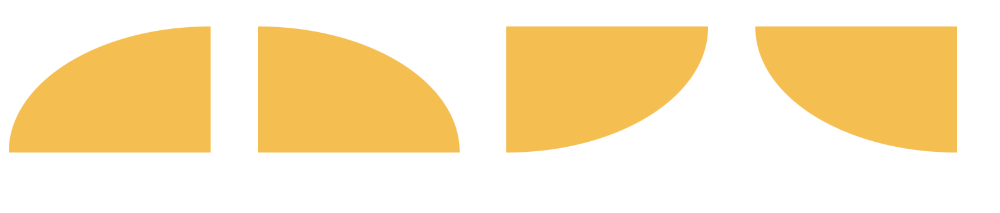

# CSS 揭秘

:::tip 前言
此文是根据 Lea Verou 的《CSS 揭秘》记录的一些 CSS 技巧
:::

## 多重边框

- **box-shadow** 模拟实线边框效果
- **border+outline+outline-offset** 实现多重边框

[box-shadow](https://developer.mozilla.org/zh-CN/docs/Web/CSS/box-shadow)接受第四个参数作为阴影扩张半径，当只设置扩张半径时，零偏移，零模糊，产生的效果其实相当于一条实线“**边框**”。

`box-shadow`虽然可以利用第四个参数模拟实线边框效果，但是有些场景可能需要用到虚线，此时这种方式就不适用了。不过，还可以通过`border+outline+outline-offset`来实现这种场景，示例如下：

```html
<div class="main">
  <div class="box1"></div>
  <div class="box2"></div>
</div>
```

:::details

```css
.main {
  width: 100%;
  padding: 0 10vh;
  display: flex;
  flex-wrap: wrap;
  justify-content: space-around;
  align-items: center;
  .box1 {
    width: 60px;
    height: 60px;
    border-radius: 50%;
    background: #fafafa;
    margin: 105px 29px;
    /* 通过将box-shadow的偏移量和模糊半径设置为0，控制第四个参数（阴影扩张半径）实现多重边框效果 */
    box-shadow: 0 0 0 10px #e8e2d6, 0 0 0 20px #e1d9c9, 0 0 0 30px #d9cfbb, 0 0 0 40px #d2c6ae,
      0 0 0 50px #cabca0, 0 0 0 60px #c3b393;
  }

  .box2 {
    width: 200px;
    height: 120px;
    background: #efebe9;
    border: 5px solid #b4a078;
    outline: #b4a078 dashed 1px;
    outline-offset: -10px;
    margin-bottom: 20px;
  }
}
```

:::


## 不规则卡片

```html
<div class="coupon-card"></div>
```

```css
.coupon-card {
  width: 200px;
  height: 120px;
  background-image: radial-gradient(circle at 100px -8px, transparent 20px, #b4a078 21px);
}
```



## 模拟打字效果

```html
<div class="main">
  <span>You-need-to-know-css!</span>
</div>
```

```css
.main {
  width: 100%;
  padding: 100px 10vh;
  display: flex;
  flex-wrap: wrap;
  justify-content: space-around;
  align-items: center;
  span {
    display: inline-block;
    width: 21ch;
    font: bold 200% Consolas, Monaco, monospace; /*等宽字体*/
    overflow: hidden;
    white-space: nowrap;
    font-weight: 500;
    border-right: 1px solid transparent;
    animation: typing 10s steps(21), caret 0.5s steps(1) infinite;
  }
  @keyframes typing {
    from {
      width: 0;
    }
  }
  @keyframes caret {
    50% {
      border-right-color: currentColor;
    }
  }
}
```



## 自适应椭圆

我们都知道可以使用`border-radius`设置圆角，如果`border-radius`设置为宽高的一半，那么就是一个圆形。基于此，要怎么实现一个椭圆形，甚至是一个自适应的椭圆呢？

当然，其实也很简单，`border-radius`其实可以单独指定水平和垂直半径，使用斜杠 (/) 来分开，两个值相等可以制作一个圆弧，如果不相等，便是一个椭圆弧了。

举个 🌰：

如果我们有一个尺寸为 200px×150px 的元素，就可以把它圆角的两个半径值分别指定为元素宽高的一半，从而得到一个精确的椭圆：



```css
border-radius: 100px / 75px;

/* 其他写法 自适应椭圆 一 */
border-radius: 50%;

/* 其他写法 二 */
border-radius: 100px 100px 100px 100px / 75px 75px 75px 75px;
/* 斜杠(/)前表示水平半径，斜杠(/)后表示垂直半径，顺序分别为左上角开始，顺时针走向 */
/* 上述这段代码相当于：左上角(100px/75px) 右上角(100px/75px) 右下角(100px/75px) 左下角(100px/75px) */

/* 其他写法 三 */
border-top-left-radius: 100px/75px;
border-top-right-radius: 100px/75px;
border-bottom-right-radius: 100px/75px;
border-bottom-left-radius: 100px/75px;
```

### 半椭圆

`border-radius`其实是一个简写属性。我们可以为元素的每个角指定不同的值，为元素每个角指定不同的值有两种方法，第一种就是使用它所对应的展开属性：

- border-top-left-radius
- border-top-right-radius
- border-bottom-right-radius
- border-bottom-left-radius

第二种方式是直接使用`border-radius`这个简写属性，使用空格分隔，顺序为左上角开始，顺时针走向。另外，我们甚至可以为所有四个角提供完全不同的水平和垂
直半径，方法是在斜杠前指定 1~4 个值，在斜杠后指定另外 1~4 个值。

举个 🌰：`border-radius 的值为10px / 5px 20px 时，其效果相当于 10px 10px 10px 10px / 5px 20px 5px 20px`



观察一下上面这个半椭圆：

- 形状是垂直对称的，这意味着左上角和右上角的半径值应该是相同的；与此类似，左下角和右下角的半径值也应该是相同的。
- 顶部边缘并没有平直的部分（也就是说，整个顶边都是曲线），这意味着左上角和右上角的半径之和应该等于整个形状的宽度。
- 基于前两条观察，我们可以推断出，左半径和右半径在水平方向上的值应该均为 50%。
- 再看看垂直方向，似乎顶部的两个圆角占据了整个元素的高度，而 且底部完全没有任何圆角。因此，在垂直方向上 border-radius 的合理值似乎就是 100% 100% 0 0。

```css
/* 一 */
border-radius: 50% / 100% 100% 0 0;
/* 二 */
border-radius: 50% / 0 0 100% 100%;
/* 三 */
border-radius: 100% 0 0 100% / 50%;
/* 四 */
border-radius: 0 100% 100% 0 / 50%;
```



### 四分之一椭圆

```css
/* 一 */
border-radius: 100% 0 0 0;
/* 二 */
border-radius: 0 100% 0 0;
/* 三 */
border-radius: 0 0 100% 0;
/* 四 */
border-radius: 0 0 0 100%;
```


