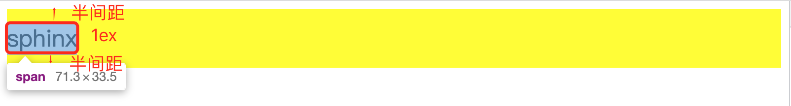
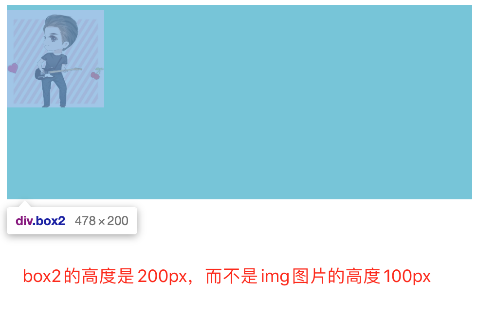
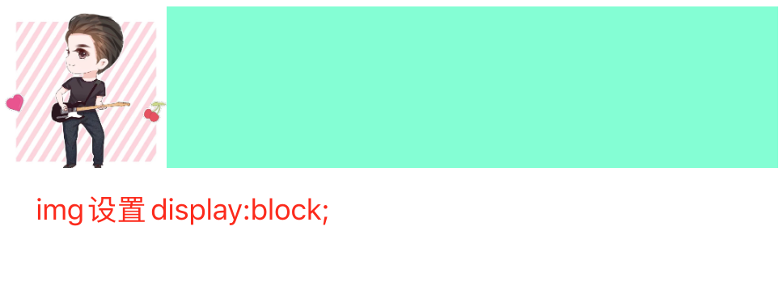
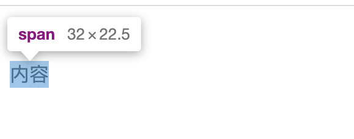
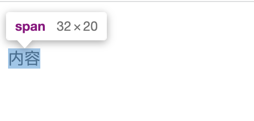
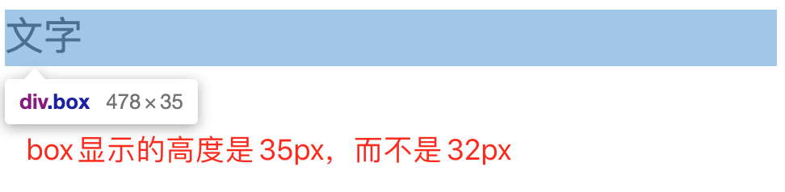
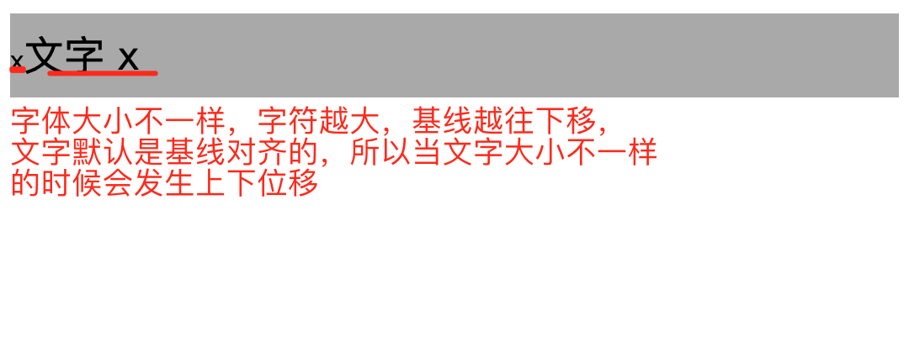
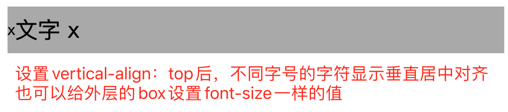
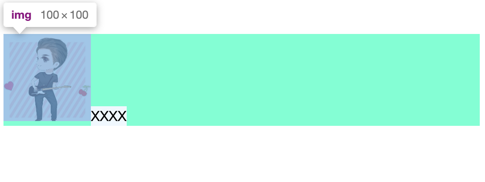

# line-height

## 内联元素的高度之本

1. 内联元素的高度是由 `line-height` 决定的。内联元素的高度由固定高度和不固定高度组成，这个不固定的部分就是这里的“行距”。换句话说，line-height 之所以起作用，就是通过改变“行距”来实现的。

   ::: tip 行距计算规则
   行距 = line-height - font-size。
   假设 `line-height` 是 1.5，`font-size` 大小是 14px， 那么我们的半行距大小就是(套用上面的行距公式再除以 2):(14px _1.5 - 14px) / 2 = 14px_ 0.25 = 3.5px；
   :::

   

2. 对于同时含有替换元素的内联元素，`line-height` 只能决定最小高度。替换元素不受 `line-height` 的影响。

```javascript
 <div class="box2"></div>

.box2 {
  line-height: 200px;
  background-color: aquamarine;
  img {
    width: 100px;
    height: 100px;
    // display: block;
  }
  span {
    background-color: aliceblue;
  }
}
```



在上述例子中，box2 的 div 里面只有一个 img 替换元素，img 的高度是 100px，box2 的 `line-height` 为 200px，这里最终外部盒子的高度是 200px，可能会误以为这里的高度是因为 `line-height`把图片占据的高度变高了，但其实不是这样的，而是幽灵空白节点的高度变高了。

::: tip
图片为内联元素，会构成一个“行框盒子”，而在 HTML5 文档模式下，每一个“行框盒 子”的前面都有一个宽度为 0 的“幽灵空白节点”，其内联特性表现和普通字符一模一样，所以，导致上述例子中容器高度会等于 line-height 设置的属性值 200px。
:::

`此时将图片块状化可以解决这个问题，即设置 img 的 diaplay:block;`



## 内联元素 line-height 的大值特性

```javascript
<div class="box"><span>内容</span></div>

//此时的span元素的line-height：20px未生效，在span元素前面存在一个幽灵空白节点，
.box {
  line-height: 96px;
  span {
    line-height: 20px;
  }
}

.box {
  line-height: 96px;
  span {
    display: inline-block;//加上这条，创建了一个独立的行框盒子，此时span元素的line-height: 20px可以生效
    line-height: 20px;
  }
}

```

:::tip display 属性对元素显示高度的差异
没加 display: inline-block;和加了 display: inline-block;span 元素显示的高度。
:::





# vertical-align

vertical-align 的属性：
• 线类，如 baseline(默认值)、top、middle、bottom;
• 文本类，如 text-top、text-bottom;
• 上标下标类，如 sub、super;
• 数值百分比类，如 20px、2em、20%等。

```javascript
<div class="box">
  <span>文字</span>
</div>

.box {
  line-height: 32px;
  span {
    font-size: 24px;
  }
}
```



原因就是 vertical-align 默认是基线对齐。

# line-height 和 vertical-align 的关系

```javascript
<div class="box">x<span>文字 x</span></div>

.box {
  height: 50px;
  line-height: 50px;
  background: darkgray;
  span {
    font-size: 24px;
    // vertical-align: top;
  }
}
```





## 幽灵空白节点产生的问题

```javascript
<div class="box2"><span>XXXX</span></div>

.box2 {
  background-color: aquamarine;
  img {
    width: 100px;
    height: 100px;
  }
  span {
    background-color: aliceblue;
  }
}
```



如上图所示，div 外部容器盒子与图片底部有一定的空隙，产生的原因是内联元素是默认是相对于基线对齐的，div 标签内的图片和 span 元素是相对于 x 的小边缘对齐的，而 X 自身是有一定的高度，因此会导致如上图所示的空隙。

::: tip 解决方案

1. 图片块状化：display: block;
2. 容器设置 line-height 足够小
3. 容器 font-size 足够小
4. 图片设置其他 vertical-align 值，如 top 等
   :::


