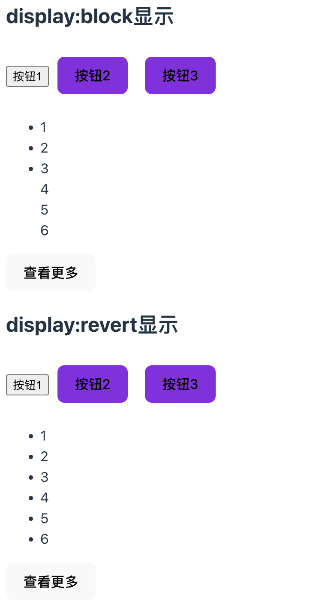
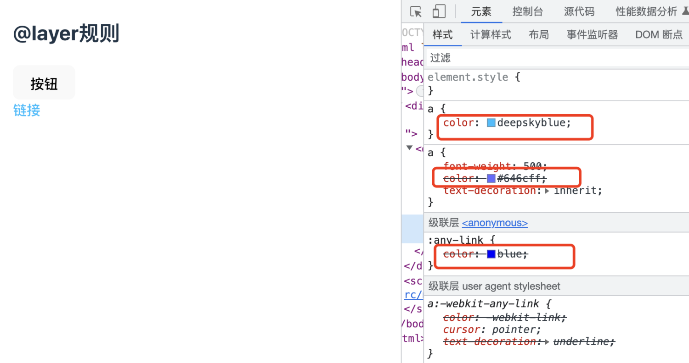
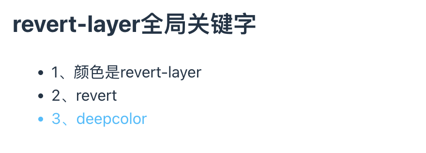
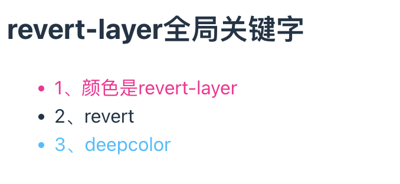

# revert-layer 全局关键字

在介绍`revert-layer`这个关键字之前，先简单的了解一下`revert`和`@layer`

## revert

`revert`全局关键字可以还原 display 显示元素（PS：不同的浏览器可能略有差异），或者可以设置某个祖先样式，通常使用`all:revert`这个 css 属性来还原成浏览器默认属性。

🌰：
:::details 列表显示查看更多

```jsx
<div>
  <h1>revert-layer全局关键字</h1>
  <h2>display:block显示</h2>
  <button className="btn btn1">按钮1</button>
  <button className="btn btn2">按钮2</button>
  <button className="btn btn3">按钮3</button>

  <ul id="ul">
    <li>1</li>
    <li>2</li>
    <li>3</li>
    <li>4</li>
    <li>5</li>
    <li>6</li>
  </ul>

  <button onClick={() => handleMore(1)}>查看更多</button>

  <h2>display:revert显示</h2>
  <button className="btn btn1">按钮1</button>
  <button className="btn btn2">按钮2</button>
  <button className="btn btn3">按钮3</button>

  <ul id="ul2">
    <li>1</li>
    <li>2</li>
    <li>3</li>
    <li>4</li>
    <li>5</li>
    <li>6</li>
  </ul>

  <button onClick={() => handleMore(2)}>查看更多</button>
</div>
```

查看更多按钮

```js
const handleMore = (type: number) => {
  if (type === 1) {
    ul.querySelectorAll('li').forEach((li) => {
      if (li.clientWidth == 0) {
        li.style.display = 'block'
      }
    })
  } else {
    ul2.querySelectorAll('li').forEach((li) => {
      if (li.clientWidth == 0) {
        li.style.display = 'revert'
      }
    })
  }
}
```

设置 CSS 样式

```css
li:nth-child(n + 4) {
  display: none;
}
```

在上述例子中，点击查看更多按钮时，让隐藏的 li 元素显示，最先想到的是设置 display 属性为 block，但是查看效果会发现这样是不行的，即列表的项目符号没有了，主要原因就是 li 元素默认的 display 计算值不是 block，而是 list-item。

如果你设置为 list-item 是没问题的，但是这样意味着你需要记住它，遇到这种情况，我们就可以考虑使用 revert 关键字来代替，不管它的 display 是哪个值，都使用 revert（浏览器默认的 display 计算值）。

两种方案的效果如下：


:::

:::tip revert 关键字的作用

- 如果当前属性使用的是开发者自定义的样式，例如 color 这类继承属性，则还原到设置的这个样式。否则还原成浏览器内置样式。
- 如果当前属性在当前元素中有被浏览器设置过，例如 button 元素的背景色、颜色等属性，则还原成浏览器内置样式。
- 如果是浏览器自己使用这个关键字值，则表现类似于 unset。
  :::

## @layer

`@layer`可以让其里面的 CSS 优先级降低，主要的应用场景就是有些第三方组件或者模块的 CSS 的样式不符合业务场景，需要覆盖它们的样式，此时就可以考虑使用@layer 规则，将需要覆盖的样式放在@layer 规则中，降低自身的优先级，然后再设置满足自己业务需求的样式。

这样做的好处就是不再需要设置复杂的层级关系，把组件的样式放在@layer 规则中就可以降低它的优先级，不需要考虑各样式间复杂的层级关系。

🌰：
:::details @layer 规则示例

```jsx
<div>
  <h2>@layer规则</h2>
  <button className="some-button">按钮</button>
  <br />
  <a href="www.baidu.com">链接</a>
</div>
```

CSS 属性设置

```css
@layer {
  .some-button {
    height: 30px;
  }
  :any-link {
    color: blue;
  }
  :any-link:hover {
    color: darkblue;
  }
}

.some-button {
  height: 40px;
}
a {
  color: deepskyblue;
}
a:hover {
  color: skyblue;
}
```

渲染的效果图如下所示：按钮的高度为 40px,链接颜色为 skyblue


:::

## revert-layer

`revert-layer`可以让 CSS 属性值还原为上一层`@layer`中设置的同属性值。

如果当前 CSS 不在`@layer`规则中，或者没有祖先`@layer`规则，则表现类似于`revert`关键字，使用浏览器默认的控件样式。

#### 示例 1：单层@layer

```jsx
<div>
  <h2>revert-layer全局关键字</h2>
  <ul>
    <li className="revert-layer">1、颜色是revert-layer</li>
    <li className="revert">2、revert</li>
    <li className="deepcolor">3、deepcolor</li>
  </ul>
</div>
```

CSS 样式

```css
@layer {
  .revert-layer {
    color: revert-layer;
  }
  .revert {
    color: revert;
  }
  .deepcolor {
    color: deepskyblue;
  }
}
```

对于单层的@layer，`revert-layer`在`@layer`中的规则是唯一的，不存在优先级更高的`@layer`规则，因此，此时的`revert-layer`表现和`revert`表现是一样的，`revert`会去寻找其祖先元素中的 color 值。

效果图如下所示：


#### 示例 2：多层@layer

CSS 样式

```css
@layer base, special;

@layer special {
  .revert-layer {
    color: revert-layer;
  }
  .revert {
    color: revert;
  }
  .deepcolor {
    color: deepskyblue;
  }
}

@layer base {
  .revert-layer {
    color: deeppink;
  }
  .revert {
    color: deeppink;
  }
  .deepcolor {
    color: deeppink;
  }
}
```

上述代码中，special 规则中的样式均在 base 后面，在 special 规则中设置的 color:revert-layer 实际上是将颜色还原到 base 规则中，因此表现的颜色就是 deeppink。在 special 规则中设置 color: revert 会将其颜色还原为浏览器默认颜色。

效果图如下所示：


#### 示例 3：嵌套@layer

```css
@layer outer {
  .revert-layer {
    color: revert-layer;
  }
  .revert {
    color: revert;
  }
  .deepcolor {
    color: deepskyblue;
  }
  @layer inner {
    .revert-layer {
      color: deeppink;
    }
    .revert {
      color: deeppink;
    }
    .deepcolor {
      color: deeppink;
    }
  }
}
```

在嵌套的@layer 规则中，外部的优先级高，内部的优先级低，因此对于上述示例，外部设置了 color:revert-layer，实际上是将颜色还原到内部，即 color: deeppink。
外部设置 color: revert，实际上是还原浏览器的默认值。

效果图如下所示：


## 参考

- [张鑫旭-revert 全局关键字还原 display 显示元素](https://www.zhangxinxu.com/wordpress/2021/05/css-revert-display/)
- [张鑫旭-revert-layer 全局关键字](https://www.zhangxinxu.com/wordpress/2023/03/css-revert-layer-global-keyword/)
