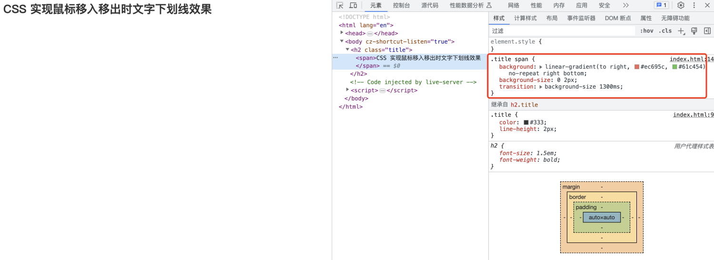
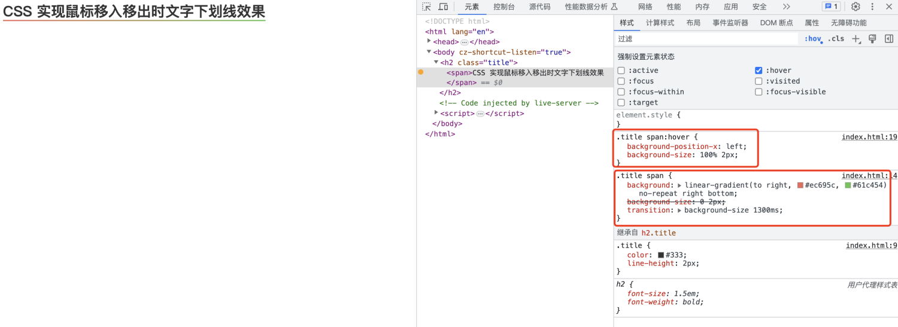
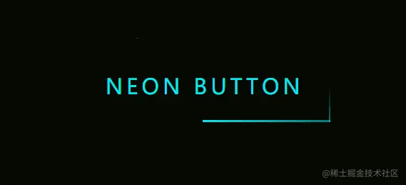
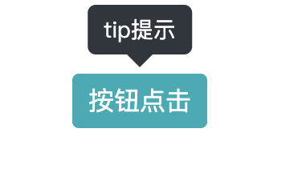

# CSS 炫酷效果

## CSS 实现鼠标移入移出时文字下划线效果

示例如下：

```html
<!DOCTYPE html>
<html lang="en">
  <head>
    <meta charset="UTF-8" />
    <meta http-equiv="X-UA-Compatible" content="IE=edge" />
    <meta name="viewport" content="width=device-width, initial-scale=1.0" />
    <title>Document</title>
    <style>
      .title {
        color: #333;
        line-height: 2px;
      }

      .title span {
        background: linear-gradient(to right, #ec695c, #61c454) no-repeat right bottom;
        background-size: 0 2px;
        transition: background-size 1300ms;
      }
      .title span:hover {
        background-position-x: left;
        background-size: 100% 2px;
      }
    </style>
  </head>
  <body>
    <h2 class="title">
      <span>CSS 实现鼠标移入移出时文字下划线效果</span>
    </h2>
  </body>
</html>
```

未移入时


鼠标移入后


代码解释

- 首先是 background 需要禁止平铺，然后是靠右（right）并且是底部(bottom)的,原因是收回去的时候需要方向是右侧（right）；然后 background-size 需要将宽度设置为 0 高度为 2（可以根据自己的需要设置）；最后是给 background-size 一个过度效果。
- hover 事件的时候需要将定位给到左侧（left）并且将 background-size 宽度百分之百；这样就会根据过度时间显示完成。

## 按钮霓虹灯效果

效果如下：


按钮霓虹灯效果包含两部分，一部分是光束沿着按钮边缘运动，另外一个就是霓虹灯光（可以考虑用多重阴影来做）。

```html
<div class="light">
  <div></div>
  <div></div>
  <div></div>
  <div></div>
  Neon Button
</div>
```

首先看霓虹灯光的实现过程：

```css
.light {
  position: relative;
  padding: 25px 30px;
  color: #03e9f4;
  font-size: 24px;
  text-transform: uppercase;
  transition: 0.5s;
  letter-spacing: 4px;
  cursor: pointer;
  overflow: hidden;
  width: fit-content;
}
.light:hover {
  background-color: #03e9f4;
  color: #050801;
  box-shadow: 0 0 5px #03e9f4, 0 0 25px #03e9f4, 0 0 50px #03e9f4, 0 0 200px #03e9f4;
}
```

运动的光束实现：

运动光束其实是根据写了四个 div 来实现的，即上左（动画从左往右），上右（动画从上到下），下右（动画从右到左），下左（动画从下到上）。
:::details 四个光束的 CSS 代码

```css
.light div {
  position: absolute;
}
.light div:nth-child(1) {
  width: 100%;
  height: 2px;
  top: 0;
  left: -100%;
  background: linear-gradient(to right, transparent, #03e9f4);
  animation: animate1 1s linear infinite;
}
.light div:nth-child(2) {
  width: 2px;
  height: 100%;
  top: -100%;
  right: 0;
  background: linear-gradient(to bottom, transparent, #03e9f4);
  animation: animate2 1s linear infinite;
  animation-delay: 0.25s;
}
.light div:nth-child(3) {
  width: 100%;
  height: 2px;
  bottom: 0;
  right: -100%;
  background: linear-gradient(to left, transparent, #03e9f4);
  animation: animate3 1s linear infinite;
  animation-delay: 0.5s;
}
.light div:nth-child(4) {
  width: 2px;
  height: 100%;
  bottom: -100%;
  left: 0;
  background: linear-gradient(to top, transparent, #03e9f4);
  animation: animate4 1s linear infinite;
  animation-delay: 0.75s;
}
@keyframes animate1 {
  0% {
    left: -100%;
  }
  50%,
  100% {
    left: 100%;
  }
}
@keyframes animate2 {
  0% {
    top: -100%;
  }
  50%,
  100% {
    top: 100%;
  }
}
@keyframes animate3 {
  0% {
    right: -100%;
  }
  50%,
  100% {
    right: 100%;
  }
}
@keyframes animate4 {
  0% {
    bottom: -100%;
  }
  50%,
  100% {
    bottom: 100%;
  }
}
```

:::

## 提示气泡

```html
<div class="poptip btn" aria-controls="tip提示">按钮点击</div>
```

:::details

```scss
$triangle: 0.5rem;
$poptipBg: #30363d;
$distance: 0.75rem;

.poptip {
  position: relative;
  margin: 3.125rem;
  &::before,
  &::after {
    visibility: hidden;
    opacity: 0;
  }

  &::before {
    position: absolute;
    top: 0px;
    left: calc(50% - $triangle);
    content: '';
    width: 0;
    height: 0;
    border-style: solid;
    border-width: $triangle $triangle 0 $triangle;
    border-color: $poptipBg transparent;
    transform: translateX(0%) translateY(-$distance);
  }

  &::after {
    position: absolute;
    left: 50%;
    bottom: 100%;
    transform: translateX(-50%) translateY(-$distance);
    content: attr(aria-controls);
    width: fit-content;
    padding: 0.3125rem 0.625rem;
    background-color: $poptipBg;
    font-size: 0.875rem;
    white-space: nowrap;
    border-radius: 0.3125rem;
  }

  &:hover::before,
  &:hover::after {
    visibility: visible;
    opacity: 1;
  }
}

.btn {
  width: fit-content;
  line-height: 1.5;
  padding: 5px 10px;
  color: #fff;
  background: #00adb5;
  border-radius: 4px;
  text-align: center;
  cursor: pointer;
}
```

:::

效果如下：

