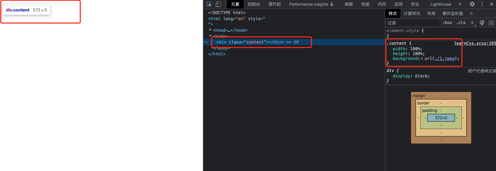
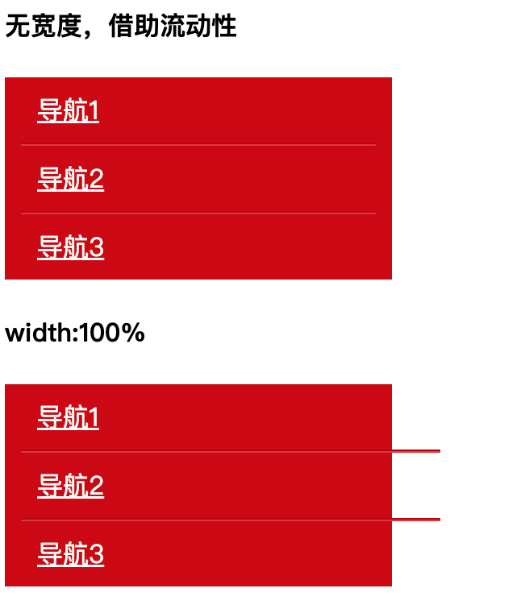
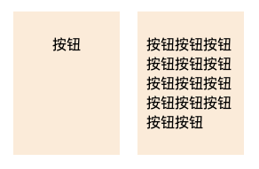
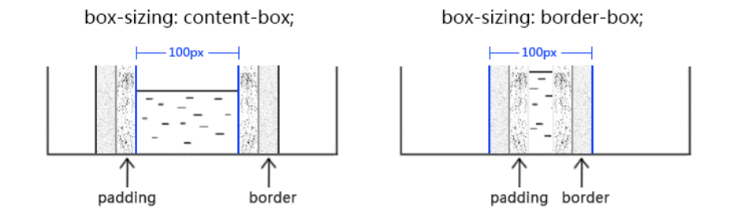

# width 和 height 作用的具体细节

## 什么元素可以有 width 和 height

元素设置 `width` 和 `height` 是否生效跟 `display` 属性有关，当 `display：inline` 时，设置 `width`，`height` 是无效的，比如 `span` 元素它的默认样式为 `display：inline`，设置宽高无效。对于其他情况，如 `display：block`，`inline-block`,`flex` 等设置宽高有效。

## width，height 的取值

### width，height 为具体值

1. px,em。如：width：100px。
2. 100vw,100vh，其中 100vw 表示当前窗口宽度*100%，100vh 表示当前窗口高度*100%。其中窗口动态改变大小时，vw 和 vh 也会改变。
3. calc()函数。如：height：calc(100vh - 32px)；表示当前窗口高度\*100%-32px。

### width，height 为百分比值

- 当 width 是百分比时，元素的宽度 = 父亲元素的宽度 乘以 width。
- 当 height 是百分比时，元素的高度 = 父亲元素的高度 乘以 height。

::: tip 怪异现象
父元素 height 为 auto，子元素在文档流中，设置子元素的高度 height:100%会被忽略，即 height:100%失效。而对于 width，父元素宽度未设置，子元素设置 width:100%是多余的，宽度为图片加文字内容的宽度，但也不会像 height 一样失效。
:::

#### 父元素 width 未设置，子元素 width：100%是多余的

浏览器的渲染规则是：先渲染父元素，后渲染子元素，当渲染父元素的时候，子元素的 width:100%没有被渲染，宽度为图片加文字内容的宽度，渲染到子元素的时候父元素的宽度已经确定，此时的 width:100%就是图片加文字的宽度，如果宽度不够就溢出。

::: tip 对于宽度的解释
如果包含块的宽度取决于该元素的宽度，那么产生的布局在 CSS2.1 中是未定义的（不同浏览器样式表现不一样）。
:::

#### 父元素 height 未设置，子元素 height：100%失效

::: tip 对于高度的解释
如果包含块的高度没有显示指定（即高度由内容决定），并且该元素不是绝对定位，则计算值为 auto。
:::

根据高度计算公式，如果父元素高度为 auto，子元素 height:100%，那么该高度为 height=auto\* 100% = NaN，此时的高度是计算不了的，因此高度失效。

示例：


上图中，为某个 div 元素设置 height 为 100%，但是渲染的时候为 0，原因就是其父级元素没有显示指定高度，且该元素不是绝对定位，因此其父元素的计算值是 auto，因此该元素的百分比值被完全忽略了。

#### 如何让元素支持 height：100%效果

- 设定显示的高度值

::: tip

(1)设置 height:600px

(2)设置可以生效的百分比值高度，如：html,body{height:100%}
:::

- 使用绝对定位

```javascript
.content {
  width: 100%;
  height: 100%;
  position:absolute;
  background: url('./1.jpeg');
}
```

::: warning 注意点
绝对定位元素的百分比计算和非绝对定位元素的百分比计算是有区别的

1. 绝对定位的宽高百分比计算是相对于 padding box 的，也就是说会把 padding 大小值计算在内。
2. 非绝对定位元素是相对于 content box 计算的。
   :::

### width 默认为 auto，height 默认也为 auto

当 height 为 auto 时，它的高度由子元素决定，子元素多高它就多高，如果没有子元素，那么高度就是 0。

### width 为 auto

width 的默认值是 auto。width 的 auto 包含以下 4 种不同的宽度表现：

1. 充分利用可用空间（fill）
2. 收缩与包裹。（fit-content）
3. 收缩到最小。（min-content）
4. 超出容器限制.（max-content）

### width 为 fill

尽可能宽，撑满父元素。如 div，p 标签这些元素的宽度默认是 100%于父级容器的。
这种情况下设置宽度为 100%是没有必要的，相反，设置了 width：100%还会使得流动性丢失。如下例：

```javascript
<h4>无宽度，借助流动性</h4>
<div class="nav">
  <a href="" class="nav-a">导航1</a>
  <a href="" class="nav-a">导航2</a>
  <a href="" class="nav-a">导航3</a>
</div>
<h4>width:100%</h4>
<div class="nav">
  <a href="" class="nav-a nav-a-width ">导航1</a>
  <a href="" class="nav-a nav-a-width ">导航2</a>
  <a href="" class="nav-a nav-a-width ">导航3</a>
</div>

.nav {
  width: 240px;
  background-color: #cd0000;
}
.nav-a {
  display: block;
  margin: 0 10px;
  padding: 9px 10px;
  border-bottom: 1px solid #b70000;
  border-top: 1px solid #de3636;
  color: #fff;
}
.nav-a-width {
  width: 100%;
}
.nav-a:first-child {
  border-top: 0;
}
.nav-a + .nav-a + .nav-a {
  border-bottom: 0;
}
```



在上述例子中，前者没有设置宽度，它将完全借助流动性，后者设置了 width：100%,导致后者的尺寸超出了外部的容器，不能完全利用容器空间，流动性丢失。

### width 为 min-content

也称首选最小宽度，指的是元素最适合的最小宽度。在 CSS 中，图片和文字的权重远大于布局，因此 width：auto 的宽度不会为 0。

::: tip 首选最小宽度的具体表现规则

- 中文的以每个文字作为最小宽度
- 英文由特定的连续的英文单词决定
- 类似图片以图片自身宽度决定
  :::

```javascript
<span class="ao"></span>
<span class="tu"></span>

.ao,
.tu {
  display: inline-block;
  width: 0;
  font-size: 14px;
  line-height: 18px;
  margin: 35px;
  color: #fff;
}
.ao:before,
.tu:before {
  outline: 2px solid #cd0000;
  font-family: Consolas, Monaco, monospace;
}
.ao:before {
  content: 'love你love';
}
.tu {
  direction: rtl;
}
.tu:before {
  content: '我love你';
}
```


### width 为 max-content

width 是 max-content 时，它的宽度由子元素决定。子元素多宽，它就多宽（即子元素会尽可能宽，意思是：子元素若能不换行就不换行）。没有子元素，那么宽度就是 0。
如果子元素是一段文字，这段文字就不会换行，除非你直接限制了子元素的宽度（此时即使你限制 max-content 元素的父元素的宽度，都拦不住子元素前进的步伐）。

### width 为 fit-content

在 `CSS` 世界里，作者称之为包裹性，它除了包裹，还有自适应性。

::: tip 自适应性
指的是元素由内部元素决定，但永远小于包含块容器的尺寸（除非容器尺寸小于元素的首选最小宽度）。
:::

对于一个元素，如果其 display 属性值是 inline-block,那么即使其里面的内容再多，只要是正常文本，宽度也不会超过容器。

按钮是 CSS 世界中极具代表性的 inline-block 元素，具体表现为：按钮文字越多，宽度越宽（内部尺寸特性），如果文字太多，则会在容器的宽度处自动换行（自适应特性）。如下例所示：
下例中，标签内部的文字是动态的，当文字少的时候居中显示，文字超过一行的时候居左显示，核心代码就是：

```javascript
.box {
  text-align: center;
}
.content {
  display: inline-block;
  text-align: left;
}
```

```javascript
<div style="display: flex;">
  <div class="box">
    <p class="content">按钮</p>
  </div>
  <div class="box1">
    <p class="content">按钮按钮按钮按钮按钮按钮按钮按钮按钮按钮按钮按钮按钮按钮</p>
  </div>
</div>

.box {
  width: 100px;
  text-align: center;
  background-color: antiquewhite;
  padding: 10px;
  margin-right: 20px;
}
.box1 {
  width: 100px;
  text-align: center;
  background-color: antiquewhite;
  padding: 10px;
  margin-top: 20px;
}
.content {
  display: inline-block;
  text-align: left;
}
```



## box-sizing 对 width，height 的影响

box-sizing 属性的作用是改变 width 的作用细节。



### box-sizing:content-box

box-sizing 的默认值是 content-box，元素宽和高不包括 padding 和 border。

### box-sizing:border-box

元素的宽高：content+padding+border。

## max-width 和 min-width 遇上 width

min-width 和 min-height 的初始值为 auto
max-width 和 max-height 的初始值为 none
max-width 和 min-width 优先级更高，即使 width 有!important。另外，min-width 比 max-width 优先级更高！

### 超越!important

超越!important 指的是 max-width 会覆盖 width。比如：
width:400px !important;
max-width:200px;
最终呈现的宽度大小是 200px,即使 width 有 !important，max-width 也会覆盖该 width。

### 超越最大

超越最大指的是 min-width 覆盖 max-width，此规则发生在 min-width 和 max-width 发生冲突的时候，如下所示：
min-width:400px;
max-width:200px;
最小宽度设置的比最大宽度还要大，此时 min-width 和 max-width 发生冲突，根据超越最大原则，最终呈现的是 400px，min-width 存活，而 max-width 被忽略。
