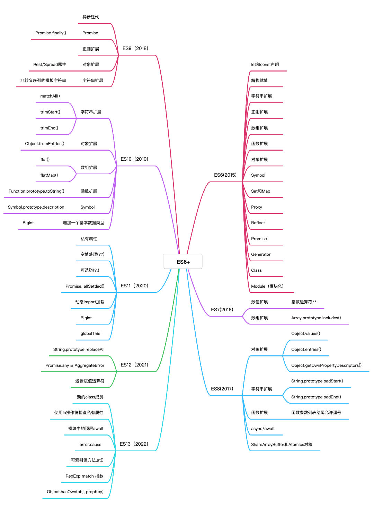

# ES6~ES13 导图概览



# ES6（2015）

`ECMAScript6.0` 是 `JavaScript` 语言的下一代标准，已经在 2015 年 6 月正式发布；

## ES6 主要的变动

- let 和 const 变量声明
- 变量的解构赋值
- Promise
- Set 和 Map 数据结构
- Symbol
- Proxy 和 Reflect
- Generator
- 模块化
- Class

## let 和 const

在 ES6 之前，一直使用 var 来声明变量，但是 var 声明变量存在一些问题

:::tip var 声明变量存在的问题

1. var 声明的变量可以重复声明，这样可能会导致变量被覆盖

```js
var a = 1
console.log(a) // 1
var a = 3
console.log(3) // 3  var允许重复声明，导致变量a的值被后者覆盖
```

2. var 存在变量提升可能会导致怪异的数据访问

```js
function test() {
  console.log(a) // undefined
  var a = 2
  console.log(a) // 2
  if (a > 2) {
    var b = 2
  }
  console.log(b) // undefined
}
test()
```

由于 var 声明的变量存在变量提升，在 test 函数作用域内，首先会先提升 var a，此时 a 的值为 undefined，并且 var 声明的变量不存在块级作用域，因此在 if 条件语句内部的 var b 也会被提升，值为 undefined，当条件不成立时 b 为 undefined 而不是报错；

3. var 声明的变量有可能会污染全局作用域

```js
var a = 1
function test() {
  a = 2 //a未声明直接赋值,使得a被挂载在全局对象上
}
console.log(a) // 1
test()
console.log(window.a, a) //2 2
```

上述代码中 test()函数内变量 a 没有声明直接赋值，使得 a 被挂载在全局对象上，此时修改了全局作用域中变量 a 的值，污染了全局作用域；

4. for 循环的计数器问题

```js
var a = []
for (var i = 0; i < 10; i++) {
  a[i] = function () {
    console.log(i)
  }
}
a[6]() // 10
```

上面代码中，变量 i 在全局范围内有效，全局只有一个变量 i，在每一次循环的时候，变量 i 的值都会发生变化，而循环内被赋给数组 a 的函数内部的 console.log(i)，里面的 i 指向的就是全局的 i。也就是说，所有数组 a 的成员里面的 i，指向的都是同一个 i，导致运行时输出的是最后一轮的 i 的值，也就是 10。

:::

在 `ES6`中新增了 let，const 来声明变量；

### let

let 的用法和 var 类似，但是 let 声明的变量，只在 let 命令所在的代码块内有效；

#### 1、let 声明的变量只在它所在的代码块中有效

```js
{
  let a = 1
  var b = 2
}
console.log(b) // 2
console.log(a) // ReferenceError：  a is not defined
```

for 循环的计数器问题中如果使用 let 声明变量 i，最后输出的结果是 6

```js
var a = []
for (let i = 0; i < 10; i++) {
  a[i] = function () {
    console.log(i)
  }
}
a[6]() // 6
```

在上面这段代码中，变量 i 是使用 let 声明的，当前的 i 只在本轮循环有效，每一次循环的 i 其实都是一个新的变量，所以最后输出的是 6；

:::info
不是说同一作用域内变量 let 不可以重复声明吗？为什么每一次的循环都是一个新的变量 i?

是的，在同一作用域内 let 声明的变量是不可以重复声明的，那每一次循环时都会创造一个新的变量是因为设置循环变量的那部分是一个父作用域，而循环体内部是一个单独的子作用域，在不同的作用域内变量的声明时不影响的；

:::

#### 2、不存在变量提升

let 声明的变量一定要在声明之后才能使用，否则会报错；

```js
console.log(a)
let a = 1 //ReferenceError
```

::: tip 暂时性死区
只要块级作用域内存在 let 命令，它所声明的变量就绑定这个区域，不再受到外部的影响；
:::

```js
var a = 123
if (true) {
  a = 'abc'
  let a // ReferenceError
}
```

在上面代码中，存在一个全局变量 a，但是在块级作用域内 let 又声明了一个局部变量 a，导致 let 声明的局部变量绑定了这个块级作用域，因此在 let 声明变量之前使用变量 a 会报错，这就是暂时性死区；

::: warning 注意点
暂时性死区也意味着 typeof 也不再是百分比的安全操作
:::

```js
typeof a //ReferenceError
let a
```

变量 a 使用 let 声明，在 a 声明之前都是 a 的死区，只要在声明该变量之前使用就会报错（包括 typeof）

#### 3、不允许重复声明

let 不允许在相同作用域内重复声明同一个变量；

```js
function f1() {
  let n = 5
  if (true) {
    let n = 10
  }
  console.log(n) //5
}
f1()
```

### const

const 声明一个只读的常量，一旦声明，常量的值就不能改变；

#### 1、const 声明的变量只在声明所在的块级作用域内有效

#### 2、不存在变量提升

#### 3、不可重复声明，一旦声明就必须赋值，且之后不能改变

const 保证的并不是变量的值不能改变，而是变量所指的那个内存地址所保存的数据不能改变。
对于简单类型的数据（数值，字符串，布尔值），值就保存在变量指向的那个内存地址，因此等同于常量，但是对于复杂数据类型（数组，对象），变量指向的内存地址只是一个指向实际数据的指针，const 只能保证这个指针是固定的，对于它指向的数据结构是不是可变的是不能控制的。

::: warning 将一个对象或数组声明为一个常量

```js
const obj = {}
obj.name = 'Bruce' //为obj添加一个name属性，可以成功
obj = {} //将obj指向另外一个对象会报错
```

:::

上述代码中，常量 obj 存储的是一个地址，这个地址指向一个对象，不可变的只是这个地址（如果将 obj 指向另外一个对象就会报错），因此不能把 obj 指向另外一个地址，而对于对象本身是可变的，因此可以给这个对象添加属性或修改属性值。

### 块级作用域

`ES5` 只有全局作用域和函数作用域，没有块级作用域；
`ES6` 新增了 let 和 const 声明变量，这实际上为 `JavaScript` 新增了块级作用域

```js
function f1() {
  let n = 5
  if (true) {
    let n = 10
  }
  console.log(n) //5
}
f1()
```

上面函数中的两个代码块都声明了变量 n，运行后输出的是 5，这表明外层代码块不受内层代码块的影响；

## 变量的解构赋值

### 数组的解构赋值

解构：ES6 允许按照一定模式，从数组和对象中提取值，对变量进行赋值；
解构的例子：

```js
let [foo, [[bar], baz]] = [1, [[2], 3]]
console.log(foo, bar, baz) // 1 2 3

let [, , third] = ['foo', 'bar', 'baz']
console.log(third) // baz

let [x, , y] = [1, 2, 3]
console.log(x, y) // 1 3

let [head, ...tail] = [1, 2, 3, 4]
console.log(head, tail) // 1  [2, 3, 4]

let [a, b, ...c] = ['a']
console.log(a, b, c) // a  undefined  []
```

上面代码表示，我们可以从数组中提取值，按照对应位置，对变量赋值。如果解构不成功，变量的值就为 undefined。

#### 不完全解构

当左边只匹配到右边的一部分时称为不完全解构。

```js
let [x, y] = [1, 2, 3]
console.log(x, y) // 1 2

let [head] = [1, 2, 3, 4]
console.log(head) // 1
```

如果等号右边不是可遍历的结构（不具备 `Iterator` 接口），还对其进行解构赋值就会报错。

```js
// 报错
let [a] = 1
let [b] = false
let [c] = NaN
let [d] = undefined
let [e] = null
let [f] = {}
```

#### 默认值

解构赋值允许指定默认值。

```js
let [a = 1] = []
console.log(a) // 1

let [x, y = 1] = [1]
console.log(x, y) // 1 1

let [m, n = 'b'] = ['a', undefined]
console.log(m, n) //a b

let [f1, f2 = 'b'] = ['a', null]
console.log(f1, f2) //a null
```

在 `ES6` 内部使用的是严格相等运算符（===）来判断一个位置是否有值，只有当一个数组成员严格等于 undefined 时，默认值才会生效，如果一个数组成员是 null，null 不严格等于 undefined，此时默认值不会生效，而是 null。

### 对象的解构赋值

对象的结构与数组的不同点：数组的元素是按次序排列的，变量的取值由它的值决定；而对象的属性没有次序，变量必须与属性同名才能取到正确的值。

```js
let { bar, foo } = { foo: 'aaa', bar: 'bbb' }
console.log(bar, foo) // bbb aaa

let { baz } = { foo: 'aaa', bar: 'bbb' }
console.log(baz) // undefined  解构失败，变量的值为undefined
```

如果变量名和属性名不一致，需写成下面这样

```js
let { foo: a, bar: b } = { foo: 'aaa', bar: 'bbb' }
console.log(a, b) // aaa bbb
console.log(foo, bar) // ReferenceError
```

对象的解构赋值的内部机制，是先找到同名属性，然后赋给对应的变量，真正被赋值的是后者，而不是前者。在上面的代码中，foo,bar 是匹配的模式，a,b 才是变量，真正被赋值的是变量 a,b，而不是匹配模式 foo,bar。
嵌套解构的对象

```js
let obj = {
  p: ['Hello', { y: 'World' }]
}

let {
  p: [x, { y }]
} = obj
console.log(x, y) //Hello World

// 在上面的代码中p是模式，不是变量，因此不会被赋值

// 如果p也要作为变量赋值，那么可以写成下面这样
let {
  p,
  p: [x, { y }]
} = obj
console.log(x, y) //Hello World
console.log(p) // ["Hello", {y: "World"}]
```

对象的解构也可以指定默认值

```js
let { x = 3 } = {}
console.log(x) //3

let { a1, a2 = 2 } = { a1: 1 }
console.log(a1, a2) //1 2

let { a: b = 3 } = {}
console.log(b) // 3

let { b1: b2 = 3 } = { b1: 5 }
console.log(b2) //5

let { message: msg = 'message' } = {}
console.log(msg) // message

let { y = 3 } = { x: undefined }
console.log(y) // 3

let { z = 3 } = { z: null }
console.log(z) // null
```

默认值生效的条件是对象的属性值严格等于 undefined。

### 字符串的解构赋值

字符串也可以解构赋值，因为此时字符串被转换成了一个类似数组的对象。

```js
const [a, b, c, d, e] = 'hello'
console.log(a, b, c, d, e) // h e l l o
```

### 数值和布尔值的解构赋值

```js
let { toString: s } = 123
s === Number.prototype.toString // true

let { toString: s } = true
s === Boolean.prototype.toString // true

let { prop: x } = undefined // TypeError
let { prop: y } = null // TypeError
```

上面代码中，数值和布尔值的包装对象都有 toString 属性，因此变量 s 都能取到值。
解构赋值的规则是，只要等号右边的值不是对象或数组，就先将其转为对象。由于 undefined 和 null 无法转为对象，所以对它们进行解构赋值，都会报错。

## 字符串

ES6 为字符串添加了遍历器接口，使得字符串可以被 for...of 循环遍历；

### 模板字符串

## 数值的扩展

### Math 对象的扩展

Math.trunc()：用于去除一个数的小数部分，返回整数部分。
Math.sign()：用来判断一个数到底是正数，负数，零，还是非数值。

```js
Math.sign(-5) // -1
Math.sign(5) // +1
Math.sign(0) // +0
Math.sign(-0) // -0
Math.sign(NaN) // NaN
```

Math.cbrt()：用于计算一个数的立方根。

### 新增 Number 属性

- Number.parseInt()
- Number.parseFloat()
- Number.isNaN()
- Number.isFinite()
- Number.isInteger()
- Number.isSafeInteger()
- Number.EPSILON()
- Number.MIN_SAFE_INTEGER()
- Number.MAX_SAFE_INTEGER()

## 正则表达式

## 类

## 模块化

## Promise

Promise 简单的说就是一个容器，里面保存着某个未来才会结束的事件的结果。从语法上说，Promise 是一个对象，从它可以获取异步操作的消息。

::: tip Promise 对象的特点

1. 对象的状态不受外界影响。Promise 对象代表一个异步操作，它共有三种状态：pending，fulfilled，rejected。只有异步操作的结果可以决定当前是哪一种状态，任何其他操作都无法改变这个状态。
2. 一旦改变，就不会改变，任何时候都可以得到这个结果。

:::

::: warning Promise 对象的缺点

1. 无法取消 Promise，一旦新建它就会立即执行，无法中途取消。
2. 如果不设置回调函数，Promise 内部抛出的错误，不会反映到外部。
3. 当处于 pending 状态时，无法得知目前进展到哪一个阶段。

:::

### 基本使用

`Promise` 对象是一个构造函数，用来生成 `Promise` 实例。

```js
const promise = new Promise(function(resolve, reject) {
  // ... some code

  if (/* 异步操作成功 */){
    resolve(value);
  } else {
    reject(error);
  }
});

//
promise.then(function(value) {  //第一个回调函数时Promise对象的状态变为resolved时调用
  // success
}, function(error) {  //第二个回调函数是Promise对象的状态变为rejected时调用
  // failure
});
```

`Promise` 构造函数接受一个函数作为参数，该函数的两个参数分别是 resolve 和 reject。
resolve 函数的作用：将 Promise 对象的状态从 pending 变为 resolve，在异步操作成功时调用，并将异步操作的结果作为参数传递出去。
reject 函数的作用：将 Promise 对象的状态从 pending 变为 reject，在异步操作失败时调用，并将异步操作报出的错误作为参数传递出去。
`Promise` 实例生成以后，可以用 then 方法分别指定 resolved 状态和 rejected 状态的回调函数。then 方法可以接受两个回调函数作为参数，第一个回调函数时 `Promise` 对象的状态变为 resolved 时调用，第二个回调函数是 `Promise` 对象的状态变为 rejected 时调用。

### Promise.prototype.then()

为 `Promise` 实例添加状态改变时的回调函数，其中，第一个参数是 resolved 状态的回调函数，第二个参数是 rejected 状态的回调函数。

### Promise.prototype.catch()

用于指定发生错误时的回调函数。

### Promise.resolve()

将现有对象转为 `Promise` 对象。
Promise.resolve()等价于下面的写法：

```js
Promise.resolve('foo')
// 等价于
new Promise((resolve) => resolve('foo'))
```

:::tip Promise.resolve()方法的参数

1. 参数是一个 promise 实例
   Promise.resolve()将不做任何修改，原封不动地返回这个实例。
2. 参数是一个 thenable 对象
   thenable 对象指的是具有 then 方法的对象。

```js
let thenable = {
  then: function(resolve, reject) {
    resolve(42);
  }
};

let p1 = Promise.resolve(thenable);
p1.then(function (value) {
  console.log(value);  // 42
});

上面代码中，thenable 对象的 then()方法执行后，对象 p1 的状态就变为 resolved，从而立即执行最后那个 then()方法指定的回调函数，输出 42。

```

3. 参数不是具有 then()方法的对象，或根本就不是对象

如果参数是一个原始值，或者是一个不具有 then()方法的对象，则 Promise.resolve()方法返回一个新的 Promise 对象，状态为 resolved。

```js
const p = Promise.resolve('Hello')

p.then(function (s) {
  console.log(s)
})
// Hello

// 上面代码生成一个新的 Promise 对象的实例 p。由于字符串 Hello 不属于异步操作（判断方法是字符串对象不具有 then 方法），返回 Promise 实例的状态从一生成就是 resolved，所以回调函数会立即执行。Promise.resolve()方法的参数，会同时传给回调函数。
```

4. 不带有任何参数
   Promise.resolve()方法允许调用时不带参数，直接返回一个 resolved 状态的 Promise 对象。
   所以，如果希望得到一个 Promise 对象，比较方便的方法就是直接调用 Promise.resolve()方法。

```js
const p = Promise.resolve()

p.then(function () {
  // ...
})
```

:::

### Promise.reject()

返回一个新的 `Promise` 实例，该实例的状态为 rejected。

```js
const p = Promise.reject('出错了')
// 等同于
const p = new Promise((resolve, reject) => reject('出错了'))

p.then(null, function (s) {
  console.log(s)
})
// 出错了
```

### Promise.all()

`Promise.all()`方法用于将多个 `Promise` 实例包装成一个新的 `Promise` 实例。

```js
const p = Promise.all([p1, p2, p3])
```

上面代码中，Promise.all()方法接受一个数组作为参数，p1、p2、p3 都是 Promise 实例，如果不是，就会先调用 Promise.resolve 方法，将参数转为 Promise 实例，再进一步处理。另外，Promise.all()方法的参数可以不是数组，但必须具有 Iterator 接口，且返回的每个成员都是 Promise 实例。
p 的状态由 p1、p2、p3 决定，分成两种情况。

1. 只有 p1、p2、p3 的状态都变成 fulfilled，p 的状态才会变成 fulfilled，此时 p1、p2、p3 的返回值组成一个数组，传递给 p 的回调函数。
2. 只要 p1、p2、p3 之中有一个被 rejected，p 的状态就变成 rejected，此时第一个被 reject 的实例的返回值，会传递给 p 的回调函数。

:::warning 注意点
如果作为参数的 `Promise` 实例，自己定义了 catch 方法，那么它一旦被 rejected，并不会触发 `Promise.all()`的 catch 方法。
:::

```js
const p1 = new Promise((resolve, reject) => {
  resolve('hello')
})
  .then((result) => result)
  .catch((e) => e)

const p2 = new Promise((resolve, reject) => {
  throw new Error('报错了')
})
  .then((result) => result)
  .catch((e) => e)

Promise.all([p1, p2])
  .then((result) => console.log(result))
  .catch((e) => console.log(e))
// ["hello", Error: 报错了]
```

上面代码中，p1 会 resolved，p2 首先会 rejected，但是 p2 有自己的 catch 方法，该方法返回的是一个新的 `Promise` 实例，p2 指向的实际上是这个实例。该实例执行完 catch 方法后，也会变成 resolved，导致 `Promise.all()`方法参数里面的两个实例都会 resolved，因此会调用 then 方法指定的回调函数，而不会调用 catch 方法指定的回调函数。
如果 p2 没有自己的 catch 方法，就会调用 `Promise.all()`的 catch 方法。

```js
const p1 = new Promise((resolve, reject) => {
  resolve('hello')
}).then((result) => result)

const p2 = new Promise((resolve, reject) => {
  throw new Error('报错了')
}).then((result) => result)

Promise.all([p1, p2])
  .then((result) => console.log(result))
  .catch((e) => console.log(e))
// Error: 报错了
```

### Promise.race()

`Promise.race()`方法同样是将多个 `Promise` 实例，包装成一个新的 `Promise` 实例。

```js
const p = Promise.race([p1, p2, p3])
p.then(console.log).catch(console.error)
```

上面代码中，只要 p1、p2、p3 之中有一个实例率先改变状态，p 的状态就跟着改变。那个率先改变的 `Promise` 实例的返回值，就传递给 p 的回调函数。
`Promise.race()`方法的参数与 `Promise.all()`方法一样，如果不是 `Promise` 实例，就会先调用 `Promise.resolve()`方法，将参数转为 `Promise` 实例，再进一步处理。

## Set 和 Map 数据结构

### Set

`ES6` 提供了新的数据结构 Set，它类似于数组，每一个成员的值都是唯一的，没有重复的值。
通过 add()方法向 Set 结构加入成员时，Set 结构不会添加重复的值。

```js
const set = new Set([1, 2, 3, 4, 5, 6, 3, 2, 3, 4, 1])
console.log([...set]) // [1, 2, 3, 4, 5, 6]
console.log(set.size) // 6

//去除数组中的重复成员
let arr = [1, 2, 3, 2, 3, 4, 2, 1, 1]
console.log(arr) // [1, 2, 3, 2, 3, 4, 2, 1, 1]
console.log(new Set(arr)) //Set(4) {1, 2, 3, 4}
//去除字符串里面的重复字符
console.log([...new Set('ababbbc')].join('')) // abc

let set = new Set()
let a = NaN
let b = NaN
set.add(a)
set.add(b)
console.log(set) // Set(1) {NaN}  set实例添加了两次NaN,但是只加入一个，在Set内部，两个NaN是相等的
```

向 Set 加入值的时候，不会发生类型转换，Set 内部判断两个值是否不同，类似于精确相等运算符（===），主要的区别是向 Set 加入值时认为 NaN 等于自身，而（===）认为 NaN 不等于自身。
另外，两个对象也总是不想等的。
Set 结构的实例有以下属性。

- Set.prototype.constructor：构造函数，默认就是 Set 函数。
- Set.prototype.size：返回 Set 实例的成员总数。

Set 实例的方法分为两大类：操作方法（用于操作数据）和遍历方法（用于遍历成员）。下面先介绍四个操作方法。

- Set.prototype.add(value)：添加某个值，返回 Set 结构本身。
- Set.prototype.delete(value)：删除某个值，返回一个布尔值，表示删除是否成功。
- Set.prototype.has(value)：返回一个布尔值，表示该值是否为 Set 的成员。
- Set.prototype.clear()：清除所有成员，没有返回值。

```js
s.add(1).add(2).add(2)
// 注意2被加入了两次

s.size // 2

s.has(1) // true
s.has(2) // true
s.has(3) // false

s.delete(2)
s.has(2) // false
```

### WeakSet

`WeakSet` 结构与 Set 类似，也是不重复的值的集合，但是，它与 Set 有两个区别：

1. `WeakSet` 的成员只能是对象，而不能是其他类型的值。

```js
const ws = new WeakSet()
ws.add({ a: 1, b: 2 }) // WeakSet的成员只能是对象，不能是其他类型
console.log(ws)
ws.add(1) // TypeError: Invalid value used in weak set
ws.add(Symbol()) //  TypeError: Invalid value used in weak set
```

2. `WeakSet` 中的对象都是弱引用，即垃圾回收机制不考虑 `WeakSet` 对该对象的引用。如果其他对象都不在引用该对象，那么垃圾回收机制会自动回收该对象所占用的内存，不考虑该对象还存在于 `WeakSet` 中。
   `WeakSet` 适合临时存放一组对象，以及存放跟对象绑定的信息，只要这些对象在外部消失，它在 `WeakSet` 里面的引用就会自动消失。`ES6` 规定 `WeakSet` 不可变量。
   `WeakSet` 是一个构造函数，可以使用 new 命令创建 `WeakSet` 数据结构。作为构造函数，`WeakSet` 可以接受一个数组或类似数组的对象作为参数。（实际上，任何具有 `Iterable` 接口的对象，都可以作为 `WeakSet` 的参数）该数组的所有成员，都会自动成为 `WeakSet` 实例对象的成员。

```js
const a = [
  [1, 2],
  [3, 4]
]
const ws = new WeakSet(a)
console.log(ws) //WeakSet {[1, 2], [3, 4]}

const b = [3, 4]
const ws1 = new WeakSet(b)
// Uncaught TypeError: Invalid value used in weak set(…)
```

上述代码中，a 是一个数组，它有两个成员，都是数组，将 a 作为 `WeakSet` 构造函数的参数，a 的成员会自动成为 WeakSet 的成员。注意，是 a 数组的成员成为 WeakSet 的成员，而不是 a 数组本身，这意味着，数组的成员只能是对象。如果数组的成员不是对象，加入 WeakSet 就会报错。
WeakSet 结构有以下三个方法。

- **WeakSet.prototype.add(value)**：向 WeakSet 实例添加一个新成员。
- **WeakSet.prototype.delete(value)**：清除 WeakSet 实例的指定成员。
- **WeakSet.prototype.has(value)**：返回一个布尔值，表示某个值是否在 WeakSet 实例之中。

`WeakSet` 没有 size 属性，没有办法遍历它的成员。`WeakSet` 不能遍历是因为它的成员都是弱引用，随时可能消失，遍历机制无法保证成员的存在，很可能刚刚遍历结束成员就取不到了。
`WeakSet` 的一个用处是存储 DOM 节点，而不用担心这些节点从文档移除时，会引发内存泄漏。

### Map

`JavaScript` 的对象本质上是键值对的集合，但是传统上只能用字符串当作键。

ES6 提供了 Map 数据结构，它类似于对象，也是键值对的集合，但是键的范围不限于字符串，各种类型的值都可以当作键。也就是说，Object 结构提供了字符串-值的对应，map 结构提供了值-值的对应，是一种更完善的 Hash 结构实现。

```js
const m = new Map()
const obj = { p: 'Hello' }
m.set(obj, 'obj键的值')
console.log(m.get(obj)) //obj键的值
m.has(o) // true
m.delete(o) // true
m.has(o) // false

//  Map构造函数接受数组作为参数
const map = new Map([
  ['name', '张三'],
  ['title', 'Author']
])

map.size // 2
map.has('name') // true
map.get('name') // "张三"
map.has('title') // true
map.get('title') // "Author"
```

上述代码中使用 Map 结构的 set 方法，将对象 obj 当作 m 的一个键，然后使用 get 方法读取这个键，接着使用 delete 方法删除这个键。

:::tip 特点

- 任何具有 Iterator 接口，且每个成员都是一个双元素的数组的数据结构都可以当作 Map 构造函数的参数。
- 如果对同一个键多次赋值，后面的值将覆盖前面的值。
- 如果读取一个未知的键，则返回 undefined。
- 同样的值的两个实例，在 Map 结构中被视为两个键。只有对同一个对象的引用，Map 结构才能将其视为同一个键。
  :::

:::tip Map 结构的实例的属性和操作方法

1. size 属性
2. Map.prototype.set(key,value) 设置键名 key 对应的键值 value，然后返回整个 Map 结构。如果 key 已经有值，则键值会被更新，否则就新生成该键。
3. Map.prototype.get(key) 读取 key 对应的键值，如果找不到 key，返回 undefined
4. Map.prototype.has(key) 判断某个键是否在当前 Map 对象之中
5. Map.prototype.delete(key) 删除某个键
6. Map.prototype.clear() 清除所有成员
   :::

Map 结构原生提供三个遍历器生成函数和一个遍历方法。

- Map.prototype.keys()：返回键名的遍历器。
- Map.prototype.values()：返回键值的遍历器。
- Map.prototype.entries()：返回所有成员的遍历器。
- Map.prototype.forEach()：遍历 Map 的所有成员。

与其他数据结构的互相转换

1. Map 转为数组，Map 转为数组最方便的方法就是使用扩展运算符（...）

```js
const myMap = new Map().set(true, 7).set({ foo: 3 }, ['abc'])
;[...myMap]
// [ [ true, 7 ], [ { foo: 3 }, [ 'abc' ] ] ]
```

2. 数组转为 Map

```js
new Map([
  [true, 7],
  [{ foo: 3 }, ['abc']]
])
// Map {
//   true => 7,
//   Object {foo: 3} => ['abc']
// }
```

3. Map 转为对象

```js
function strMapToObj(strMap) {
  let obj = Object.create(null)
  for (let [k, v] of strMap) {
    obj[k] = v
  }
  return obj
}

const myMap = new Map().set('yes', true).set('no', false)
strMapToObj(myMap)
// { yes: true, no: false }
```

如果所有 Map 的键都是字符串，它可以无损地转为对象。如果有非字符串的键名，那么这个键名会被转成字符串，再作为对象的键名。

### WeakMap

`WeakMap` 结构与 `Map` 结构类似，也是用于生成键值对的集合。

:::tip `WeakMap` 与 `Map` 的区别

- `WeakMap` 只接收对象作为键名（null 除外），不接受其他类型的值作为键名。
- `WeakMap` 的键名所指向的对象，不计入垃圾回收机制。
  :::

## Symbol

`Symbol` 是 `ES6` 引入的一种新的数据类型，它表示的是独一无二的值。

`Symbol` 可以通过 `Symbol()`生成，对象的属性名现在可以有两种类型，一种是原来就有的字符串，另一种就是新增的 `Symbol` 类型。凡是属性名属于 `Symbol` 类型，就都是独一无二的，可以保证不会与其他属性名产生冲突。

```js
let s = Symbol()
console.log(typeof s) // symbol  新的数据类型
let s1 = Symbol('foo')
let s2 = Symbol('bar')
console.log(s1, s1.toString(), s2, s2.toString()) //Symbol(foo) 'Symbol(foo)' Symbol(bar) 'Symbol(bar)'
let s3 = Symbol()
let s4 = Symbol()
console.log(s3 === s4) // false
```

`Symbol` 是一种独一无二的值，上述代码中 s3 和 s4 都是 Symbol 的返回值，它们的参数是相同的，但是 s3,s4 是不相等的；
`Symbol` 值不能与其他类型的值进行运算；

:::warning 注意点
`Symbol` 不能使用 new 命令，因为 `Symbol` 是原始数据类型，不是对象，如果使用 new 命令会报错。
:::

## Iterator 和 Generator

### Iterator

`JavaScript` 原有的表示“集合”的数据结构，主要是数组和对象，ES6 又添加了 Map 和 Set。因此一个有四种数据集合，而且还可以组合使用定义自己的数据结构，这样导致需要一种统一的接口机制来处理所有不同的数据结构。
遍历器 Iterator 是一种接口，它为各种不同的数据结构提供统一的访问机制，任何数据结构只要部署 Iterator 接口就可以完成遍历操作。

:::tip 遍历器 `Iterator` 的作用

1. 为各种数据结构提供一个统一的，简便的访问接口。
2. 是的数据结构的成员能够按某种次序排列。
3. `ES6` 创造了一种新的遍历命令 for...of 循环，遍历器 `Iterator` 接口主要共 for...of 消费。
   :::

:::tip 遍历器 `Iterator` 的遍历过程

1. 创建一个指针对象，指向当前数据结构的起始位置。也就是说，遍历器对象本质上，就是一个指针对象。
2. 第一次调用指针对象的 next 方法，可以将指针指向数据结构的第一个成员。
3. 第二次调用指针对象的 next 方法，指针就指向数据结构的第二个成员。
4. 不断调用指针对象的 next 方法，直到它指向数据结构的结束位置。
   每一次调用 next 方法，都会返回数据结构的当前成员的信息。具体来说，就是返回一个包含 value 和 done 两个属性的对象。其中，value 属性是当前成员的值，done 属性是一个布尔值，表示遍历是否结束。
   :::

::: tip 默认 `Iterator` 接口

一种数据结构只要部署了 `Iterator` 接口，就成这种数据结构是“可遍历的”。

默认的 `Iterator` 接口部署在数据结构的 `Symbol.iterator` 属性，一个数据结构只要具有 `Symbol.iterator` 属性，就可以认为是可遍历的。`Symbol.iterator` 属性本身是一个函数，就是当前数据结构默认的遍历器生成函数。执行这个函数，就会返回一个遍历器。至于属性名`Symbol.iterator`，它是一个表达式，返回 `Symbol` 对象的 `iterator` 属性，这是一个预定义好的、类型为 `Symbol` 的特殊值，所以要放在方括号内。

:::

`ES6` 的有些数据结构原生具备 `Iterator` 接口（比如数组），即不用任何处理，就可以被 for...of 循环遍历。原因在于，这些数据结构原生部署了 `Symbol.iterator` 属性（详见下文），另外一些数据结构没有（比如对象）。凡是部署了 `Symbol.iterator` 属性的数据结构，就称为部署了遍历器接口。调用这个接口，就会返回一个遍历器对象。

原生具备 `Iterator` 接口的数据结构如下。

- Array
- Map
- Set
- String
- TypedArray
- 函数的 arguments 对象
- NodeList 对象

```js
let arr = ['a', 'b', 'c']
let iter = arr[Symbol.iterator]()

iter.next() // { value: 'a', done: false }
iter.next() // { value: 'b', done: false }
iter.next() // { value: 'c', done: false }
iter.next() // { value: undefined, done: true }
```

### Generator

## Proxy 和 Reflect

要想更详细了解 `ES6` 新特性，推荐阮一峰入门教程：[ES6](https://es6.ruanyifeng.com/#docs/intro)

# ES7（2016）

ES7 主要增加了两个新特性

## 1、Array.prototype.includes()

## 2、指数运算符\*\*

# ES8（2017）

## 对象扩展

- Object.values()
- Object.entries()
- Object.getOwnPropertyDescriptors()

## 字符串填充

- String.prototype.padStart()
- String.prototype.padEnd()

## async/await

# ES9（2018）

## Promise

### Promise.prototype.finally()

finally()方法用于指定不管 `Promise` 对象最后状态如何，都会执行的操作。

```js
promise
.then(result => {···})
.catch(error => {···})
.finally(() => {···});
不管promise最后的状态如何，在执行完.then()或catch()指定的回调函数后，都会执行finally()方法指定的回调函数
```

# ES10（2019）

- JSON.stringify()的改造
- Symbol.prototype.description

```js
let s1 = Symbol('foo')
console.log(s1.description) //foo
```

`Symbol` 的 description 属性可以直接返回 `Symbol` 的描述。

# ES11（2020）

## globalThis 对象

`JavaScript` 语言存在一个顶层对象，它提供全局环境，所有代码都是在这个环境中运行，但是，顶层对象在各种实现里面是不统一的；
浏览器里面，顶层对象指的是 window 对象，Node 里面，顶层对象是 global，Web Worker 里面，顶层对象指的是 self。
同一段代码为了能够在各种环境都能取到顶层对象，现在一般是使用 this 关键字，但是 this 关键字有局限性。

:::tip this 关键字有局限性

- 全局环境中，this 会返回顶层对象。但是，Node.js 模块中 this 返回的是当前模块，ES6 模块中 this 返回的是 undefined。
- 函数里面的 this，如果函数不是作为对象的方法运行，而是单纯作为函数运行，this 会指向顶层对象。但是，严格模式下，这时 this 会返回 undefined。
- 不管是严格模式，还是普通模式，new Function('return this')()，总是会返回全局对象。但是，如果浏览器用了 CSP（Content Security Policy，内容安全策略），那么 eval、new Function 这些方法都可能无法使用。
  :::

`ES2020` 引入了 globalThis 作为顶层对象。在任何环境下，globalThis 都是存在的，都可以从它拿到顶层对象，指向全局环境下的 this；

## Promise

### Promise.allSettled()

`Promise.allSettled()`方法用来确定一组异步操作是否都结束了（不管成功或失败）。

```js
const resolved = Promise.resolve(42)
const rejected = Promise.reject(-1)

const allSettledPromise = Promise.allSettled([resolved, rejected])

allSettledPromise.then(function (results) {
  console.log(results)
})
// [
//    { status: 'fulfilled', value: 42 },
//    { status: 'rejected', reason: -1 }
// ]
```

`Promise.allSettled()`方法接受一个数组作为参数，数组的每个成员都是一个 Promise 对象，并返回一个新的 Promise 对象。只有等到参数数组的所有 `Promise` 对象都发生状态变更（不管是 fulfilled 还是 rejected），返回的 Promise 对象才会发生状态变更。

`Promise.allSettled()`方法返回的新的实例 Promise 实例，一旦发生状态变更，状态总是 fulfilled，不会变成 rejected。状态变成 fulfilled 后，它的回调函数会接收到一个数组作为参数，该数组的每个成员对应前面数组的每个 `Promise` 对象。

# ES12（2021）

数值分隔符

## Promise

### Promise.any()

该方法接受一组 `Promise` 实例作为参数，包装成一个新的 `Promise` 实例返回。

```js
Promise.any([
  fetch('https://v8.dev/').then(() => 'home'),
  fetch('https://v8.dev/blog').then(() => 'blog'),
  fetch('https://v8.dev/docs').then(() => 'docs')
])
  .then((first) => {
    // 只要有一个 fetch() 请求成功，包装实例就会变成fulfilled状态
    console.log(first)
  })
  .catch((error) => {
    // 所有三个 fetch() 全部请求失败,包装实例就会变成rejected状态
    console.log(error)
  })
```

只要参数实例有一个变成 fulfilled 状态，包装实例就会变成 fulfilled 状态；如果所有参数实例都变成 rejected 状态，包装实例就会变成 rejected 状态。

`Promise.any()`跟 `Promise.race()`方法很像，只有一点不同，就是 `Promise.any()`不会因为某个 `Promise` 变成 rejected 状态而结束，必须等到所有参数 `Promise` 变成 rejected 状态才会结束。

## WeakRef

`WeakRef` 对象用于直接创建对象的弱引用。

```js
let target = { a: 11 }
let wr = new WeakRef(target)
console.log(wr.deref()) //{a: 11}
```

`WeakRef` 实例对象有一个 deref()方法，如果原始对象存在，该方法返回原始对象。如果原始对象已经被垃圾回收机制清除，该方法返回 undefined。

# ES13（2022）
