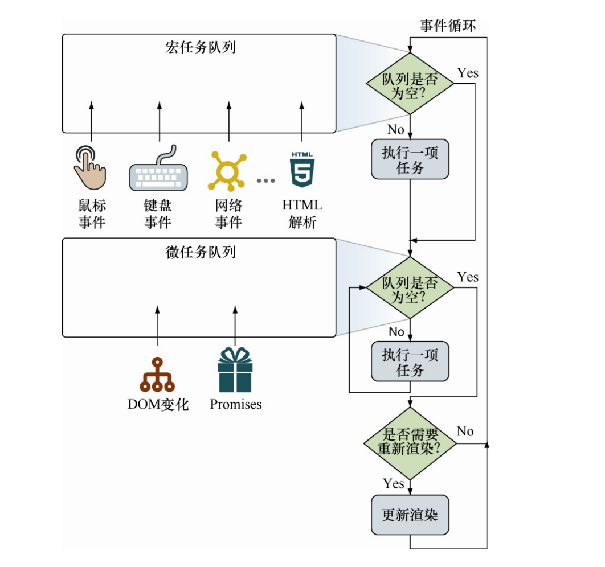
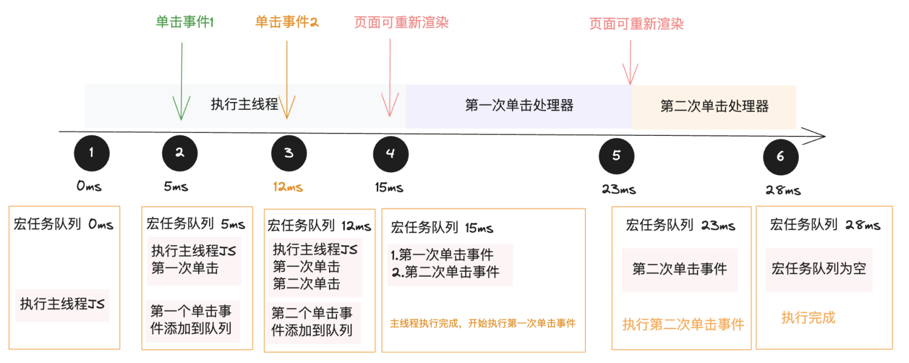
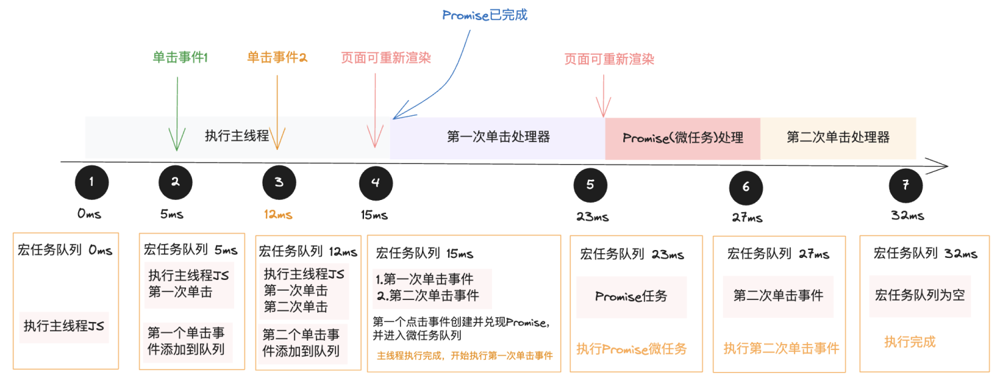
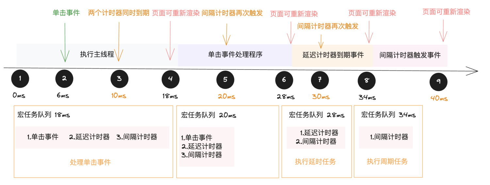

# JavaScript 事件

## 事件循环

事件循环不仅仅包含事件队列，而是具有至少两个队列，除了事件，还要保持浏览器执行的其他操作，这些操作被称为任务，分别是宏任务与微任务。

宏任务主要包括创建主文档对象，解析 HTML，执行主线程 JavaScript 代码，输入、点击事件，网络事件，定时器事件等。从浏览器的角度来看，宏任务代表一个离散的、独立工作单元，一个宏任务运行完成后，浏览器可以继续其他调度(如重新渲染页面或执行垃圾回收等)。

微任务是更小的任务。微任务更新应用程序的状态，但是必须在浏览器任务继续执行其他任务之前执行(即在重新渲染 UI 之前执行)，避免不必要的 UI 重绘，UI 重绘会使应用程序的状态不连续。

**事件循环的两个基本原则：**

- 一次处理一个任务
- 一个任务开始后直到运行完成，不会被其他任务中断。

事件循环通常至少需要两个任务队列(宏任务和微任务)，两种任务队列在同一时刻都只能执行一个任务，如下图所示：

在一次迭代中，事件循环将首先检查宏任 务队列，如果宏任务等待，则立即开始执行宏任务。直到该任务运行完 成（或者队列为空），事件循环将移动去处理微任务队列。如果有任务 在该队列中等待，则事件循环将依次开始执行，完成一个后执行余下的 微任务，直到队列中所有微任务执行完毕。
:::warning 注意点
处理宏任务和微任务队列之间的区别：单次循环迭代中，最多处理一个宏任务（其余的在队列中等待），而队列中的所有微任务都会被处理。
:::

当微任务队列处理完成并清空时，事件循环会检查是否需要更新 UI 渲染，如果需要就会重新渲染 UI 视图，此次迭代结束，继续检查宏任务队列，开始新的一轮事件循环。

### 仅含宏任务的示例

由于 JavaScript 的执行是单线程的，因此一次只能执行一个任务，所有任务都必须在队列中排队等待执行的时机。看如下示例：

```jsx
const handleBtn1 = () => {
  // 第一个按钮的点击事件处理器
}

const handleBtn2 = () => {
  // 第二个按钮的点击事件处理器
}

return (
  <>
    <button onClick={handleBtn1}>按钮1</button>
    <button onClick={handleBtn2}>按钮2</button>
  </>
)
```

假设：

- 主线程 JavaScript 代码需要执行 15ms
- 第一个单击事件处理器需要执行 8ms
- 第二个单击事件处理器需要执行 5ms
- 用户在代码执行 5ms 时单击第一个按钮，在 12ms 单击第二个按钮


根据上面的假设，主线程需要执行 15ms,由于 JavaScript 单线程，一次只能执行一个任务并且不会被中断，当在 5ms 单击事件的时候并不会立即执行，而是会将该事件处理器加入到任务队列中，等到被执行；在 12ms 单击第二个事件同样的会被添加到队列中。

- 在 15ms 时，主线程 JavaScript 代码执行完成，任务开始转向微任务队列，但是在本例中不存在微任务，则直接到重新渲染这个步骤，事件循环完成了一次，开始继续到宏任务队列中查找是否还有任务。
- 此时开始执行第一次单击任务。这个单击任务需要执行 8ms,执行完成后继续查找是否有微任务，微任务还是空的，则直接到重新渲染页面步骤，第二次事件循环完成。
- 在 23ms 开启第三次事件循环， 执行第二次单击事件，需要执行 5ms,执行完成后查找微任务还是为空，重新渲染页面，第三次事件循环完成，至此整个事件循环执行结束。

### 包含宏任务和微任务的示例

```jsx
const handleBtn1 = () => {
  // 第一个按钮的点击事件处理器
  promise.resolve().then(() => {
    console.log('微任务')
  })
}

const handleBtn2 = () => {
  // 第二个按钮的点击事件处理器
}

return (
  <>
    <button onClick={handleBtn1}>按钮1</button>
    <button onClick={handleBtn2}>按钮2</button>
  </>
)
```

这个示例与上面唯一的区别就是在第一个单击事件的时候创建了一个微任务，假设需要执行 4ms。

在 15ms 的时候，主程序 JavaScript 代码执行完成，事件循环会检查微任务队列，此时微任务队列为空，则页面可以重新渲染，开始进入下一个事件循环，即第一次单击处理事件，在这个单击事件中，创建了一个微任务，微任务进入微任务队列，当执行完 8ms 后，开始检查微任务队列，此时微任务队列中有正在等待被执行的任务，于是开始执行微任务，执行 4ms 后，微任务队列为空，页面重新渲染，进入下一次事件循环。

## 定时器机制

:::tip 前言
在看 `JavaScript 忍者秘籍`的时候，刚好看到计时器这一节，看完一遍之后感觉不是特别好理解，因此在这里对计时器机制进行详细的解析，一方面可以加深自身的理解，另一方面也希望能够帮助大家更好的阅读。
:::

在详细了解定时器机制之前，先看一下浏览器提供的两种创建计时器的方法以及清空计时器的方法：

| 方法          | 语法                      | 描述                                                                                 |
| ------------- | ------------------------- | ------------------------------------------------------------------------------------ |
| setTimeout    | id = setTimeout(fn,delay) | 启动一个计时器，在指定的延迟时间结束时执 行一次回调函数，返回标识计时器的唯一值      |
| clearTimeout  | clearTimeout(id)          | 当指定的计时器尚未触发时，取消（消除）计时器                                         |
| setInterval   | id = setTimeout(fn,delay) | 启动一个计时器，按照指定的延迟间隔不断执行回调函数，直至取消。返回标识计时器的唯一值 |
| clearInterval | clearInterval(id)         | 取消（消除）指定的计时器                                                             |

:::warning 注意点
定时器的时间间隔设为 0，也会有几毫秒的延迟。无法确保计时器延迟的时间。
:::

### 执行线程中的定时器

```jsx
setTimeout(function timeoutHandler() {
  /*Some timeout handle code that runs for 6ms*/
}, 10) //注册10ms后延迟执行函数

setInterval(function intervalHandler() {
  /*Some interval handle code that runs for 8ms*/
}, 10) //⇽--- 注册每10ms执行的周期函数

const myButton = document.getElementById('myButton')
myButton.addEventListener('click', function clickHandler() {
  /*Some click handle code that runs for 10ms*/
}) // ⇽--- 为按钮单击事件注册事件处理器

return <button id="myButton"></button>
```

上面这段代码中，注册了两个计时器（分别是延迟计时器和间隔计时器），延迟 10ms，接着又注册了一个单击事件处理器。假设延迟执行回调函数需要执行 6ms,间隔执行回调函数需要执行 8ms,单击事件处理器需要执行 10ms,因此上例中的代码需要运行 18ms。

假设用户在程序执行 6ms 的时候，快速单击按钮，队列中第一个任务是执行主线程 JavaScript 代码，我们上面已经知道，主线程代码大概执行 18ms，根据 JS 单线程特性，当线程正在执行状态的时候，有异步事件触发时会先排队，并且在线程空闲的时候才会开始执行。在主线程 JavaScript 代码执行的过程中：

1. 在 0ms 时，延迟计时器延迟 10ms 执行，间隔计时器间隔 10ms 执行，计时器的引用保存在浏览器中。
2. 在 6ms 时，单击鼠标，单击事件任务被添加到队列中。
3. 在 10ms 时，延迟计时器到期，间隔计时器的第一个时间间隔触发。

由于 JS 单线程特性，在主程序执行的时候，异步事件触发时会先排队。根据这个特性我们知道，在 6ms 时触发了单击事件，它被添加进队列中，在 10ms 的时候，延迟计时器和间隔计时器分别被添加进队列中排队等候线程空闲的时候执行。

此时队列中的排队顺序为：**单击事件处理器 -> 延迟计时器处理器 -> 间隔计时器处理器**

- 在 18ms 之后，主线程 JavaScript 代码执行完，此时宏任务队列中有三个任务正在等待被执行，根据先进先出的规则，此时单击事件处理器开始执行（假设需要耗时 10ms）。

`setInterval 的调用被废弃：`在单击事件处理程序执行的过程中，间隔计时器又会被触发一次，但是间隔计时器的实例已经在队列中等待被执行，因此该触发会被终止（因为浏览器不会同时创建两个相同的间隔计时器）。

单击事件在 28ms 执行完成，在第 28ms 时，事件循环进行下一次迭代，执行延迟计时器任务。

- 在 28ms 时，执行延迟计时器。假设延迟计时处理器需要执行 6ms，那么在 34ms 结束执行。
- 34ms 时，间隔计时处理器开始执行，此时距离添加到队列时相差 24ms。

执行过程图如下所示：


:::warning 注意点
计时器提供一种异步延迟执行代码片段的能力，至少要延迟指定的毫秒数，由于 JavaScript 单线程的本质，我们只能控制计时器何时被添加进队列中，无法控制计时器何时被执行。

正如上面的示例一样，我们指定了延迟计时器和间隔计时器都是延迟 10ms 执行，但是 js 是单线程的，主线程正在执行的时候，异步宏任务会被添加进队列中，等待线程空闲的时候才能开始执行，因此延迟计时器在 28ms 时才开始执行，间隔计时器在 34ms 才开始执行，与预期的执行时间有一定的差距。
:::

### 总结

- JS 是单线程的，事件执行需要根据先进先出原则排队执行。
- 定时器无法保证回调函数在指定的时间间隔内执行，我们只能控制计时器何时被添加进队列中，无法控制计时器何时能被执行。
- setInterval 的调用被废弃。
