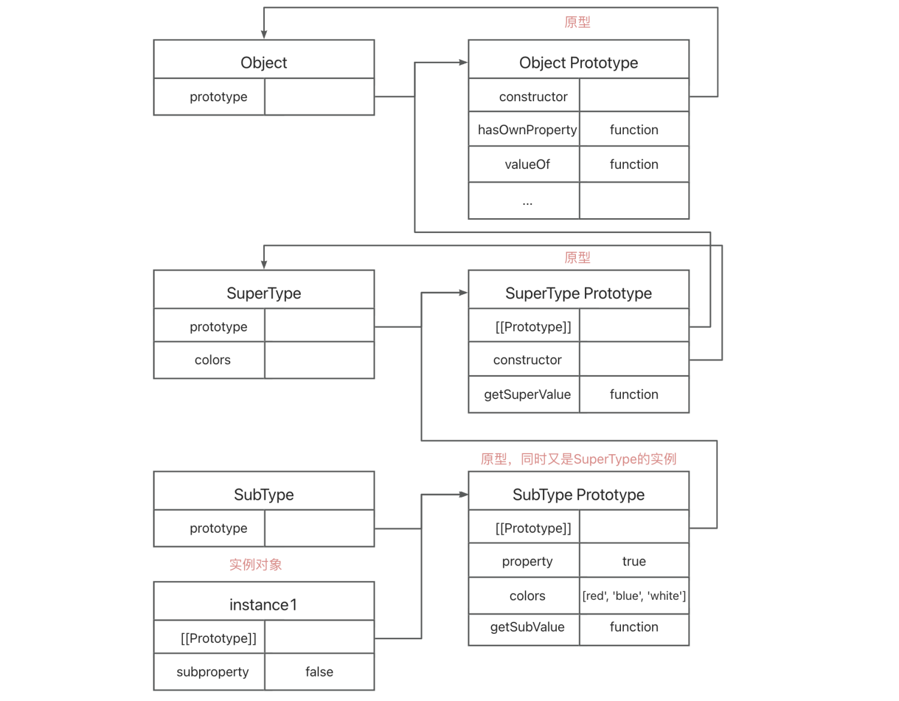
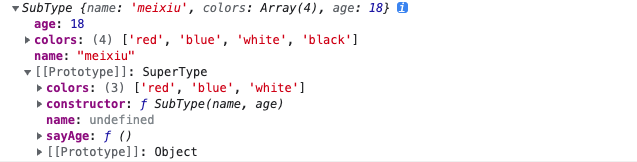

# 继承

继承是面向对象编程语言中一个最为人津津乐道的概念，许多面向对象编程语言都支持以下两种继承方式：

- **接口继承**：只继承方法签名
- **实现继承**：继承实际的方法

由于函数没有签名，因此在`ECMAScript`中无法实现接口继承，它只支持实现继承，而且其实现继承主要是依靠**原型链**来实现的。

## 原型链继承

`ECMAScript`将原型链作为实现继承的主要方法，即利用原型让一个引用类型继承另一个引用类型的属性和方法。

**构造函数、原型和实例的关系**：

- 每个构造函数都有一个原型对象，且原型对象都有一个属性`constructor`，指向这个构造函数；
- 实例对象都有一个`__proto__`属性（即一个内部指针），指向原型对象；

如果让原型对象等于另一个类型的实例，那么此时的原型对象也有一个包含指向另一个原型的指针，相应地，另一个原型中也包含着一个指向另一个构造函数的指针，另一个原型又是另一个函数的实例，以此层层递进，就构成了实例与原型的链条，这就是原型链的基本概念。

:::tip 原型链继承
原型链继承的本质就是复制，即重写原型对象，代之以一个新类型的实例。
:::

```js
// 定义一个构造函数SuperType
function SuperType() {
  this.property = true
  this.colors = ['red', 'blue', 'white']
}

// 给SuperType的原型添加一个方法
SuperType.prototype.getSuperValue = function () {
  return this.property
}

// 定义另外一个构造函数SubType
function SubType() {
  this.subProperty = false
}

// 继承SuperType
// 通过创建SuperType的实例，并将该实例赋给SubType的原型（即SubType.prototype）来实现继承
SubType.prototype = new SuperType()

// 给SubType.prototype添加方法
SubType.prototype.getSubValue = function () {
  return this.subProperty
}

// 创建一个实例对象
const instance1 = new SubType()
instance1.colors.push('black')
console.log(instance1.getSuperValue()) // true
console.log(instance1.colors) // ['red', 'blue', 'white', 'black']

// 创建另外一个实例对象
const instance2 = new SubType()
console.log(instance2.getSuperValue()) // true
// 引用类型值的原型属性会被所有实例共享
console.log(instance2.colors) // ['red', 'blue', 'white', 'black']
```

这个例子的实例、构造函数与原型之间的关系用图表示如下所示：


SubType 继承了 SuperType，而 SuperType 继承了 Object。

上图中，SubType 的原型没有使用默认的原型，而是一个新原型（即 SuperType 的实例），因此这个原型拥有 SuperType 实例所拥有的全部属性和方法，而且其也有一个属性`__proto__`(内部指针)，指向 SuperType 的原型。最终的指向结果就是：

instance1 指向 SubType 的原型（SubType.prototype），SubType 的原型又指向 SuperType 的原型(SuperType.prototype)，SuperType 的原型指向 Object 的原型(Object.prototype)，最后 Object 的原型指向 null。

:::warning 原型链的缺点

- 包含引用类型值的原型属性会被所有实例共享
- 在创建子类型的实例时，不能向超类型的构造函数中传递参数
  :::

## 借用构造函数继承（伪造对象或经典继承）

:::tip 借用构造函数继承
在子类型构造函数的内部调用父类型构造函数（等同于复制父类的实例给子类），而不使用原型。

借用构造函数继承有以下两个优点：

- 包含引用类型值的原型属性不会被所有实例共享，即每个实例都有自己实例属性的副本
- 可以在子类型构造函数中向父类型构造函数传递参数
  :::

```js
// 定义一个构造函数
function SuperType() {
  this.colors = ['red', 'blue', 'white']
}

// 定义另外一个构造函数
function SubType() {
  // 继承SuperType
  // 实际上是在（未来将要）新创建的SubType实例的环境下调用SuperType构造函数
  SuperType.call(this)
}

// 创建一个实例对象
const instance1 = new SubType()
instance1.colors.push('black')
console.log(instance1.colors) // ['red', 'blue', 'white', 'black']

// 创建另外一个实例对象
const instance2 = new SubType()
// 包含引用类型值的原型属性没有被实例共享
console.log(instance2.colors) // ['red', 'blue', 'white']
```

:::warning 借用构造函数继承的问题

- 函数无法复用（因为方法都在构造函数中定义）
- 只能继承父类的实例属性和方法，不能继承原型属性和方法
  :::

## 组合继承（伪经典继承）

:::tip 组合继承（伪经典继承）
组合继承是指将原型链和借用构造函数继承组合到一起，从而发挥二者职场的一种继承模式——使用原型链实现对原型属性和方法的继承，通过借用构造函数继承来实现对实例属性的继承。

优点：弥补了原型链和借用构造函数的不足，是 JavaScript 中使用最多的继承模式。而且组合继承也保留了 instanceof 操作符和 isPrototypeOf() 方法识别合成对象的能力
:::

```js
// 定义一个构造函数
function SuperType(name) {
  this.name = name
  this.colors = ['red', 'blue', 'white']
}

// 原型方法
SuperType.prototype.sayName = function () {
  console.log(this.name)
}

// 定义另外一个构造函数
function SubType(name, age) {
  // 继承属性
  SuperType.call(this, name)
  // 定义自己的属性
  this.age = age
}

// 继承方法
SubType.prototype = new SuperType()
SubType.prototype.constructor = SubType
SubType.prototype.sayAge = function () {
  console.log(this.age)
}

// 创建一个实例对象
const instance1 = new SubType('meixiu', 18)
instance1.colors.push('black')
console.log(instance1.colors) // ['red', 'blue', 'white', 'black']
instance1.sayName() // meixiu
instance1.sayAge() // 18

// // 创建另外一个实例对象
const instance2 = new SubType('Bruce', 18)
console.log(instance2.colors) // ['red', 'blue', 'white']
instance2.sayName() // Bruce
instance2.sayAge() // 18
```

:::warning 缺点
由于调用了两次父类的构造函数，导致父类中的实例属性和方法既存在于子类的实例中又存在于子类的原型中
:::


组合继承中，SubType 调用了两次父类的构造函数，因此在子类的实例和原型中都有父类中的实例属性和方法。

## 原型式继承

:::tip 原型式继承
原型式继承的基本思想就是利用一个空对象作为中介，将某个对象直接赋值给空对象构造函数的原型。

ES5 Object.create 的模拟实现，将传入的对象作为创建的对象的原型。
:::

```js
function object(obj) {
  // 创建一个临时性构造函数
  function F() {}
  // 将传入的对象作为这个构造函数的原型
  F.prototype = obj
  // 返回这个临时构造函数的一个实例
  return new F()
}
```

本质上说，object()对传入的对象执行了一次浅复制，将构造函数 F 的原型直接指向传入的对象。举个例子 🌰：

```js
const person = {
  name: 'Nicholas',
  friends: ['Shelby', 'Court', 'Van']
}

const anotherPerson = object(person)
anotherPerson.name = 'Greg'
anotherPerson.friends.push('Rob')

const yetAnotherPerson = object(person)
yetAnotherPerson.name = 'Linda'
yetAnotherPerson.friends.push('Barbie')

console.log(person.friends) //['Shelby', 'Court', 'Van', 'Rob', 'Barbie']
```

:::warning 原型式继承缺点
其实和原型链继承的缺点一样

- 引用类型属性会被所有实例共享，其中一个实例进行修改时会影响其他实例
- 无法传递参数
  :::

在 ECMAScript5 中新增的`Object.create()`方法能够替代上面的 object()方法。

```js
const person = {
  name: 'Nicholas',
  friends: ['Shelby', 'Court', 'Van']
}

const anotherPerson = Object.create(person)
anotherPerson.name = 'Greg'
anotherPerson.friends.push('Rob')

const yetAnotherPerson = Object.create(person)
yetAnotherPerson.name = 'Linda'
yetAnotherPerson.friends.push('Barbie')

console.log(person.friends) //['Shelby', 'Court', 'Van', 'Rob', 'Barbie']
```

## 寄生式继承

:::tip 寄生式继承
寄生式继承是在原型式继承的基础上，创建一个仅用于封装继承过程的函数，该函数在内部以某种方式来增强对象，最后再像真的它做了所有工作一样返回对象。

简单理解就是在内部以某种方式增强对象，最后返回对象。
:::

```js
function createAnother(original) {
  var clone = object(original) // 通过调用 object() 函数创建一个新对象
  clone.sayHi = function () {
    // 以某种方式来增强对象
    console.log('hi')
  }
  return clone // 返回这个对象
}
```

使用 createAnother()函数：

```js
const person = {
  name: 'Nicholas',
  friends: ['Shelby', 'Court', 'Van']
}
const anotherPerson = createAnother(person)
anotherPerson.sayHi() //"hi"
```

上述例子中，基于 person 返回了一个新对象 anotherPerson，这个对象不仅有 person 的属性和方法，还有自己的属性和方法。

:::warning 缺点

- 函数无法复用而降低效率（因为使用对象来为其添加方法）
- 无法传递参数
- 每次创建对象都会创建一遍方法
  :::

## 寄生组合式继承

:::tip 寄生组合式继承
寄生组合式继承是通过借用构造函数来继承属性，通过原型链的混成形式来继承方法。本质上，就是使用寄生式继承来继承父类型的原型，然后再将结果指定给子类型的原型。

优点：只调用一次父类构造函数，并且因此避免了在父类原型上面创建不必要的、多余的属性。与此同时原型链还能保持不变；因此还能够正常使用 `instanceof` 和 `isPrototypeOf`
:::

```js
function inheritPrototype(subType, superType) {
  var prototype = Object.create(superType.prototype) // 创建对象，创建父类原型的一个副本
  prototype.constructor = subType // 增强对象，弥补因重写原型而失去的默认的constructor 属性
  subType.prototype = prototype // 指定对象，将新创建的对象赋值给子类的原型
}

// 父类初始化实例属性和原型属性
function SuperType(name) {
  this.name = name
  this.colors = ['red', 'blue', 'green']
}
SuperType.prototype.sayName = function () {
  alert(this.name)
}

// 借用构造函数传递增强子类实例属性（支持传参和避免篡改）
function SubType(name, age) {
  SuperType.call(this, name)
  this.age = age
}

// 将父类原型指向子类
inheritPrototype(SubType, SuperType)

// 新增子类原型属性
SubType.prototype.sayAge = function () {
  alert(this.age)
}

var instance1 = new SubType('xyc', 23)
var instance2 = new SubType('lxy', 23)

instance1.colors.push('2') // ["red", "blue", "green", "2"]
instance2.colors.push('3') // ["red", "blue", "green", "3"]
```

:::tip
这是最成熟的方法，也是现在库实现的方法
:::

## ES6 类继承 extends

`ES6`引入了 class 关键字，使得开发者可以更方便的使用面向对象的方式编写代码。`ES6`的 class 可以看作是一个语法糖，它的绝大部分功能`ES5`都可以做到，新的 class 写法只是让对象原型的写法更加清晰、更像面向对象编程的语法。

:::tip ES6 类继承 extends
class 可以通过 extends 关键字实现继承，在类声明或类表达式中，创建一个类，让子类继承父类的属性和方法。
:::

```js
class Rectangle {
  constructor(width, height) {
    this.width = width
    this.height = height
  }

  get area() {
    return this.width * this.height
  }

  calcArea() {
    return this.width * this.height
  }
}

const rectangle = new Rectangle(10, 10)
console.log(rectangle.area) // 100
console.log(rectangle.calcArea()) // 100

// 继承
class Square extends Rectangle {
  constructor(length) {
    super(length, length)
    this.name = 'Square'
  }
  get area() {
    return this.width * this.height
  }
}

const square = new Square(10)
console.log(square.area) // 100
console.log(square.calcArea()) // 100
```

extends 继承的核心代码如下所示，它和寄生组合式继承方式一样：

```js
function _inherits(subType, superType) {
  // 创建对象，创建父类原型的一个副本
  // 增强对象，弥补因重写原型而失去的默认的constructor 属性
  // 指定对象，将新创建的对象赋值给子类的原型
  subType.prototype = Object.create(superType && superType.prototype, {
    constructor: {
      value: subType,
      enumerable: false,
      writable: true,
      configurable: true
    }
  })

  if (superType) {
    Object.setPrototypeOf
      ? Object.setPrototypeOf(subType, superType)
      : (subType.__proto__ = superType)
  }
}
```

## 总结

- `ECMAScript`无法只支持实现继承，且其实现继承主要依靠原型链实现的。
- **原型链继承**：原型链继承的本质就是复制，即重写原型对象，代之以一个新类型的实例。
- **借用构造函数继承**：在子类型构造函数的内部调用父类型构造函数（等同于复制父类的实例给子类），而不使用原型。
- **组合继承**：使用原型链实现对原型属性和方法的继承，通过借用构造函数继承来实现对实例属性的继承。
- **原型式继承**：利用一个空对象作为中介，将某个对象直接赋值给空对象构造函数的原型。
- **寄生式继承**：在内部以某种方式增强对象，最后返回对象。
- **寄生组合式继承**：通过借用构造函数来继承属性，通过原型链的混成形式来继承方法。本质上，就是使用寄生式继承来继承父类型的原型，然后再将结果指定给子类型的原型。
- **ES6 类继承 extends**：class 可以通过 extends 关键字实现继承，在类声明或类表达式中，创建一个类，让子类继承父类的属性和方法。

## 参考文档及书籍

- JavaScript 高级程序设计
- [JavaScript 常用八种继承方案](https://github.com/yygmind/blog/issues/7)
