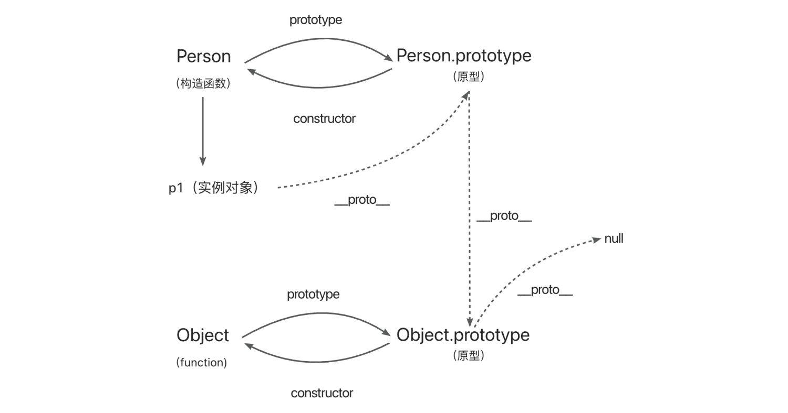

# 原型与原型链

::: tip 背景
原型和原型链是 JavaScript 中非常重要的概念，也是比较难理解和混淆的一个知识点。

不过理解和掌握了它不仅能帮你巩固 JavaScript 知识，还能让你在面试中脱颖而出。如果你有兴趣，就跟着我一起走进原型与原型链的世界吧~
:::

## 前言

::: tip Q1
对于一切皆对象你怎么理解？
:::
关于怎么理解一切皆对象之前，我们先看一下 typeof 这个操作符检测的类型
| **类型** | **typeof 检测的结果** |
| :-------: | :-------------------: |
| Undefined | undefined |
| String | string |
| Number | number |
| Boolean | boolean |
| Symbol | symbol |
| BigInt | bigint |
| Function | function |
| **Null** | **object** |
| 其他对象 | object |

从上面这个表格中我们可以知道，typeof 检测数据类型的时候，对于值类型（undefined，string，number，boolean，symbol，bigint）它不是对象，剩下的（引用类型）都是对象包括 null。
因此对于一切皆对象这句话，我们可以这样理解，一切引用类型都是对象，对象是属性的集合。

要判断一个变量是不是对象，值类型可以直接使用 typeof 操作符判断，引用类型我们可以通过 instanceof 来判断，如下所示：

```js
// 普通函数
const fn = () => {}
// 构造函数
function Fn() {}
// 实例对象
const f1 = new Fn()

console.log(fn instanceof Object) // true
console.log(f1 instanceof Object) // true

console.log(typeof fn, typeof f1) // function object
```

`疑问❓`：既然函数也是对象，那么为什么在 typeof function 的时候不是 object，而是 function 呢？直接叫 object 不行嘛~

带着这个疑问我们来看下第二个问题

::: tip Q2
函数与对象是什么关系？
:::
对象都是函数创建的，函数也是一种对象。要想真正理解这句话，我们先看一个属性 prototype。

## prototype

在 JavaScript 中，每个函数都有一个属性 prototype，prototype 这个属性的值是一个对象，默认情况下 prototype 这个对象只有一个 constructor 属性，指向这个函数本身。

举个 🌰：

```js
// 定义一个构造函数Person
function Person(name) {
  this.name = name
}
// 创建一个实例
const p1 = new Person('meixiu')
```


如上图所示，Person 这个构造函数有一个 prototype 属性，指向它的原型(Person.prototype),这个原型对象有一个 constructor 属性，指向构造函数 Person 本身。

现在我们给构造函数添加自定义的属性

```js
// 定义一个构造函数Person
function Person(name) {
  this.name = name
}
Person.prototype.city = '杭州'
Person.prototype.age = 18
// 创建一个实例
const p1 = new Person('meixiu')
console.log(p1.name, p1.age, p1.city) //meixiu 18 杭州
```

在 Person 构造函数中，已经有一个 name 属性，同时我们在它的原型上添加了两个属性，分别是 age 和 city，p1 对象是从 Person 构造函数中 new 出来的，此时我们打印 p1 对象的属性，可以看到它能够取到 Person.prototype 对象上的属性，即我们的实例对象可以调用原型对象上的属性（实例对象可以共享原型对象上的属性）。

## constructor

每一个原型对象都有一个 `constructor` 属性，指向函数本身。

```js
function Person(name) {
  this.name = name
}
console.log(Person.prototype) // {constructor: ƒ}
console.log(Person.prototype.constructor === Person) //true
```

## `__proto__`

每个对象都有一个隐藏的属性`__proto__`，成为隐式原型，指向创建该对象的函数的原型。

```js
function Person(name) {
  this.name = name
}
const p1 = new Person('meixiu')

console.log(Person.prototype) // {constructor: ƒ}
console.log(p1.__proto__) // {constructor: ƒ}
console.log(p1.__proto__ === Person.prototype) //true
```


`Person.prototype`和`p1.__proto__`的属性值是一样的。

问 ❓：我们已经知道每个对象都有一个隐藏的属性`__proto__`，在上图中 Person.prototype 也是一个对象，那么它的`__proto__`指向哪里呢？

它指向的是`Object.prototype`，即 Object 的原型，而`Object.prototype`的`__proto__`指向的是 null。



## instanceof

```js
function Person(name) {
  this.name = name
}
const p1 = new Person('meixiu')

console.log(p1 instanceof Person) // true
console.log(p1 instanceof Object) // true
```

问 ❓：上述代码中，p1 是通过 Person 创建的，但是为什么`p1 instanceof Object`为 true 呢？

要回答这个问题，我们先了解一下 instanceof 的判断规则。

对于上例中的 Person 构造函数，其的原型及其关系如下所示：


### instanceof 判断规则

instanceof 运算符的第一个变量是一个对象，第二个变量一般是一个函数，我们简单的以：A instanceof B 来表示。
那么 instanceof 判断规则可以简单的以如下规则来表示：

1. 沿着 A 的`__proto__`这条线寻找。
2. 沿着 B 的 prototype 这条线寻找。

如果这两条线能够找到同一个引用（即同一对象），那么就返回 true；如果一直到终点还没重合，那么就返回 false。

根据这个规则，我们看图，对于 p1 我们沿着`__proto__`寻找，对于 Person 我们沿着 prototype 寻找，最后找到了它们的共同引用 Person.prototype，即 Person 的原型，因此`p1 instanceof Person`返回 true。对于 Object 我们沿着 prototype 寻找也找到了 Object.prototype，因此`p1 instanceof Object`也返回 true。

接下来回到上面的问题，为什么`p1 instanceof Object`为 true 就一目了然了。

### Object 与 Function

在`JavaScript`中，一切引用类型都是对象，对象是属性的集合。

`Function`构造函数是一个函数对象，其的`__proto__`属性指向了`Function.prototype`.

:::warning Function.prototype 注意点
Function.prototype 是一个函数，但是它没有 prototype，同时 Function.prototype.bind()方法创建的对象也没有 prototype。

```js
console.log(typeof Function.prototype) // function
const fn = Function.prototype.bind()
console.log(fn.prototype) //undefined
```

Function.prototype 是引擎创建出来的函数，引擎认为不需要给这个函数对象添加 prototype 属性，不然 Function.prototype.prototype 将无休无止并且没有存在的意义
:::

同时每个 JavaScript 函数实际上都是一个 Function 对象，即 Function 的实例，所以我们可以看到以下的怪异的现象，举个例子 🌰：

先看一张经典图：


```js
console.log(Object instanceof Function) // true
// 等价于
console.log(Object.__proto__ === Function.prototype) // true

console.log(Function instanceof Function) // true
// 等价于
console.log(Function.__proto__ === Function.prototype) //true

console.log(Function instanceof Object) // true
// 等价于
console.log(Function.__proto__ === Object.prototype) //true
```

结合上图就可以解释上面代码中的怪异现象了。

## 原型链

理解原型链之前，先简单看一段代码：

```js
// 定义一个构造函数Person
function Person(name) {
  this.name = name
}
Person.prototype.city = '杭州'
Person.prototype.age = 18
// 创建一个实例
const p1 = new Person('meixiu')
console.log(p1.name, p1.age, p1.city) //meixiu 18 杭州
```

在这段代码中，我们定义了一个构造函数 Person 和一个实例对象 p1，并且给这个实例对象的原型上添加了两个属性，分别是 city，age，然后打印 p1 的时候，可以发现其也有 city，age 这两个属性，那么它是如何找到找到的呢———从 Person.prototype 来的，因为`p1.__proto__`指向的是 Person.prototype。

再来看一下这张图：


访问一个对象的属性时，先在自身的基本属性中查找，如果没有，就沿着`__proto__`这条链向上查找，一直查找到 null，这个链式结构就被称为原型链。

:::tip `Object.prototype.__proto__ === null`
Object.prototype 是 JavaScript 中所有对象的原型，同时 Object.prototype 也是一个对象，因此它也有原型，它的`__proto__`指向的是 null，即原型的顶层。
因此 `Object.prototype.__proto__ === null`（为了让原型链有终点）
:::

即从这个例子中我们可以引出原型链的知识
:::tip 原型链
每个对象都有一个属性`__proto__`，这个属性指向创建该对象的函数的原型，并从中继承方法和属性，同时这个原型也是一个对象，因此也有`__proto__`属性，也有它所指向的原型，这样一层一层的，直到最终指向 null。这个链式结构就被称为原型链。
:::

## 总结

- 一切引用类型都是对象，对象是属性的集合
- 对象是函数创建的，函数也是一种对象
- 在 JavaScript 中，每个函数都有一个属性 `prototype`，这个属性的值是一个对象，指向函数本身
- 每一个原型对象都有一个 `constructor` 属性，指向函数本身
- 每个对象都有一个隐藏属性`__proto__`，指向创建该对象的函数的原型，同时原型对象也可能有原型，这样一层一层，最终指向 null
- `Function`构造函数是一个函数对象，其的`__proto__`属性指向了`Function.prototype`

## 参考文档

- [深入理解 JavaScript 原型](https://www.cnblogs.com/wangfupeng1988/p/3977924.html)
