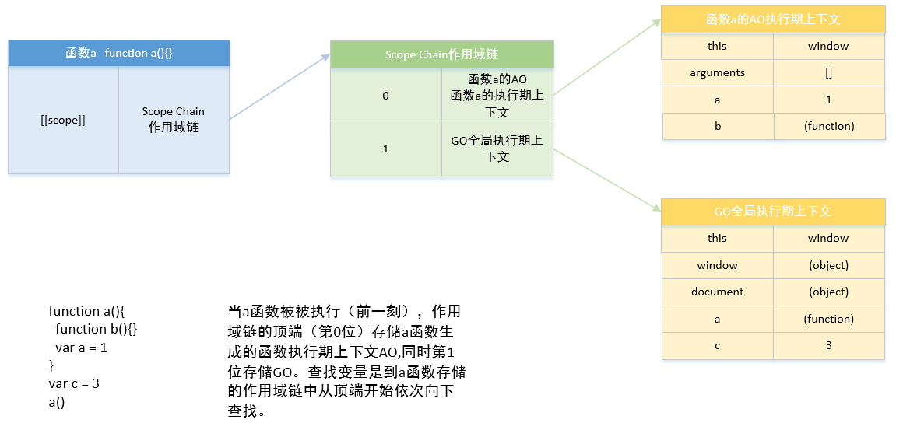
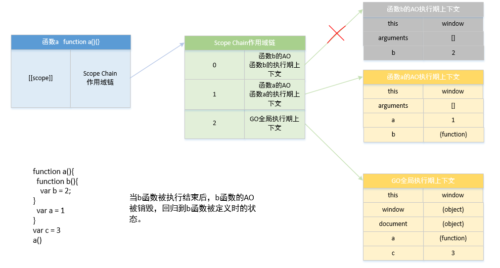

# 作用域浅析

::: tip 背景
几乎所有的编程语言最基本的功能之一就是能够储存变量中的值，并且能在之后对这个值进行访问或修改；事实上，正是这种储存和访问变量的值的能力将状态带给了程序；
但是将变量引入程序有几个需要讨论的问题：

1. 这些变量存储在哪里
2. 程序需要时如何找到它

以上的问题说明需要一套设计良好的规则来存储变量，并且之后可以方便的找到这些变量，这套规则被称为作用域；
:::

## 作用域

### 1.1 编译原理

与传统编译语言相比，`JavaScript` 不是提前编译的，编译结果也不能在分布式系统中进行移植。

传统编译语言执行前编译的三个步骤：

1. 分词/词法分析：这个过程会将由字符组成的字符串分解成有意义的代码块，这些代码块被称为词法单元；
   例如：var a = 2;这段程序通常会被分解成这些词法单元：var、a、=、2、；
   分词和词法分析之间的区别：主要差异在于词法单元的识别是通过有状态和无状态的方式进行的；
   分词和词法分析其实指的是同一件事，“词”在这里不是“word”，而是“token”——带有某种归类的字符串；这字符串叫做“词素”（lexeme）；
   “分词”这个动作是“tokenize”；“词”通过“词法”（lexical grammar）来界定，因而为了完成“分词”的目的，手段就是“词法分析”（lexical analysis）

2. 解析/语法分析：这个过程是将词法单元流（数组）转换成一个由元素逐级嵌套所组成的代表了程序语法结构的树，这个树被称为“抽象语法树”（AST）；
   例如：var a = 2; 的抽象语法树中可能会有一个叫作 VariableDeclaration（变量声明） 的顶级节点，接下来是一个叫作 Identifier(标识符，它的值是 a)的子节点，以及一个叫作 AssignmentExpression（赋值表达式） 的子节点。AssignmentExpression 节点有一个叫作 NumericLiteral(值，它的值是 2)的子节点。
3. 代码生成：将 AST 转换为可执行代码的过程被称为代码生成；抛开具体细节，简单来说就是有某种方法可以将 var a = 2; 的 AST 转化为一组机器指令，用来创建一个叫作 a 的变量(包括分配内存等)，并将一个值储存在变量 a 中。

### 1.2 理解作用域

**引擎**：从头到尾负责整个 JavaScript 程序的编译以及执行过程；

**编译器**：引擎的好朋友，负责语法分析及代码生成等脏活累活；

**作用域**：引擎的另一位好朋友，负责收集并维护由所有声明的标识符——也就是变量，所组成的一系列查询，并实施一套非常严格的规则，确定当前执行的代码对这些标识符的访问权限。
以 var a = 2;这段代码为例，编译器首先会将这段程序分解成词法单元，然后将词法单元解析成一个树结构；
遇到 var a 时，编译器会询问作用域是否有一个该名称的变量存在于同一个作用域的集合中，如果已经存在过，就会忽略该声明，否则它会要求作用域在当前作用域的集合中声明一个新的变量，并命名为 a;

接下来，编译器会为引擎生成运行时所需的代码，这些代码被用来处理 a=2 这个赋值操作；引擎运行时会询问作用域是否存在一个称为 a 的变量，如果存在，引擎就会使用这个变量，否则，引擎会继续查找该变量；如果引擎找到了 a 变量，就会将 2 赋值给它；否则引擎就会抛出一个异常；

**总结**：变量的赋值操作会执行两个动作，首先编译器会在当前作用域中声明一个变量（之前没有声明过），然后在运行时引擎会在作用域查找该变量，如果能找到就对它赋值；

#### js 预编译

js 运行三步曲：

1. 语法分析
2. 预编译
3. 解释执行

在执行完 JavaScript 的语法分析之后，就会进入全局预编译环节

##### 预编译步骤

全局预编译的三个步骤：

1. 创建 GO 对象（Global Object）全局对象
2. 找变量声明，将变量名作为 GO 属性名，值为 undefined
3. 查找函数声明，作为 GO 属性，值赋予函数体

如果执行过程中遇到函数，就会触发局部预编译，函数的局部预编译发生在函数执行前一刻；

局部预编译的 4 个步骤：

1. 创建 AO 对象（Activation Object）执行器上下文
2. 找形参和变量声明，将变量和形参名作为 AO 属性名，值为 undefined
3. 将实参值和形参值统一
4. 在函数体里面找函数声明，值赋予函数体

示例：

:::details

```js
a = 1
function test(e) {
  function e() {}
  arguments[0] = 2
  console.log(e) // 2
  if (a) {
    // 此位置a为undefined
    var b = 3
  }
  var c
  a = 4
  var a
  console.log(b) // undefined
  f = 5
  console.log(c) // undefined
  console.log(a) // 4
}
var a
test(1)
console.log(a) // 1
console.log(f) // 5
```

:::

- **第一步**：全局预编译
  （1）创建 GO 对象
  （2）找变量声明，将变量名作为 GO 对象的属性名，值为 undefined
  （3）找函数声明，作为 GO 属性
  
- **第二步**：解释执行（ 从上往下依次执行，遇到函数时，首先会在函数执行的前一刻创建 AO 对象）,执行 test(1)的前一刻，会创建 test()的执行上下文 AO 对象
- **第三步**：局部预编译
  （1）创建 AO 对象
  （2）找形参和变量声明，将变量名和形参名作为 GO 对象的属性名，值为 undefined
  （3）将实参值和形参值统一
  （4）在函数体里面找函数声明，值赋予函数体
  
- **第四步**：解释执行

```js
 AO = {
 e:function e(){} => 2, （e 被赋值为 2）
 b:undefined,
 c:undefined,
 a:undefined => 4,
 }
 上述中 b 只声明未被赋值，因为在
 if(a){ // 此位置 a 为 undefined
 var b = 3;
 }
```

这段代码中，a 也是 undefined，条件为假，因此 b=3;的赋值语句未被执行，故 b 还是 undefined；

- **第五步**：因为 f = 5 中 f 未声明直接赋值，因此会被放在全局 GO 对象中

```js
  GO = {
  a:undefined => 1
  test:function test(){}, //test()执行前一刻，创建 test 的 AO 对象
  f:5
  }
```

代码编译执行图解：


#### 执行栈

:::tip 执行栈
执行栈，也叫调用栈，具有 LIFO（后进先出）结构，用于存储在代码执行期间创建的所有执行上下文。
:::

首次运行 JS 代码时，会创建一个全局执行上下文并 Push 到当前的执行栈中。每当发生函数调用，引擎都会为该函数创建一个新的函数执行上下文并 Push 到当前执行栈的栈顶。

根据执行栈 LIFO 规则，当栈顶函数运行完成后，其对应的函数执行上下文将会从执行栈中 Pop 出，上下文控制权将移到当前执行栈的下一个执行上下文。

```js
function skulk(ninja) {
  report(ninja + ' skulking')
} //⇽--- 一个函数调用另外一个函数 }
function report(message) {
  console.log(message)
} //⇽--- 通过内置的console.log方法发送消息
skulk('Kuma')
skulk('Yoshi') //⇽--- 在全局中分别调用两个函数
```


执行上下文的行为：

1. 每个 `JavaScript` 程序只创建一个全局执行上下文，并从全局执行 上下文开始执行(在单页应用中每个页面只有一个全局执行上下文)。 当执行全局代码时，全局执行上下文处于活跃状态。
2. 首先在全局代码中定义两个函数:skulk 和 report，然后调用 skulk("Kuma")。由于在同一个特定时刻只能执行特定代码，所以 `JavaScript` 引擎停止执行全局代码，开始执行带有 Kuma 参数的 skulk 函数。创建新的函数执行上下文，并置入执行上下文栈的顶部。
3. skulk 函数进而调用 report 函数。又一次因为在同一个特定时刻只 能执行特定代码，所以，暂停 skulk 执行上下文，创建新的 Kuma 作为参数的 report 函数的执行上下文，并置入执行上下文栈的顶部。
4. report 通过内置函数 console.log(详见附录 B)打印出消息后， report 函数执行完成，代码又回到了 skulk 函数。report 执行上下文从执行上下文栈顶部弹出，skulk 函数执行上下文重新激活，skulk 函数继续执行。
5. skulk 函数执行完成后也发生类似的过程：skulk 函数执行上下文从栈顶端弹出，重新激活一直在等待的全局执行上下文并恢复执行。 `JavaScript` 的全局代码恢复执行。

执行栈示例二 🌰：

```js
function a() {
  function b() {
    var b = 2
  }
  var a = 1
  b()
}
var c = 3
a()
```

全局预编译，a 函数被定义时，创建全局执行上下文(GO)：


a 函数被执行前一刻（此时 b 函数被定义）,创建 a 函数的执行期上下文（位于作用域链的顶端）：


函数 b 被执行前一刻，创建 b 函数的执行期上下文（位于作用域链顶端）：


当 b 函数被执行结束后，b 函数的 AO 被销毁，回归到 b 函数被定义时的状态。此时作用域链的顶端为函数 a 的执行期上下文。


当 a 函数被执行结束时，a 函数的 AO 被销毁的同时，b 函数的`[[scope]]`也将不存在，a 函数回归到被定义时的状态。此时其他函数的执行期上下文都被销毁，作用域链顶端为 GO 全局执行期上下文。


### 1.3 LHS 和 RHS 查询

LHS 和 RHS 的含义是“赋值操作的左侧和右侧”，但并不一定意味着就是“=赋值操作符的左侧和右侧”；RHS 查询与简单地查找某个变量的值别无二致，而 LHS 查询则是试图找到变量的容器本身，从而可以对其赋值；
LHS:赋值操作的目标是谁，RHS：谁是赋值操作的源头；

例如 🌰：a = 2；这里对 a 的引用就是 LHS 引用，因为我们只想为“=2”这个赋值找到一个目标；

```js
function foo(a) {
  console.log(a + b)
  b = a
}
foo(2) // ReferenceError: b is not defined
```

上述代码中有两处 `LHS` 查询：

1. 将 2 作为参数赋值给 a
2. 将 a 赋值给 b 即(b=)

3 处 `RHS` 查询：

1. 查找 foo()
2. foo()函数里查找 a
3. foo()函数里查找 b

#### 查找规则

- 当 `RHS` 在所有嵌套的作用域中寻找不到所需的变量，就会报 `ReferenceError` 错误；
- 当执行 `LHS` 时，如果在顶层作用域也无法找到目标变量，在非严格模式下，会在全局作用域中创建一个同名变量，在严格模式下会报一个 `ReferenceError` 错误；
- 如果 `RHS` 查找到了变量，但是对这个变量进行了不合理的操作，比如对一个非函数值进行函数调用，那么会报出 `TypeError` 错误；

在上述的例子中，第一次对 b 进行 `RHS` 查询时时无法找到该变量，因为在任何相关的作用域中都无法找到它，如果在所有嵌套的作用域中都无法找到该变量，那么引擎就会抛出 `ReferenceError` 错误；

### 小结

作用域是一套规则，用于确定在何处以及如何查找变量（标识符）；如果查找的目的是对变量进行赋值，那么就会使用 `LHS` 查询；如果目的是获取变量的值，就会使用 `RHS` 查询；

## 词法作用域

词法作用域意味着作用域是由书写代码时函数声明的位置来决定的；编译的词法分析阶段基本能够知道全部标识符在哪里以及是如何声明的，从而能够预测在执行过程中如何对它们进行查找；

### 欺骗词法

#### eval()

`eval()`函数可以接受一个字符串作为参数，并将其中的内容视为好像在书写时就存在于程序中这个位置的代码；

当执行 `eval(...)`之后的代码时，引擎并不知道前面的代码是以动态形式插入进来的，并对词法作用域进行修改的，引擎还是会像往常一样进行词法作用域查找；

```js
function foo(str, a) {
  eval(str) // 欺骗!
  console.log(a, b)
}
var b = 2
foo('var b = 3;', 1) // 1, 3
```

在上述代码中，`eval("var b = 3;")`中的"var b = 3;"会像这段代码就在这个位置一样被执行，因此在这里创建了一个 b 变量并赋值为 3，此时已经对词法作用域进行了修改，当执行 console.log(a,b)时，会在 foo()函数内部找到 a 和 b，但是无法找到外部的变量 b，因此最终输出的结果是 1，3，而不是 1，2；

#### with

```js
function foo(obj) {
  with (obj) {
    a = 2
  }
}
var o1 = {
  a: 3
}
var o2 = {
  b: 3
}
foo(o1)
console.log(o1.a) // 2
foo(o2)
console.log(o2.a) // undefined
console.log(a) // 2——不好，a 被泄漏到全局作用域上了!
```

这个例子中创建了 o1 和 o2 两个对象。其中一个具有 a 属性，另外一个没有。foo(..) 函数接受一个 obj 参数，该参数是一个对象引用，并对这个对象引用执行了 with(obj) {..}。 在 with 块内部，我们写的代码看起来只是对变量 a 进行简单的词法引用，实际上就是一个 `LHS` 引用，并将 2 赋值给它。

当我们将 o1 传递进去，a=2 赋值操作找到了 o1.a 并将 2 赋值给它，这在后面的 console. log(o1.a) 中可以体现。而当 o2 传递进去，o2 并没有 a 属性，因此不会创建这个属性， o2.a 保持 undefined。

但是可以注意到一个奇怪的副作用，实际上 a = 2 赋值操作创建了一个全局的变量 a;

## 函数作用域和块作用域

### 3.1 函数中的作用域

函数作用域的含义是指，属于这个函数的全部变量都可以在整个函数的范围内使用及复用（事实上在嵌套的作用域中也可以使用）；
在任意代码片段外部添加包装函数，可以将内部的变量和函数定义“隐藏”起来，外部作用域无法访问包装函数内部的任何内容；

### 3.2 函数作用域

**函数声明和函数表达式**的区别：
`function` 如果出现在声明的第一个词，那么它就是一个函数声明，否则是一个函数表达式；

对于函数表达式你最熟悉的场景可能就是回调参数了，比如 🌰:

```js
setTimeout(function () {
  console.log('I waited 1 second!')
}, 1000)
```

这叫作匿名函数表达式，因为 `function()..`没有名称标识符。函数表达式可以是匿名的，而函数声明则不可以省略函数名——在 `JavaScript` 的语法中这是非法的。 匿名函数表达式书写起来简单快捷，很多库和工具也倾向鼓励使用这种风格的代码。但是它也有几个缺点需要考虑。

1. 匿名函数在栈追踪中不会显示出有意义的函数名，使得调试很困难。
2. 如果没有函数名，当函数需要引用自身时只能使用已经过期的 arguments.callee 引用， 比如在递归中。另一个函数需要引用自身的例子，是在事件触发后事件监听器需要解绑自身。
3. 匿名函数省略了对于代码可读性/可理解性很重要的函数名。一个描述性的名称可以让 代码不言自明。

### 立即执行函数

```js
var a = 2
;(function IIFE(def) {
  def(window)
})(function def(global) {
  var a = 3
  console.log(a) // 3
  console.log(global.a) // 2
})
```

### 块作用域

块作用域是一个用来对之前的最小授权原则进行扩展的工具，将代码从在函数中隐藏信息扩展为在块中隐藏信息；

```js
for (var i = 0; i < 10; i++) {
  console.log(i)
}
```

上述代码我们在 for 循环的头部直接定义了变量 i，通常是因为只想在 for 循环内部的上下文中使用 i，而忽略了 i 会被绑定在外部作用域(函数或全局)中的事实。

```js
var foo = true
if (foo) {
  var bar = foo * 2
  bar = something(bar)
  console.log(bar)
}
```

上述代码中，虽然 bar 变量定义在 if 块内部，但是使用 var 声明的变量，它都属于外部作用域中；

#### with

用 with 从对象中创建出的作用域仅在 with 声明中而非外部作用域中有效。

```js
function buildUrl() {
  let queryString = '?name=Bruce'
  with (location) {
    let url = href + queryString
  }
  return url //不能访问url
}
```

在上面的代码中，with 语句将 location 对象作为上下文，因此 location 会被添加到作用域链前端，在 with 语句中的代码引用变量 href 时，实际上引用的是 location.href，在引用 queryString 时，引用的是定义在 buildUrl()函数中的变量。在 with 语句中，使用 let 声明的变量 url 将被限制在块级作用域，在 with 块的外部不能访问到 url

#### try/catch

```js
try {
  undefined() // 执行一个非法操作来强制制造一个异常
} catch (err) {
  console.log(err) // 能够正常执行!
}
console.log(err) // ReferenceError: err not found
```

err 仅存在 catch 内部，当在外部访问 err 时会抛出错误；

#### let

let 关键字可以将变量绑定到所在的任意作用域中(通常是{...})；

#### const

const 同样可以创建块作用域变量，但其值是固定的，之后任何试图修改值得操作都会引起错误；
