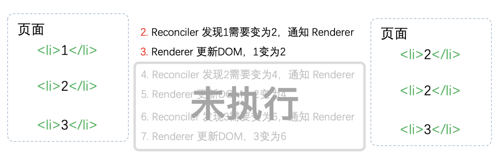
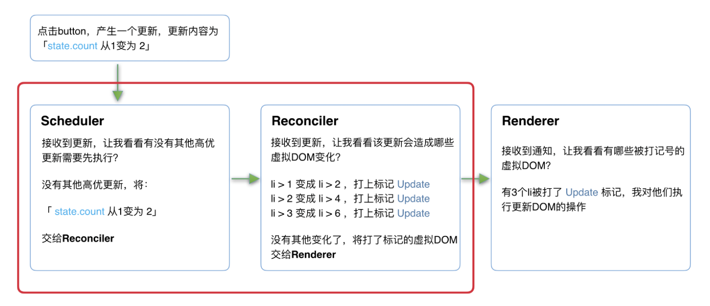

# React 基础知识

## React 理念

React 是一个用于构建用户界面的 JavaScript 库。当你使用 React 构建用户界面时，你首先会把它分解成一个个 组件，然后，你需要把这些组件连接在一起，使数据流经它们。

:::tip
JavaScript 是单线程的，浏览器是多线程的。
:::
相信基本每位前端开发者都听说过这句经典名言，JavaScript 是单线程的，决定了它一次只能执行一个任务；而浏览器是多线程的，它不仅要处理 JS 线程，还需要处理 GUI 渲染线程，定时器触发线程(处理 setTimeout/setInterval 定时器)，事件处理，网络请求等各种线程。

JavaScript 是单线程的，在 JavaScript 执行期间会阻塞 UI 的渲染，当 JavaScript 脚本执行之间太长或者网络很慢的时候就可以看到页面长时间时无响应的，这其实就是 GUI 渲染线程与 JS 引擎线程是互斥导致的。既然互斥会导致页面崩溃，那为什么要设计浏览器的 GUI 线程和 JS 引擎线程是互斥的呢？

:::tip 为什么 GUI 渲染线程与 JS 引擎线程是互斥的？
主要原因就是 JS 可以操作 DOM。

当 JS 被执行的时候，GUI 渲染线程就会被挂起，等待 JS 引擎执行完毕空闲的时候再执行。如果 GUI 渲染线程与 JS 引擎线程同时进行，由于 JS 是可以操作 DOM 的，假设在 JS 执行的过程中，渲染线程已经将一张图片渲染完毕，此时 JS 又将这张图片删除了，这样就导致了不必要的渲染，或者是其他的样式错乱，渲染混乱或重复等问题，甚至可能导致页面崩溃，因此 GUI 渲染线程与 JS 引擎线程必须是互斥的。
:::

主流浏览器刷新频率为 60Hz，即每（1000ms / 60Hz）16.6ms 浏览器刷新一次。由于 GUI 渲染线程与 JS 线程是互斥的。所以 JS 脚本执行和浏览器布局、绘制不能同时执行。因此在每次刷新的时候(16.6ms)需要完成一下工作：

- js 脚本执行
- 样式布局
- 样式绘制

如果 JS 执行时间过长，超出了 16.6ms，可能就会导致页面无响应(即样式布局和样式绘制没有时间执行)。

## React 架构

### React15 架构

React15 架构主要分为两层：

- Reconciler（协调器）：负责找出变化的组件
- Renderer（渲染器）： 负责将变化的组件渲染到页面上

每当有更新发生的时候，Reconciler 会做以下工作：

- 调用 render 方法，将返回的 JSX 转化为虚拟 DOM
- 将虚拟 DOM 和上次更新时的虚拟 DOM 对比
- 通过对比找出本次更新中变化的虚拟 DOM
- 通知 Renderer 将变化的虚拟 DOM 渲染到页面上

在每一次更新发生的时候，`Renderer` 会接受到 `Reconciler` 的通知，重新渲染变化的组件。

#### React15 架构的缺点

在 `Reconciler` 中，mount 的组件会调用 `mountComponent` (opens new window)，update 的组件会调用 `updateComponent` (opens new window)。这两个方法都会递归更新子组件。

递归更新会导致以下问题：

由于递归执行，所以更新一旦开始，中途就无法中断。当层级很深时，递归更新时间超过了 16ms，用户交互就会卡顿。

那么要如何解决这个问题呢？

答案：在浏览器每一帧的时间中，预留一些时间给 JS 线程，React 利用这部分时间更新组件（可以看到，在源码 (opens new window)中，预留的初始时间是 5ms）。当预留的时间不够用时，React 会中断这次 JS 的执行，将线程控制权交还给浏览器使其有时间渲染 UI，React 则等待下一帧时间到来继续被中断的工作，这样浏览器就有剩余时间执行样式布局和样式绘制，减少掉帧的可能性。

其实关键就是将同步的更新变为异步的更新。

举个 🌰：

假设点击按钮时，count 由 1 变为 2



由于 Reconciler 和 Renderer 是交替工作的，当第一个 li 完成更新时中断更新（**实际上 React15 并没有实现中断的异步更新**），此时后面的步骤未执行，用户看到的页面是 223，而不是期望的 246。因此之后又对 React 进行了重构。

### React 16 架构

React16 架构可以分为三层：

- Scheduler（调度器）：调度任务的优先级，高优任务优先进入 Reconciler
- Reconciler（协调器）: 负责找出变化的组件
- Renderer（渲染器）:负责将变化的组件渲染到页面上

从上可以看到，和 React15 相比，多了一个 Scheduler(调度器).

#### Scheduler(调度器)

在 react15 的时候，我们已经分析了其的缺点，并提出了解决方案，即需要一种机制，判断浏览器是否有剩余时间从而通知我们。

其实浏览器已经实现了这个 API，[requestIdleCallback](https://developer.mozilla.org/zh-CN/docs/Web/API/Window/requestIdleCallback),但是因为它浏览器兼容性差，触发频率不稳定，react 放弃使用它，而是实现了一个更加完备的`requestIdleCallbackpolyfill`,就是**Scheduler**。Scheduler 除了会在空闲时触发回调的功能外，还提供了多种调度优先级任务设置。

#### Reconciler（协调器）

在 React15 中 Reconciler 是递归处理虚拟 DOM 的。而在 React16 中，更新工作从递归变成了可以中断的循环过程。每次循环都会调用 shouldYield 判断当前是否有剩余时间。

```js
/** @noinline */
function workLoopConcurrent() {
  // Perform work until Scheduler asks us to yield
  while (workInProgress !== null && !shouldYield()) {
    workInProgress = performUnitOfWork(workInProgress)
  }
}
```

另外，我们还知道，如果中断循环的话，可能会存在 DOM 渲染不完全的问题，那么在 React16 中又是如何解决的呢？

在 `React16` 中，`Reconciler` 与 `Renderer` 不再是交替工作。当 `Scheduler` 将任务交给 `Reconciler` `后，Reconciler` 会为变化的虚拟 DOM 打上代表增/删/更新的标记，类似这样：

```js
export const Placement = /*             */ 0b0000000000010
export const Update = /*                */ 0b0000000000100
export const PlacementAndUpdate = /*    */ 0b0000000000110
export const Deletion = /*              */ 0b0000000001000
```

整个 `Scheduler` 与 `Reconciler` 的工作都在内存中进行。只有当所有组件都完成 `Reconciler` 的工作，才会统一交给 `Renderer`。

#### Renderer（渲染器）

`Renderer` 根据 `Reconciler` 为虚拟 DOM 打的标记，同步执行对应的 DOM 操作。

React16 架构的更新流程：


其中红框中的步骤随时可能由于以下原因被中断：

- 有其他更高优任务需要先更新
- 当前帧没有剩余时间

由于红框中的工作都在内存中进行，不会更新页面上的 DOM，所以即使反复中断，用户也不会看见更新不完全的 DOM。

## Fiber 架构

在 React 的架构中，我们提到过虚拟 DOM，其实在 React16 之后，它有了一个新的称呼(`Fiber`).在 React15 及其以前，`Reconciler`采用递归的方式创建虚拟 DOM,在递归的过程中不能中断，如果遇到组件树的层级很深，那么递归可能会占用线程的时间导致卡顿，然而这种递归虚拟 DOM 的数据结构不能解决现有问题(将递归重构为异步可中断更新可能会导致页面渲染的结果与预期不一致)。于是，在 React16 之后，产生了 Fiber 架构。

### Fiber 是什么

1. 作为架构来说，之前 React15 的 Reconciler 采用递归的方式执行，数据保存在递归调用栈中，所以被称为 stack Reconciler。React16 的 Reconciler 基于 Fiber 节点实现，被称为 Fiber Reconciler。
2. 作为静态的数据结构来说，每个 Fiber 节点对应一个 React element，保存了该组件的类型（函数组件/类组件/原生组件...）、对应的 DOM 节点等信息。
3. 作为动态的工作单元来说，每个 Fiber 节点保存了本次更新中该组件改变的状态、要执行的工作（需要被删除/被插入页面中/被更新...）。

### 双缓存 Fiber 树

在 React 中最多会同时存在两棵 Fiber 树。当前屏幕上显示内容对应的 Fiber 树称为 `current Fiber` 树，正在内存中构建的 Fiber 树称为 `workInProgress Fiber` 树。

`current Fiber` 树中的 Fiber 节点被称为 `current fiber`，`workInProgress Fiber` 树中的 Fiber 节点被称为 `workInProgress fiber`，他们通过 alternate 属性连接。

```js
currentFiber.alternate === workInProgressFiber
workInProgressFiber.alternate === currentFiber
```

当 `workInProgress Fiber` 树构建完成交给 Renderer 渲染在页面上后，应用根节点的 current 指针指向 `workInProgress Fiber` 树，此时 `workInProgress Fiber` 树就变为 `current Fiber` 树。每次状态更新都会产生新的 `workInProgress Fiber` 树，通过 current 与 workInProgress 的替换，完成 DOM 更新。

## React 源码目录结构

在 React16 架构那里已经提到过，React16 的架构分为三层：

- Scheduler（调度器）：调度任务的优先级，高优任务优先进入 Reconciler
- Reconciler（协调器）: 负责找出变化的组件
- Renderer（渲染器）:负责将变化的组件渲染到页面上

那么在源码中，这些层次是如何体现的呢，接下来让我们一起来看看。

顶层目录(除去一些配置文件及隐藏文件夹，主要就是一下三个)

```markdown
根目录
├── fixtures # 包含一些给贡献者准备的小型 React 测试项目
├── packages # 包含元数据（比如 package.json）和 React 仓库中所有 package 的源码（子目录 src）
├── scripts # 各种工具链的脚本，比如 git、jest、eslint 等
```

React 架构源码在 packages 目录下，我们重点关注 packages

- **react 文件夹**：React 的核心，包含所有全局的 React API。如 **React.createElement**，**React.Component**，**React.Children** 等。

- **scheduler 文件夹**：Scheduler（调度器）的实现。

- **react-reconciler 文件夹**：一边对接 Scheduler，一边对接不同平台的 Renderer，构成了整个 React16 的架构体系。

- **Renderer 相关的文件夹**

```markdown
- react-art
- react-dom # 注意这同时是 DOM 和 SSR（服务端渲染）的入口
- react-native-renderer
- react-noop-renderer # 用于 debug fiber（后面会介绍 fiber）
- react-test-renderer
```
