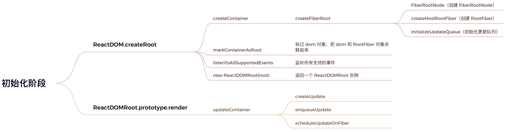
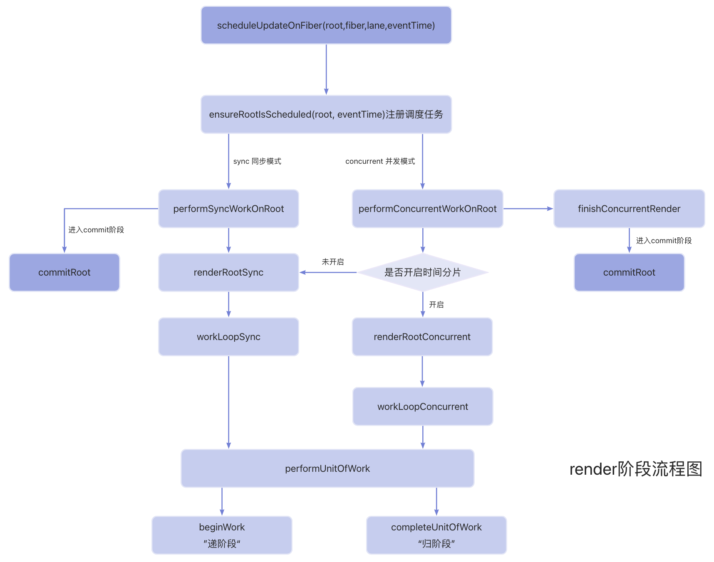
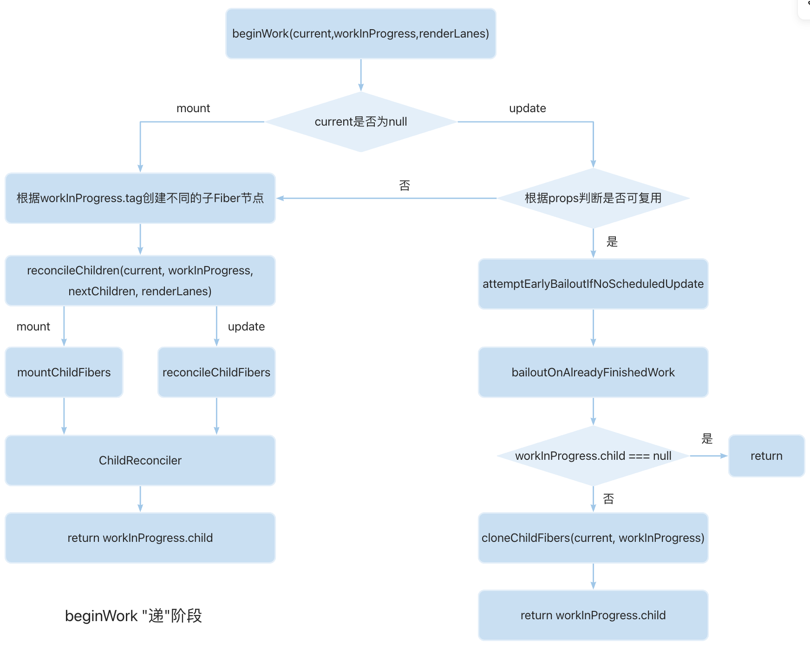
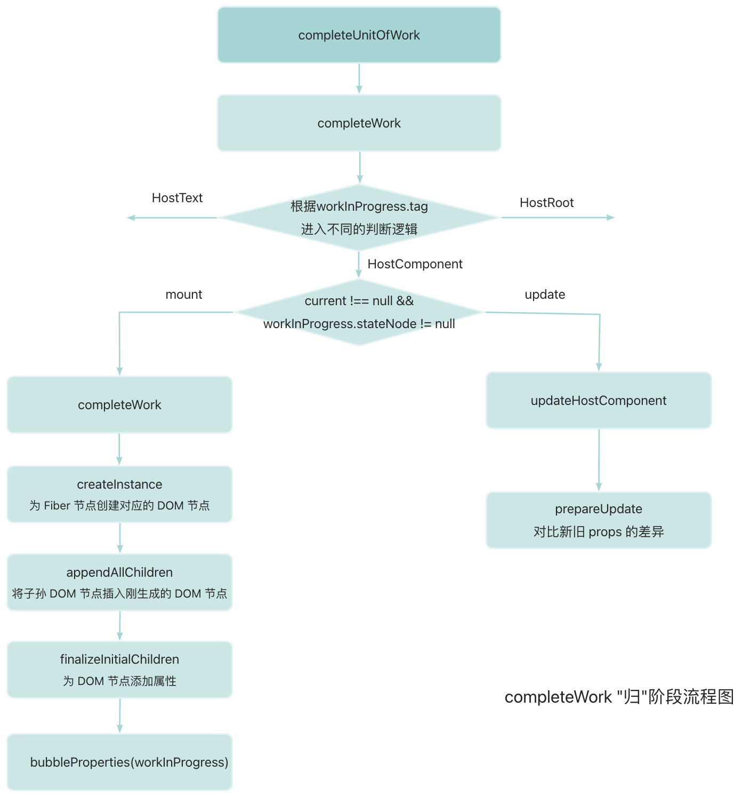

# React 18 渲染流程

在上一节的[源码基础](https://meix.netlify.app/fe/react/)中已经介绍了 React 架构以及 Fiber 架构，本节将主要讲解的是 React 的渲染流程。

## 初始化阶段



React 的初始化以下面这段代码开始：

```jsx
import React from 'react'
import ReactDOM from 'react-dom/client'
import App from './App.jsx'

ReactDOM.createRoot(document.getElementById('root')).render(<App />)
```

`ReactDOM.createRoot`是 React 应用初始化的入口，进行一些初始化的操作，返回一个 ReactDOMRoot 实例。

render 调用的是`ReactDOMRoot.prototype.render`这个原型方法，用于渲染根组件。

主要的流程如下：

- 校验 container 是否合法
- 处理 options 参数
- 创建 FiberRootNode 和 RootFiber，初始化更新队列
- 标记 DOM 对象，把 DOM 和 RootFiber 对象关联起来
- 监听支持的事件
- 返回 ReactDOMRoot 实例

### ReactDOM.createRoot

`createRoot`

:::details createRoot

```js
export function createRoot(
  container: Element | Document | DocumentFragment,
  options?: CreateRootOptions
): RootType {
  // 校验容器元素 container 是否合法
  if (!isValidContainer(container)) {
    throw new Error('createRoot(...): Target container is not a DOM element.')
  }

  let isStrictMode = false // 是否是严格模式
  let concurrentUpdatesByDefaultOverride = false // 是否允许并发更新
  let identifierPrefix = '' // 标识符前缀
  let onRecoverableError = defaultOnRecoverableError // 错误处理函数
  let transitionCallbacks = null // 过渡回调函数

  // 处理 options 参数
  if (options !== null && options !== undefined) {
    // ...
  }

  // 创建 FiberRootNode  和 RootFiber，初始化更新队列
  const root = createContainer(
    container,
    ConcurrentRoot,
    null,
    isStrictMode,
    concurrentUpdatesByDefaultOverride,
    identifierPrefix,
    onRecoverableError,
    transitionCallbacks
  )

  /**
   * 标记 dom 对象，把 dom 和 RootFiber 对象关联起来
   * 将 root.current 挂载到 container 的 _reactRootContainer 属性上
   *
   * export function markContainerAsRoot(hostRoot: Fiber, node: Container): void {
   *  node[internalContainerInstanceKey] = hostRoot;
   * }
   */
  markContainerAsRoot(root.current, container)

  const rootContainerElement: Document | Element | DocumentFragment =
    container.nodeType === COMMENT_NODE ? (container.parentNode: any) : container

  // 监听所有支持的事件
  listenToAllSupportedEvents(rootContainerElement)

  // 返回一个 ReactDOMRoot 实例
  return new ReactDOMRoot(root)
}
```

:::

`createContainer`
:::details createContainer

```js
export function createContainer(
  containerInfo: Container,
  tag: RootTag,
  hydrationCallbacks: null | SuspenseHydrationCallbacks,
  isStrictMode: boolean,
  concurrentUpdatesByDefaultOverride: null | boolean,
  identifierPrefix: string,
  onRecoverableError: (error: mixed) => void,
  transitionCallbacks: null | TransitionTracingCallbacks
): OpaqueRoot {
  const hydrate = false
  const initialChildren = null
  return createFiberRoot(
    containerInfo,
    tag,
    hydrate,
    initialChildren,
    hydrationCallbacks,
    isStrictMode,
    concurrentUpdatesByDefaultOverride,
    identifierPrefix,
    onRecoverableError,
    transitionCallbacks
  )
}
```

:::

`createFiberRoot`
:::details createFiberRoot

```js
export function createFiberRoot(
  containerInfo: any,
  tag: RootTag,
  hydrate: boolean,
  initialChildren: ReactNodeList,
  hydrationCallbacks: null | SuspenseHydrationCallbacks,
  isStrictMode: boolean,
  concurrentUpdatesByDefaultOverride: null | boolean,
  identifierPrefix: string,
  onRecoverableError: null | ((error: mixed) => void),
  transitionCallbacks: null | TransitionTracingCallbacks
): FiberRoot {
  // 创建 FiberRootNode
  const root: FiberRoot = (new FiberRootNode(
    containerInfo,
    tag,
    hydrate,
    identifierPrefix,
    onRecoverableError
  ): any)
  if (enableSuspenseCallback) {
    root.hydrationCallbacks = hydrationCallbacks
  }

  if (enableTransitionTracing) {
    root.transitionCallbacks = transitionCallbacks
  }

  // 创建 RootFiber
  const uninitializedFiber = createHostRootFiber(
    tag,
    isStrictMode,
    concurrentUpdatesByDefaultOverride
  )

  // 设置 FiberRootNode 的 current 属性为 RootFiber
  root.current = uninitializedFiber
  // 设置 RootFiber 的 stateNode 属性为 FiberRootNode
  uninitializedFiber.stateNode = root

  if (enableCache) {
    const initialCache = createCache()
    retainCache(initialCache)

    root.pooledCache = initialCache
    retainCache(initialCache)
    const initialState: RootState = {
      element: initialChildren,
      isDehydrated: hydrate,
      cache: initialCache,
      transitions: null,
      pendingSuspenseBoundaries: null
    }
    uninitializedFiber.memoizedState = initialState
  } else {
    const initialState: RootState = {
      element: initialChildren,
      isDehydrated: hydrate,
      cache: null, // not enabled yet
      transitions: null,
      pendingSuspenseBoundaries: null
    }
    uninitializedFiber.memoizedState = initialState
  }

  // 初始化更新队列
  initializeUpdateQueue(uninitializedFiber)

  return root
}
```

:::

`ReactDOMRoot`

```js
function ReactDOMRoot(internalRoot: FiberRoot) {
  this._internalRoot = internalRoot
}
```

### render

render 实际上调用的是`ReactDOMRoot.prototype.render`这个原型方法

```js
ReactDOMHydrationRoot.prototype.render = ReactDOMRoot.prototype.render = function (
  children: ReactNodeList
): void {
  const root = this._internalRoot
  if (root === null) {
    throw new Error('Cannot update an unmounted root.')
  }

  // 调用 updateContainer 进行更新
  updateContainer(children, root, null, null)
}
```

`updateContainer`

当初始化工作完成之后，我们调用的 render 方法实际上调用的是`ReactDOMRoot.prototype.render`这个原型方法，而这个原型方法会调用`updateContainer`进行更新

流程：

- createUpdate：创建 update 对象
- enqueueUpdate：将 update 对象添加到更新队列
- scheduleUpdateOnFiber：调度更新（进入 render 阶段）

```js
export function updateContainer(
  element: ReactNodeList,
  container: OpaqueRoot,
  parentComponent: ?React$Component<any, any>,
  callback: ?Function
): Lane {
  const current = container.current
  const eventTime = requestEventTime() // 获取当前时间戳
  const lane = requestUpdateLane(current) // 计算本次更新的优先级

  if (enableSchedulingProfiler) {
    markRenderScheduled(lane)
  }

  const context = getContextForSubtree(parentComponent)
  if (container.context === null) {
    container.context = context
  } else {
    container.pendingContext = context
  }

  // 创建 update 对象
  const update = createUpdate(eventTime, lane)
  // 设置 update 对象的 payload 属性为需要挂载在根节点的组件
  update.payload = { element }

  callback = callback === undefined ? null : callback
  if (callback !== null) {
    update.callback = callback
  }

  // 将 update 对象添加到更新队列
  const root = enqueueUpdate(current, update, lane)
  if (root !== null) {
    // 调度更新（进入 render 阶段）
    scheduleUpdateOnFiber(root, current, lane, eventTime)
    entangleTransitions(root, current, lane)
  }
  // 返回当前更新的优先级
  return lane
}
```

## 渲染(render)阶段

在初始化阶段中，调用了`updateContainer`方法创建 update 对象，并将 update 对象添加到更新队列，接下来会调用`scheduleUpdateOnFiber`进行调度更新(这也是 render 阶段的入口)


<!-- ### scheduleUpdateOnFiber

### ensureRootIsScheduled

### performSyncWorkOnRoot

### performConcurrentWorkOnRoot

### renderRootSync

### renderRootConcurrent

### workLoopSync

### workLoopConcurrent

### performUnitOfWork

### beginWork



### completeUnitOfWork



## commit 阶段 -->
