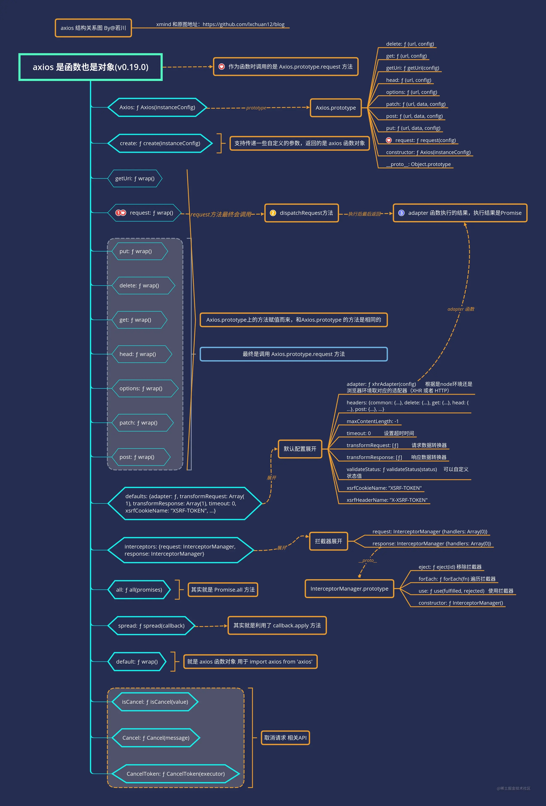

# axios 源码阅读

## 说在前面

:::tip 说在前面
相信每位前端开发者或多或少都用过 axios 这个请求库，也一定再熟悉不过了。对于 axios 的内部实现原理笔者知之甚少，阅读 axios 源码的灵感也是看到了[若川组织的源码共读活动](https://juejin.cn/post/6844904019987529735#heading-0)，因此想要对 axios 的内部实现一探究竟。
:::

## 参考地址

- [github](https://github.com/axios/axios)
- [axios 文档](https://www.axios-http.cn/docs/intro)
- [源码阅读仓库.来源若川](https://github.com/lxchuan12/axios-analysis)

## 调试

chrome 调试浏览器环境的 `axios`

```sh
git clone https://github.com/lxchuan12/axios-analysis
cd axios
npm install
npm run start

# open http://localhost:3000
# chrome F12 source 控制面板  webpack//   .  lib 目录下，根据情况自行断点调试
```

本文是通过 sandbox/client.html 进行调试的。

## axios 结构

打开控制台，在控制台打印一下 axios：

```js
console.log({ axios: axios })
```



## axios 源码分析

看源码的时候首先需要找到入口文件，对于小的项目还好，对于大型框架如 React 和 Vue，源码文件是非常多的，如果不能找到入口文件对于阅读源码是非常吃力的，因此找到入口文件是非常有必要的。

一般入口文件可以到 package.json 文件的 main 字段中查找，这里一般都会声明主入口文件：

```js
{
  "name": "axios",
  "version": "0.19.0",
  "description": "Promise based HTTP client for the browser and node.js",
  "main": "index.js",
  ...
}
```

主入口文件：

```js
module.exports = require('./lib/axios')
```

从主入口文件可以看到，它引入的是 lib/axios，因此找到这个文件。

### lib/axios 主文件

axios.js 主要做的事包括：

- 引入工具函数，如：utils，Axios 构造函数，defaults 默认配置等。
- 创建实例，生成实例对象 axios,axios.create,axios.Axios 等。
- 取消相关 API 实现以及 all，spread，exports（导出）。

#### 引入工具函数相关

```js
// 引入 utils 对象
var utils = require('./utils')
// 引入bind方法
var bind = require('./helpers/bind')
// 引入核心构造函数
var Axios = require('./core/Axios')
// 引入合并配置方法
var mergeConfig = require('./core/mergeConfig')
// 引入默认配置
var defaults = require('./defaults')
```

#### 创建实例相关

```js
/**
 * Create an instance of Axios
 *
 * @param {Object} defaultConfig The default config for the instance
 * @return {Axios} A new instance of Axios
 */
function createInstance(defaultConfig) {
  // new Axios生成一个实例对象
  var context = new Axios(defaultConfig)
  // 调用bind方法改变context的this指向，指向Axios.prototype.request
  // 这也就是为什么调用axios的时候，其实调用的是Axios.prototype.request函数的原因了
  var instance = bind(Axios.prototype.request, context)

  // Copy axios.prototype to instance
  // 复制 Axios.prototype 到实例上。
  // 这也就是为什么会有axios.get方法，且实际上调用的是Axios.prototype.get方法
  // 相当于Axios.prototype有的方法，都可以使用axios. 这种形式调用
  utils.extend(instance, Axios.prototype, context)

  // Copy context to instance
  // 复制 context 到 intance 实例
  // 也就是为什么默认配置 axios.defaults 和拦截器  axios.interceptors 可以使用的原因
  utils.extend(instance, context)

  // 返回实例对象
  return instance
}

// 导出 创建默认实例
var axios = createInstance(defaults)

// 暴露 Axios calss 允许 class 继承
axios.Axios = Axios

// 工厂模式 创建新的实例 用户可以自定义一些参数
axios.create = function create(instanceConfig) {
  return createInstance(mergeConfig(axios.defaults, instanceConfig))
}
```

##### bind 函数

```js
// bind接收两个参数，分别是函数和thisArg指向
module.exports = function bind(fn, thisArg) {
  return function wrap() {
    // 把参数生成数组
    var args = new Array(arguments.length)
    for (var i = 0; i < args.length; i++) {
      args[i] = arguments[i]
    }
    // apply方法接收两个参数，第一个参数是要调用的this参数，第二个参数是函数的参数数组
    // 调用返回参数结构
    return fn.apply(thisArg, args)
  }
}
```

##### extend 函数

extend 函数的主要作用就是复制对象

```js
function extend(a, b, thisArg) {
  forEach(b, function assignValue(val, key) {
    if (thisArg && typeof val === 'function') {
      a[key] = bind(val, thisArg)
    } else {
      a[key] = val
    }
  })
  return a
}
```

其实就是遍历 b 对象，将其复制到 a 对象中，如果是函数的话，就用 bind 调用。

##### forEach 函数

```js
/**
 * Iterate over an Array or an Object invoking a function for each item.
 *
 * If `obj` is an Array callback will be called passing
 * the value, index, and complete array for each item.
 *
 * If 'obj' is an Object callback will be called passing
 * the value, key, and complete object for each property.
 *
 * @param {Object|Array} obj The object to iterate
 * @param {Function} fn The callback to invoke for each item
 */
function forEach(obj, fn) {
  // 判断 null 和 undefined 直接返回
  if (obj === null || typeof obj === 'undefined') {
    return
  }

  // 如果不是对象，放在数组里。
  if (typeof obj !== 'object') {
    /*eslint no-param-reassign:0*/
    obj = [obj]
  }

  // 是数组 则用for 循环，调用 fn 函数。参数类似 Array.prototype.forEach 的前三个参数。
  if (isArray(obj)) {
    // Iterate over array values
    for (var i = 0, l = obj.length; i < l; i++) {
      fn.call(null, obj[i], i, obj)
    }
  } else {
    // 用 for in 遍历对象，但 for in 会遍历原型链上可遍历的属性，所以用 hasOwnProperty 来过滤自身属性了。
    // 其实也可以用Object.keys来遍历，它不遍历原型链上可遍历的属性。
    for (var key in obj) {
      if (Object.prototype.hasOwnProperty.call(obj, key)) {
        fn.call(null, obj[key], key, obj)
      }
    }
  }
}
```

如果对 Object 相关 API 不熟悉的，可以参考我的文章-[JS 对象方法](https://meix.netlify.app/tools/javascript/obj.html)

#### 取消相关 API

```js
// 导出 Cancel 和 CancelToken
axios.Cancel = require('./cancel/Cancel')
axios.CancelToken = require('./cancel/CancelToken')
axios.isCancel = require('./cancel/isCancel')

axios.all = function all(promises) {
  return Promise.all(promises)
}
axios.spread = require('./helpers/spread')

module.exports = axios

//以下的使用默认导出也就是为什么可以使用 import axios from 'axios'; 来引入axios了
module.exports.default = axios
```

#### spread 函数

`spread`是一个用于调用函数和扩展参数数组的语法糖。

对于以下的需求：

```js
function f(x, y, z) {}
var args = [1, 2, 3]
f.apply(null, args)
```

可以直接使用 spread 语法糖实现：

```js
spread(function (x, y, z) {})([1, 2, 3])
```

源码实现如下：

```js
/**
 * @param {Function} callback
 * @returns {Function}
 */
module.exports = function spread(callback) {
  return function wrap(arr) {
    return callback.apply(null, arr)
  }
}
```

### 核心构造函数 Axios.js

```js
/**
 * Create a new instance of Axios
 *
 * @param {Object} instanceConfig The default config for the instance
 */
function Axios(instanceConfig) {
  // 设置默认参数
  this.defaults = instanceConfig
  // 拦截器
  this.interceptors = {
    // 请求拦截器
    request: new InterceptorManager(),
    // 响应拦截器
    response: new InterceptorManager()
  }
}
```

#### Axios.prototype.request

`Axios.prototype.request`实现的步骤如下：

1. 判断第一个参数是否是 string，如果是 string，则设置 url,即支持 axios('example/url', [, config])和 xios({})两种请求方式。
2. 合并默认参数和用户传入的参数
3. 设置请求方法，默认为 get 请求方法
4. 将用户设置的请求和响应拦截器、发送请求的 dispatchRequest 组成 Promise 链，最后返回还是 Promise 实例。也就是保证了请求前拦截器先执行，然后发送请求，再响应拦截器执行这样的顺序。

```js
/**
 * Dispatch a request
 *
 * @param {Object} config The config specific for this request (merged with this.defaults)
 */
Axios.prototype.request = function request(config) {
  /*eslint no-param-reassign:0*/
  // Allow for axios('example/url'[, config]) a la fetch API
  // 下面的代码其实就是相当于可以以axios('example/url'[, config])方式调用，即如果config是string类型，那么第一个参数是url
  if (typeof config === 'string') {
    config = arguments[1] || {}
    config.url = arguments[0]
  } else {
    config = config || {}
  }

  // 合并默认参数和用户传入的参数
  config = mergeConfig(this.defaults, config)

  // Set config.method  设置请求方法，默认是get请求
  if (config.method) {
    config.method = config.method.toLowerCase()
  } else if (this.defaults.method) {
    config.method = this.defaults.method.toLowerCase()
  } else {
    config.method = 'get'
  }

  // Hook up interceptors middleware
  // 组成`Promise`链 ，返回Promise实例
  // 把 xhr 请求 的 dispatchRequest 和 undefined 放在一个数组里
  var chain = [dispatchRequest, undefined]
  // 创建一个请求实例，相当于 new Promise(config)
  var promise = Promise.resolve(config)

  // 遍历所有请求拦截器，放在chain的前面
  this.interceptors.request.forEach(function unshiftRequestInterceptors(interceptor) {
    chain.unshift(interceptor.fulfilled, interceptor.rejected)
  })

  // 遍历所有响应拦截器，push到chain的后面
  this.interceptors.response.forEach(function pushResponseInterceptors(interceptor) {
    chain.push(interceptor.fulfilled, interceptor.rejected)
  })

  // 遍历chain数组，直到遍历chain.length为0
  while (chain.length) {
    promise = promise.then(chain.shift(), chain.shift())
  }

  return promise
}
```

#### dispatchRequest

```js
/**
 * Dispatch a request to the server using the configured adapter.
 *
 * @param {object} config The config that is to be used for the request
 * @returns {Promise} The Promise to be fulfilled
 */
module.exports = function dispatchRequest(config) {
  // 取消相关
  throwIfCancellationRequested(config)

  // Ensure headers exist  确保headers存在
  config.headers = config.headers || {}

  // Transform request data  转换请求的数据
  // transformData 就是遍历数组，调用数组里的传递 data 和 headers 参数调用函数，返回数据。
  config.data = transformData(config.data, config.headers, config.transformRequest)

  // Flatten headers   拍平config.headers
  config.headers = utils.merge(
    config.headers.common || {},
    config.headers[config.method] || {},
    config.headers || {}
  )

  // 删除一些 config.header。  以下这些方法 删除 headers
  utils.forEach(
    ['delete', 'get', 'head', 'post', 'put', 'patch', 'common'],
    function cleanHeaderConfig(method) {
      delete config.headers[method]
    }
  )

  // 返回适配器adapter（Promise实例）执行后 then执行后的 Promise实例。返回结果传递给响应拦截器处理。
  var adapter = config.adapter || defaults.adapter

  return adapter(config).then(
    function onAdapterResolution(response) {
      throwIfCancellationRequested(config)

      // Transform response data
      response.data = transformData(response.data, response.headers, config.transformResponse)

      return response
    },
    function onAdapterRejection(reason) {
      if (!isCancel(reason)) {
        throwIfCancellationRequested(config)

        // Transform response data
        if (reason && reason.response) {
          reason.response.data = transformData(
            reason.response.data,
            reason.response.headers,
            config.transformResponse
          )
        }
      }

      return Promise.reject(reason)
    }
  )
}
```

##### adapter 适配器

```js
var adapter = config.adapter || defaults.adapter
```

根据上述代码的 adapter，用户可以自定义 adapter，没有自定义 adapter 的话，就使用默认的 adapter，接着看 defaults.adapter，即在文件夹：axios/lib/defaults.js

对于浏览器引入 xhr，对于 node 环境则引入 http。

```js
function getDefaultAdapter() {
  var adapter
  if (typeof XMLHttpRequest !== 'undefined') {
    // For browsers use XHR adapter
    adapter = require('./adapters/xhr')
  } else if (
    typeof process !== 'undefined' &&
    Object.prototype.toString.call(process) === '[object process]'
  ) {
    // For node use HTTP adapter
    adapter = require('./adapters/http')
  }
  return adapter
}

var defaults = {
  adapter: getDefaultAdapter()
  ...
}
```

#### 拦截器 InterceptorManager

```js
function InterceptorManager() {
  this.handlers = []
}
```

`handlers`用于存储拦截器函数。另外，它还声明了三个方法，分别是 use,eject,forEach.

##### 拦截器使用

```js
// 添加请求拦截器
axios.interceptors.request.use(
  (config) => {
    return config
  },
  (err) => {
    return Promise.reject(err)
  }
)

// 添加响应拦截器
axios.interceptors.response.use(
  (response) => {
    return response
  },
  (err) => {
    return Promise.reject(err)
  }
)
```

如果想要移除请求拦截器，那么可以使用 eject 方法，如下所示：

```js
const myRequestInterceptors = axios.interceptors.request.use(function () {})
axios.interceptors.request.eject(myRequestInterceptors)
```

##### InterceptorManager.prototype.use

```js
/**
 * Add a new interceptor to the stack
 *
 * @param {Function} fulfilled The function to handle `then` for a `Promise`
 * @param {Function} rejected The function to handle `reject` for a `Promise`
 *
 * @return {Number} An ID used to remove interceptor later  返回ID 是为了用 eject 移除
 */
InterceptorManager.prototype.use = function use(fulfilled, rejected) {
  this.handlers.push({
    fulfilled: fulfilled,
    rejected: rejected
  })
  return this.handlers.length - 1
}
```

传递两个函数作为参数，返回 ID，用于之后 eject 移出。

##### InterceptorManager.prototype.eject

```js
/**
 * Remove an interceptor from the stack
 *
 * @param {Number} id The ID that was returned by `use`
 */
InterceptorManager.prototype.eject = function eject(id) {
  if (this.handlers[id]) {
    this.handlers[id] = null
  }
}
```

根据 use 返回的 ID 移除 拦截器。

##### InterceptorManager.prototype.forEach

```js
/**
 * Iterate over all the registered interceptors
 * @param {Function} fn The function to call for each interceptor
 */
InterceptorManager.prototype.forEach = function forEach(fn) {
  utils.forEach(this.handlers, function forEachHandler(h) {
    if (h !== null) {
      fn(h)
    }
  })
}
```

遍历执行所有拦截器，传递一个回调函数（每一个拦截器函数作为参数）调用，被移除的一项是 null，所以不会执行，也就达到了移除的效果。
