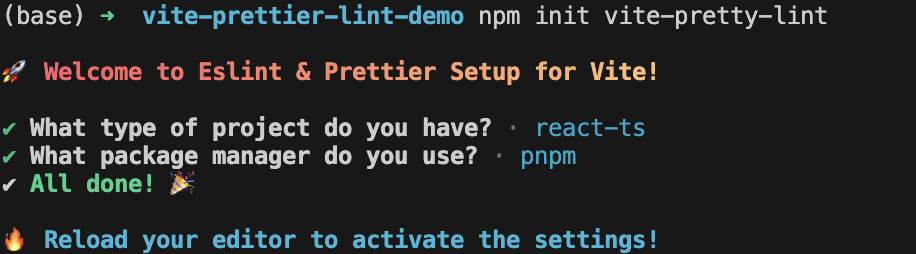
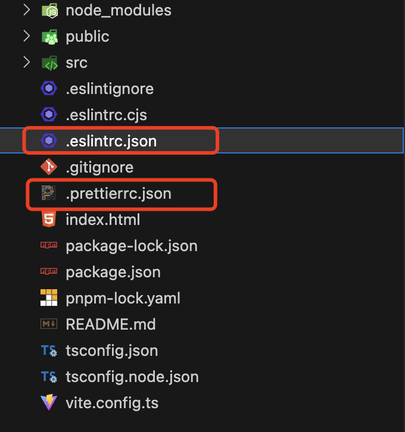
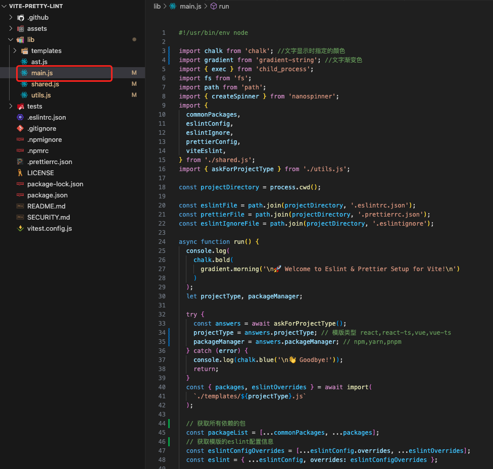

# vite-pretty-lint 源码解析

:::tip ESLint
`Eslint` 主要的工作就是通过静态分析代码快速发现问题，校验并可以自动修复一些错误代码或格式，这对于团队协作非常的方便且是必要的，因为每个人的代码风格或多或少都会存在差异，如果没有对代码风格进行约束，那么后期的维护成本将很大。

`ESLint` 通过遍历 AST，然后再遍历到不同的节点或者合适的时机的时候，触发响应的函数，抛出错误。
:::

在开发一个项目之前，我们往往需要配置 eslint 和 prettier 及相关的依赖，往常的做法就是在项目根目录下创建相关依赖的文件并复制相关规则，而`vite-pretty-lint`可以为 vite 项目自动添加 eslint 和 prettier。

## github 仓库地址

[github](https://github.com/tzsk/vite-pretty-lint)

## 如何使用

```sh
# 创建vite项目
npm init vite

# 执行vite-pretty-lint
npm init vite-pretty-lint

```

不了解 npm init 的可以看我的这篇文章[npm init 初始化项目](https://meix.netlify.app/tools/npm/command.html)

执行`npm init vite-pretty-lint`本质上执行的是`create-vite-pretty-lint`插件,这个插件以交互式的命令让用户选择项目框架类型以及使用的包管理器，最终根据相关的选择下载相关的包，最后生成相应的配置文件。




## 源码目录

```js
|____assets               静态资源目录
|____lib                  源代码
| |____main.js
|____tests                测试代码目录
|____package.json         项目依赖、启动打包命令
|____package-lock.json
|____.gitignore
|____.eslintrc.json       eslint 的配置
|____.eslintignore        eslint 的忽略配置
|____.prettierrc.json     prettier 的配置
|____README.md
```

## package.json

看源码之前，首先查看 package.json 文件，找到 bin(即找到入口文件)，入口文件为 main.js.

## main.js



`main.js`文件中执行的就是一个 run 函数

### run

```js
async function run() {
  // 打印渐变的文字
  console.log(chalk.bold(gradient.morning('\n🚀 Welcome to Eslint & Prettier Setup for Vite!\n')))
  let projectType, packageManager

  try {
    // 通过控制台交互获取我们需要给哪个类型的项目添加插件
    const answers = await askForProjectType()
    projectType = answers.projectType // 模版类型 react,react-ts,vue,vue-ts
    packageManager = answers.packageManager // npm,yarn,pnpm
  } catch (error) {
    console.log(chalk.blue('\n👋 Goodbye!'))
    return
  }
  // 根据选择不同的框架类型获取不同的包以及获取对应的eslint配置
  const { packages, eslintOverrides } = await import(`./templates/${projectType}.js`)

  // 获取所有依赖的包
  // commonPackages:eslint,prettier,eslint-plugin-prettier,eslint-config-prettier,vite-plugin-eslint
  const packageList = [...commonPackages, ...packages]
  // 获取模版的eslint配置信息
  const eslintConfigOverrides = [...eslintConfig.overrides, ...eslintOverrides]
  const eslint = { ...eslintConfig, overrides: eslintConfigOverrides }

  const commandMap = {
    npm: `npm install --save-dev ${packageList.join(' ')}`,
    yarn: `yarn add --dev ${packageList.join(' ')}`,
    pnpm: `pnpm install --save-dev ${packageList.join(' ')}`
  }
  const viteConfigFiles = ['vite.config.js', 'vite.config.ts']

  // 找到vite.config配置文件，如果不存在该配置文件，将其添加到项目根目录下，否则退出执行并抛出错误
  const [viteFile] = viteConfigFiles
    .map((file) => path.join(projectDirectory, file))
    .filter((file) => fs.existsSync(file))

  if (!viteFile) {
    console.log(
      chalk.red('\n🚨 No vite config file found. Please run this command in a Vite project.\n')
    )
    return
  }

  // 1.读取vite.config文件并使用babel.parseSync将其内容解析成ast
  // 2.根据ast树 查找是否已经有了需要添加的配置，有则退出，无则向ast添加需要配置的ast节点
  // 3.通过babel.transformFromAstSync将ast转换为js代码
  const viteConfig = viteEslint(fs.readFileSync(viteFile, 'utf8'))
  // 终端执行子进程
  const installCommand = commandMap[packageManager]

  if (!installCommand) {
    console.log(chalk.red('\n✖ Sorry, we only support npm、yarn and pnpm!'))
    return
  }

  // 下载相关包(通过child_process的exec子进程下载包)
  const spinner = createSpinner('Installing packages...').start()
  exec(`${commandMap[packageManager]}`, { cwd: projectDirectory }, (error) => {
    if (error) {
      spinner.error({
        text: chalk.bold.red('Failed to install packages!'),
        mark: '✖'
      })
      console.error(error)
      return
    }

    // eslintFile:.eslintrc.json
    fs.writeFileSync(eslintFile, JSON.stringify(eslint, null, 2))
    // prettierConfig:.prettierrc.json
    fs.writeFileSync(prettierFile, JSON.stringify(prettierConfig, null, 2))
    // eslintIgnoreFile:.eslintignore
    fs.writeFileSync(eslintIgnoreFile, eslintIgnore.join('\n'))
    // vite.config.js/vite.config.ts:viteConfig
    fs.writeFileSync(viteFile, viteConfig)

    spinner.success({ text: chalk.bold.green('All done! 🎉'), mark: '✔' })
    console.log(chalk.bold.cyan('\n🔥 Reload your editor to activate the settings!'))
  })
}
```

### askForProjectType

enquirer 处理交互式询问用户输入

```js
import enquirer from 'enquirer'

// 控制台命令交互
export function askForProjectType() {
  return enquirer.prompt([
    {
      type: 'select',
      name: 'projectType',
      message: 'What type of project do you have?',
      choices: getOptions()
    },
    {
      type: 'select',
      name: 'packageManager',
      message: 'What package manager do you use?',
      choices: ['npm', 'yarn', 'pnpm']
    }
  ])
}
```

### viteEslint

babel 处理 vite 配置文件

```js
export function viteEslint(code) {
  // 将源码解析成AST树
  const ast = babel.parseSync(code, {
    sourceType: 'module',
    comments: false
  })
  const { program } = ast

  const importList = program.body
    .filter((body) => {
      return body.type === 'ImportDeclaration'
    })
    .map((body) => {
      delete body.trailingComments
      return body
    })

  // 如果import节点中已经有了vite-plugin-eslint，则直接返回配置文件将不进行修改
  if (importList.find((body) => body.source.value === 'vite-plugin-eslint')) {
    return code
  }

  // 拿到所有不是import的节点
  const nonImportList = program.body.filter((body) => {
    return body.type !== 'ImportDeclaration'
  })
  // 拿到 export default ** 的节点
  const exportStatement = program.body.find((body) => body.type === 'ExportDefaultDeclaration')

  // 判断导出的节点类型是不是CallExpression的表达式
  if (exportStatement.declaration.type === 'CallExpression') {
    const [argument] = exportStatement.declaration.arguments
    if (argument.type === 'ObjectExpression') {
      const plugin = argument.properties.find(({ key }) => key.name === 'plugins')

      if (plugin) {
        plugin.value.elements.push(eslintPluginCall)
      }
    }
  }

  // 添加需要引入的依赖 import ast 节点
  importList.push(eslintImport)
  // 添加换行节点
  importList.push(blankLine)
  program.body = importList.concat(nonImportList)

  ast.program = program

  return babel.transformFromAstSync(ast, code, { sourceType: 'module' }).code
}
```
