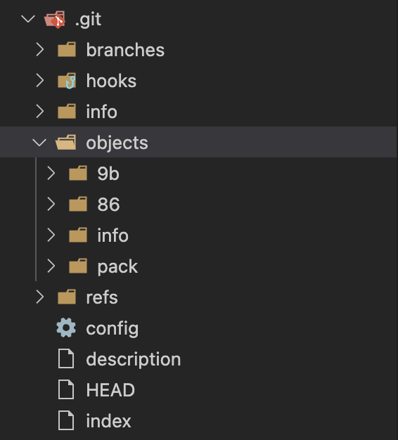
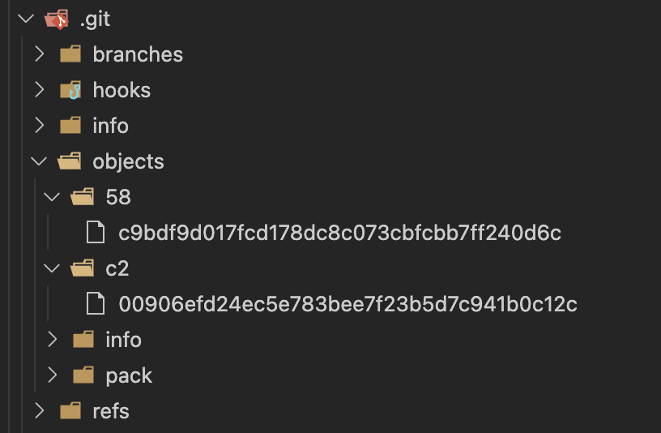
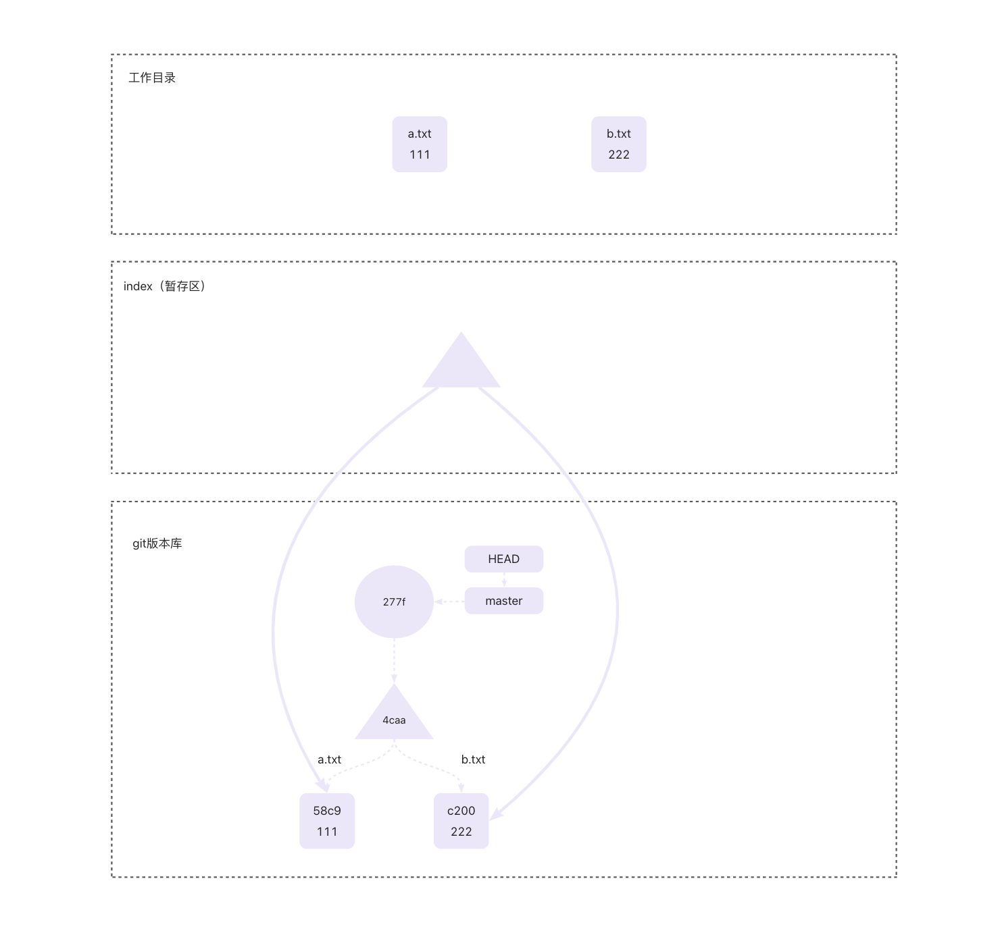
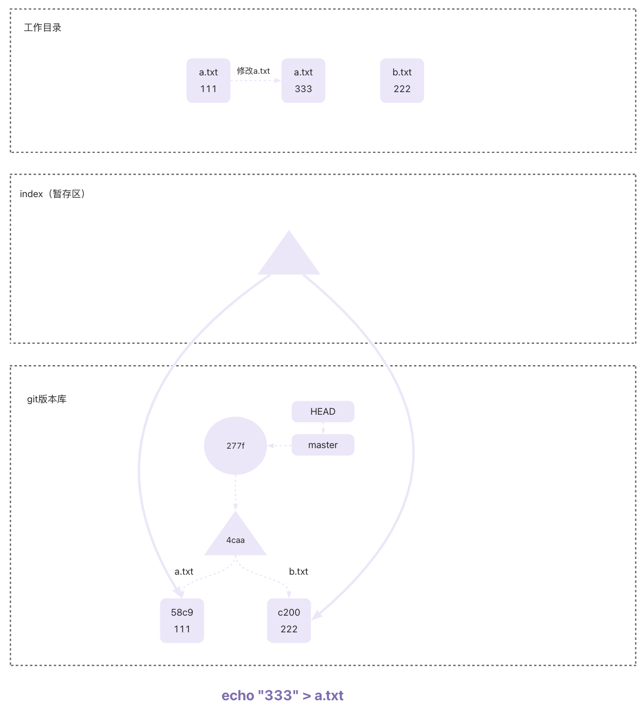
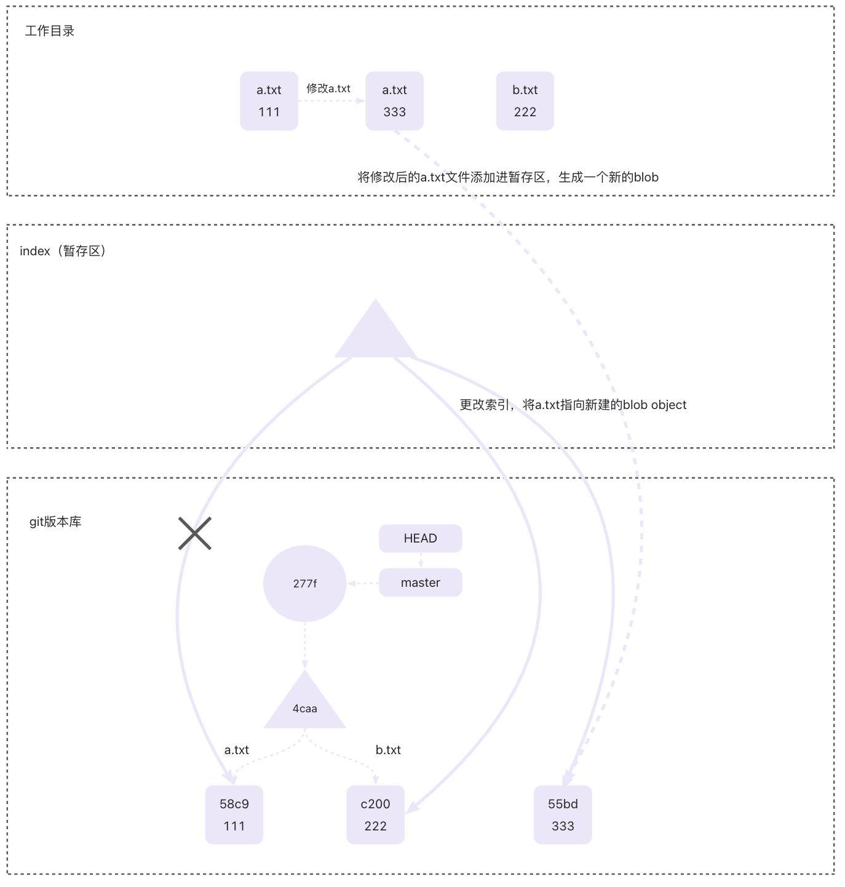

# 浅谈 git 底层原理

::: tip 前言
我们基本上每天都会使用到 Git，通过使用 Git 我们可以更方便快捷的进行团队协作。

本篇文章主要讲一下 git 操作发生的时候，git 文件是如何变化的，以及其背后到底发生了什么。
:::

## git 是怎么存储信息的

git 版本库的内容都是存储在.git 这个隐藏目录中，一般默认是被隐藏的，如果想要显示，那么需要在 exclude 中把\*\*/.git 这个配置删除，这样就可以看到啦，展开.git 目录文件如下所示：


.git 目录下有很多文件：

```sh
└── .git
    ├── config    # 仓库的配置文件
    ├── description    # 仓库的描述信息，主要给gitweb使用
    ├── HEAD    # 指向当前分支
    ├── hooks    # 存放一些shell脚本，可以设置特定的git命令后触发相应的脚本
    ├── index    # 二进制暂存区（stage）
    ├── info    # 仓库的其他信息
    │   └── exclude # 本地的排除文件规则，功能和.gitignore类似
    ├── logs    # 保存所有更新操作的引用记录，主要用于git reflog等
    ├── objects    # 所有文件的存储对象
    └── refs    # 具体的引用，主要存储分支和标签的引用
```

关于 git 是怎么存储信息的，我们先简单的举一个例子直观感受一下

```sh
# git版本库初始化
git init

# 创建两个文件
echo '111' > a.txt
echo '222' > b.txt

# 提交到暂存区
git add *.txt

# 查看在git版本库里存的内容
git cat-file -t 58c9
# blob
git cat-file -p 58c9
# 111

git cat-file -t c200
# blob
git cat-file -p c200
# 222
```

此时的版本库包含两个 blob object，分别存储 a.txt，b.txt 的内容。


```sh
# 创建一个commit
git commit -am 'init commit'
# 发现版本库里又多两个object

# 查看一下这两个内容是啥
git cat-file -t 4caa
# tree
git cat-file -p 4caa
# 100644 blob 58c9bdf9d017fcd178dc8c073cbfcbb7ff240d6c    a.txt
# 100644 blob c200906efd24ec5e783bee7f23b5d7c941b0c12c    b.txt


git cat-file -t 277f
# commit
git cat-file -p 277f
# tree 4caaa1a9ae0b274fba9e3675f9ef071616e5b209
# author mx <zhongmeixiu@fenxianglife.com> 1686290529 +0800
# committer mx <zhongmeixiu@fenxianglife.com> 1686290529 +0800

# init commit
```

当执行完 commit 之后，git 版本库里又多出了两个 object，我们使用 git cat-file 查看之后，发现它们的类型分别是 tree object 和 commit object，首先我们看 tree 这种 object 类型，从打印的内容我们可以看出，它存储的是 a.txt 和 b.txt 这两个 blob 的内容，即一个目录结构（相当于一个文件夹），以及文件模式，object 类型，通过 SHA-1 算法计算出的二进制哈希值 ，文件名等。

此时的版本库如下所示：


接下来我们再来看 commit 这种 object 类型，它存储的是一个提交信息，包括：

- 对应目录结构的快照 tree 的哈希值
- 上一个提交的哈希值（由于这里是第一个提交，所以没有父节点）
- 提交者信息（依据你的 user.name 和 user.email 配置来设定，外加一个时间戳）
- 留空一行，最后是提交的信息；

此时我们看 git 仓库是这样的：


以上就是关于 git 怎么存储一个提交信息的过程了，不过这里没有涉及到关于分支的存储，那么在 git 版本库中分支是怎么存储的呢，它又是存储在哪里？

```sh
# 查看我们的提交在哪个分支
cat .git/HEAD
# 查看分支所指向提交的哈希值
cat .git/refs/heads/master
# 277fabc07e7f87e4006640d80d6d89308550ccc7
```

在 git 版本库中，HEAD，分支，tag 可以简单理解成一个指针，指向所提交的哈希值，如下所示：


## git add 底层执行原理

在进行 git add 底层执行原理之前，我们先了解几个 git 相关的底层命令

```sh
# 创建 blob 对象
$ git hash-object

# 更新暂存区
$ git update-index

# 创建 commit 节点
$ git commit-tree

# 暂存区写入版本库
$ git write-tree

# 提交tree对象
$ git commit-tree

# 查看对象类型
$ git cat-file -t

# 查看对象内容
$ git cat-file -p

# 创建和更新 ref
$ git update-ref
```

初始化一个版本库：

```sh
# 初始化git版本库
$ git init

# 查看.git/objects下有两个空的info和pack子目录
$ find .git/objects
# .git/objects
# .git/objects/pack
# .git/objects/info
```

可以看到，初始化 git 版本库之后，git 对 objects 目录进行了初始化，创建了两个空的 info 和 pack 子目录。

接下来，创建两个文件 a.txt 和 b.txt，使用 git hash-object 分别创建 git 对象并进行存储，拿到这些文件的 key

```sh
echo '111' > a.txt | git hash-object -w --stdin
# 58c9bdf9d017fcd178dc8c073cbfcbb7ff240d6c  （blob object）
echo '222' > b.txt | git hash-object -w --stdin
# c200906efd24ec5e783bee7f23b5d7c941b0c12c  （blob object）

# 查看objects目录
$ find .git/objects -type f
# .git/objects/58/c9bdf9d017fcd178dc8c073cbfcbb7ff240d6c
# .git/objects/c2/00906efd24ec5e783bee7f23b5d7c941b0c12c
```

`git hash-object` 用于获取文件的 key，如果带上-w 选项，则表示会将该对象的 value 进行存储。
带上--stdin 选项表示该命令从标准输入读取内容；若不指定此选项，则须在命令尾部给出待存储文件的路径。

从上面创建的对象中可以看到输出的 key 是一个长度为 40 个字符的校验和。它是一个 SHA-1 哈希值——一个将待存储的数据外加一个头部信息（header）一起做 SHA-1 校验运算而得的校验和。

git 存储内容的方式是一个文件对应一条内容，以该内容加上特定头部信息一起的 SHA-1 校验和为文件命名。校验和的前两个字符用于命名子目录，余下的 38 个字符则用作文件名。

### 生成的文件存储的是什么

在上述创建的对象中，git hash-object 会接受你传给它的内容，并只会返回可以存储在 Git 仓库中的唯一键，同时在 objects 目录下可以找到与新内容对应的文件，如下所示：


查看一下执行 git hash-object 之后在 git 版本库中存储的内容及其类型，如下所示，我们可以看到这里拿到的 key 和上文中使用 git add 执行命令的 key 是一样的。

```sh
# 查看在git版本库里存的内容
git cat-file -t 58c9
# blob
git cat-file -p 58c9
# 111

git cat-file -t c200
# blob
git cat-file -p c200
# 222
```

通过`git update-index`命令将通过 git hash-object 生成的对象加入暂存区进行暂存

```sh
# 将a.txt对应的key添加进暂存区
git update-index --add --cacheinfo 100644 58c9bdf9d017fcd178dc8c073cbfcbb7ff240d6c a.txt

# 将b.txt对应的key添加进暂存区
git update-index --add --cacheinfo 100644 c200906efd24ec5e783bee7f23b5d7c941b0c12c b.txt
```

执行完上述命令后我们可以看到，a.txt 和 b.txt 分别被添加进了暂存区。其中：
--add：此前该文件不在暂存区，添加进暂存区
--cacheinfo：将要添加的文件位于数据库中，而不是本地目录下
100644：表示文件模式（100644 是普通文件，100755 是可执行文件，120000 是符号链接文件）

以上就是 git add 命令在底层的实现，总共分为两步：

1. 通过 git hash-object 命令将需要暂存的文件转换成 git 对象并进行存储，拿到这些文件的 key
2. 通过 git update-index 命令将这些对象加入到暂存区进行暂存
   这样便完成了 git 文件的暂存操作。

## git commit 底层执行原理

通过`git write-tree`将暂存区内容写入一个 tree 对象

```sh
git write-tree
# 4caaa1a9ae0b274fba9e3675f9ef071616e5b209  （tree object）

# 查看这个key的类型为tree
git cat-file -t 4caa
# tree
# 查看这个tree对象的内容
git cat-file -p 4caa
# 100644 blob 58c9bdf9d017fcd178dc8c073cbfcbb7ff240d6c    a.txt
# 100644 blob c200906efd24ec5e783bee7f23b5d7c941b0c12c    b.txt
```

此时 git 版本库的结构如下所示：


通过 git commit-tree 提交 4caa 这个 tree 对象

```sh
echo 'init commit' | git commit-tree 4caa
# 810c16a2dc94a8ac641e45bf6ab274cb37e52b21  (commit object)

# 查看文件类型 为commit
git cat-file -t 810c
# commit
# 查看其内容
git cat-file -p 810c
# tree 4caaa1a9ae0b274fba9e3675f9ef071616e5b209
# author mx <zhongmeixiu@fenxianglife.com> 1686306442 +0800
# committer mx <zhongmeixiu@fenxianglife.com> 1686306442 +0800

# init commit
```

此时 git 版本库的结构如下所示：


我们可以知道此时的 git 版本库结构和上文中我们执行 git commit 之后是一样的，即 git commit 的底层执行原理其实也是执行了两步：

1. 执行 git write-tree 将暂存区内容写入一个 tree 对象
2. 执行 git commit-tree 提交暂存区写入的 tree 对象

Git 所做的工作实质就是将被改写的文件保存为数据对象， 更新暂存区，记录树对象，最后创建一个指明了顶层树对象和父提交的提交对象。 这三种主要的 Git 对象（数据对象、树对象、提交对象）最初均以单独文件的形式保存在 .git/objects 目录下。

以上就是执行 git add 和 git commit 命令时，git 所做的工作实质。用一个图来表示大概就是如下这样：


git add files 命令将文件放入暂存区

git commit 命令给暂存区生成快照并提交

## git 文件内容更新过程

这一部分我们介绍一下 git 的三个分区（即工作目录，暂存区，git 版本库），以及 git 的变更记录是如何形成的。

接上文中的示例，此时三个分区的状态如下所示：



接下来我们通过更新一个文件内容看一下这个过程是怎样的

```sh
# 将a.txt的内容由111改为333
echo "333" > a.txt
```



从上图中我们可以看到，修改 a.txt 的内容后，git 版本库和暂存区都没有发生改变，此时我们执行 git add a.txt 命令，将其添加进暂存区，如下图所示，git add a.txt 命令执行之后，在 git 版本库中新增了一个 blob object，同时更新了索引的指向，即 a.txt 指向了新建的 blob：55bd

```sh
# 将修改内容添加进暂存区
git add a.txt
# 此时可以看到我们的git版本库新增了一个blob 其的key为
# 55bd0ac4c42e46cd751eb7405e12a35e61425550
```



最后我们提交这次更改，再看一下版本库是如何变化的：

```sh
git commit -m 'update'
# 新增了一个tree  0fd247c919b0faa824e03cbef3b4b375d804e481
# 新增一个commit  59604511bc4a0e258fd54b784d38db1d0df63d7e
```


由上图可以看到，执行 git commit -m 'update'提交这次更改之后，git 版本库的过程如下：

1. 根据当前的索引生成一个 tree object，充当新提交的快照
2. 新建一个 commit object，将这次 commit 的信息存储起来，并且其父提交指向上一个 commit，组成一条链，记录变更历史
3. 将 master 分支的指针指向新的提交
