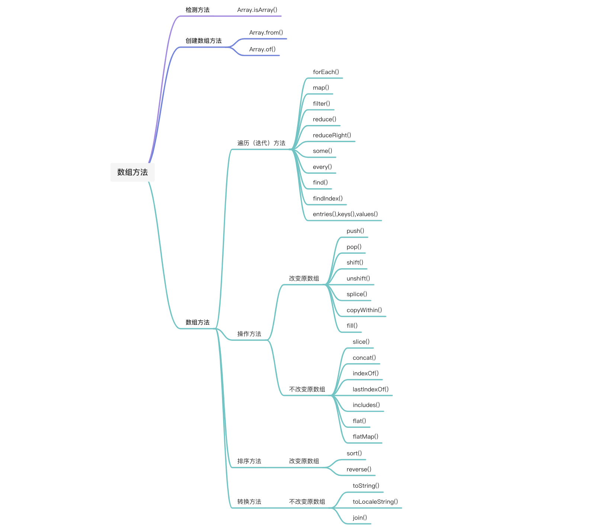
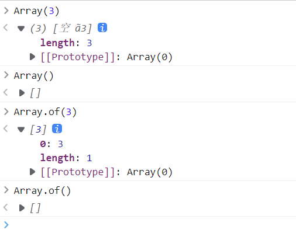
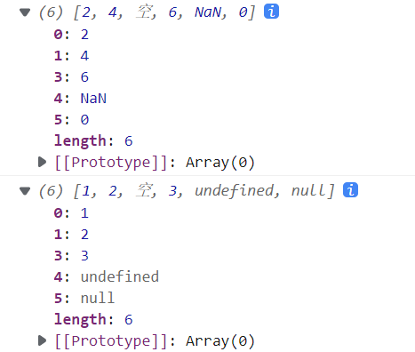
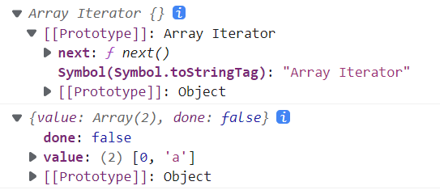
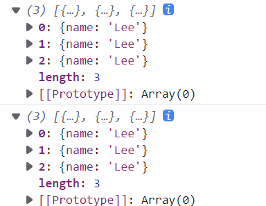

# JS 数组方法



# 检测方法

## Array.isArray()

`Array.isArray()`方法用于确定传递的值是否是一个 `Array`。

```js
console.log(Array.isArray([1, 2, 3])) //true
console.log(Array.isArray([])) // true
console.log(Array.isArray(new Array())) //true
console.log(Array.isArray(new Array('a', 'b', 'c'))) //true
console.log(Array.isArray(Array.prototype)) //true
console.log(Array.isArray('foo')) // false
console.log(Array.isArray(undefined)) //false
console.log(Array.isArray(null)) //false
```

# 创建数组方法

## Array.from()

`Array.from()`方法用于将类数组对象和可迭代对象转为真正的数组，并且返回一个新的，浅拷贝的数组实例。

只要是部署了 `Iterator` 接口的数据结构，`Array.from()`都能将其转为数组。

```js
console.log(Array.from('hello')); //  ['h', 'e', 'l', 'l', 'o']
console.log(Array.from('')); // []
console.log(Array.from(new Set(['a', 'b'])));  // ['a', 'b']
// Map对象转为数组：[[1, 2], [2, 4]]
console.log(Array.from(new Map([[1, 2], [2, 4]])))

// 传入第二个参数
let arr = Array.from([1, 2, 3], (x) => x ** 2);
console.log(arr);  //[1, 4, 9]

//传入第三个参数
const a1 = [1, 2, 3, 4];
const a2 = Array.from(a1, x => x＊＊2);
const a3 = Array.from(a1, function(x) {return x＊＊this.exponent}, {exponent: 2});
console.log(a2);   // [1, 4, 9, 16]
console.log(a3);   // [1, 4, 9, 16]
```

## Array.of()

`Array.of()`创建一个包含所有传入参数的数组，不考虑参数的数量或类型，返回一个新数组。如果没有参数，就返回一个空数组。
对于 `Array()`方法来说，参数个数的不同会导致 Array()的行为差异，如下所示：



当 `Array()`的参数是一个正整数时，实际上是指定了数组的长度，只有参数个数不少于 2 个的时候，Array()才会返回由参数组成的一个新数组。`Array.of()`弥补了 `Array()`函数的这种不足，当`Array.of()`只有一个参数时，返回的依然是由这个参数组成的一个新数组，它不存在由于参数不同而导致的重载。

```js
console.log(Array.of()) //[]
console.log(Array.of(undefined)) //[undefined]
console.log(Array.of(null)) //[null]
console.log(Array.of(4)) //[4]
console.log(Array.of(1, 2, 3)) //[1,2,3]
console.log(Array.of('foo')) //['foo']
```

`Array.of()`可以用以下代码实现

```js
function m_ArrayOf() {
  return [].slice.call(arguments)
}

console.log(m_ArrayOf()) //[]
console.log(m_ArrayOf(undefined)) //[undefined]
console.log(m_ArrayOf(null)) //[null]
console.log(m_ArrayOf(4)) //[4]
console.log(m_ArrayOf(1, 2, 3)) //[1,2,3]
console.log(m_ArrayOf('foo')) //['foo']
```

# 数组方法

## 遍历（迭代）方法

### forEach()

`forEach()`方法对数组的每个元素执行一次给定的函数。这个方法即使指定了 return 值，它的返回值也是 undefined。

**语法**：arr.forEach(callback[currentValue[,index[,array]]] (,thisArg))

**参数**：**callback**：为数组中每个元素执行的函数，该函数接收一至三个参数：

- **currentValue**：数组中正在处理的**当前元素**
- **index**：数组中正在处理的当前元素的**索引**
- **array**：forEach()方法**正在操作的数组**
- **thisArg**：可选参数，当执行回调函数 callback 时，用作**this**的值

**返回值**：undefined

```js
const arr = [
  { name: 'Bruce', num: 1 },
  { name: 'Li', num: 3 },
  { name: 'Liang', num: 10 },
  { name: 'Lee', num: 20 }
]
arr.forEach((item, index, arr) => {
  console.log(`${item.name} ---- ${index}`)
  if (item.name === 'Bruce') return
})
// Bruce ---- 0
// Li ---- 1
// Liang ---- 2
// Lee ---- 3
```

:::warning 注意点

1. 无法中途退出循环，只能通过 return 退出本次回调，进入下一次回调。使用 break 语句中断循环会报错。
2. 空元素不会遍历，但是 undefined，null 会遍历。
3. 即使 return 了一个值它也总是返回 undefined 值。
   :::

```js
let arr = [1, 2, , 3] //arr[2]元素是空的，不会遍历(undefined，null会遍历)
let obj = { name: 'Bruce' }
let result = arr.forEach(function (item, index, arr) {
  arr[3] = '改变元素'
  arr.push('添加到数组末尾')
  console.log(item, index) // 分别打印1,2,改变元素，arr[2]元素是空的，不会遍历
  console.log(this.name) //打印三次
  // break   //break会报错
  return item //return 只会结束本次回调，下次回调依然会继续执行
  console.log(item)
}, obj)
console.log(result) //undefined   即使有return值，返回的依然是undefined
```

### map()

map()方法创建一个新数组，这个新数组由原数组中的每个元素都调用一次提供的函数后的返回值组成。

**语法**：let new_array = arr.map(function callback(currentValue[, index[, array]])

:::tip 参数
**callback**：生成新数组元素的函数，接收三个参数：

- **currentValue**：数组中正在处理的**当前元素**
- **index**：（可选）数组中正在处理的当前元素的**索引**
- **array**：（可选）map()方法**正在操作的数组**
- **thisArg**：可选参数，当执行回调函数 callback 时，用作**this**的值
  :::

**返回值**：一个由原数组每个元素执行回调函数的结果组成的新数组。

```js
let arr = [1, 2, 3, '4']
let result = arr.map((item, index, array) => {
  return item * 2
})
console.log(result) // [2, 4, 6, 8]
console.log(arr) //[1, 2, 3, '4']

let arr = [1, 2, , 3, undefined, null]
let result = arr.map((item, index, array) => {
  return item * 2
})
console.log(result) // [2, 4, 空, 6, NaN, 0]
console.log(arr) //[1, 2, 空, 3, undefined, null]
```



:::warning 注意点
空值会直接忽略，不会进行遍历
:::

### filter()

filter()方法创建一个新数组，其包含通过所提供函数实现的测试的所有元素。

**语法**：let new_array = arr.filter(function callback(currentValue[, index[, array]])

:::tip 参数
**callback**：用来测试数组的每个元素的函数，返回 true 表示该元素通过测试，保留该元素，false 则不保留，它接收三个参数：

- **currentValue**：数组中正在处理的**当前元素**
- **index**：（可选）数组中正在处理的当前元素的**索引**
- **array**：（可选）调用了 filter 的数组本身
- **thisArg**：可选参数，当执行回调函数 callback 时，用作**this**的值
  :::

**返回值**：一个新的、由通过测试的元素组成的数组，如果没有任何数组元素通过测试，则返回空数组。

```js
let arr = [1, 2, , 3, undefined, null, 66, 33]
let result = arr.filter((item, index, array) => {
  return item > 10 //返回所有大于10的元素组成的数组
})
console.log(result) //  [66, 33]
console.log(arr) //[1, 2, 空, 3, undefined, null, 66, 33]
```

### reduce()

`reduce()`方法对数组中的每个元素按序执行一个由您提供的 **reducer** 函数，每一次运行 **reducer** 会将先前元素的计算结果作为参数传入，最后将其结果汇总为单个返回值。
**语法**： array.reduce(function(previousValue, currentValue, currentIndex, array), initialValue)

:::tip **参数**

- previousValue：上一次调用 callbackFn 时的返回值。在第一次调用时，若指定了初始值 initialValue，其值则为 initialValue，否则为数组索引为 0 的元素 array[0]。
- currentValue：数组中正在处理的元素。在第一次调用时，若指定了初始值 initialValue，其值则为数组索引为 0 的元素 array[0]，否则为 array[1]。
- currentIndex：（可选）数组中正在处理的元素的索引。若指定了初始值 initialValue，则起始索引号为 0，否则从索引 1 起始。
- array:（可选）用于遍历的数组

- initialValue:(可选）
  作为第一次调用 callback 函数时参数 previousValue 的值。若指定了初始值 initialValue，则 currentValue 则将使用数组第一个元素；否则 previousValue 将使用数组第一个元素，而 currentValue 将使用数组第二个元素。

:::

返回值：使用 reducer 回调函数遍历整个数组后的结果。

```js
let arr = [1, 2, 3, 4, 5]
const callbackFun = (pre, cur, curIndex, array) => {
  return pre + cur
}
let result = arr.reduce(callbackFun, 0) //指定初始值为0
let result1 = arr.reduce(callbackFun, 2) //指定初始值为2
let result2 = arr.reduce(callbackFun) //不指定初始值
console.log(result) // 15
console.log(result1) // 17
console.log(result2) // 15
```

### reduceRight()

从右往左累加，其他的和 reduce 类似。

### some()

some()方法测试数组中是不是至少有一个元素通过了被提供的函数测试，它返回的是一个 Boolean 类型的值。

**语法**：arr.some(callback[element[, index[, array]]] (, thisArg))

:::tip 参数
**callback**：用来测试每个元素的函数，它接收三个参数：

- **currentValue**：数组中正在处理的**当前元素**
- **index**：（可选）数组中正在处理的当前元素的**索引**
- **array**：（可选）调用了 some()的数组本身
- **thisArg**：可选参数，当执行回调函数 callback 时，用作**this**的值
  :::

**返回值**：数组中有至少一个元素通过回调函数的测试就会返回**true**；所有元素都没有通过回调函数的测试返回值才会为 false。

:::warning 注意点
如果用一个空数组进行测试，那么在任何情况下它返回的都是 false
返回规则：

1. 如果有一个元素满足条件，则表达式返回 true，剩余的元素不会再执行检测。
2. 如果没有满足条件的元素，就返回 false。

:::

```js
let arr = [1, 2, 3, 4, 5]
let result = arr.some((item, index, array) => {
  return item > 5
})
let result1 = arr.some((item, index, array) => {
  return item > 2
})
console.log(result) // false
console.log(result1) // true

//如果用一个空数组进行测试，那么在任何情况下它返回的都是false
let a = []
let noElement = a.some((item) => {
  item > 3
})
console.log(noElement) // false
```

### every()

every()方法用于测试一个数组内的所有元素是否都能通过指定函数的测试，它返回一个布尔值。

**语法**：arr.every(callback[element[, index[, array]]] (, thisArg))
参数与 some 方法类似。

**返回值**：如果回调函数的每一次返回都为 true，则返回 true，否则返回 false。

:::warning 注意点
若收到一个空数组，此方法在任何情况下都返回 true
:::

```js
let arr = [1, 2, 3, 4, 5]
let result = arr.every((item, index, array) => {
  return item > 5
})
let result1 = arr.every((item, index, array) => {
  return item < 10
})
console.log(result) // false
console.log(result1) // true

//若收到一个空数组，此方法在任何情况下都返回true
let a = []
let noElement = a.every((item) => {
  item > 3
})
console.log(noElement) // true
```

### find()

find()方法返回数组中满足提供的测试函数的第一个元素的值，否则返回 undefined。

**语法**：arr.find()(callback[,thisArg])

**返回值**：数组中第一个满足所提供测试函数的元素的值，否则返回 undefined。

```js
let arr = [1, 2, 3, 4, 5]
let result = arr.find((item) => item > 3) //返回第一个满足条件的元素的值
console.log(result) // 4
```

### findIndex()

findIndex()方法返回数组中满足提供的测试函数的第一个元素的索引，若没有找到对应元素则返回-1。

**语法**：arr.findIndex()(callback[,thisArg])

:::tip 参数
**callback**：针对数组中的每个元素，都会执行该回调函数，执行时会自动传入下面三个参数：

- **currentValue**：数组中正在处理的**当前元素**
- **index**：数组中正在处理的当前元素的**索引**
- **array**：（可选）调用了 findIndex()的数组本身
- **thisArg**：可选参数，当执行回调函数 callback 时，用作**this**的值
  :::
  **返回值**：数组中通过提供测试函数的第一个元素的索引，否则返回-1.

```js
let arr = [1, 2, 3, 4, 5]
let result = arr.findIndex((item) => item > 3) //返回第一个满足条件元素的索引
console.log(result) // 3
```

### entries(),keys(),values()

这三个方法都返回一个新的 Array Iterator 对象，对象根据方法不同包含不同的值；
entries()方法返回的对象中包含数组中每个索引的键/值对，keys()方法返回的对象中包含数组中每个索引的键，values()方法返回的对象中包含数组中每个索引的值。

```js
let arr = ['a', 'b', 'c']
for (let [key, value] of arr.entries()) {
  console.log(key, value)
  // 0 'a'
  // 1 'b'
  // 2 'c'
}

for (let key of arr.keys()) {
  console.log(key)
  // 0
  // 1
  // 2
}

for (let value of arr.values()) {
  console.log(value)
  // a
  // b
  // c
}
```

如果不使用 for...of 循环，可以手动调用遍历器对象的 next 方法进行遍历
entries()方法返回值：一个新的 Array Iterator 对象。

Array Iterator 是对象，它的原型上有一个 next 方法，可用于变量迭代器取得原数组的[key,value]

```js
let arr = ['a', 'b', 'c', 1, 2, 3]
console.log(arr.entries())
console.log(arr.entries().next())
```



```js
let arr = ['a', 'b', 'c']
let entries = arr.entries()
console.log(entries.next().value) //  [0, 'a']
console.log(entries.next().value) // [1, 'b']
console.log(entries.next().value) //[2, 'c']
```

## 操作方法

### 改变原数组

#### push()

push()方法从数组尾部添加元素

```js
let arr = [1, 2, 3, 4, 5]
arr.push(6) //从数组最后面开始添加一个元素
console.log(arr) // [1, 2, 3, 4, 5, 6]
```

#### pop()

移除数组的最后一个元素。如果数组为空，则返回 undefined。

```js
let arr = [1, 2, 3, 4, 5]
arr.pop() //删除数组的最后一个元素
console.log(arr) // [1, 2, 3, 4]
```

#### shift()

移除数组的第一个元素；如果数组为空，则返回 undefined。

```js
let arr = [1, 2, 3, 4, 5]
arr.shift() //删除数组的第一个元素
console.log(arr) // [2, 3, 4, 5]
```

#### unshift()

从数组头部添加元素

```js
let arr = [1, 2, 3, 4, 5]
arr.unshift(1, 2) // 从数组第0位开始添加元素
console.log(arr) // [1, 2, 1, 2, 3, 4, 5]
```

#### splice()

splice() 方法通过删除或替换现有元素或者原地添加新的元素来修改数组，并以数组形式返回被修改的内容。此方法会改变原数组。

**语法**：array.splice(start[, deleteCount[, item1[, item2[, ...]]]])

**参数**：

```js
start：指定修改的开始位置。
  如果超出了数组长度则从数组末尾添加元素；
  如果是负值，则从数组末尾开始；
  如果负数的绝对值大于数组的长度，则表示开始位置为第0位
deleteCount：整数，表示要移出的数组元素的个数。
  如果 deleteCount 被省略了，或者它的值大于等于array.length - start(也就是说；
  如果它大于或者等于start之后的所有元素的数量)，那么start之后数组的所有元素都会被删除。
  如果 deleteCount 是 0 或者负数，则不移除元素。这种情况下，至少应添加一个新元素。

```

**返回值**：由被删除的元素组成的一个数组。如果只删除了一个元素，则返回只包含一个元素的数组。如果没有删除元素，则返回空数组。

```js
let arr = [1, 2, 3, 4, 5]
// 在数组的第0位开始插入一个元素
console.log(arr.splice(0, 0, 1), arr) // []   [1, 1, 2, 3, 4, 5]
// 删除第0位的元素，并插入一个元素（相当于替换第0位索引的元素）
console.log(arr.splice(0, 1, 2), arr) // [1]  [2, 2, 3, 4, 5]
// 删除两个元素，插入一个元素
console.log(arr.splice(0, 2, 2), arr) // [1, 2]  [2, 3, 4, 5]
// 从第2为开始删除之后的所有元素
console.log(arr.splice(2), arr) //[3, 4, 5]  [1,2]
// 从数组的第倒数第二位开始删除元素
console.log(arr.splice(-2), arr) //[4, 5]  [1, 2, 3]
```

#### copyWithin()

copyWithin()方法，在当前数组内部，将指定位置的成员复制到其他位置（会覆盖原有成员），然后返回当前数组。这个方法会修改当前数组。

**语法**：Array.prototype.copyWithin(target, start = 0, end = this.length)

:::tip **参数**

- target：（必需）从该位置开始替换数据，如果为负值则表示倒数
- start：（可选）从该位置开始读取数据，默认为 0。如果为负值，表示从末尾开始计算。
- end：（可选）到该位置前停止读取数据，默认等于数组长度。如果为负值，表示从末尾开始计算。
  :::

```js
let arr = [1, 2, 3, 4, 5]
console.log(arr.copyWithin(0, 2)) // [3, 4, 5, 4, 5]
console.log(arr.copyWithin(0, 2, 4)) // [3, 4, 3, 4, 5]
let arr = [1, 2, 3, 4, 5]
console.log(arr.copyWithin(0, 2)) // [3, 4, 5, 4, 5]
console.log(arr.copyWithin(0, 2, 4)) // [3, 4, 3, 4, 5]
// 将3号位复制到0号位
;[].copyWithin.call({ length: 5, 3: 1 }, 0, 3)
// {0: 1, 3: 1, length: 5}
```

#### fill()

fill()方法使用给定的值填充一个数组。

```js
console.log([1, 2, 3].fill(4)) // [4, 4, 4]
// 使用fill()填充空数组
console.log(new Array(3).fill(4)) //[4, 4, 4]
// 接收第二个，第三个参数，用于指定填充的起始位置和结束位置
//用4填充索引大于等于0，小于2的元素
console.log([1, 2, 3].fill(4, 0, 2)) // [4, 4, 3]
```

fill()静默忽略超出数组边界、零长度及方向相反的索引范围：

```js
const zeroes = [0, 0, 0, 0, 0] // 索引过低，忽略
zeroes.fill(1, -10, -6)
console.log(zeroes) // [0, 0, 0, 0, 0]    // 索引过高，忽略
zeroes.fill(1, 10, 15)
console.log(zeroes) // [0, 0, 0, 0, 0]    // 索引反向，忽略
zeroes.fill(2, 4, 2)
console.log(zeroes) // [0, 0, 0, 0, 0]    // 索引部分可用，填充可用部分
zeroes.fill(4, 3, 10)
console.log(zeroes) // [0, 0, 0, 4, 4]
```

:::warning 注意点
如果填充的类型为对象，那么被赋值的是同一个内存地址的对象，而不是深拷贝对象
:::

```js
let obj = { name: 'Bruce' }
let arr = new Array(3).fill(obj)
console.log(arr)
arr[0].name = 'Lee'
console.log(arr)
```


上面代码中填充的是一个对象，当修改对象属性的值时，原数组也一起更改了，说明它填充的对象并不是一个深拷贝对象

### 不改变原数组

#### slice()

slice()方法返回一个新的数组对象，这个数组对象是由开始和结束（包括开始，不包括结束）决定的原数组的浅拷贝，原数组不会被改变。

**语法**：arr.slice([begin[,end]])

```js
let arr = [1, 2, 3, 4, 5]
console.log(arr.slice(0, 3)) //[1, 2, 3]
console.log(arr.slice(-1, -2)) //[]
console.log(arr.slice(-3, -1)) //[3,4]
console.log(arr.slice(0, -2)) //[1, 2, 3]
console.log(arr.slice(-2, 1)) //[]
console.log(arr.slice(0)) //[1, 2, 3, 4, 5]
```

:::tip 参数

1. begin：如果省略 begin，那么 slice 从索引 0 开始；如果该参数为负数，则表示从原数组的倒数第几个元素开始提取；如果 begin 超出原数组索引范围，则返回空数组。
2. end：结束索引的位置；如果省略 end，则会从起始位置一直取到数组末尾；如果 end 大于数组长度也会一直取到数组末尾；如果参数为负数，则表示在原数组中的倒数第几个元素结束抽取。
   :::

#### concat()

concat() 方法用于合并两个或多个数组。此方法不会更改现有数组，而是返回一个新数组。

**语法**：var new_array = old_array.concat(value1[, value2[, ...[, valueN]]])

```js
let arr = [1, 2, 3, { a: 1 }]
let arr1 = ['a', 'b', 'c']
let arr3 = arr.concat(arr1)
console.log(arr3) //[1, 2, 3,{a:1}, 'a', 'b', 'c']

let arr4 = arr.concat(arr1, [4, 5], 'string')
console.log(arr4) //[1, 2, 3, {a:1}, 'a', 'b', 'c', 4, 5, 'string']

//concat方法返回的是一个浅拷贝
//修改原数组对象的属性值，新数组也会更改
arr[3].a = 22
console.log(arr3) //[1, 2, 3,{a:22}, 'a', 'b', 'c']
```

#### indexOf()

indexOf()方法返回在数组中可以找到一个给定元素的第一个索引，如果不存在，则返回-1。

**语法**：arr.indexOf(searchElement[, fromIndex])

**参数**：

- searchElement：要查找的元素
- fromIndex：开始查找的位置

```js
let arr = [1, 2, 3, 3, 2, 4, 1, 1]
console.log(arr.indexOf(3)) //2
console.log(arr.indexOf(1, -1)) //7
```

#### lastIndexOf()

lastIndexOf() 方法返回指定元素（也即有效的 JavaScript 值或变量）在数组中的最后一个的索引，如果不存在则返回 -1。从数组的后面向前查找，从 fromIndex 处开始。

**语法**：arr.lastIndexOf(searchElement[, fromIndex])

**参数**：

- searchElement：要查找的元素
- fromIndex：从此位置开始逆向查找。

```js
let arr = [1, 2, 3, 3, 2, 4, 1, 1]
console.log(arr.lastIndexOf(3)) //3
console.log(arr.lastIndexOf(1)) //7
```

#### includes()

includes() 方法用来判断一个数组是否包含一个指定的值，根据情况，如果包含则返回 true，否则返回 false。

**语法**：arr.includes(valueToFind[, fromIndex])

**参数**：

- valueToFind：需要查找的元素值。
- fromIndex：从该位置的索引处开始查找 valueToFind。

**返回值**：返回一个布尔值。如果在数组中（或 fromIndex 指定的范围中）找到了 valueToFind，则返回 true，否则返回 false。

```js
let arr = [1, 2, 3, 3, 2, 4, 1, 1]
console.log(arr.includes(3)) //true
console.log(arr.includes(6)) //false
```

#### flat()

flat()方法用于将嵌套的数据“拉平”，变成一维的数组。该方法返回一个新数组，对原数组没有影响。

```js
let arr = [1, 2, 3, [3, 4]]
// flat()方法将子数组的成员取出来，添加在原来的位置
console.log(arr.flat()) //  [1, 2, 3, 3, 4]
let arr1 = [1, 2, [3, [4, 5]]]
// flat()方法默认只会拉平一层，如果需要拉平多层，可以为其指定参数
console.log(arr1.flat()) //  [1, 2, 3, [4,5]]
// 指定拉平两层
console.log(arr1.flat(2)) // [1, 2, 3, 4, 5]
// 如果不确定要拉平几层，可以使用Infinity代替
console.log(arr1.flat(Infinity)) //[1, 2, 3, 4, 5]
//如果原数组有空位，flat()方法会跳过空位
let arr2 = [1, 2, , 3, 4, , 5]
console.log(arr2.flat()) // [1, 2, 3, 4, 5]
```

#### flatMap()

flatMap()方法对原数组的每个成员执行一个函数，然后对返回值组成的数组执行 flat()方法，该方法返回一个新数组，不改变数组。

```js
// 相当于[[2,4],[3,5],[4,6]]
let result = [2, 3, 4].flatMap((x) => [x, x + 2])
console.log(result) // [2, 4, 3, 5, 4, 6]
// flatMap()只能展开一层数组
// 相当于 [[[2]], [[4]], [[6]], [[8]]].flat()
console.log([1, 2, 3, 4].flatMap((x) => [[x * 2]])) // [[2], [4], [6], [8]]
```

flatMap()方法的参数是一个遍历函数，该函数可以接受三个参数，分别是当前数组成员，当前数组成员的位置（从零开始），原数组。

```js
arr.flatMap(function callback(currentValue[, index[, array]]) {
  // ...
}[, thisArg])
thisArg：第二个参数，用来绑定遍历函数里面的this
```

## 排序方法

### 改变原数组

#### sort()

```js
const arr = [1, 6, 2, 3, 8, 9, 66, 12, 4]
arr.sort((a, b) => a - b) //升序排列
console.log(arr) //[1, 2, 3, 4, 6, 8, 9, 12, 66]
arr.sort((a, b) => b - a) //降序排列
console.log(arr) //[66, 12, 9, 8, 6, 4, 3, 2, 1]
```

#### reverse()

reverse() 方法将数组中元素的位置颠倒，并返回该数组。数组的第一个元素会变成最后一个，数组的最后一个元素变成第一个。该方法会改变原数组。

```js
const arr = [1, 6, 2, 3, 8, 9, 66, 12, 4]
arr.reverse()
console.log(arr) // [4, 12, 66, 9, 8, 3, 2, 6, 1]
```

## 转换方法

### 不改变原数组

#### toLocaleString()

toLocaleString() 返回一个字符串表示数组中的元素。数组中的元素将使用各自的 toLocaleString 方法转成字符串，这些字符串将使用一个特定语言环境的字符串（例如一个逗号 ","）隔开。

```js
const arr = ['Bruce', 'Foo', 'Lee', undefined, null]
console.log(arr.toLocaleString()) //Bruce,Foo,Lee,,
```

#### toString()

`toString()` 返回一个字符串，表示指定的数组及其元素。

`Array` 对象覆盖了 `Object` 的 `toString` 方法。对于数组对象，`toString` 方法连接数组并返回一个字符串，其中包含用逗号分隔的每个数组元素。

```js
const arr = ['Bruce', 'Foo', 'Lee', undefined, null]
console.log(arr.toString()) //Bruce,Foo,Lee,,
```

#### join()

join() 方法将一个数组（或一个类数组对象）的所有元素连接成一个字符串并返回这个字符串。如果数组只有一个项目，那么将返回该项目而不使用分隔符.

如果一个元素为 undefined 或 null，它会被转换为空字符串。

```js
const arr = ['Bruce', 'Foo', 'Lee', undefined, null]
console.log(arr.join()) //Bruce,Foo,Lee,,
console.log(arr.join('')) //BruceFooLee
console.log(arr.join('-')) //Bruce-Foo-Lee--
console.log(arr.join(',')) //Bruce,Foo,Lee,,
console.log(arr.join('+')) //Bruce+Foo+Lee++
```

:::warning 注意
如果数组中某一项是 null 或 undefined，则在 join()、toLocaleString()、toString()和 valueOf()返回的结果中会以空字符串表示。

:::

## 实例方法（提案）

- toReversed()，toSorted()，toSpliced()，with()
- toReversed()对应---reverse()
- toSorted()对应---sort()
- toSpliced()对应---splice()，用来在指定位置，删除指定数量的成员，并插入新成员。
- with(index,value)对应---splice(index,1,value)，用来将指定位置的成员替换为新的值。

## 数组使用注意

### includes()和 indexOf()

- includes()方法返回布尔值，indexOf()返回数组子项的索引。
- indexOf()在需要索引的情况下使用。
- 如果仅需要知道某个元素是否存在于数组中，使用 includes()方法。
- includes()方法能找到 NaN，返回 true；indexOf()找不到 NaN，返回-1。

```js
;[NaN]
  .includes(NaN) // true
  [NaN].indexOf(NaN) // -1
```

### find()和 some()

- Array.find()方法需要一个回调函数作为参数，并返回第一个符合条件的值。
- Array.some()方法同样需要一个回调函数作为参数，但它返回的是一个布尔值，只要数组中有元素符合条件就会返回 true，否则返回 false。
- 当我们需要知道数组中是否存在某个元素时，使用 some()方法更佳，因为 some()方法直接返回一个布尔值。
- 如果符合条件的返回值为 0，使用 some 比 find 更合适。

```js
let arr = [0, 1, 2, 3]
let result = arr.find((item) => item === 0)
let result1 = arr.some((item) => item === 0)
console.log(result, result1) // 0 true
if (result) {
  console.log('存在')
} else {
  console.log('不存在')
}
//返回的是不存在，因为find符合条件返回的值是0，此时if条件判断为false
```

:::tip includes()方法和 some()方法异同点

相同点：两者都返回一个布尔值，表示某项是否存在于数组中。

不同点：some()方法的参数是一个回调函数，includes()方法的参数是一个值。

:::
