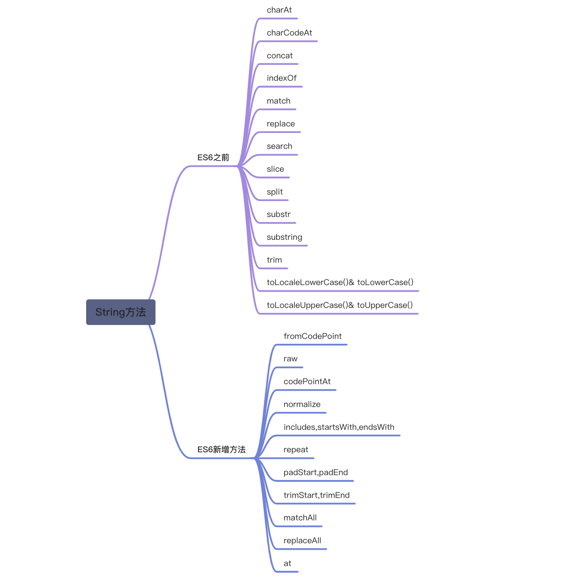

# String 方法总结



# 常用方法

## charAt()

用于返回指定位置的字符。

```javascript
let str = 'bruce'
str.charAt(3) // 'c'
```

## charCodeAt()

用于返回指定位置的字符的 Unicode 编码。

- `charCodeAt()` 方法可返回指定位置的字符的 Unicode 编码。这个返回值是 0 - 65535 之间的整数。
- `charCodeAt()` 与 `charAt()` 方法执行的操作相似，只不过前者返回的是位于指定位置的字符的编码，而后者返回的是字符子串。

```javascript
let str = 'bruce'
str.charCodeAt(3) // 99
```

## concat()

`concat()` 方法用于连接两个或多个数组（字符串）。

该方法不会改变现有的数组，而仅仅会返回被连接数组的一个副本。

```javascript
//连接字符串
let str = 'bruce'
let str1 = 'liang'
str1.concat(str) // 'liangbruce'

//连接数组  （两个数组）
let arr1 = ['1', 'a', 'b'],
  arr2 = ['2', 'c', 'd']
arr2.concat(arr1) // ['2', 'c', 'd', '1', 'a', 'b']
// 三个数组
const arr3 = ['3']
arr3.concat(arr1, arr2) // ['3', '1', 'a', 'b', '2', 'c', 'd']
```

## indexOf()

检索字符串。可返回某个指定的字符串值在字符串中首次出现的位置。

`indexOf()` 方法对大小写敏感！

```javascript
let str = 'bruce liang'
str.indexOf('liang') //6
str.indexOf('a') // 8
str.indexOf('liangg') // -1 没找到返回-1
str.indexOf('Liang') // -1 对大小写敏感
```

## match()

`match()`方法用于在字符串内检索指定的值或找到一个或多个正则表达式的匹配，返回的是值而不是值的位置。

```javascript
let str = 'bruce liang'
str.match('bruce') //'bruce'  返回的是值
str.match('be') //null

// 正则表达式匹配
let str = '1 days 2 days 3 days'
str.match(/\d+/g) // ['1', '2', '3']
```

## replace()

`replace()`方法用于在字符串中用一些字符替换另一些字符，或替换一个与正则表达式匹配的子串。

```javascript
let str = '1 days 2 days 3 days'
str.replace('3', '4') // '1 days 2 days 4 days'
//全局替换，将days替换为day
str.replace(/days/g, 'day') // '1 day 2 day 3 day'
```

## search()

用于检索与字符串匹配的子串，返回的是地址，与 `indexOf()`  的区别是 `search()` 是强制正则的，而 `indexOf()` 只是按字符串匹配的。

要执行忽略大小写的检索，请追加标志 i。如果没有找到任何匹配的子串，则返回 -1。

```javascript
let str = 'hello world'
str.search('w') // 6
str.indexOf('w') //6

//
const string = 'abcdefg.1234'
string.search(/\./) // 7  （转译之后可以匹配到 . 的位置）
string.indexOf(/\./) // -1  （相当于匹配/\./，找不到则返回-1,只能匹配字符串）
```

## slice()

提取字符串的片断，并在新的字符串中返回被提取的部分。
`stringObject.slice(start,end);`

**start**：要抽取的片断的起始下标。如果是负数，则该参数规定的是从字符串的尾部开始算起的位置。也就是说，-1 指字符串的最后一个字符，-2 指倒数第二个字符，以此类推。

**end**：紧接着要抽取的片段的结尾的下标（不包括 end 的位置）。若未指定此参数，则要提取的子串包括 start 到原字符串结尾的字符串。
如果该参数是负数，那么它规定的是从字符串的尾部开始算起的位置。

```javascript
let str = 'abc,def,ghi,jklmn'
str.slice() //'abc,def,ghi,jklmn'
str.slice(2) //'c,def,ghi,jklmn'
str.slice(2, 4) // 'c,'
// 参数为负数
str.slice(-2) // 'mn'
str.slice(-2, -1) // 'n'
```

## split()

把一个字符串分割成字符串数组。

```javascript
// 将单词或字符串分割为字符
let str = 'how are you?'
str.split('') //['h', 'o', 'w', ' ', 'a', 'r', 'e', ' ', 'y', 'o', 'u', '?']
// 只返回部分字符
str.split('', 2) //  ['h', 'o']

// 分割成字符串数组
str.split(' ') //['how', 'are', 'you?']
```

## substr()

用于从起始索引号提取字符串中指定数目的字符。`stringObject.substr(start,length)`。

**start**：必需。要抽取的子串的起始下标。必须是数值。如果是负数，那么该参数声明从字符串的尾部开始算起的位置。也就是说，-1 指字符串中最后一个字符，-2 指倒数第二个字符，以此类推。

**length**：可选。子串中的字符数。必须是数值。如果省略了该参数，那么返回从 stringObject 的开始位置到结尾的字串。

```javascript
let str = 'bruce liang'
str.substr() // 'bruce liang'
str.substr(6, 3) // 'lia'
// 参数为负数
str.substr(-4, 3) // 'ian'
```

## substring()

用于提取字符串中两个指定索引号之间的字符。(与 `slice()`  和 `substr()`  方法不同的是， `substring()`  不接受负的参数。)`stringObject.substring(start,stop)`。

**start** ：必需。一个非负的整数，规定要提取的子串的第一个字符在 stringObject 中的位置。
**stop** ：可选。一个非负的整数，比要提取的子串的最后一个字符在 stringObject 中的位置多 1。如果省略该参数，那么返回的子串会一直到字符串的结尾。

```javascript
let str = 'bruce liang'
str.substring() // 'bruce liang'
str.substring(6) // 'liang'
str.substring(6, 7) // 'l'
```

## trim()

去掉字符串两端的空格。

```javascript
let str = ' bruce  '
str.trim() // 'bruce'
```

## toLocaleLowerCase()& toLowerCase()

将字符串转换为小写。

```javascript
let str = 'Bruce'
str.toLocaleLowerCase() // 'bruce'
str.toLowerCase() // 'bruce'
```

## toLocaleUpperCase()& toUpperCase()

将字符串转换为大写。

```javascript
let str = 'Bruce'
str.toLocaleUpperCase() // 'BRUCE'
str.toUpperCase() // 'BRUCE'
```

# ES6 新增方法

## fromCodePoint

`ES5` 提供 `String.fromCharCode` 方法，用于从码点返回对应字符，但是这个方法不能识别 32 位的 UTF-16 字符（Unicode 编号大于 0xFFFF）。

```javascript
String.fromCharCode(0x20bb7) // "ஷ"
```

上面代码中，`String.fromCharCode` 不能识别大于 0xFFFF 的码点，所以 0x20BB7 就发生了溢出，最高位 2 被舍弃了，最后返回码点 U+0BB7 对应的字符，而不是码点 U+20BB7 对应的字符。

`ES6` 提供了 `String.fromCodePoint` 方法，可以识别大于 0xFFFF 的字符，弥补了 String.fromCharCode 方法的不足。

```javascript
String.fromCodePoint(0x20bb7) // "𠮷"
String.fromCodePoint(0x78, 0x1f680, 0x79) === 'x\uD83D\uDE80y' // true
```

## raw

该方法返回一个斜杠都被转义（即斜杠前面再加一个斜杠）的字符串，往往用于模板字符串的处理方法。

```javascript
String.raw`Hi\u000A!` // 'Hi\\u000A!'
// `foo${1 + 2}bar`
// 等同于
String.raw({ raw: ['foo', 'bar'] }, 1 + 2) //'foo3bar'
```

## codePointAt

```javascript
var s = '𠮷'
s.length // 2
s.charAt(0) // '\uD842'
s.charAt(1) // '\uDFB7'
s.charCodeAt(0) // 55362
s.charCodeAt(1) // 57271
```

上面代码中，汉字“𠮷”（注意，这个字不是“吉祥”的“吉”）的码点是 0x20BB7，UTF-16 编码为 0xD842 0xDFB7（十进制为 55362 57271），需要 4 个字节储存。

对于这种 4 个字节的字符，`JavaScript` 不能正确处理，字符串长度会误判为 2，而且`charAt`()方法无法读取整个字符，`charCodeAt`()方法只能分别返回前两个字节和后两个字节的值。

`ES6` 提供了`codePointAt`方法，`codePointAt`方法的参数，是字符在字符串中的位置（从 0 开始）。

```javascript
let s = '𠮷a'
s.codePointAt(0) // 134071
s.codePointAt(1) // 57271
s.codePointAt(2) // 97
```

上面代码中，JavaScript 将“𠮷 a”视为三个字符，codePointAt 方法在第一个字符上，正确地识别了“𠮷”，返回了它的十进制码点 134071（即十六进制的 20BB7）。
在第二个字符（即“𠮷”的后两个字节）和第三个字符“a”上，codePointAt 方法的结果与 charCodeAt 方法相同。
从上面可知，`codePointAt`()方法的参数，仍然是不正确的。比如，上面代码中，字符 a 在字符串 s 的正确位置序号应该是 1，但是必须向 codePointAt()方法传入 2。解决这个问题的一个办法是使用 for...of 循环，因为它会正确识别 32 位的 UTF-16 字符。

```javascript
let s = '𠮷a'
for (let ch of s) {
  console.log(ch.codePointAt(0).toString(16))
}
// 20bb7
// 61
```

另一种方法使用扩展运算符(...)也可以

```javascript
let arr = [...'𠮷a'] //['𠮷', 'a']
arr.forEach((ch) => console.log(ch.codePointAt(0)))
// 134071  97

// 十六进制表示
arr.forEach((ch) => console.log(ch.codePointAt(0).toString(16)))
// 20bb7  61
```

`codePointAt`方法也是测试一个字符由两个字节还是由四个字节组成的最简单方法。

```javascript
function is32Bit(c) {
  return c.codePointAt(0) > 0xffff
}

is32Bit('𠮷') // true
is32Bit('a') // false
```

## normalize

许多欧洲语言有语调符号和重音符号。为了表示它们，Unicode 提供了两种方法。一种是直接提供带重音符号的字符，比如 Ǒ（u01D1）。
另一种是提供合成符号（combining character），即原字符与重音符号的合成，两个字符合成一个字符，比如 O（u004F）和 ˇ（u030C）合成 Ǒ（u004Fu030C）。

这两种表示方法，在视觉和语义上都等价，但是 JavaScript 不能识别。

```javascript
'\u01D1' === '\u004F\u030C' //false
'\u01D1'.length // 1
'\u004F\u030C'.length // 2
```

ES6 提供了`normalize`方法，`normalize`方法用来将字符的不同表示方法统一为同样的形式，这称为 Unicode 正规化。

```javascript
'\u01D1'.normalize() === '\u004F\u030C'.normalize() // true
```

## includes,startsWith,endsWith

传统上，JavaScript 只有 indexOf 方法，可以用来确定一个字符串是否包含在另一个字符串中。ES6 又提供了三种新方法。

- `includes`()：返回布尔值，表示是否找到了参数字符串。
- `startsWith`()：返回布尔值，表示参数字符串是否在原字符串的头部。
- `endsWith`()：返回布尔值，表示参数字符串是否在原字符串的尾部。

```javascript
let str = 'bruce liang'
str.includes('bruce') // true
str.includes('Bruce') // false
str.startsWith('bruce') // true
str.startsWith('Bruce') // false
str.endsWith('liang') // true
str.endsWith('Bruce') // false
```

这三个方法都支持第二个参数，表示开始搜索的位置。

```javascript
let str = 'bruce liang'
// includes，startsWith的n表示从第n个字符位置到结束
str.includes('liang', 6) // true
str.startsWith('liang', 6) // true
// endsWith的n针对前n个字符
str.endsWith('liang', 6) // false
str.endsWith('bruce', 5) // false
```

## repeat

`repeat`方法返回一个新字符串，表示将原字符串重复 n 次。

```javascript
let str = 'bruce'
str.repeat(2) // 'brucebruce'
str.repeat(0) // ''
```

参数如果是小数，会被取整。

```javascript
let str = 'bruce'
// 小数会向下取整
str.repeat(2.8) // 'brucebruce'
```

如果 repeat 的参数是负数或者 Infinity，会报错。

```javascript
str.repeat(-2) // RangeError
str.repeat(Infinity) // RangeError
```

如果参数是 0 到-1 之间的小数，则等同于 0，这是因为会先进行取整运算。0 到-1 之间的小数，取整以后等于-0，repeat 视同为 0。

```javascript
str.repeat(-0.9) // ''
// 参数为NaN也等同于0
str.repeat(NaN) // ''
```

如果参数是字符串，则首先会转换为数字

```javascript
str.repeat('3') // 'brucebrucebruce'
// 不能转换为数字的字符串则转换为NaN,等同于0
str.repeat('3a') // ''
```

## padStart,padEnd

ES2017 引入了字符串补全长度的功能。如果某个字符串不够指定长度，会在头部或尾部补全。`padStart`()用于头部补全，`padEnd`()用于尾部补全。

```javascript
'x'.padStart(5, 'ab') // 'ababx'
'x'.padStart(4, 'ab') // 'abax'

'x'.padEnd(5, 'ab') // 'xabab'
'x'.padEnd(4, 'ab') // 'xaba'
```

上面代码中，`padStart`和`padEnd`一共接受两个参数，第一个参数用来指定字符串的最小长度，第二个参数是用来补全的字符串。
如果原字符串的长度，等于或大于指定的最小长度，则返回原字符串。

```javascript
'xxx'.padStart(2, 'ab') // 'xxx'
'xxx'.padEnd(3, 'ab') // 'xxx'
```

如果用来补全的字符串与原字符串，两者的长度之和超过了指定的最小长度，则会截去超出位数的补全字符串。

```javascript
'xxx'.padStart(5, '12345') // '12xxx'
'xxx'.padEnd(5, '12345') // 'xxx12'
```

如果省略第二个参数，默认使用空格补全长度。

```javascript
'xxx'.padEnd(5) // 'xxx  '
// 第二个参数为空字符串
'xxx'.padEnd(5, '') // 'xxx'
```

`padStart`的常见用途是为数值补全指定位数和提示字符串格式。

```javascript
// 生成 10 位的数值字符串。
'1'.padStart(10, 0) // '0000000001'
'1'.padEnd(10, 0) // '1000000000'

// 提示字符串格式
'12'.padStart(10, 'YYYY-MM-DD') // "YYYY-MM-12"
'09-12'.padStart(10, 'YYYY-MM-DD') // "YYYY-09-12"
```

## trimStart,trimEnd

ES2019 对字符串实例新增了`trimStart`()和`trimEnd`()这两个方法。它们的行为与`trim`()一致，`trimStart`()消除字符串头部的空格，`trimEnd`()消除尾部的空格。它们返回的都是新字符串，不会修改原始字符串。

```javascript
const s = '  abc  '

s.trim() // "abc"
s.trimStart() // "abc  "
s.trimEnd() // "  abc"
```

## matchAll

`matchAll`方法返回一个正则表达式在当前字符串的所有匹配。`matchAll`方法可以一次性取出所有匹配。不过，它返回的是一个遍历器（Iterator），而不是数组。

```javascript
const string = 'test1test2test3'
const regex = /t(e)(st(\d?))/g

for (const match of string.matchAll(regex)) {
  console.log(match)
}
// ["test1", "e", "st1", "1", index: 0, input: "test1test2test3"]
// ["test2", "e", "st2", "2", index: 5, input: "test1test2test3"]
// ["test3", "e", "st3", "3", index: 10, input: "test1test2test3"]
```

## replaceAll

ES2021 引入了`replaceAll()`方法，可以一次性替换所有匹配。

```javascript
// replace只能替换第一个匹配
'ab121212abab'.replace('b', 'a') // 'aa121212abab'
// replaceAll可一次性替换所以匹配
'ab121212abab'.replaceAll('b', 'a') // 'aa121212aaaa'
```

它的用法与`replace()`相同，返回一个新字符串，不会改变原字符串。

语法：String.prototype.replaceAll(searchValue, replacement)

- searchValue 是搜索模式，可以是一个字符串，也可以是一个全局的正则表达式（带有 g 修饰符）。
- replacement 是一个字符串，表示替换的文本，其中可以使用一些特殊字符串。

如果 searchValue 是一个不带有 g 修饰符的正则表达式，replaceAll()会报错。这一点跟 replace()不同。

```javascript
// 不报错
'aabbcc'.replace(/b/, '_')

// 报错
'aabbcc'.replaceAll(/b/, '_')
```

`replaceAll`的第二个参数也可以是一些特殊的字符串，也可以是函数。

```javascript
// $& 表示匹配的字符串，即`b`本身
// 所以返回结果与原字符串一致
'abbc'.replaceAll('b', '$&') // 'abbc'

// $` 表示匹配结果之前的字符串
// 对于第一个`b`，$` 指代`a`
// 对于第二个`b`，$` 指代`ab`
'abbc'.replaceAll('b', '$`') // 'aaabc'

// $' 表示匹配结果之后的字符串
// 对于第一个`b`，$' 指代`bc`
// 对于第二个`b`，$' 指代`c`
'abbc'.replaceAll('b', `$'`) // 'abccc'

// $1 表示正则表达式的第一个组匹配，指代`ab`
// $2 表示正则表达式的第二个组匹配，指代`bc`
'abbc'.replaceAll(/(ab)(bc)/g, '$2$1') // 'bcab'

// $$ 指代 $
'abc'.replaceAll('b', '$$') // 'a$c'

// 第二个参数是函数
'aabbcc'.replaceAll('b', () => '_') // 'aa__cc'
```

## at

`at()`方法接受一个整数作为参数，返回参数指定位置的字符，支持负索引（即倒数的位置）。

```javascript
let str = 'bruce'
str.at(1) // 'r'
str.at(-1) // 'e'

// 参数超出字符串范围
str.at(9) // undefined
```
